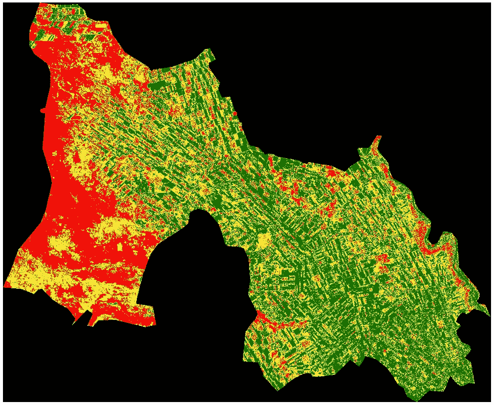
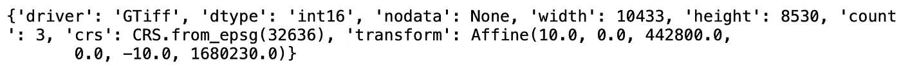
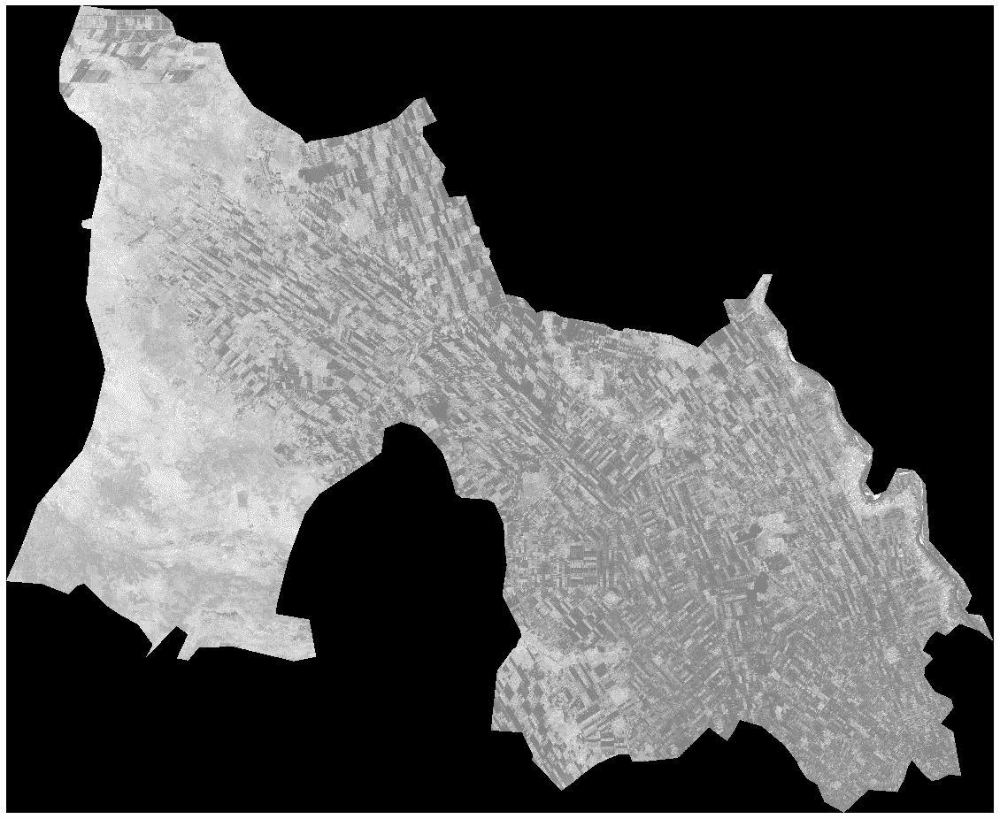
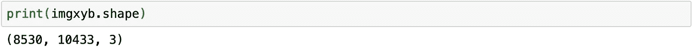
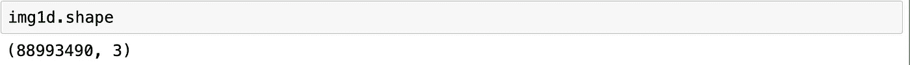
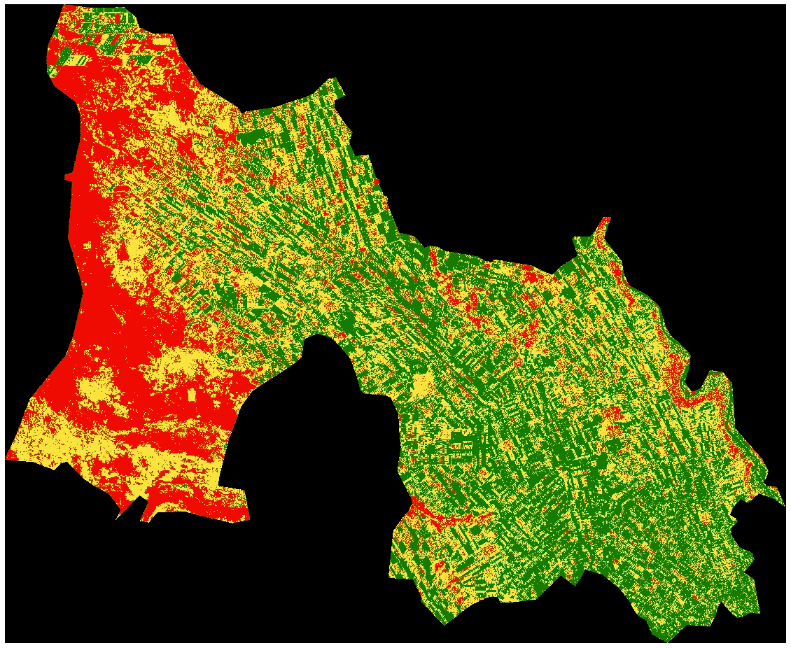

# python 中的 Sentinel-2 图像聚类

> 原文：<https://towardsdatascience.com/sentinel-2-image-clustering-in-python-58f7f2c8a7f6?source=collection_archive---------23----------------------->

## 关于如何在 python 中使用 scikit-learn 和 rasterio 执行无监督分类的分步教程



左图:苏丹杰济拉州 Elhasaheesa 地区的 Sentinel-2 图像。右图:Elhasaheesa 聚类图像(4 类)。

**聚类或无监督分类**是根据统计相似性将图像的像素值分组或聚集成一定数量的自然类(组)的过程。在本教程中，我们将在 [jupyter 笔记本](https://jupyter.org/)中使用 *rasterio* 进行 [sentinel-2](http://www.esa.int/Applications/Observing_the_Earth/Copernicus/Sentinel-2) 图像操作，并使用 power full*scikit-learn*python 包进行聚类。

> [**Scikit-learn**](https://scikit-learn.org/stable/) 是一个针对 Python 编程语言的免费软件机器学习库，包含各种分类、回归和聚类算法。要安装此软件包:

```
conda install -c anaconda scikit-learn
```

> [**Rasterio**](https://rasterio.readthedocs.io/en/latest/) 是一个开源的 python 库，可以读写不同格式的栅格数据集，如卫星影像和地形模型，如 GEOTIFF 和 JP2。

```
conda install -c conda-forge rasterio
```

**算法:** Scikit-learn 有不同的聚类算法，这些算法可以直接从聚类子库中导入。 [**K-Means**](https://en.wikipedia.org/wiki/K-means_clustering) 算法简单，是聚类中使用最多的算法之一。它基本上将 n 个观察值(在我们的例子中是像素值)分成 k 个簇(由用户预先定义的类的数量)，其中每个观察值属于具有最近平均值的簇。本教程将基于 K-means，但你可以很容易地切换到尝试其余的，代码将几乎保持不变，但你只需要改变算法。

> **本教程将分别使用苏丹杰济拉州 El-hasaheesa 和 Elmanagel 地区的 Sentinel-2 图像进行训练和预测。这个数据和本教程的完整代码可以在** [**github 上找到。**](https://github.com/wathela/Sentinel2-clustering)

要开始这项工作，首先要导入所有需要的包:

```
import rasterio as rio
from rasterio.plot import show
from sklearn import cluster
import matplotlib.pyplot as plt
import numpy as np
```

然后将使用 *rasterio 打开图像并读入其元数据*

```
# Open the image 
elhas_raster = rio.open("Elhasaheesa.tif")print(elhas_raster.meta)
```



元数据为我们提供了有关图像的信息，如数据类型、大小(宽度、高度)、计数(波段数)和坐标参考系统。为了更好地可视化这张图像，首先需要通过拉伸来调整它的对比度，你可以在这里 **阅读更多关于图像增强的内容 [**。**](https://seos-project.eu/remotesensing/remotesensing-c05-p02.html)**

```
# Read, enhance and show the image
elhas_arr = elhas_raster.read() # read the opened image
vmin, vmax = np.nanpercentile(elhas_arr, (5,95))  # 5-95% contrast stretch# show the enhanced image
plt.figure(figsize=[20,20])
show(elhas_raster, cmap='gray', vmin=vmin, vmax=vmax)
plt.show()
```



如果我们打印此图像的形状，我们会看到它的顺序为(带、高、宽)，这需要首先更改为形状顺序(高、宽、带)。我们将通过以下方式改革这一模式:

*   使用元数据中的图像大小、计数和数据类型创建一个空数组。
*   使用一个 for 循环来分割每个波段，并在我们的空数组中重组它。

在这个循环的最后，我们将得到一个具有所需形状顺序的新数组，它具有相同的大小和带数。

```
# create an empty array with same dimension and data type
imgxyb = np.empty((elhas_raster.height, elhas_raster.width, elhas_raster.count), elhas_raster.meta['dtype'])# loop through the raster's bands to fill the empty array
for band in range(imgxyb.shape[2]):
    imgxyb[:,:,band] = elhas_raster.read(band+1)
```



现在，我们几乎准备好训练我们的分类器，但首先，我们需要将我们的 X(宽度)和 Y(高度)维度转换为 1 维，因此要有一个 2d 数组而不是 3d 数组，然后我们可以将它提供给 K-means 分类器。

```
# convert to 1d array
img1d=imgxyb[:,:,:3].reshape((imgxyb.shape[0]*imgxyb.shape[1],imgxyb.shape[2]))
```



**训练:**要设置的最重要的参数是 *n_clusters* ，它表示我们要将像素分组到的簇的数量，在我们的图像中，我们可以直观地看到它有三个主要类别(建筑区、裸地和耕地)，但我们还有一个额外的类别，即感兴趣区域之外的黑色区域，其像素也可以分组到一个组中。K-means 有一些其他参数，如最大迭代次数和初始化次数，但在本教程中我们将把它们保留为默认值。

```
cl = cluster.KMeans(n_clusters=4) # create an object of the classifier
param = cl.fit(img1d) # train itimg_cl = cl.labels_ # get the labels of the classes
img_cl = img_cl.reshape(imgxyb[:,:,0].shape) # reshape labels to a 3d array (one band only)
```

为了显示结果图像，我想使用一个自定义的颜色图，我可以控制每个类的颜色。我们将保持外部区域为黑色，其余的类使用红色、绿色和黄色。

```
# Create a custom color map to represent our different 4 classes
cmap = mc.LinearSegmentedColormap.from_list("", ["black","red","green","yellow"])# Show the resulting array and save it as jpg image
plt.figure(figsize=[20,20])
plt.imshow(img_cl, cmap=cmap)
plt.axis('off')
plt.savefig("elhas_clustered.jpg", bbox_inches='tight')
plt.show()
```



**预测:**一旦训练了分类器，就可以用它来预测任何看不见的图像中的相同的学习聚类。我们将使用 Elmanagel locality(与 Elhasaheesa 相邻)的图像来预测上面的 4 个类。

要使用 Elmanagel 的图像进行预测，我们需要对之前的图像进行所有的预处理(重新调整形状并重新形成 2d 数组)，然后才能将其提供给分类器。此外，还需要前面相同的步骤来显示得到的预测聚类。

```
# open the raster image
elmanagel = rio.open(‘elmanagel.tif’)# create an empty array with same dimensions and data type 
elman_xyb = np.empty((elmanagel.height, elmanagel.width,elmanagel.count), elmanagel.meta['dtype'])# loop through the raster bands and fill the empty array in x-y-bands order
for band in range(elman_xyb.shape[2]):
    elman_xyb[:,:,band] = elmanagel.read(band+1)# convert to 1d array
elman_1d = elman_xyb[:,:,:3].reshape(elman_xyb.shape[0]*elman_xyb.shape[1], elman_xyb.shape[2])# predict the clusters in the image 
pred = cl.predict(elman_1d)# reshape the 1d array predictions to x-y-bands shape order (only one band)
elman_cul = pred
elman_cul = elman_cul.reshape(elman_xyb[:,:,0].shape)
```

现在让我们在子图中显示原始图像和结果预测图像，但首先，我们将通过对比度拉伸来增强原始图像，以便更好地查看。

```
elman_arr = elmanagel.read() # Read the image
vmin, vmax = np.nanpercentile(elman_arr, (5,95)) # 5–95% contrast stretch# show the original and predicted image
fig, (ax1,ax2) = plt.subplots(figsize=[15,15], nrows=1,ncols=2, sharey=False,)
show(elmanagel, cmap='gray', vmin=vmin, vmax=vmax, ax=ax1)
show(elman_cul, cmap=cmap, ax=ax2)
ax1.set_axis_off()
ax2.set_axis_off()
fig.savefig("pred.png", bbox_inches='tight')
plt.show()
```


左图:原图。右图:集群图像。

## **参考文献**

[](https://link.springer.com/chapter/10.1007/978-981-13-6424-2_3) [## 卫星图像聚类

### 应用科学与技术丛书(BRIEFSAPPLSCIENCES)遥感的一部分

link.springer.com](https://link.springer.com/chapter/10.1007/978-981-13-6424-2_3) [](https://scikit-learn.org/stable/) [## sci kit-学习

### “我们使用 scikit-learn 来支持前沿基础研究[...]" "我认为这是我设计过的最棒的 ML 套装…

scikit-learn.org](https://scikit-learn.org/stable/)  [## Rasterio:访问地理空间栅格数据- rasterio 文档

### 编辑描述

rasterio.readthedocs.io](https://rasterio.readthedocs.io/en/latest/) [](https://seos-project.eu/remotesensing/remotesensing-c05-p02.html) [## 遥感概论

### 为什么我们要增强卫星图像？使用不同的图像增强方法来准备“原始数据”,以便…

seos-project.eu](https://seos-project.eu/remotesensing/remotesensing-c05-p02.html)