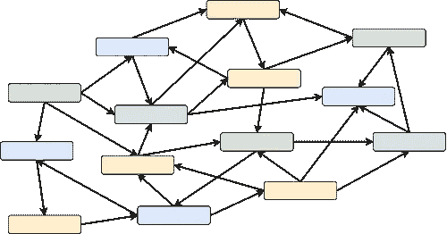

# 软件设计中关注点的分离

> 原文：<https://towardsdatascience.com/separation-of-concerns-in-software-design-aaad847b3b44?source=collection_archive---------26----------------------->

## 应用计算机科学的基本原理来提高各级软件的质量


艾伦·格林伍德在 [Unsplash](https://unsplash.com/photos/x9zy_1oHjqw) 上的照片

[关注点分离](https://en.wikipedia.org/wiki/Separation_of_concerns) (SoC)是软件开发中最基本的原则之一。

> SoC 是如此重要，以至于 5 个坚实的原则中有 2 个(单一责任和界面分离)是从这个概念直接衍生出来的。

原则很简单:不要把你的程序写成一个完整的块，相反，要把代码分解成小块，这些小块是系统中最终确定的小块，每个小块都能够完成一项简单而独特的工作。

在这篇文章中，我详细阐述了在抽象的所有层次应用这个深刻的原则:从每个功能内部的编程代码和模块的设计到整个应用程序的架构，所有这些都是为了实现我们所说的定性软件的特征。

# 用于编程功能的 SoC

如果我们拿最底层(实际的编程代码)来说，SoC 指导我们避免编写冗长复杂的函数。当函数开始[变大](https://martinfowler.com/bliki/FunctionLength.html)时，这是一个危险信号，表明该方法可能一次处理太多的事情。

在这种情况下，SoC 推动我们[重构](https://refactoring.guru/extract-method)它，变成一个更简洁、更具描述性的版本。在这个过程中，原始算法的一部分被导出并封装在具有私有访问级别的独立的较小函数中。我们获得了代码的清晰性，算法的大部分最终变得可以被其他部分重用，即使我们最初没有预料到这种情况会发生。

# 模块的 SoC

在更高的层次上，这一原则告诉我们将功能分组到独立的模块中，每个模块负责完成一组具有明确逻辑关系的任务。

这个过程非常类似于我们必须为功能所做的事情:*分离不太相关的功能，并将服务于相同明确目的的功能组合在一起*。

# 内聚和耦合

关注点分离的应用包括两个过程:减少[耦合](https://en.wikipedia.org/wiki/Coupling_(computer_programming))和增加[内聚](https://en.wikipedia.org/wiki/Cohesion_(computer_science))。

**内聚性**是通过职责集、细节层次和位置来衡量相似性。比如函数`drawCircle`和`drawTriangle`足够内聚，属于同一个负责绘图的模块，*感觉*在代码中把这两个函数放在一起很自然(高相似~高内聚)。

**耦合**则是衡量该部分对系统其余部分的依赖程度(低依赖~松耦合)。

前述的`drawCircle`和`drawTriangle`可以被另一个功能`drawCybertruck`使用。我们也可以将这个函数放在绘图模块中，但是`drawCyberthuck`可能依赖于物理引擎和外部状态。因此，这将使整个绘图模块的可重用性大大降低，并与其他一些组件紧密耦合。

你可以看出原始绘图函数和`drawCyberthuck`属于不同的抽象层次和逻辑复杂度，因此它们需要驻留在不同的模块中。

如果在某个时候我们决定在另一个项目中使用绘图模块——将不再依赖于物理引擎，所以我们将能够更容易地提取它。

一种快速记住应该增加或减少哪个属性的方法:

*   解耦是好的——所以我们需要瞄准一个**松耦合**
*   内聚的代码是好的——我们需要瞄准**高内聚**

高内聚(低分散)代码的一个很好的例子是使用闭包回调而不是委托方法。

这里我应该注意，代码示例是在 iOS 应用程序开发的环境中用 Swift 编写的，但并不太多，它们很好地展示了这个概念。

考虑发送网络请求的代码:

```
// configuring and sending the request
session.send(request: URLRequest) { response in
    // handling the response
}
```

想象一下，如果 URLSession 有一个基于委托的 API 来发出请求:所有的响应都将被交付给一个函数`handle(response: URLResponse, for request: URLRequest)`

这将使网络更加容易出错和乏味，因为处理所有响应的逻辑现在必须绑定到那个函数。

使用基于回调的 API，动作和动作的结果在一个地方处理，这使得跟踪执行流更加容易。

如果我们需要在函数或模块之间跳来跳去，因为我们遵循算法的逻辑，这意味着代码具有**低内聚**，这通常被称为[意大利面条代码](https://www.techopedia.com/definition/9476/spaghetti-code)。

# 松耦合和高内聚的好处

遵循关注点分离的原则有助于改进代码库的许多特性:

1.  更清晰的代码。当每个模块都有一个简洁明了的 API 和一组有逻辑作用域的方法时，理解程序中发生的事情就容易多了。
2.  更好的代码重用性([干原理](https://en.wikipedia.org/wiki/Don%27t_repeat_yourself))。重用代码的主要好处是降低了维护成本。每当您需要扩展功能或修复 bug 时——当您确定它只出现在一个地方时，这样做就不那么痛苦了。
3.  更好的测试性。具有适当范围功能的独立模块以及与应用程序其余部分的隔离很容易测试。您不需要设置整个环境来查看您的模块如何工作——用虚拟模拟或假数据源替换相邻的真实模块就足够了。通过这种方式，您可以通过验证输出将模块测试为黑盒，或者通过查看在连接的模块上调用了哪些方法将模块测试为白盒( [BDD](https://en.wikipedia.org/wiki/Behavior-driven_development) )。
4.  更快的项目进展。无论是新功能还是现有功能的更新，模块的隔离都有助于确定程序中可能受变化影响的区域，从而加快开发速度。
5.  更容易组织多个工程师同时开发。他们只需要就他们在哪个模块上工作达成一致，以确保他们不会互相干扰。只有模块 API 的更新可以作为明确通知其他开发人员的标志，而大多数更改可以在其他贡献者没有立即注意的情况下添加。当与良好的测试覆盖相结合时，并行开发变得和每个单独工作的工程师的累积生产率一样有效([它通常更慢](https://en.wikipedia.org/wiki/The_Mythical_Man-Month))。

如你所见，从程序员的角度来看，耦合和内聚是最终影响使用代码的便利性的特征。

# 用于系统设计的 SoC

对于一堆具有不同职责和明确目的的模块，我们仍然需要概述一个全局策略，以说明模块之间应该如何相互引用。

如果我们不引入这种策略，我们可能会以一个关系错综复杂、数据流难以跟踪的系统而告终。



系统设计的主要目标是勾勒出模块相互感知的边界。

每个现有的架构模式都提供了这种策略。以我们为例，模型-视图-控制器，我们会看到视图不允许与模型直接交互，而应该使用控制器作为中介。

在我看来，这些策略往往来自于纵容不好的普遍观念。在我看来，这要么导致过度设计的解决方案，要么导致职责分离不足的系统。

我倾向于认为系统的设计需要一个更加正式的方法，有明确的标准和动机。

我们已经看到，当 SoC 应用于功能和模块时，总是会产生更多可重用、可测试和可维护的代码。那么，为什么不将内聚性和耦合性作为这些指标，并在应用程序级别应用 SoC 呢？

这就是我们如何将模块分成[层](https://dzone.com/articles/layered-architecture-is-good)的方法。这不是一个具体的架构模式，而是我刚才谈到的策略的高级规范。

模块按层分组，就像我们从一组不同的功能中形成一个模块一样。

> 基于系统中相似的职责和相同的抽象级别，在一层中产生的模块集具有高度的内聚性，而层之间的通信和环境感知非常受限，以实现松散耦合。

我们不仅限制了通信——底层具有更高环境细节的层(存储库，如数据库包装器或网络服务)被禁止直接引用在更高层(业务逻辑或 UI)中定义的任何东西。

因此，如果我们只采用与后端对话的网络服务，它应该对系统的其余部分一无所知**并且只提供发送请求的 API。**

业务逻辑层将知道并使用该存储库，但是它不知道是否有任何 UI 附加到系统上。

UI 层知道业务逻辑模块，并使用它们的 API 来读取最新的数据和触发动作，但同时，它对存储库一无所知，因为业务逻辑对它隐藏了实际的底层基础结构。

> *这样我们可以保证整个系统内在的可测试性，其中每一层要么不知道另一层的存在，要么是高度解耦，很容易被测试中的模拟包围。*

# 贮藏室ˌ仓库

尽管业务逻辑和 UI 的解耦是一个标准举措，但我发现令人惊讶的是，我们为 iOS 开发的大多数流行模式都没有强调业务逻辑与数据网关(如网络层)解耦的重要性。

我多次看到请求直接从视图控制器或其他业务逻辑模块发出。数据库查询、用户默认值和任何其他本地或远程数据存储也是如此。

正如您可能猜到的，我不喜欢这里的紧耦合。但这不仅仅是模块之间的耦合，这或多或少是可以容忍的。

我们讨论的是算法的输入和算法本身之间的紧密耦合。这样的代码几乎不可能测试或进化。

您不希望在业务逻辑中嵌入直接读写操作的原因有很多，因此无法轻松地用模拟的调用交换真实的调用:

1.  在运行未完成的算法时，您可能会意外损坏有价值的数据
2.  对真实数据的访问可能很慢(本地资源的文件很大，访问远程资源时网络/测试服务器很慢)
3.  外部数据可能不可用(本地数据库为空，需要预先填充，服务器关闭或互联网连接中断)
4.  后端可能会在你意想不到的时候突然改变响应格式

后一种情况是臭名昭著的。当然，在一个理想的世界里，这种情况永远不会发生，但它确实发生了，而且比你想象的还要频繁。就算是 CI 也救不了你。

应用程序将停止工作，而第一个被指责的人将是你，移动工程师。你的应用损坏。在失败被发现后的最初几分钟，你不得不找借口，看起来很可怜。

想象一下，你公司的首席执行官正在为投资者展示一个重要活动的应用程序，这种情况发生了。

理想的解决方法是:应用程序不会崩溃，而是优雅地显示一条用户友好的错误消息。我们交给老板另一个设备，它可以使用模拟的演示数据在离线模式下运行，演示继续进行，事故几乎没有被注意到。

离线演示模式？听起来工作量很大！但是如果您已经从数据网关中分离和抽象出来，就不是这样了。

当我们有一个从其他地方查询数据的业务逻辑模块时，我们需要将访问外部数据资源的问题提取到一个单独的模块中，并将不必要的查询细节隐藏在外观后面。

这就是知识库的形成过程。

让我们看一个例子。我们有一个 ViewController，它加载并显示一些项目的列表:

首先要做的是引入`ListRepository`协议并重构 ViewController 来使用它:

现在，我们可以自由地替换实际适用于后端的实现:

或者甚至在离线模式下提供演示数据的虚拟存储库:

通过这种设置，应用程序可以配置为使用真实的网络 API 或模拟数据，我们也可以将这些数据保存在捆绑资源中，而不是硬编码。

对于上面的例子，我还应该注意，当我们实现异步 API 调用的存根时，我们应该始终保持它的异步性(从内部`DispatchQueue.main.async`触发回调)。否则，我们将会释放萨尔戈。

您可以看到存储库在我为 SwiftUI 应用提议的 Clean 架构变体中扮演了一个固有的角色:

[](https://medium.com/swlh/clean-architecture-for-swiftui-6d6c4eb1cf6a) [## SwiftUI 的干净架构

### VIPER、MVVM、Clean Swift (VIP)、RIBs 或 ELM 是否适合 SwiftUI 项目？

medium.com](https://medium.com/swlh/clean-architecture-for-swiftui-6d6c4eb1cf6a) 

# 结论

关注点分离是一个巨人，他的肩膀上站着许多我们今天知道的时髦术语模式。仅仅这个原则就为软件质量在各个层面上的显著提高提供了必要的指导。

在编写代码或设计架构时，不要忽略它。松耦合和高内聚是你的朋友！

为了更好的可测试性，将算法从输入和输出中分离出来，即使没有坚实的基础，你的软件也会坚如磐石:)

在[推特](https://twitter.com/nallexn)上关注我，关注即将发布的帖子！顺便说一下，我所有的文章都可以在我的技术博客( [RSS](https://nalexn.github.io/feed.xml) )中免费阅读:

[](https://nalexn.github.io/?utm_source=xm) [## 阿列克谢·瑙莫夫

### iOS 开发最佳实践、软件架构设计、功能反应式编程、Swift、SwiftUI、Combine…

nalexn.github.io](https://nalexn.github.io/?utm_source=xm)