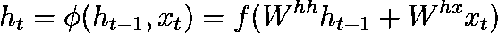

# 英语到法语翻译的 Seq2Seq 建模

> 原文：<https://towardsdatascience.com/seq2seq-modelling-for-english-to-french-translations-f6e4aa7aa02c?source=collection_archive---------42----------------------->

## 使用 Tensorflow 和 Keras 从头构建 Seq2Seq 网络

在隔离期间，我试图学习如何说法语，让自己有事可做。这一尝试并不成功，因此我建立了一个神经网络来尝试为我学习它。

为了做到这一点，我使用了一个具有注意力层的 seq2seq 递归神经网络，在加拿大第 36 届议会的众议院和参议院辩论中进行了训练(见[此处](https://www.isi.edu/natural-language/download/hansard/))。基于注意力的 seq2seq 模型通常用于各种各样的任务，事实上，如果你曾经使用过 Siri 或谷歌翻译，你就有可能从这种模型中受益。

但是在我开始讨论我们如何自己构建一个之前，我认为快速了解 seq2seq 模型如何工作背后的一些理论是一个好主意——重点关注使这些模型表现如此良好的几个关键元素。

由 [Alex Ovs](https://unsplash.com/@sanekovs?utm_source=medium&utm_medium=referral) 在 [Unsplash](https://unsplash.com?utm_source=medium&utm_medium=referral) 上拍摄

## 什么是 seq2seq 模型？

seq2seq 模型关于 NLP 的目标实质上是在考虑输入单词序列时计算输出单词序列的概率。这对机器翻译很有用，因为我们可能有一堆潜在的翻译，我们想知道哪个序列是最好的——例如狗是大的>大的是狗。或者我们可能需要选择一个最适合给定序列的词——例如上班迟到>上班慢跑迟到。

对于机器翻译，我们需要将一个单词序列编码成一个易于被模型消化的向量，然后让模型将这个向量解码成我们的目标语言。我们可以使用一个模型来进行编码和解码，但当您考虑到输入长度可能与输出长度不匹配时，问题就出现了，例如，“我妈妈爱法国”翻译成“ma maman aime la france”，需要一个额外的单词。这些输出序列长度不一定事先知道。

这将我们引向 seq2seq 模型。这个想法是，你得到一个模型——编码器——把一个单词序列转换成一个编码器向量，这个向量代表你要翻译的句子中的所有信息。然后你得到一个解码器，它使用 softmax 函数获取这个向量并输出翻译后的单词。

首先，编码器接受一个输入序列，并返回它自己的隐藏状态。当计算编码器隐藏状态(ht)时，我们只需要考虑当前输入(xt)和先前步骤隐藏状态(ht-1 ),因此等式看起来像这样

然后，解码器获取编码器的最后一个隐藏向量(c=ht)、前一个隐藏状态(ht-1)和前一个预测输出字(yt-1)。考虑到我们也是从编码器的最后一个隐藏向量计算的，我们使用先前预测的输出字可能看起来很奇怪，但是使用它允许 softmax 对当前预测(yt)产生影响。此外，yt-1 实际上给出了关于前一个单词是什么的明确答案，而不是概率分布，这有助于防止模型重复单词。所以总的来说，我们的解码器隐藏状态的公式看起来像这样-

现在我们需要做的就是在最后应用一个 softmax 函数，因为本质上这仍然是一个多类分类问题，但是现在我们的类是下一个时间步目标语言中的每个单词。

## LSTM 细胞

因此，上面我们已经为 seq2seq 模型设计了结构。但是你可能想知道编码层和解码层是由什么组成的。编码器/解码器层可以由基本的 RNN 单元组成，但是这些单元不能在长序列中寻找上下文。因此，如果它试图根据前面的单词预测下一个单词，它可能会很好地处理类似“坐在椅子上的人”的事情，因为坐和椅子之间没有很大的差距。然而，对于像“正在做牛排…然后我坐下来吃牛排“它可能不会表现得很好，因为我们想要预测的单词(牛排)和这个单词的上下文之间有更大的差距(关于为什么 RNN 细胞在长序列上表现不好的详细信息，Bengio 等人有很好的论文详细说明了[困难](http://ai.dinfo.unifi.it/paolo//ps/tnn-94-gradient.pdf)

这就是 LSTM 细胞的用武之地。不仅仅是将前一时间步的隐藏状态与当前输入相结合，还有四个层在起作用。基本的想法是，这些细胞可以将对未来决策有用的信息保存在细胞内。

加戈、詹妮弗·乔安娜&瓦斯科、瓦伦蒂娜&茹卡沃斯基、巴特克&帕塔奇尼、乌戈&蒂哈诺夫、瓦迪姆&维克托斯、胡安&巴拉格尔、卡洛斯。(2019).序列对序列自然语言到类人机器人手语。[链接](https://www.researchgate.net/publication/334360853_Sequence-to-Sequence_Natural_Language_to_Humanoid_Robot_Sign_Language)

在每个时间步，我们都要修改以下内容-

输入门-

遗忘之门-

输出-

前三个方程都非常相似。sigmoid 函数，因此它们的输出将位于 0 和 1 之间，这意味着它们的输出向量可以定义另一个向量可以通过第一个向量的量。xt 是当前输入，ht-1 是前一时间步隐藏层，W U 是权重。

然后我们有了新的存储单元，它与标准的 RNN 层相同，只是我们用输入向量的输出来控制它的输出。我们可以将这一层视为候选隐藏状态。

然后我们将它们与最终的存储单元和隐藏状态结合在一起。

输入门决定了我们对当前单词向量的关心程度。换句话说，它决定了你想让当前输入的新计算状态通过多少。例如，如果我们试图预测电影评论的情绪，但当前向量正在谈论这个人晚餐吃了什么，那么权重可能接近于零，当前向量将不会通过这个门。

输出门将对当前预测重要的内容与对未来重要的内容分开，因此它不会对当前时间步长的单元输出产生影响，但会改变其隐藏状态。这很有用，因为有时当前步骤可能现在对输出没有用，但以后可能会有一些好处。

遗忘门使用当前步骤输入来决定我们应该从长期状态(h(t-1))中遗忘什么。所以回到前面的例子，如果我们试图预测一部电影评论的情绪，而前面的时间步骤只是关于情节，而当前的时间步骤是“我讨厌它”，你可能会想忘记前面的信息，只关注当前的时间步骤。值得注意的是，所有这些门都是向量，我们不应该认为它们是绝对的，而是会忘记一个长期隐藏的单元的某些元素。

所有上面的层都是单层神经网络，然后我们把它们放在最终的存储单元(ct)中，就像这样-

这个等式有直观的意义，因为我们的遗忘门(ft)决定了我们想要忘记多少以前的记忆，所以我们将其应用于以前的时间步。同时，我们希望将当前时间步长的输入门(it)和标准 RNN 单元(c̃t)结合在一起。

最后，我们使用这个存储单元和输出门来确定时间 t -时的隐藏状态 ht

基本上就是这样了！要更详细地了解 LSTMs 是如何工作的，这里有一些很好的资源

 [## 了解 LSTM 网络

### 2015 年 8 月 27 日发布人类不是每秒钟都从零开始思考。当你读这篇文章时，你…

colah.github.io](https://colah.github.io/posts/2015-08-Understanding-LSTMs/) 

## 注意层

在我们进入代码之前，我将快速讨论一下注意力层，因为它在这个模型的性能中起着很大的作用。

尽管 LSTM 单元对于单词远离模型试图预测的单词的上下文很有帮助，但它并没有完全缓解这个问题。注意层允许解码器关注在该时间步获得正确输出所需的序列部分，从而缩短输入字到其翻译之间的路径，从而减轻 LSTMs 可能具有的一些存储器限制。它通过提供一种针对源序列上的所有标记对目标序列中的标记进行评分的方式来实现这一点，并使用这种方式来改变解码器序列的输入。分数然后被输入到 softmax 激活中，以进行注意力分配。

注意力如何融入模型架构的其他部分？我们不是只发送编码器的最终状态，而是将其所有输出发送给解码器。在每个时间步，解码器的注意力单元计算所有这些编码器输出的加权和，并使用 softmax 激活函数确定在每个步骤中它将关注哪些单词。关于注意力机制的更详细的解释，请看这里

 [## 注意力和增强递归神经网络

### 递归神经网络是深度学习的主要内容之一，允许神经网络与序列一起工作…

蒸馏. pub](https://distill.pub/2016/augmented-rnns/) 

## 数据清理和准备

现在，我们已经快速浏览了理论，我们可以进入实际的编码，我不会覆盖项目中的所有代码，但会在最后将 github repo 与所有内容联系起来。此外，如果你的计算机上没有 GPU 访问，我会推荐使用谷歌 Colab 这样的东西，这样你就可以使用他们的免费 GPU，因为它将大大加快训练时间。

第一步是清理数据，并将其转换成可用的格式。要做到这一点，我们需要删除所有奇怪的东西，如空格，标点符号和不可打印的符号。

接下来，我们需要限制每个句子的长度，以加快训练速度。此外，对于目标序列，我们需要在每个序列的开头和结尾添加一个开始字符(~~)和一个结束字符(~~)。我们这样做是为了当我们想要翻译看不见的数据时，我们可以输入开始字符来让模型运行，并在翻译完成时给模型一个停止的方法。最后，我们需要填充英文数据，这样每个序列都是相同的大小。

我们准备的下一步是为每种语言创建字典，字典中的每个单词都与一个数字相关，该数字可以很容易地为模型进行编码。重要的是，我们将在字典中添加一个<unk>符号，用于解释模型词汇表之外的单词。</unk>

最后，我们必须实际编码我们的训练和测试数据。在每一个时间步，我们都将输入数据和下一步的目标数据提供给模型。

## 手套嵌入

因此，我们可以从这里直接进入建模，但我们可以采取一个额外的步骤，可以大大提高模型的性能。我不会说太多细节，但基本上我们可以在模型中给单词预设权重，以反映单词的相似程度——例如，国王和王后比国王和胡萝卜更相似。关于这个概念的更详细的观点，这里是原文——[https://nlp.stanford.edu/pubs/glove.pdf](https://nlp.stanford.edu/pubs/glove.pdf)

## 创建和训练模型

好了，现在我们已经做好了所有的数据准备，我们可以开始创建模型了。编码器模型是一个两层 LSTM，解码器是一个单层 LSTM，还增加了一个关注层。这提供了很好的性能，仅在几个时期后验证精度就达到了 0.96，但在未来，我希望研究双向 LSTMs 来提高性能。

在训练初始模型后，我们将训练好的层转移到推理模型中，这样我们就可以实际使用它了。

## 运行推理模型

最后，在创建我们的推理模型后，我们可以用它来翻译任何我们想要的英语句子！为此，我们将英语句子输入推理编码器，然后将编码数据和起始标记输入解码器。接下来，我们使用 while 循环继续遍历整个句子，直到模型预测到结束标记()或者达到最大句子长度。

## 测试模型

那么模型做的怎么样呢？我用下面验证集中的几个句子进行了测试-

接下来，我想尝试一个全新的句子

总的来说，只有几个训练时期非常棒！

## 结束语

在本文中，我们展示了 seq2seq 模型在机器翻译中的强大功能。然而，还有更多事情要做！在未来，我想引入波束搜索和双向层，因为它们可以进一步提高性能。对于这个项目中使用的完整代码，你可以访问 github repo [这里](https://github.com/danch12/seq2seq_translation/tree/master)。