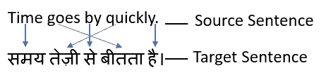
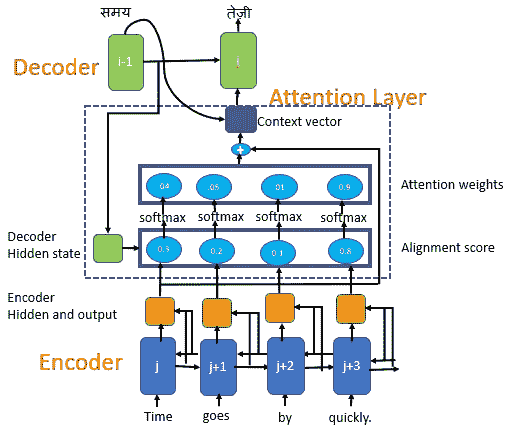
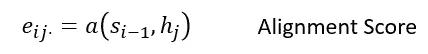
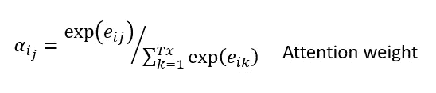
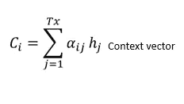
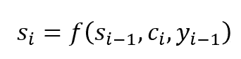
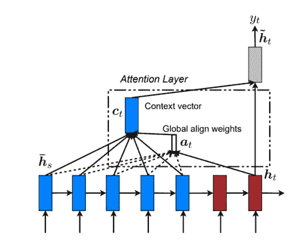
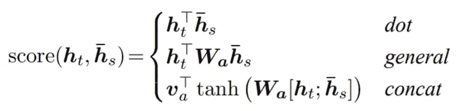
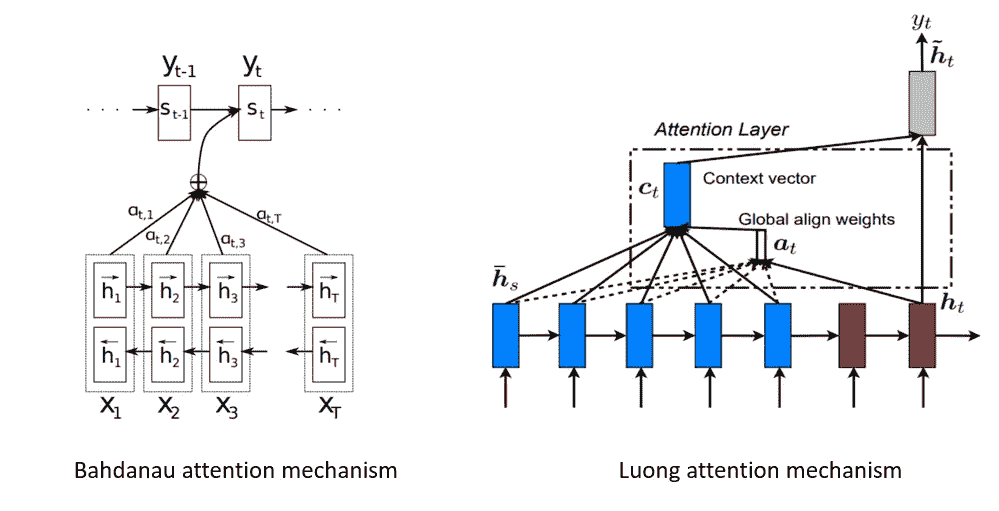

# 注意:具有注意机制的序列 2 序列模型

> 原文：<https://towardsdatascience.com/sequence-2-sequence-model-with-attention-mechanism-9e9ca2a613a?source=collection_archive---------4----------------------->

## Bahdanau 和 Luong 提出的序列 2 序列模型中注意机制的详细解释

在本文中，您将了解到:

*   为什么我们需要序列 2 序列模型的注意机制？
*   Bahdanua 的注意力机制是如何工作的？
*   Luong 的注意力机制是如何工作的？
*   什么是本地和全球关注？
*   Bahdanau 和 Luong 注意机制的主要区别

**先决条件:**

[像 LSTM 和 GRU 这样的循环神经网络(RNN)](https://medium.com/datadriveninvestor/recurrent-neural-network-rnn-52dd4f01b7e8)

[Seq2Seq-神经机器翻译](/intuitive-explanation-of-neural-machine-translation-129789e3c59f)

## 什么是注意，为什么我们需要序列 2 序列模型的注意机制？

让我们考虑两个场景，场景一，你正在阅读一篇与当前新闻相关的文章。第二种情况是你准备考试。两种情况下的注意力水平是相同还是不同？

与新闻文章相比，你在准备考试时会相当注意阅读。在准备考试的时候，你将会更加关注关键词来帮助你记住一个简单或复杂的概念。这同样适用于任何深度学习任务，我们希望专注于感兴趣的特定领域。

**序列到序列(Seq2Seq)模型使用编码器-解码器架构。**

seq2seq 的几个用例

*   神经机器翻译(NMT)、
*   图像字幕，
*   聊天机器人
*   抽象文本摘要等。

Seq2Seq 模型将源序列映射到目标序列。在神经机器翻译的情况下，源序列可以是英语，目标序列可以是印地语。

我们将英语中的源句子传递给编码器；**编码器将源序列的完整信息编码成单个实值向量，也称为上下文向量**。这个上下文向量然后被传递给解码器，以产生目标语言(如印地语)的输出序列。上下文向量负责将整个输入序列总结成一个向量。

***如果输入的句子很长，来自编码器的单个向量能否容纳所有相关信息提供给解码器？***

***在预测目标词时，是否可以关注句子中的几个相关词，而不是保存整个句子信息的单个向量？***

注意力机制有助于解决问题。

> 注意机制的基本思想是避免试图学习每个句子的单个向量表示，而是基于注意权重来注意输入序列的特定输入向量。

在每一个解码步骤，解码器将被告知需要对每个输入单词给予多少“关注”，使用一组**。*这些注意力权重向解码器提供上下文信息以进行翻译*

**

# *巴赫达瑙注意机制*

*Bahdanau 等人提出了一种**学习联合对齐和翻译**的注意机制。它也被称为**附加注意，因为它执行编码器状态和解码器状态的线性组合**。*

**让我们来理解巴赫达瑙提出的注意机制**

*   *编码器(前向和后向)和解码器的所有隐藏状态都用于生成上下文向量，不像 seq2seq 中只使用最后一个编码器隐藏状态而不加注意。*
*   *注意机制利用由前馈网络参数化的比对分数来比对输入和输出序列。它有助于注意源序列中最相关的信息。*
*   *该模型基于与源位置和先前生成的目标单词相关联的上下文向量来预测目标单词。*

**

*注意机制*

***具有注意机制的 Seq2Seq 模型由编码器、解码器和注意层组成。***

*注意力层包括*

*   *对准层*
*   *注意力权重*
*   *上下文向量*

***比对分数***

*比对分数映射了位置*”****j”***周围的输入和位置***I”***处的输出匹配得如何。分数基于预测目标单词之前的前一解码器的隐藏状态 **s₍ᵢ₋₁₎** 和输入句子的隐藏状态 hⱼ*

**

***解码器决定需要关注源句子的哪一部分，而不是让编码器将源句子的所有信息编码成一个定长向量**。*

*与源序列具有相同长度的对齐向量，在解码器的每个时间步长进行计算*

**在我们的例子中，为了预测第二个目标词，***，我们将为输入词* ***快速生成一个高分*****

****注意力权重****

**我们**将 softmax 激活函数应用于比对分数，以获得注意力权重**。**

****

**Softmax 激活函数将获得总和等于 1 的概率，这将有助于表示每个输入序列的影响权重。输入序列的注意力权重越高，其对预测目标单词的影响就越大。**

***在我们的例子中，我们看到输入单词******【तेज़ी】***具有较高的注意力权重值****

****上下文向量****

**上下文向量用于计算解码器的最终输出。**上下文向量𝒸ᵢ是注意力权重和编码器隐藏状态(h₁、h₂、…,hₜₓ)的加权和，其映射到输入句子。****

****

****预测目标词****

**为了预测目标单词，解码器使用**

*   **上下文 vector(𝒸ᵢ)，**
*   **前一时间步的解码器输出(y **ᵢ₋₁** )和**
*   **前一个解码器的隐藏状态( **sᵢ₋₁)****

****

**解码器在时间步长 I 的隐藏状态**

# **卢昂注意机制**

**Luong 的注意力也被称为**倍增注意力**。**通过简单的矩阵乘法将编码器状态和解码器状态转化为注意力分数。简单的矩阵乘法使它更快更节省空间。****

**Luong 根据注意力在源序列中的位置提出了两种类型的注意机制**

1.  ****全局关注**关注所有源位置**
2.  ****局部注意力**其中注意力仅放在每个目标单词的源位置的一个小子集上**

****全局和局部注意力的共性****

*   **在解码阶段的每个时间步长 t，全局和局部注意这两种方法首先将堆叠 LSTM 顶层的隐藏状态 hₜ作为输入。**
*   **这两种方法的目标都是导出一个上下文向量 **𝒸ₜ** 来捕捉相关的源端信息，以帮助预测当前的目标单词 **yₜ****
*   **注意力向量作为输入被馈送到下一个时间步骤，以通知模型关于过去的对齐决策。**

****全局和局部注意力模型在如何导出上下文向量𝒸ₜ方面有所不同****

**在我们讨论全局和局部注意之前，让我们先了解 Luong 的注意机制在任何给定时间 t 所使用的惯例**

*   **𝒸ₜ:语境向量**
*   **aₜ:对齐向量**
*   **hₜ:当前目标隐藏状态**
*   **hₛ:电流源隐藏状态**
*   **yₜ:预测当前目标词**
*   **˜ₜ : 注意力向量**

# **全球关注**

****

**全球注意力来源:[基于注意力的神经机器翻译的有效方法](https://arxiv.org/pdf/1508.04025.pdf)**

*   ****当计算上下文向量𝒸ₜ.时，全局注意力模型考虑编码器的所有隐藏状态****
*   **通过将当前目标隐藏状态**h*ₜ*与源隐藏状态 **hₛ** 中的每一个进行比较，得到等于源序列中时间步长数量大小的可变长度对齐向量**t1】aₜ******
*   **比对分数被称为基于内容的函数，我们考虑了三种不同的备选方案**

****

*   ****全局上下文向量𝒸ₜ是根据对齐向量 *aₜ* 在所有源隐藏状态 hₛ** 上计算的加权平均值**

***当源序列是大段或者大文档时会怎样？***

**当全局注意力模型考虑源序列的所有单词来预测目标单词时，它变得**计算昂贵，并且翻译更长的句子可能具有挑战性****

**我们可以通过使用局部注意来解决全局注意模型的这一缺陷**

# **当地的关注**

****

**局部注意力来源:[基于注意力的神经机器翻译的有效方法](https://arxiv.org/pdf/1508.04025.pdf)**

*   ****局部注意力只集中在每个目标单词的源位置的一个小的子集上，不像全局注意力那样集中在整个源序列上****
*   ****计算成本低于全局注意力****
*   **局部注意力模型首先在时间 t 为每个目标单词生成对齐位置 **Pₜ****
*   **上下文向量 **𝒸ₜ** 是作为所选窗口内的源隐藏状态集合的加权平均值导出的**
*   ****可单调或预测地选择对齐位置****

# **Bahdanau 和 Luong 注意机制的主要区别**

****

****双向编码器中前向和后向隐藏状态的 Bahdanau 级联。Luong attention 在编码器和解码器的顶层都使用隐藏状态****

## **Bahdanau 和 Luong 注意机制中注意的计算**

**Bahdanau 等人在双向编码器中使用前向和后向隐藏状态的连接，在他们的非堆叠单向解码器中使用先前目标的隐藏状态**

**Loung 等人的注意力在编码器和解码器中的顶部 LSTM 层使用隐藏状态**

****Luong 注意机制使用当前解码器的隐藏状态来计算对齐向量，而 Bahdanau 使用前一时间步的输出****

## **对齐功能**

****Bahdanau** 仅使用 concat 评分比对模型，而 Luong 使用 dot、general 和 concat 评分比对模型**

****

**有了注意力机制的知识，你现在可以构建强大的深度 NLP 算法。**

## **参考资料:**

**[通过联合学习对齐和翻译 Dzmitry Bahdanau 的神经机器翻译](https://arxiv.org/pdf/1409.0473.pdf)**

**[基于注意力的神经机器翻译的有效方法:Minh-Thang Luong Hieu Pham Christopher d . Manning](https://arxiv.org/pdf/1508.04025.pdf)**

** [## 神经网络中的注意机制

### 在机器翻译中，编码器-解码器架构是常见的。编码器读取一个单词序列，然后…

devopedia.org](https://devopedia.org/attention-mechanism-in-neural-networks)**