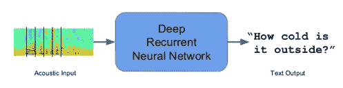

# 序列模型和递归神经网络

> 原文：<https://towardsdatascience.com/sequence-models-and-recurrent-neural-networks-rnns-62cadeb4f1e1?source=collection_archive---------9----------------------->

## 理解深度递归神经网络(RNNs)

# 序列模型

序列模型是输入或输出数据序列的机器学习模型。序列数据包括文本流、音频片段、视频片段、时间序列数据等。递归神经网络(RNNs)是一种用于序列模型的流行算法。

序列模型的应用 1。语音识别 **:** 在语音识别中，给定一个音频片段作为输入，然后模型必须生成它的文本副本。这里输入和输出都是数据序列。

语音识别(来源:作者)

2.情感分类**:情感分类中的**对一段文本中表达的观点进行分类。这里的输入是一个单词序列。

情感分类(来源:作者)

3.视频活动识别 **:** 在视频活动识别中，模型需要识别视频片段中的活动。视频剪辑是视频帧序列，因此在视频活动识别的情况下，输入是数据序列。

视频活动识别(来源:作者)

这些例子表明序列模型有不同的应用。有时输入和输出都是序列，有时输入或输出都是序列。递归神经网络(RNN)是一种流行的序列模型，它对序列数据表现出高效的性能。

# 递归神经网络

递归神经网络(RNN)是一种深度学习算法，是一种专门用于处理序列数据的人工神经网络架构。rnn 主要用于自然语言处理领域。RNN 维护内存，因此它们对于涉及顺序数据的机器学习问题非常有效。rnn 也用于时间序列预测。

传统的 RNN 建筑(来源:Stanford.edu)

使用 RNNs 而不是标准神经网络的主要优点是标准神经网络中没有共享的特征。在 RNN，权重是跨时间共享的。RNNs 可以记住它以前的输入，但是标准的神经网络不能记住以前的输入。RNN 利用历史信息进行计算。

损失函数

在 RNN，损失函数是根据每个时间步的损失定义的。

重量损失的导数

在 RNN，反向传播在每个时间点进行

**RNN 建筑**

基于输入和输出的数量，有几种 RNN 架构
1。一对多架构:图像字幕就是这种架构的一个很好的例子。在图像字幕中，它获取一幅图像，然后输出一系列单词。这里只有一个输入，但有许多输出。

2.多对一架构:情感分类是这种架构的一个很好的例子。在情感分类中，给定的句子被分类为肯定或否定。在这种情况下，输入是单词序列，输出是二进制分类。

3.多对多架构:在多对多架构中有两种情况，

*   *第一种*是输入长度等于输出长度。命名实体识别是一个很好的例子，其中输入序列中的单词数等于输出序列中的单词数。
*   *多对多架构的第二种*是当输入长度不等于输出长度时。机器翻译是这种架构的一个很好的场景。在机器翻译中，RNN 阅读一种语言的句子，然后将其转换成另一种语言。这里输入长度和输出长度是不同的。

RNN 建筑(来源:[https://Calvin feng . git book . io](https://calvinfeng.gitbook.io))

# 长短期记忆(LSTM)

传统的 rnn 不擅长捕捉长程相关性。这主要是由于消失梯度问题。当训练非常深的网络时，梯度或导数随着其向下传播而指数下降。这就是所谓的消失梯度问题。这些梯度用于更新神经网络的权重。当梯度消失时，权重将不会更新。有时候会
完全停止神经网络的训练。这种消失梯度问题是非常深的神经网络中的常见问题。

为了克服 RNNs 中的梯度消失问题，Sepp Hochreiter 和 Juergen Schmidhuber 引入了长短期记忆。LSTM 是对 RNN 隐藏层的修改。LSTM 使 RNNs 能够长时间记住它的输入。在 LSTM 中，除了隐藏状态，单元状态被传递到下一个时间步。

基本 RNN 和 LSTM 单位的内部结构(资料来源:stanford.edu)

LSTM 可以捕捉远程依赖。它可以长时间记忆以前的输入。LSTM 的牢房里有三道门。LSTM 的记忆操作是通过这些门完成的。长短期记忆(LSTM)利用门来控制递归网络记忆中的梯度传播。

*   遗忘门:遗忘门删除单元状态中不再有用的信息
*   输入门:输入门增加了对单元状态有用的附加信息
*   输出门:输出门增加了对单元状态有用的附加信息

LSTM 的这种门控机制允许网络学习何时忘记、忽略或保留记忆单元中的信息。

LSTM 是一种非常流行的序列模型深度学习算法。苹果的 Siri 和谷歌的语音搜索是一些使用 LSTM 算法的真实例子，它是这些应用程序成功的背后。最近的研究表明，LSTM 算法可以提高机器学习模型的性能。LSTM 也用于时间序列预测和文本分类任务。

**参考文献**

[https://www . researchgate . net/publication/13853244 _ Long _ Short-Short _ Memory](https://www.researchgate.net/publication/13853244_Long_Short-term_Memory)
[https://Stanford . edu/~ shervine/teaching/cs-230/cheat sheet-recurrent-neural-networks](https://stanford.edu/~shervine/teaching/cs-230/cheatsheet-recurrent-neural-networks)