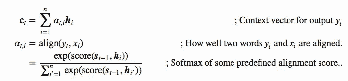
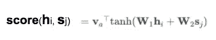

# 序列对序列模型:使用 Tensorflow 2 的注意力网络

> 原文：<https://towardsdatascience.com/sequence-to-sequence-models-attention-network-using-tensorflow-2-d900cc127bbe?source=collection_archive---------46----------------------->

## 第 2 部分:序列到序列模型:从 RNN 到变压器

在本系列教程的[第 1 部分](/sequence-to-sequence-models-from-rnn-to-transformers-e24097069639)中，我们讨论了带有简单编码器-解码器网络的序列间模型。简单网络更容易理解，但它也有其局限性。

## 简单编码器-解码器网络的局限性

如果您还记得第 1 部分，解码器仅基于编码器的最后隐藏输出进行解码。 ***这意味着，为了让普通的编码器-解码器网络正常工作，编码器需要确保在最后的隐藏状态输出中编码所有必要的信息。*** 这对于短序列很有效，但对于长序列效果不佳。

这就是为什么`attention`是序列到序列模型中的一个关键概念[1]。

## 注意力是如何工作的

注意机制的目标是向解码器提供上下文信息，以便解码器能够以更高的准确度解码。注意力网络表示上下文向量和整个输入序列之间的关系，而不是依赖编码器的最后隐藏状态中的单个上下文向量。

图 1:*bahda nau 注意的编码器-解码器模型[1]*

*   我们计算一个上下文向量 ***c*** 作为输入序列的隐藏状态的总和，用`alignment scores`加权。
*   `alignment scores`给位置*处的输入 ***x*** 和位置*处的输出*分配一个 ***分数*。*****

****

**图 2:注意力等式[4]**

*   **不同的注意机制以不同的方式计算这个`score`。**
*   **解码器使用这些注意力分数来决定在每个解码时间步长对输入给予多大程度的关注**

**计算注意力得分主要有四种不同的方法——加法(Bahdanau 的注意力)和乘法(Luong 的注意力)、自我注意力和键值注意力。这里我们将重点关注 Bahdanua 的注意力。**

## **巴丹瑙注意了**

**Bahdanau 等人[1]提出了原始的注意力机制，该机制使用一个隐藏层前馈网络来计算注意力对准分数[2]**

****

**图 3 —注意力得分计算**

**这里，***v******W***是学习到的——注意网络的参数。 ***W₁*** 和 ***W₂*** 是分别学习当前隐藏状态*的变换和编码器输出 ***s*** 的独立矩阵。***

**如果你有点困惑，不要担心。我们会写一个方法让 Bahdanau 注意，让事情变得更清楚。**

## **使用 Tensorflow 2.0 实现 Bahdanau 注意力**

**在`BahdanauAttention`初始化器中，你会看到我们正在初始化三个`Dense`层— `W1`、`W2`和`V`。如图 3 所示，这些`Dense`层将用于计算正向传播中的分数，也称为`call`方法中的分数。**

**我们向`W1`和`W2`层传递什么？`W1`和`W2`分别将当前隐藏状态和编码器输出作为输入。在`call`方法内部——隐藏状态和编码器输出分别由`query`和`value`表示。一旦我们使用来自`Decoder`网络的`BahdanauAttention`，你会对分数计算有更清晰的了解。**

**接下来，当我们通过 softmax 层传递`score`时，我们计算`attention_weights`。由于 softmax 返回多类分类问题中目标类的概率分布[5]，因此`attention_weights`本质上代表了解码器在解码过程中关注了哪个单词。**

**最后，我们计算`context_vector`，解码器将使用它来预测最可能的输出。**

## **编码器和解码器:**

**`Encoder`等级与[第一部分](/sequence-to-sequence-models-from-rnn-to-transformers-e24097069639)中描述的等级相同。除了添加了如下所示的注意机制之外，`Decoder`类也非常相似。**

**你会注意到在`line #19`我们正在初始化`attention`层。在`call`方法的前向传播过程中，我们用当前的隐藏状态和编码器输出实例化了`attention`层，该输出转化为`BahdanauAttention`类中的`query`和`value`。`attention`层输出`context_vector`和`attention_weights`(第`20`行)。`context_vector`与解码器输入`x`连接(第#行`26`)。该连接的结果然后通过`gru`单元和一个完全连接的层(线# `35`)。这里的`Decoder`类也输出`attention_weights`，稍后您可以使用它来可视化解码器关注的地方[3]**

## **把所有的放在一起**

**端到端的工作流程与我们在[第一部分](/sequence-to-sequence-models-from-rnn-to-transformers-e24097069639)中描述的相同——数据清理、定义`Encoder`和`Decoder`类、训练模型、推理和评估。关于工作代码，请参考 TensorFlow 示例代码[这里的](https://github.com/tensorflow/docs/blob/master/site/en/tutorials/text/nmt_with_attention.ipynb)。**

# **参考:**

1.  **联合学习对齐和翻译的神经机器翻译[https://arxiv.org/abs/1409.0473](https://arxiv.org/abs/1409.0473)**
2.  **NLP 深度学习最佳实践[https://ruder . io/Deep-Learning-NLP-Best-Practices/index . html #注意](https://ruder.io/deep-learning-nlp-best-practices/index.html#attention)**
3.  **有注意力的神经机器翻译[https://www . tensor flow . org/tutorials/text/NMT _ with _ Attention](https://www.tensorflow.org/tutorials/text/nmt_with_attention)**
4.  **[https://lilian Weng . github . io/lil-log/2018/06/24/attention-attention . html](https://lilianweng.github.io/lil-log/2018/06/24/attention-attention.html)**
5.  **Softmax 的直观解释[https://www . machine curve . com/index . PHP/2020/01/08/how-the-soft max-activation-function-work/](https://www.machinecurve.com/index.php/2020/01/08/how-does-the-softmax-activation-function-work/)**