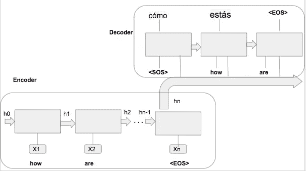

# 序列到序列模型:使用 Tensorflow 2 的编码器-解码器

> 原文：<https://towardsdatascience.com/sequence-to-sequence-models-from-rnn-to-transformers-e24097069639?source=collection_archive---------17----------------------->

## 第 1 部分:序列到序列模型:从 RNN 到变压器

来自 [Pixabay](https://pixabay.com/?utm_source=link-attribution&utm_medium=referral&utm_campaign=image&utm_content=1661731) 的[莫尼卡普](https://pixabay.com/users/MonikaP-2515080/?utm_source=link-attribution&utm_medium=referral&utm_campaign=image&utm_content=1661731)的图片

序列到序列模型是对序列数据进行操作的基本深度学习技术。它将一个结构域的序列转换成另一个结构域的序列[1]。这些模型可以是基于 RNN 的简单编码器-解码器网络或高级的基于注意力的编码器-解码器 RNN 或最先进的变压器模型。序列到序列模型有许多应用，例如机器翻译、语音识别、文本摘要、问题回答、需求预测等等。

本文是关于序列到序列模型的三篇文章中的第 1 篇，在这篇文章中，我们将重点构建一个机器翻译系统。在这一部分中，我们将关注基于 RNN 的编码器-解码器网络的内部工作。为了举例说明，我们将构建一个西班牙语到英语的翻译模型。

本文的重点是模型架构、训练和使用 Tensorflow 2.0 的推理过程。因此，我们将省略关于数据准备的讨论。作为参考，数据准备部分可以按照 Tensorflow 教程[2]进行。如果您是 Tensorflow 2.0 的新手，您可能需要特别关注`create a tf.data dataset`部分[2]

如果你觉得这篇文章很有趣，请随时联系 LinkedIn。

# 编码器-解码器模型

直观上，编码器对输入进行编码，解码器将其解码到所需的域。在我们的例子中，编码器将对输入的西班牙语句子进行编码，解码器将它们解码成英语。在基于递归神经网络(RNN)的架构中，编码器和解码器都是 RNN 或其变体之一，如 LSTM 或 GRU。在本文中，我们将使用 GRU 单元。

图 1:机器翻译的编码器-解码器模型

## 编码器

*   编码器的输入是英语单词。在每个时间步长，一个英语单词作为输入与前一个时间步长(称为隐藏状态)的 RNN 的输出一起传递给 RNN。一开始，这个隐藏状态被初始化为零。
*   编码器通过这个 RNN 网络对输入数据进行编码

## 解码器

*   在训练阶段，解码器的输入是移动一步的西班牙语单词。也就是说，给解码器一个它`should have`预测的输入字，而不管它实际预测的是什么。
*   对于第一个时间步长，解码器被赋予`start-of-sequence (SOS)`。解码器应该以一个`end-of-sequence (EOS)`标记结束句子。

## 推理过程:

序列对序列模型中的一个关键概念是理解训练和推理模型的不同之处。它是关于解码器的。我们在推断时间和训练时间如何将输入提供给解码器是不同的。你大概可以直观的理解，在推理时间里，我们不知道目标翻译的单词。因此解码器将被馈送前一时间步的输出。当然，对于第一个时间步长，解码器被赋予`start-of-sequence (SOS)`。

让我们深入研究一下实现。

## 编码器型号

我们将使用 Tensorflow 2 构建一个`Encoder`类。首先，确保您导入了必要的库

`import tensorflow as tf`

`Encoder`和`Decoder`类都将继承自`tf.keras.Model`。至少，这些类将有两个方法——一个初始化器`__init__`方法和一个`call`方法。`call`方法在网络的正向传递过程中执行。如果您熟悉 Pytorch，那么您很可能熟悉这种定义模型的风格。

在`Encoder`类中，我们还将定义一个初始化隐藏状态的方法。

在`__init__`方法中，我们需要定义层——例如`Embedding`层、`GRU`层或完全连接的`Dense`层。我们还需要初始化定义这些层所需的变量。具体来说，我们需要定义

*   `vocab_size`:训练数据中的唯一单词数
*   `embedding_dim`:您希望嵌入的尺寸。一般来说，越高越好，但这也带来了计算和内存成本。
*   `enc_units`:GRU 单位的数量。例如，在`figure-1`中，我们有`n`个编码器单元
*   `batch_size`:你希望你的模型在每个时期训练的数据量。

在`call`方法中，你想做你认为你的模型在网络的前向传播中应该做的操作。在编码器的情况下，我们需要得到嵌入的输入字，并通过 GRU 层传递它。

## 解码器模型

`Decoder`类与`Encoder`类非常相似。除此之外，您需要通过完全连接的`Dense`层传递 GRU 单元的输出，以便从网络中获得预测。

## 训练编码器-解码器网络

首先，我们将定义网络的优化器和损失函数。我们将使用 Adam 优化器。既然是分类问题，我们就用`CrossEntropy`损失作为损失函数。

在训练过程中—

*   我们通过返回`encoder output`和`encoder hidden state`的编码器输入。
*   然后将`encoder output`、`encoder hidden state`和`decoder input`传递给解码器。`decoder input`以`<SOS>`(句首)标记开始。
*   解码器输出`prediction`和`decoder hidden state`。
*   `prediction`用于计算损失
*   我们根据当前时间步的输入为下一个时间步创建`decoder input`。这个迫使解码器学习目标输出的过程称为`teacher forcing`。
*   当前时间步的`decoder hidden state`被送至下一个时间步。
*   接下来，我们将计算梯度。随着 Tensorflow 进入急切执行模式[6]，我们将使用`tf.GradientTape`来跟踪计算梯度的操作。梯度计算相对于模型的可训练参数发生。因此，在下面的行`19`中，你会发现我们正在总结编码器和解码器的可训练变量。
*   当在`tf.GradientTape`的上下文中执行操作时，它们被记录。默认情况下会记录可训练参数[7]。如果你想记录张量，你必须通过在`tf.GradientTape`的上下文中调用`watch`方法来手动完成。
*   最后，我们将对优化器应用梯度，优化器将更新模型参数——aka。反向传播。

## 推理

您可能已经注意到，在培训时，我们保存了模型检查点。保存检查点是保存模型的一种方式。或者，如果您有一个`keras.Model`对象，那么您可以使用`saved_model.save`来保存模型[8]。要运行推理，您需要重新加载检查点[9]。

如前所述，推理过程与训练过程非常相似，只是我们如何馈送给解码器。这里，解码器的输入是解码器在前一时间步的输出——无论它预测了什么，而不是目标。如果你理解训练过程，代码是简单的。

如果你已经理解到这一点，可以写一个基于 RNN 的编码器-解码器，可以做训练和编码推理方法-祝贺你！

即将推出！第 2 部分—关注基于 RNN 的编码器-解码器网络

# 参考:

1.  十分钟序列对序列学习介绍[https://blog . keras . io/a-ten-minute-introduction-to-sequence-to-sequence-learning-in-keras . html](https://blog.keras.io/a-ten-minute-introduction-to-sequence-to-sequence-learning-in-keras.html)
2.  关于数据处理/清理的一切[https://www . tensor flow . org/tutorials/text/NMT _ with _ attention](https://www.tensorflow.org/tutorials/text/nmt_with_attention)
3.  原序对序纸[https://arxiv.org/pdf/1409.3215.pdf](https://arxiv.org/pdf/1409.3215.pdf)
4.  [https://machine learning mastery . com/define-encoder-decoder-sequence-sequence-model-neural-machine-translation-keras/](https://machinelearningmastery.com/define-encoder-decoder-sequence-sequence-model-neural-machine-translation-keras/)
5.  [理查德·索契的机器翻译讲座](https://youtu.be/QuELiw8tbx8?list=PL3FW7Lu3i5Jsnh1rnUwq_TcylNr7EkRe6&t=1190)
6.  张量流急切执行[https://www.tensorflow.org/guide/eager](https://www.tensorflow.org/guide/eager)
7.  张量流梯度带[https://www.tensorflow.org/api_docs/python/tf/GradientTape](https://www.tensorflow.org/api_docs/python/tf/GradientTape)
8.  https://www.tensorflow.org/guide/saved_model
9.  张量流检查点[https://www.tensorflow.org/guide/checkpoint](https://www.tensorflow.org/guide/checkpoint)