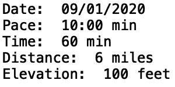
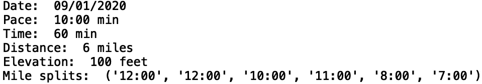
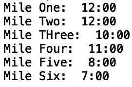
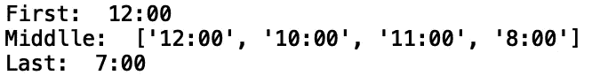
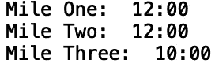

# Python 中的序列解包

> 原文：<https://towardsdatascience.com/sequence-unpacking-in-python-14d995f9a619?source=collection_archive---------33----------------------->

## 了解 Python 序列解包


[来源](https://www.pexels.com/photo/creative-desk-pens-school-2170/)

python 中的序列解包允许您获取集合中的对象，并将它们存储在变量中以备后用。这在函数或方法返回一系列对象时特别有用。在这篇文章中，我们将讨论 python 中的序列解包。

我们开始吧！

python 的一个关键特性是任何序列都可以通过赋值被解包到变量中。考虑与 Nike run 应用程序上特定跑步的属性相对应的值列表。该列表将包含跑步的日期、配速(分钟)、时间(分钟)、距离(英里)和海拔(英尺):

```
new_run = ['09/01/2020', '10:00', 60, 6, 100]
```

我们可以通过赋值用适当命名的变量解开这个列表:

```
date, pace, time, distance, elevation = new_run
```

然后，我们可以打印这些变量的值，以验证赋值是否正确:

```
print("Date: ", date)
print("Pace: ", pace, 'min')
print("Time: ", time, 'min')
print("Distance: ", distance, 'miles')
print("Elevation: ", elevation, 'feet')
```



我们正在解包的序列中的元素也可以是序列。例如，除了整体跑步的平均配速，我们还可以有一组英里分割:

```
new_run_with_splits = ['09/01/2020', '10:00', 60, 6, 100, ('12:00', '12:00', '10:00', '11;00', '8:00', '7:00')]
```

现在让我们打开新序列的包装:

```
date, pace, time, distance, elevation, splits = new_run_with_splits
```

我们可以打印英里分割:

```
print("Mile splits: ", splits)
```



我们甚至可以进一步解开前面代码中的拆分列表。让我们用表示英里数的变量来解开分割列表:

```
date, pace, time, distance, elevation, (mile_2, mile_2, mile3_, mile_4, mile_5, mile_6) = new_run_with_splits
```

让我们打印英里变量:

```
print("Mile Two: ", mile_2)
print("Mile Three: ", mile_3)
print("Mile Four: ", mile_4)
print("Mile Five: ", mile_5)
print("Mile Six: ", mile_6)
```



我们还可以使用' _ '字符来删除不需要的值。例如，如果我们想省略日期和高度，我们会这样做:

```
_, pace, time, distance, _, (mile_2, mile_2, mile_3, mile_4, mile_5, mile_6) = new_run_with_splits
```

我们还可以使用 python 的“星形表达式”(*)来解包任意数量的元素。例如，如果我们想存储第一个和最后一个变量，并将中间值存储在一个列表中，我们可以执行以下操作:

```
date, pace, time, distance, elevation, (first, *middle, last) = new_run_with_splits
```

让我们打印第一个、中间和最后一个变量:

```
print("First: ", first)
print("Middlle: ", middle)
print("Last: ", last
```



我想强调的是，我们序列中的对象可以是任何类型。例如，对于英里分割，我们可以使用字典而不是元组:

```
new_run_with_splits_dict = ['09/01/2020', '10:00', 60, 6, 100, {'mile_1': '12:00', 'mile_2':'12:00', 'mile3':'10:00', 'mile_4':'11;00', 'mile_5':'8:00', 'mile_6':'7:00'}]
```

让我们打开新清单:

```
date, pace, time, distance, elevation, splits_dict = new_run_with_splits_dict
```

现在，我们可以通过键访问英里分割值:

```
print("Mile One: ", splits_dict['mile_1'])
print("Mile Two: ", splits_dict['mile_2'])
print("Mile Three: ", splits_dict['mile_3'])
```



我就讲到这里，但是我鼓励你自己去研究代码。

## 结论

在这篇文章中，我们讨论了如何在 python 中解包序列。首先，我们展示了如何解包与发布到 Nike Run 应用程序的跑步相关的值列表。我们还展示了序列中的值也可以是序列，其中序列或其元素可以存储在单独的变量中供以后使用。然后，我们展示了如何使用下划线字符删除值。接下来，我们讨论了如何使用 python“星形表达式”解包任意数量的对象。最后，我们演示了如何从对象列表中解包一个字典对象，并通过键访问字典值。我希望你觉得这篇文章有趣/有用。这篇文章中的代码可以在 [GitHub](https://github.com/spierre91/medium_code/blob/master/basic_python/sequence_unpacking.py) 上找到。感谢您的阅读！