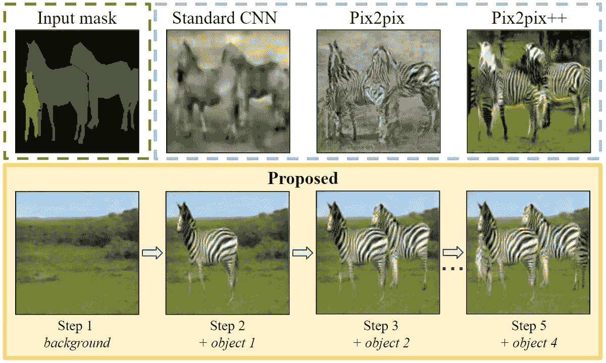
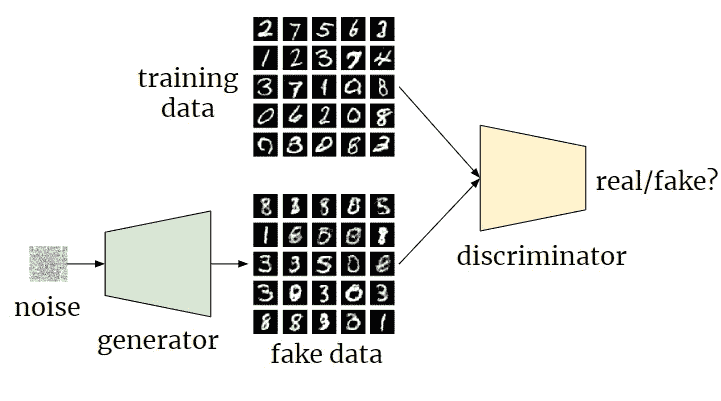
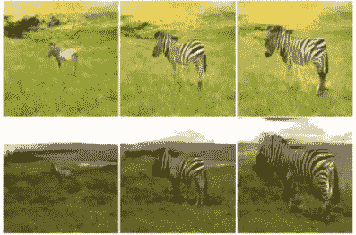
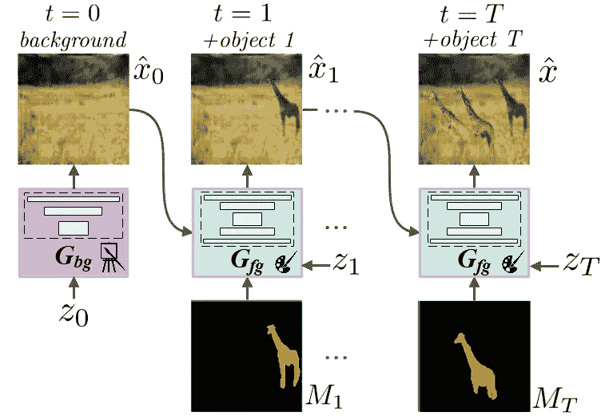
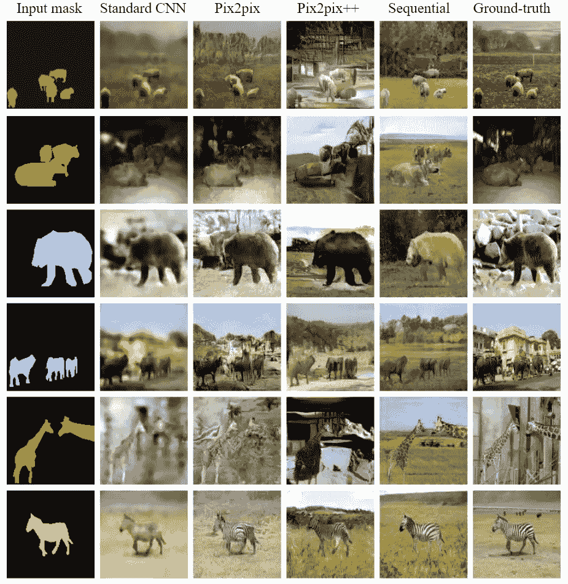
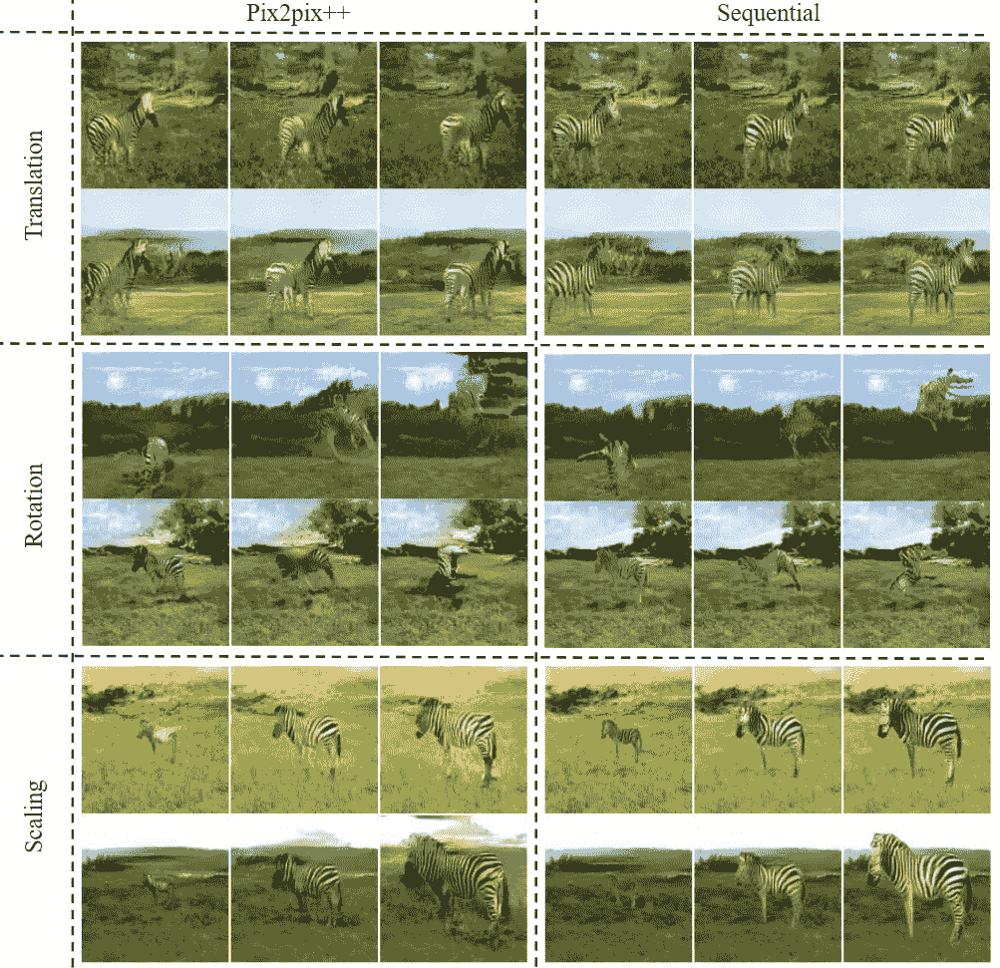
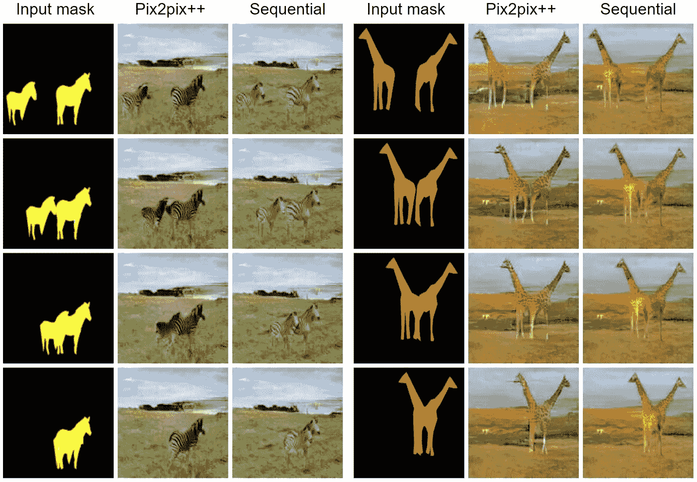
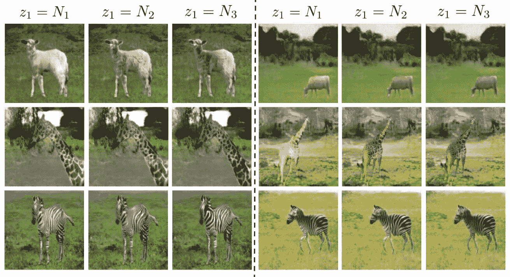
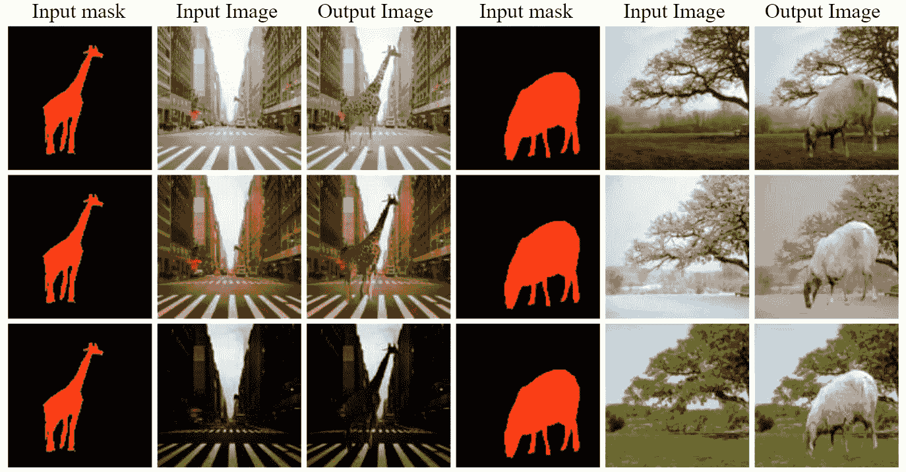
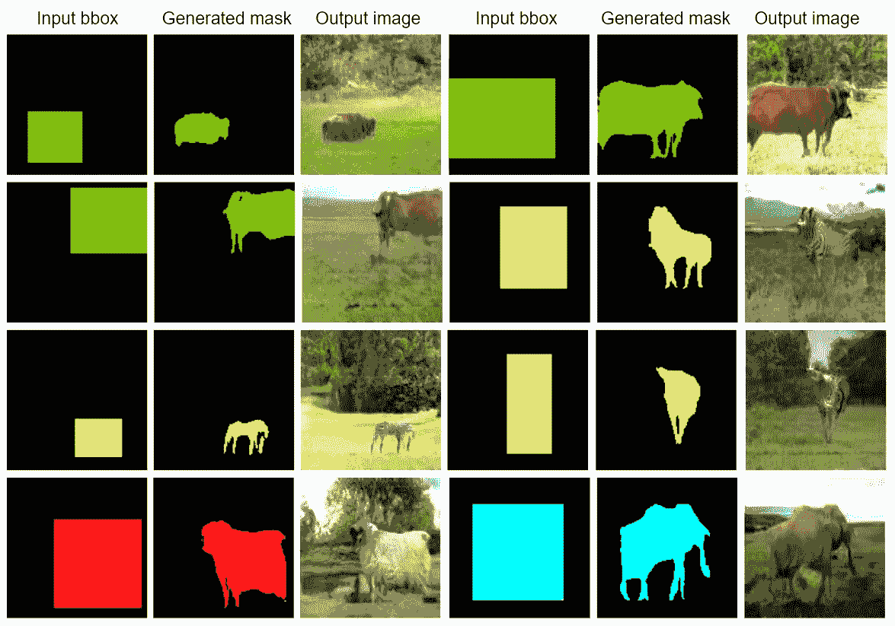

# 使用 GANs 的顺序图像生成

> 原文：<https://towardsdatascience.com/sequential-image-generation-with-gans-acee31a6ca55?source=collection_archive---------36----------------------->

生成敌对网络(GANs)在生成非常清晰和真实的图像方面非常成功。这篇文章简要地解释了我们的基于 GANs 的图像生成框架，它顺序地组成一个图像场景，将潜在的问题分解成更小的问题。有关深入的描述，请参见我们的出版物:[用 GANs 进行场景生成的基于层的顺序框架。](https://arxiv.org/pdf/1902.00671.pdf)

图 1:建议的图像生成过程。给定一个语义布局图，我们的模型一步一步地组成场景。第一行显示了输入语义图和由最新基线生成的图像。

# 什么是生成性对抗网络？

图 2:氮化镓框架。

生成对抗网络(GAN) [1]是一类机器学习框架。两个神经网络:(I)生成器，和(ii)鉴别器在一个博弈论场景中相互竞争。生成器将随机噪声作为输入，并生成假样本。鉴别器试图区分从训练数据集中提取的样本(真实样本，例如手写数字图像)和由生成模型产生的样本(假样本)。这个游戏驱动鉴别器学习正确地将样本分类为真或假。同时，生成器试图欺骗分类器，让它相信它的样本是真实的。在收敛时，生成器样本与训练数据无法区分。更多详情请看[原文](https://papers.nips.cc/paper/5423-generative-adversarial-nets.pdf)或[本帖](/generative-adversarial-networks-explained-34472718707a)。GANs 可用于图像生成；他们能够学习生成清晰逼真的图像数据。

# 单镜头图像生成限制了用户对所生成元素的控制

图 3:前景对象的不同缩放。

在 GAN 文献[2，3，4]中已经广泛研究了自动图像生成问题。它主要被认为是学习从*单源*，例如噪声或语义图，到*目标*，例如斑马的图像的映射。这个公式对单独控制场景元素的能力设置了主要的限制。因此，举例来说，很难改变一个斑马的外观或形状，同时保持图像场景的其余部分不变。让我们看看图 3。如果我们改变对象大小，即使每行的输入噪声相同，背景也会改变。

# 我们的方法:基于层的顺序图像生成

我们的主要想法类似于风景画家如何首先勾画出整体结构，然后用其他元素逐渐修饰场景，以填充场景。例如，绘画可以从山脉或河流作为背景开始，而树木和动物作为前景实例依次添加。

主要目标被分解成两个更简单的子任务。首先，我们用背景生成器 **Gbg** 根据噪声生成背景画布 **x0** 。其次，我们用前景生成器 **Gfg** 依次添加前景对象，以达到最终的图像 **xT** ，其中包含画布上预期的 T 个前景对象(T 不固定)。我们的模型允许用户控制要生成的对象，以及它们的类别、位置、形状和外观。

图 4:提议的框架概述。Gbg、Gfg 分别是背景和前景生成器。

# 表现如何？

我们用 MS-COCO 数据集的子集运行了几个实验。图 5 比较了数据集中六个对象类的场景生成任务的不同基线的视觉结果。标准的 CNN 产生模糊的结果，尽管 L1 损失，以补救这一特殊问题。Pix2Pix [2]生成更清晰的图像。然而，标准的 CNN 和 Pix2Pix 都试图复制地面真相，这表明它只记住了数据集。它们在生成过程中缺乏随机性，这抑制了生成图像的多样性。应该避免这种行为，因为目标是生成逼真的场景，而不是模仿数据集中的场景。当添加最新的 GANs 训练技术时，多样性和图像质量得到改善，如 Pix2Pix++和我们提出的模型所示。然而，当存在多个对象(第 1、2、4 和 5 行)时，Pix2Pix++似乎很难处理。它不能产生一个可信的场景。我们的模型明确地将前景和背景生成过程分开，克服了这些问题。

图 5:使用来自训练集的对象遮罩与现有技术模型的比较。从上到下:羊、牛、熊、大象、长颈鹿和斑马。地面真实对应于原始图像。

## 前景对象遮罩变换

在这个实验中，将几个仿射变换应用于输入对象遮罩。图 6 示出了当平移、旋转和缩放操作变换前景对象时，Pix2pix++和所提出的顺序模型如何保存场景。考虑 Pix2Pix++模型(图 6 的左栏)。应用平移时，前景和背景都会改变。旋转对象时，前景对象开始与背景融合。Pix2Pix++似乎学习了地面和斑马腿之间的颜色相关性，这使得无法绘制旋转较大的对象。当对象放大时，前景对象的颜色开始在背景中渗色。相比之下，我们提出的顺序模型(图 6 的右栏)保留背景直到仿射变换，并且不会遭受对象混合或渗色。然而，它确实稍微改变了前景物体的外观。

图 6:物体遮罩仿射变换。Pix2Pix++无法保留场景。它要么改变背景，混合前景和背景，要么遭受颜色混合。我们的模型不会受到这些伪像的影响。

## 前景物体遮挡

在这个实验中，两个前景对象在水平轴上平移，直到它们彼此遮挡。图 7 比较了 Pix2Pix++和所提出的顺序模型在它们各自的对象遮罩变得更接近时如何生成前景对象。首先，Pix2Pix++不能正确地描绘这两个对象。考虑 zebra 示例和 Pix2pix++模型。当蒙版彼此轻微接触时(第 2 行)，它会在错误的位置分割斑马。当它们被完全遮挡时(第 4 行)，它只绘制一条斑马。第二，Pix2Pix++倾向于为两个对象产生相似的模式。现在考虑长颈鹿的例子和 Pix2pix++模型。当遮罩变得更近时(第 2 行)，它会为长颈鹿输出相似的颜色。当它们彼此轻微接触时(第 3 行)，它会合并长颈鹿，并绘制一个连续的图案。当它们被完全遮挡时(第 4 行)，它会画一个有两个头的长颈鹿。这两种类型的伪影不会出现在我们提出的顺序模型中。

图 7:水平平移两个物体，直到它们相互遮挡。Pix2pix++描绘了前景对象上的伪像，这在我们提出的模型中是不存在的。

## 前景对象控件

在这个实验中，我们展示了物体的外观可以通过改变相关的噪声来改变。在图 8 中，我们添加了来自不同噪声矢量但在相同背景上具有相同遮罩的前景对象。

图 8:通过改变相关的输入噪声 z1 来控制前景物体的外观。

## 超出生成的背景

我们的前景模型也可以用于图像编辑的目的，通过添加一个对象到现有的图像。在图 9 中，我们将对象添加到相同的场景，但是具有不同的照明或季节条件。前景模型知道背景场景的内容及其环境条件，例如全局照明。

图 9:向现有图像添加新对象。全局照明影响对象外观。

## 超越对象遮罩

在当前的问题公式中，前景生成器以对象遮罩为条件。这限制了用户对所提出的顺序模型的控制，因为用户将不得不画出物体的形状来获得场景。在这个实验中，我们展示了如何通过引入一个单独的掩码生成器模型来轻松扩展当前的框架。这个想法是基于边界框生成物体形状。它们可以进一步用作当前框架的输入。遮罩生成器是一个条件 GANs 模型，它将边界框和对象类作为输入，并在感兴趣的区域中输出对象遮罩。图 10 呈现了从边界框生成的掩模样本及其最终生成的图像。

图 10:从边界框而不是对象遮罩开始生成图像。请注意，掩码是在本实验中生成的。盒子的位置控制水平线，而形状控制视点。

要了解更多关于我们方法的细节或看到更多结果包括定量结果，您可以看看我们的[**出版物:**](https://arxiv.org/pdf/1902.00671.pdf)

用 GANs 生成场景的基于层的顺序框架。在 AAAI。2019.

如果您想在您的项目中使用我们的方法，可以在*这里[**获得**代码**。**](https://github.com/0zgur0/Seq_Scene_Gen)*

# 参考

[1] I. Goodfellow、J. Pouget-Abadie、M. Mirza、B. Xu、D. Warde-Farley、S. Ozair、a .库维尔和 Y. Bengio，“生成性对抗网络”，载于《神经信息处理系统进展》，第 2672-2680 页，2014 年。

[2] P. Isola，J.-Y. Zhu，T. Zhou，A. A. Efros，“有条件对抗网络的图像到图像翻译”，2017 年 IEEE 计算机视觉与模式识别大会(CVPR)，第 5967–5976 页，2017。

[3]宫户，t；t .片冈；Koyama，m；还有吉田，Y. 2018。生成对抗网络的谱归一化。在 ICLR。

[4]王；刘，男，女；朱；陶；考茨，j；和卡坦扎罗，B. 2018。用条件 gans 进行高分辨率图像合成和语义处理。在 CVPR。