# 二元序列中的序列相关性

> 原文：<https://towardsdatascience.com/serial-dependence-in-binary-sequences-409c5e8f54d0?source=collection_archive---------50----------------------->

## 用 Meixner 正交多项式检验序列相关性


2018 Julian Wergieluk

在这篇博文中，我将研究随机二进制序列中的序列(即时间)依赖现象。

随机二进制序列是由随机过程产生的 0 和 1 的序列。大多数随机数生成器生成的主要输出是二进制的。二进制序列通常对随机事件的发生进行编码:

*   金融市场的极端回报。
*   机器、服务器等的故障
*   金融市场风险模型中的风险价值超额指标。

在许多这样的情况下，有必要确保被跟踪的事件彼此独立地发生。例如，生产系统中事件的发生不应该使系统更容易发生事件。为此，我们需要仔细研究一下所考虑的二进制序列的依赖结构。

## 概述

在这篇博文中，我将开发并测试一种评分方法，用于量化随机二进制序列中的依赖强度。Meixner 依赖分数易于实现，并且基于与几何分布相关联的正交多项式。

读完这篇博文，你会知道:

1.  如何用统计术语来表述序列相关性度量的问题。
2.  如何从几何分布中导出迈克尔逊多项式？
3.  如何计算等待时间序列的 Meixner 依赖分数，以量化依赖强度。
4.  如何使用简单的 Monte-Carlo 实验测试依赖性评分方法，该实验涉及具有已知依赖性结构的马尔可夫链。

# 问题的统计公式

给定一个随机变量序列 *X = (X[0]，X[1]，…，X[n])* 取集合 *{0，1}* 中的值和一个概率 *p∈(0，1)* ，我想考察 *X* 的元素之间的序列依赖关系。这个调查应该基于从 *X* 中抽取的一个样本 *x* ，即一个有限的 0 和 1 序列 *(x[0]，x[1)，...，x[n])* 。这是一个非常困难和深刻的问题，在这篇博文中，我将重点收集证据来支持或拒绝以下两个基本假设:

1.  随机变量*X【I】*具有分布 Ber( *p* )(成功概率为 *p* 的伯努利分布)。
2.  随机变量*X【I】*是独立的。

如果我们假设 *x* 的元素是来自一个固定伯努利随机变量 *X[0]* 的独立样本，那么我们可以通过计算 *x[0]，x[1]，…，x[n]* 的平均值来估计概率 *p* 。这是因为 *X[0]* 的期望是 *𝔼 X[0] = p* 。

为了给串行相关性检测问题设置一个合适的上下文，让我注意到随机二进制序列 *x* 通常与具有两个状态的系统的谨慎观察相关联。如果 *x[0] = 1* ，我们说“一个事件”发生在时间 *i* 。

我们如何检查我们的事件是否彼此独立地发生，并收集事件时间之间没有序列相关性的证据？

我们经常倾向于在不存在序列相关性的情况下看到序列相关性。典型的例子是赌场里的赌徒所经历的“好运连连”。

为了根据观察结果 *x* 严格研究序列 *X* 中的序列相关性问题，我们可以看看事件之间等待时间的分布。例如序列

```
[0, 1, 1, 0, 0, 1, 0, 0]
```

产生以下等待时间序列

```
[1, 3].
```

请注意，等待时间计算会丢弃事件序列 *x* 中的初始零和尾随零。

为了基于 *x* 正式定义等待时间序列*y =(y*【1】*，…，y*【m】)，考虑索引*I =(I*【1】*，I*【2】*，…)* 的序列，使得对于每个 *i∈ I* 我们有 *x 我们出发了*

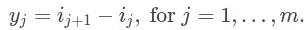

对于同分布的伯努利随机变量序列，等待时间序列由几何分布的同分布随机变量组成。让我们仔细看看它的属性。

# 几何分布

参数为 p 的几何分布的概率质量函数(PMF)由下式给出

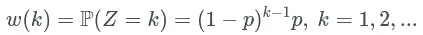

参数为 *p=0.1* 的几何分布的 PMF 如下。

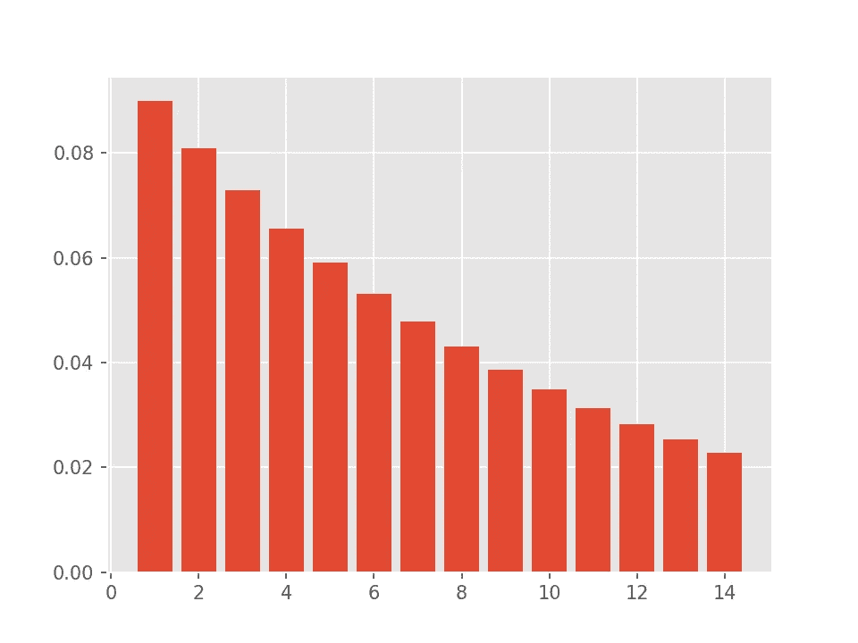

参数为 *p=0.1 的几何分布的概率质量函数*

测试等待时间序列是否遵循几何分布的一种方法是查看由该分布生成的*正交多项式*。

一族正交多项式与 *ℝ* 上的每个概率分布 *μ* 密切相关。对于任何这样的分布，我们可以将(平方可积)实值函数 *f* 和 *g* 之间的标量积定义为

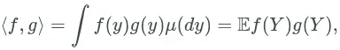

其中 *Y* 是分布为 *μ* 的随机变量。对于几何分布，上述标量积采用以下形式

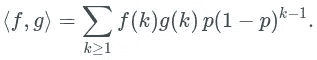

我们说函数 *f* 和 *g* 正交(相对于 *μ* )当且仅当 *⟨f,g⟩ = 0。*

最后，一个多项式序列 *(q[i])* 与 *i≥ 0* 称为正交，当且仅当，对于所有的 *k ≠ i* ，q[i]⟩ = 0 ，每个*q[I】*都有度 *i* 。因此，对于 *i > 0* ，我们得到 *𝔼 q[i](Y) = 0* 。这是我将要用来检查给定的 *Y* 是否遵循几何分布的工具。

对应于几何分布的正交多项式族 *M = (M[i](y))* 是由负二项分布(几何分布的推广)导出的 *Meixner 族*的特例。Meixner 家族的成员满足以下方便的递归关系:

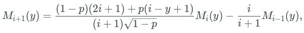

用 *M[1](y) = 1* 和 *M[-1](y) = 0* 。该关系用于计算序列 *M* 。另外，请注意 *M[k]* 取决于参数 *p* 的值。

在配套的 python [源代码](https://www.wergieluk.com/binary-sequences/meixner.py)中，函数`meixner_poly_eval`用于在给定的点集上计算 Meixner 多项式到给定的次数。我用这个函数画出了这些多项式的 55 次曲线。

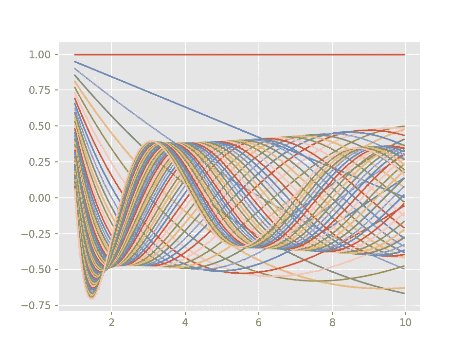

p=0.1 到 55 度的 Meixner 正交多项式的图

如上所述，对于每个多项式*M【k】(y)*在 *M* 中的等式

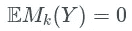

当且仅当 *Y∈* Geom( *p* )和 *k > 0* 成立。

这个关系可以用来检验给定的等待时间样本是否属于参数为 *p* 的几何分布。我们将估计期望值 *𝔼 M[k](Y)* 并将估计值用作分数:接近零的值可以解释为参数为 *p* 的几何分布的证据。如果值远离零，这是一个信号，表明我们需要重新考虑我们的假设，并可能放弃关于原始事件序列的 i.i.d .假设。注意，如果事件是独立的，也可能出现与零的显著偏差，但是真实概率*p’*与假定的 *p* 显著不同。如前所述，这很容易测试。

# Meixner 依赖分数

为了获得在上述意义上量化串行相关性程度的单个数字(分数)，我们将定义 *Meixner 相关性分数(MDS)* 作为在等待时间 *y=(y[1】的样本上评估的第一个 *k* Meixner 多项式的期望估计的平均值，..，y[m])* :

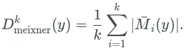

使用正交多项式来测试二进制序列中依赖结构假设的思想源于矩推断方法，并在金融文献中被发展用于回溯测试风险值模型。在这篇博客文章中，我采用了 Candelon 等人提出的方法，请参见下面的参考资料部分。

# 蒙特卡罗研究

为了找出上面设计的过程是否有机会在实践中起作用，我将使用综合生成的数据来测试它。这种类型的测试程序通常称为蒙特卡罗(MC)研究。它不会用真实世界的数据替换测试，但可以帮助在受控环境中评估统计方法。

我们要执行的实验包括以下步骤:

1.  使用具有已知序列相关性结构的模型生成二进制序列。
2.  估计对 *k=1，…，10* 的期望 *𝔼 M[k](X)* 。
3.  在大量独立试验中重复第 1 步和第 2 步，并将汇总结果可视化。

让我们从一个简单的例子开始，用成功概率 *p[0]* 来模拟伯努利随机变量的 i.i.d 序列。这可以用作健全性检查，并测试我们的过程实现是否正确。

对于下面的实验，我们设置 *p[0] = 0.05* 并模拟来自 *X = (X[1])的 5000 个样本，..，X[1000])* 。

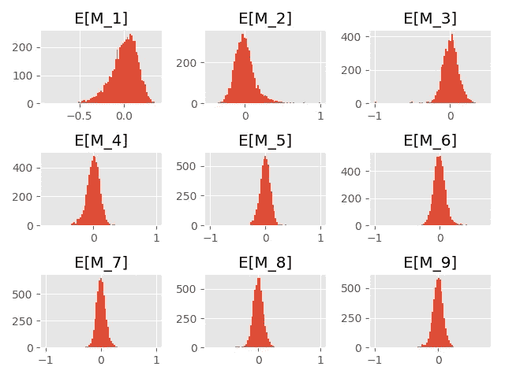

对于一个具有简单形式的序列相关性的模型，我们选择概率*0<p[1]<p[0]<p[2]<1*，并设置序列*中随机变量的分布 X = (X[0]，X[1]，X[2]，…)* 如下。让 *X[0]* 为伯努利，成功概率 *p[0]* 。 *X[i]* 对于 *i > 0* 的分布以 *X[i-1]* 为条件:


为了将该模型与具有成功概率
的 I . I . Bernoulli 模型 *p[0]* 进行比较，我们需要设置 *p[1]* 和 *p[2]* ，使得 *X[i]* 的无条件
分布为 Ber *(p[0])* 。

换句话说，对于给定的*0<P[1]<P[0]<1*，我们寻找的是*P[2]∑(0，1)* ，使得上述定义的随机二进制序列满足 *P(X[i] = 1) = p[0]* 。
这个二元序列可以用状态空间{0，1}表示为简单的马尔可夫链，转移概率矩阵 *P* 由下式给出

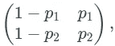

而初始分布 *λ = (1-p[0]，p[0])* 。 *X[i]* 的边际分布由下式给出

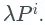

这个基本结果可以在任何一本关于马氏链的书中找到(参见下面的参考资料部分)。找到一个 *p[2]* 使得 *P(X[i] = 1)* 尽可能接近 *p[0]* 的任务，可以用现成的优化算法，例如 [BFGS](https://docs.scipy.org/doc/scipy/reference/optimize.minimize-bfgs.html) 很容易地解决。

例如，对于 *p[1] = 0.02* 和 *p[0] = 0.05* ，上述过程很快得出 *p[2] = 0.62* 。

## 蒙特卡罗研究结果

让我们测试下面的值 *p[1]* 和 *p[2]* 的依赖评分算法。Meixner 多项式的 MC 评估产生以下 Meixner 相关性分数:

```
+------+------+-------+
|  p1  |  p2  |  MDS  |
+------+------+-------+
| 0.5, |  0.5 | 0.083 |
|  0.4 | 0.24 | 0.194 |
|  0.3 | 0.43 | 0.382 |
|  0.2 | 0.62 | 0.583 |
+------+------+-------+
```

同样，对长度为 1000 的样本的 5000 次模拟产生了下面的期望估计直方图。

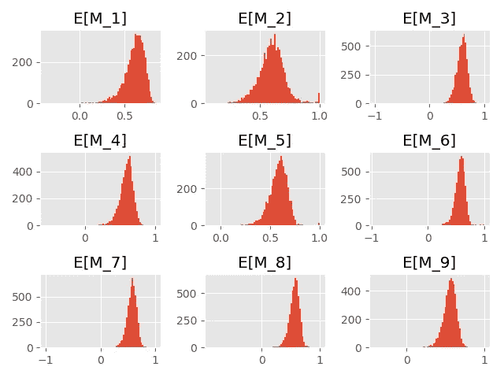

正如我们所见，直方图略微向左偏移。

这篇博文中展示的所有结果和图表都是使用以下 Python 脚本生成的: [meixner.py](https://www.wergieluk.com/binary-sequences/meixner.py)

# 结束语

在这篇博文中，我们了解了二进制序列中的序列相关性的概念。我们基于 Meixner 正交多项式实现了一种串行依赖性检测方法，Meixner 依赖性得分，并使用简单的马尔可夫链模型测试了它的性能。

依赖性测试的一个重要财务用例是分析由市场风险模型生成的风险价值超出事件序列。市场风险模型广泛用于银行业的监管资本要求计算，以及资产管理行业的投资组合构建和风险管理。

[风险价值](https://en.wikipedia.org/wiki/Value_at_risk) (Var)是固定时间范围内金融资产价格损失分布的分位数。例如，持有黄金多头头寸的投资者可能对美元黄金价格在一天时间范围内的 95% VaR 感兴趣。对于校准良好的风险值模型，在一个投资期内观察到的 5%营业日的极端损失将超过 95%的风险值分数。VaR 超过事件不仅必须以预期的频率发生，还必须相互独立。对市场风险模型进行适当校准，将超出事件的相关性降低到较低水平，通常比超出频率的简单校准要困难得多。但这在金融危机时期尤为重要，因为低估风险不可避免地会导致投机倒把，甚至可能导致更严重的损失。

非常感谢 Sarah Khatry 阅读了这篇博文的草稿，并提供了无数的改进意见和更正。

# 参考

*   Bertrand Candelon，Gilbert Colletaz，Christophe Hurlin，Sessi Tokpavi，[回测风险价值:基于 GMM 持续期的测试](http://citeseerx.ist.psu.edu/viewdoc/download?doi=10.1.1.404.3188&rep=rep1&type=pdf) (2011)，《金融计量经济学杂志》，第 9 卷，第 2 期，2011 年春季
*   弗兰克·WJ·奥尔弗、丹尼尔·w·洛兹尔、罗纳德·f·博伊斯维特和查尔斯·w·克拉克编辑。，[《NIST 数学函数手册》精装本及光盘](https://www.nist.gov/publications/nist-handbook-mathematical-functions)，(2010)，剑桥大学出版社
*   詹姆斯·诺里斯，[马尔可夫链](https://doi.org/10.1017/CBO9780511810633) (1998)剑桥大学出版社
*   Alexander J. McNeil、Rüdiger Frey 和 Paul Embrechts，[量化风险管理](https://press.princeton.edu/books/hardcover/9780691166278/quantitative-risk-management) (2015)，普林斯顿大学出版社