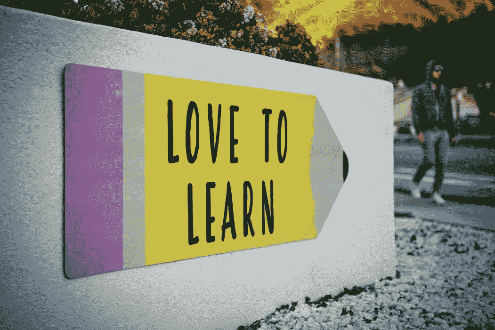

# 成为数据科学家的一系列免费课程

> 原文：<https://towardsdatascience.com/series-of-free-courses-to-become-a-data-scientist-3cb9fd591739?source=collection_archive---------4----------------------->

## 链接到知名大学的高质量课程，可以免费学习。循序渐进地学习这些课程，成为一名数据科学家。

来源:蒂姆·莫斯霍尔德

现在有很多资源声称它们会让你成为一名数据科学家。刚开始在网上上课的时候，我花了一段时间才明白哪些课程好。我开始了一门课程，几天或几周后，我意识到它没有帮助。再次转移到别的东西上。我希望我能找到一个可靠的向导，告诉我到底该学什么，从哪里开始，以及如何进行学习之旅。虽然我找到了一些材料，但我仍然不得不挣扎了很多。这就是为什么我决定分享一个完整的学习和课程计划，最终给你足够的知识来找到一份数据科学家的工作。**最棒的是，它是免费的！**

我将展示一条成为 Python 数据科学家的途径。因为我是 python 用户，我喜欢。还有，我相信如果你是初学者，学好一门语言是很好的。然后继续学习更多。以下是循序渐进的免费学习计划:

## 1.学习 Python

如果你不知道 Python，这个免费课程是一个好的开始。Udacity 有一门免费的课程“计算机科学入门”,教授 python 编程语言，有很多例子和练习题，对初学者来说非常好。不幸的是，如果你去 Udacity 的主页搜索它，它现在会把你重定向到另一个课程。但是幸运的是，在下面的链接中，你仍然可以找到所有的资料。

 [## Udacity CS101 资源

### 这个页面为我的 Udacity cs101:计算机科学入门(构建搜索引擎)收集了一些资源…

www.cs.virginia.edu](http://www.cs.virginia.edu/~evans/cs101/) 

这门 Python 课程应该给你足够的知识，让你开始学习数据科学工具。

## 2.了解 Python 的数据科学库

Coursera 有很多课程，你可以免费学习。是学习者的福气。他们有密歇根大学的专业“[应用数据科学与 Python](https://www.coursera.org/specializations/data-science-python) ”。它包含以下五门课程:

a.[Python 中的数据科学简介](https://www.coursera.org/learn/python-data-analysis?specialization=data-science-python)

b.[应用 Python 进行绘图、制图&数据展示](https://www.coursera.org/learn/python-plotting?specialization=data-science-python)

c.[在 Python 中应用机器学习](https://www.coursera.org/learn/python-machine-learning?specialization=data-science-python)

d.[在 Python 中应用文本挖掘](https://www.coursera.org/learn/python-text-mining?specialization=data-science-python)

e.[应用 Python 进行社会网络分析](https://www.coursera.org/learn/python-social-network-analysis)

我只想警告你一件事。如果你选择学习这些课程，你必须保持耐心。因为作业很难，尤其是如果你是初学者。你只需要不断努力，做到最好。但是因为作业很难，如果你能完成作业，你真的会学得很好。你只需要花足够的时间在上面。如果你不想要证书，只想学习，你不需要支付任何费用。你可以免费旁听所有课程。

下面是查找审计选项的说明。**不要在专业化页面注册。**只免费 7 天。转到个别课程的页面。然后，您会在页面顶部看到一个注册选项。甚至不要从那里注册。继续向下滚动单个课程的页面。在每周的课程讨论和教员信息之后，你会发现另一个注册选项。单击注册选项。一个窗口将会打开，在它的底部，你会看到一个非常小的“审计”选项。单击审核选项并从那里注册。即使你不能按时完成，你也可以再次审计。您可以根据需要多次审核课程。如果你不能遵循上面的指示，我有一个视频可以带你完成这个过程:

## 3.学习 SQL

SQL 是数据分析师或数据科学家的必备之一。如果你已经完成了上述专业之一的课程，学习 SQL 应该很容易。有一些共同的想法。这里有一个专业，可以教你足够多的 SQL，让你开始成为一名数据科学家:

 [## 了解数据科学的 SQL 基础知识

### 由加州大学戴维斯分校提供。这个专业是为以前没有编码的学习者设计的…

www.coursera.org](https://www.coursera.org/specializations/learn-sql-basics-data-science) 

该专业有四门课程:

a.用于数据科学的 SQL

b.使用 SQL 进行数据争论、分析和 AB 测试

c.使用 Spark SQL 的分布式计算

d.SQL for Data Science 顶点项目

我之前已经解释过如何审核这些课程。

## 4.了解更多信息

学完以上课程后，你就可以申请工作了。你会发现很多适合你的机会。但是，如果你想在数据科学方面取得进步，还有很多东西要学。例如，在处理数据时，了解一些统计学概念是很好的。上面步骤 2 中的应用机器学习课程教你，如何使用一个非常好的机器学习库 scikit-lean。它给出了许多机器学习算法的基本概念，你可以通过从 scikit-learn 库中调用它们来使用它们。它适用于很多问题。但是从头开始学习编写算法会给你更多的能力。以下是一个统计专业化课程和一个机器学习课程的链接:

[用 Python 统计](https://www.coursera.org/specializations/statistics-with-python)

[机器学习](https://www.coursera.org/learn/machine-learning)

对于初学者来说，这可能看起来太多了。但是请记住，你不必在一天之内学会所有的东西。无论何时你要改变职业或者开始新的事情，都需要时间。如果你能做到步骤 2 中提到的数据科学专业化，那么学习 SQL 将会非常容易和快速。所以，这并不像看起来那么难。再给你一个提示。当你有一个好的学习伙伴时，保持动力和耐心会容易得多。大概你已经知道了，只是提醒一下。

推荐阅读:

 [## 12 周能成为数据科学家吗？

### 12 周的合理学习目标是什么

towardsdatascience.com](/can-you-become-a-data-scientist-in-12-weeks-58ed9e3064a6)  [## 学习编程、软件工程、机器学习等的最佳免费资源

### 找到所有高质量的计算机科学课程，从麻省理工学院，哈佛大学，和其他大的大学成为专家…

towardsdatascience.com](/best-free-resources-to-learn-programming-software-engineering-machine-learning-and-more-89ee724b90c3)  [## 使用 Pandas Cut 或 Qcut 方法对数据进行分类和分段

### 当你在寻找一个范围而不是一个确切的数值，一个等级而不是一个分数

towardsdatascience.com](/sort-and-segment-your-data-into-bins-to-get-sorted-ranges-pandas-cut-and-qcut-7785931bbfde)  [## 如何在 Python 中呈现多个变量之间的关系

### 了解如何使用 Python 中的多元图表和绘图来呈现要素之间的关系

towardsdatascience.com](/how-to-present-the-relationships-amongst-multiple-variables-in-python-fa1bdd4f368c)  [## Pandas 的 Groupby 功能详细，可进行高效的数据汇总和分析

### 学习对数据进行分组和汇总，以使用聚合函数、数据转换、过滤、映射、应用函数…

towardsdatascience.com](/master-pandas-groupby-for-efficient-data-summarizing-and-analysis-c6808e37c1cb)  [## Python 中从头开始的多项式回归

### 学习用一些简单的 python 代码从头开始实现多项式回归

towardsdatascience.com](/polynomial-regression-from-scratch-in-python-a8d64845495f)  [## 置信区间、计算和特征

### 什么是置信区间，如何计算它及其重要特征

towardsdatascience.com](/confidence-interval-calculation-and-characteristics-1a60fd724e1d)