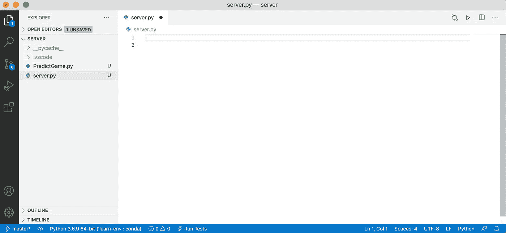
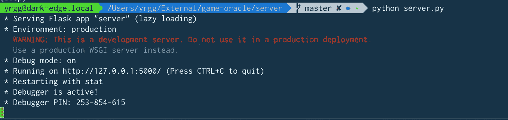
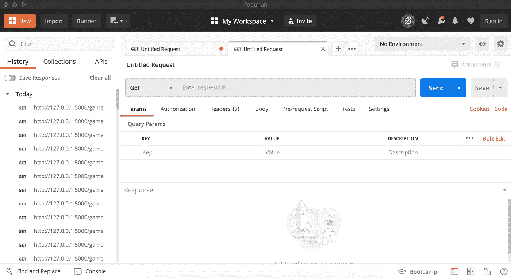
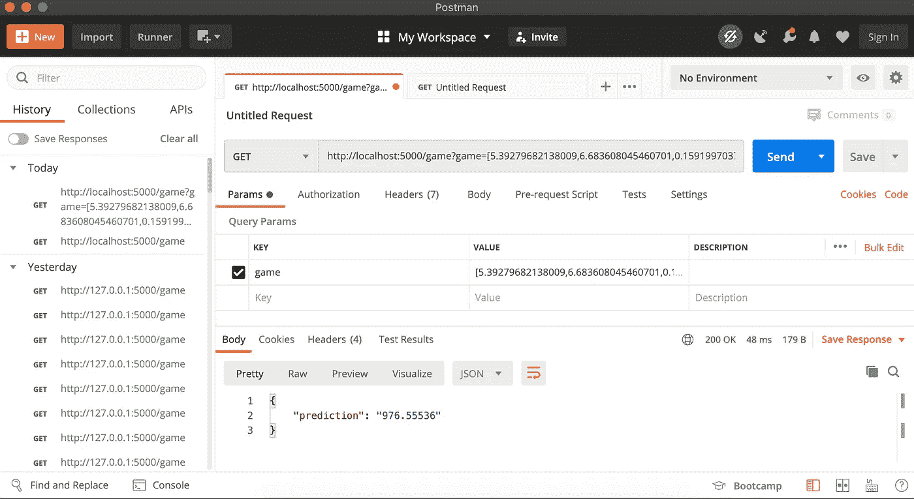

# 从 API 提供预测

> 原文：<https://towardsdatascience.com/serve-predictions-from-an-api-1d84b4ac9a7c?source=collection_archive---------53----------------------->

## 使用 Python 和 Flask 建立与 ML 模型交互的 API


弗洛里安·克拉姆在 [Unsplash](https://unsplash.com?utm_source=medium&utm_medium=referral) 上拍摄的照片

# 关于

在本文中，我将尝试演示如何建立一个快速的 Flask API 来为 ML 模型预测服务。

一旦你创建并训练了你的模型，你就会想要与它互动。虽然可以在 jupyter 笔记本中手动完成这项工作，但您很可能希望自动完成预测。

我已经使用 React.js 创建了一个仪表板，它使用户能够配置游戏的功能，然后我们可以将其发送到 API 以接收预测。

# 安装

继续启动你选择的编辑器。我用的是 VS 代码，是免费的，可以在[这里](https://code.visualstudio.com/)下载。它非常直观，当您第一次启动它并开始处理 python 文件时，它会提示您安装一些模块，帮助您轻松创建 python 文件。

这里有一篇关于为 python 开发设置 VS 代码的很棒的文章:

[](https://code.visualstudio.com/docs/languages/python) [## Visual Studio 代码中的 Python

### 使用 Microsoft Python 扩展，在 Visual Studio 代码中使用 Python 是简单、有趣且高效的。的…

code.visualstudio.com](https://code.visualstudio.com/docs/languages/python) 

# 创建 Flask 服务器

现在我们准备写一些代码。

继续创建一个新文件夹，为 Flask 服务器创建一个新文件，为“PredictGame”路径创建一个新文件:



让我们继续为我们的 Flask 服务器添加基本功能。

首先，我们加载设置 REST 服务器所需的 flask API。

然后导入将要实现的 provider 类，它将负责处理预测请求。

最后，我们告诉编译器启动服务器。

# 路由处理器

现在，我们有了一种与将要接收的请求进行交互的方法，以及一种发送回正确信息的方法。

让我们继续创建一个路由处理器，它将包含我们接收游戏信息的所有逻辑，并发送回正确的预测。

首先，我们导入所需的库。我们从 Flask 导入“reqparse”和资源。

我们将使用' reqparse '使处理请求参数像使用字典一样简单。

“Resource”将允许我们继承一个超类，该超类将允许我们实现不同的 HTTP 方法，如“get”、“delete”、“put”、“post”。

这对我们来说很容易，因为我们需要做的就是在“get”方法中实现功能。

接下来，我们导入“xgboost ”,因为我们必须创建一个新的模型，将预训练的权重加载到该模型中。

我们导入 numpy，因为模型期望数据是某种形状，并且是 numpy 数组类型。

最后，我们导入 json，这样我们可以将游戏参数从 json 对象转换成 python 列表。

在我们的构造函数中，我们设置了参数解析器，并用保存的权重初始化模型。

然后，我们创建我们的“get”方法，该方法只是从请求中解析游戏对象，然后我们将游戏对象格式化为模型期望的格式，最后，我们进行预测并在字典中返回它们。

这是一个超级基本的实现，没有任何错误处理或类型检查。

最后，在底部我们有一个私有的 helper 方法，用于将数据转换成正确的格式。

# 启动服务器

首先，在 server.py 文件所在的目录中打开一个终端，并使用以下命令运行该文件:

```
$ python server.py
```

这将启动 Flask 服务器，您应该会看到一些文本，宣布服务器正在运行，并且您可以在以下地址找到它:



现在我们的服务器正在运行，我们可以与 API 进行交互。

# 使用 API

现在我们已经有了一个运行的服务器，我们需要测试我们的工作。

虽然测试 API 端点最流行的工具肯定是 Postman，但是有几种方法可以发出 HTTP 请求。

Postman 是一个免费的应用程序，用于使用 HTTP 创建和运行测试，当您发出请求时，它可以让您准确地看到正在发送的内容和正在接收的内容。

继续并[下载 Postman](https://www.postman.com/downloads/) ，我们可以用它来发出 http 请求并查看原始响应。

[](https://www.postman.com/downloads/) [## 下载邮差 App

### 下载邮差！加入依赖 Postman 作为唯一完整 API 的 1100 万开发者和 50 万家公司…

www.postman.com](https://www.postman.com/downloads/) 

下载完成后，继续打开它，您应该会看到类似如下的屏幕:



令人欣慰的是，邮差用户界面非常直观，很容易适应所有东西的位置。

输入我们要测试的 URL，在本例中为:

```
http://127.0.0.1:5000/game
```

请注意，您的地址可能会因端口而异。此外，“127.0.0.1”有时也被称为“localhost”，因此向以下地址发送请求基本上是一样的。

```
http://localhost:5000/game
```

注意地址末尾的/game，这是我们在 server.py 文件中设置的路由。

回到 Postman，在 Query Params 下，您应该看到一个“key”“value”字段的列表。

在这些字段中键入我们的参数，将会自动用正确的值和特殊字符(如空格)的 URI 编码填充我们的 URI。

继续用下面的值创建一个“游戏”键(我知道它很长，每个游戏预测都是基于 84 个不同的特性):

```
[5.39279682138009,6.683608045460701,0.15919970376939438,3.55590999603135,1.1554737031359337,0.7067666437650326,1.1426873175695553,1.2569168628035827,-0.7803980111346107,-0.2962583460820777,-0.24055440492626987,-1.7136287338568992,-0.1651305355827784,-0.2036357303066871,-0.4540528313626752,-0.48914117436953486,-0.22271712167442767,-0.5282740359736868,-0.031858861469518406,-0.24937339127109132,-0.32994634379035076,-0.512297869820368,-0.7031963621472596,-0.07105583014744833,-0.29576266052192457,0.1870374024689484,-0.14092851934520698,-0.33523660382633563,-0.14365069955967955,-0.12421426326285712,-0.06650450595001171,-0.10261069449730548,-0.1123532348785659,3.27774725901111,-0.45335715532058596,-0.16592152231605703,1.5775085110873435,1.5048682557955273,1.9597419248177352,-0.48621831608959837,1.642609246782289,0.5213592693458309,-0.48290073165693087,-0.3244873199973241,-0.301429739232314,2.4736135100111123,-0.22133313058352583,3.8765749060205286,-0.23604923873792524,-0.2401213205987764,-0.27373953556863745,-0.35059866422759306,4.098403285704536,4.559516332813075,-0.28035794137016523,-0.2973715918552079,-0.30799315147252165,3.713847136118922,3.139731271607883,-0.2625780433542825,2.3218106291644776,-0.30943922402842255,2.6890016668398484,-0.2316238571204376,3.884818704555654,-0.35758626244129893,-0.31778939411173085,-0.24428267916420615,-0.43130531370481745,-0.2341397130078093,-0.22087023503836106,-0.3216777806746954,-0.21651103657152967,-0.28636063937475126,-0.21776380127418174,-0.2768681688204387,-0.7287651618291123,-0.355929439908863,-0.24655521427098337,-0.22667679255666365,-0.2785523148360368,-0.2524454873949673]
```

继续按“发送”,您应该会得到类似如下的回复:



完美！我们的服务器接受一个表示单个游戏特性的浮点字符串列表，并返回一个数字，该数字是 Steam 商店中外观的预测排名。

# 结论

在本文中，我们经历了创建一个 HTTP 服务器的整个过程，该服务器可以接受一个包含游戏特性列表的请求，然后用一个表示 Steam store 页面上预测排名的数字进行响应。

我们将服务器做得非常简单，没有处理任何错误处理或参数验证。关于如何做到这一点，有大量的参考资料，并且可能是将来的一篇文章。

感谢您的阅读，如果您有任何想法或问题，请让我知道，我很乐意有机会谈论任何与技术相关的话题。