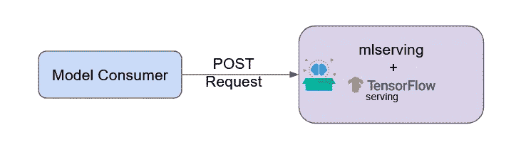
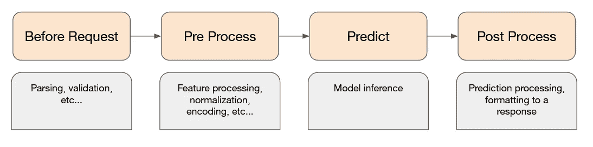

# 使用简单的 Python 服务器为您的机器学习模型提供服务

> 原文：<https://towardsdatascience.com/serve-your-machine-learning-models-with-a-simple-python-server-5a72d005e0ae?source=collection_archive---------28----------------------->

## 如何轻松服务于机器学习模型

许多数据科学项目中最大的挑战之一是模型部署。在某些情况下，您可以批量离线进行预测，但在其他情况下，您必须实时调用您的模型。

此外，我们看到越来越多的模型服务器像`[TensorFlow Serving](https://www.tensorflow.org/tfx/guide/serving)`和`[Torch Serve](https://pytorch.org/serve/)`被发布。尽管有很多很好的理由在生产中使用这些解决方案，因为它们快速高效，但是它们不能封装模型技术和实现细节。

这就是为什么我创造了`[mlserving](https://pypi.org/project/mlserving/)`。一个 python 包，帮助数据科学家将更多的火力集中在机器学习逻辑上，而不是服务器技术上。



作者图片

`mlserving`尝试一般化预测流，而不是您自己实现预测，或者为此使用另一个服务应用程序。

通过实现一个简单的接口，您可以轻松地为您的模型设置一个端点。



作者图片

这个接口表示一个通用的预测流。

让我们看一个例子(假设我们已经有了一个训练好的模型)

首先，我们将训练好的模型加载到构造函数中，并实现接口。

稍后，我们创建一个`ServingApp`，并添加我们刚刚实现的推理处理器。

在这个例子中，我们没有对输入进行任何处理，但是正如您所看到的，为您的模型设置一个端点是非常容易的。

通过发送 POST 请求来调用我们的模型。

```
curl -X POST [http://localhost:1234/api/v1/predict](http://localhost:1234/api/v1/predict) \
-H 'Content-Type: application/json' \
  -d '{
    "features": [...]
}'
```

使用 TensorFlow 服务也不例外，用我们的定制处理来包装 TensorFlow 服务非常容易，但首先，我们需要设置我们的 TensorFlow 服务。在本例中，我们将使用 docker:

```
docker run -p 8501:8501 \
  --mount type=bind,source=/path/to/my_model/,target=/models/model \
  -e MODEL_NAME=model -t tensorflow/serving
```

在这里阅读更多:[https://www.tensorflow.org/tfx/serving/docker](https://www.tensorflow.org/tfx/serving/docker)

现在我们已经成功运行了 TensorFlow 服务，让我们围绕它创建一个 python 处理层:

这一次，我们没有在构造函数中加载我们的模型，因为 TensorFlow Serving 已经加载了它。

`def predict`方法由`TFServingPrediction` 实现，基本上，它发送从`def pre_process` 返回的有效载荷，并处理 TensorFlow 服务的推理。所以我们剩下要做的就是实现预处理和后处理。

就是这样！我们已经设法用一个易于使用的 API 来包装我们的模型。

我很乐意听到任何反馈或建议，随时联系！

感谢阅读！

**附加资源**

*   在这里阅读更多关于`mlserving`的内容:[https://ml serving . readthedocs . io](https://mlserving.readthedocs.io)
*   带有*逻辑回归*模型的`mlserving`的代码示例(sci kit learn):[https://github.com/orlevii/mlserving-example](https://github.com/orlevii/mlserving-example)