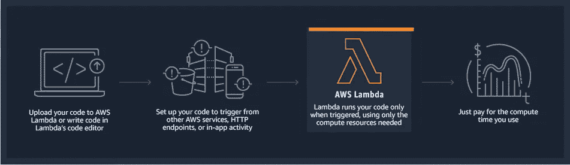
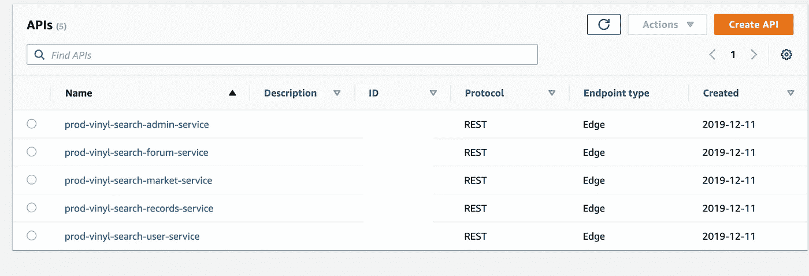
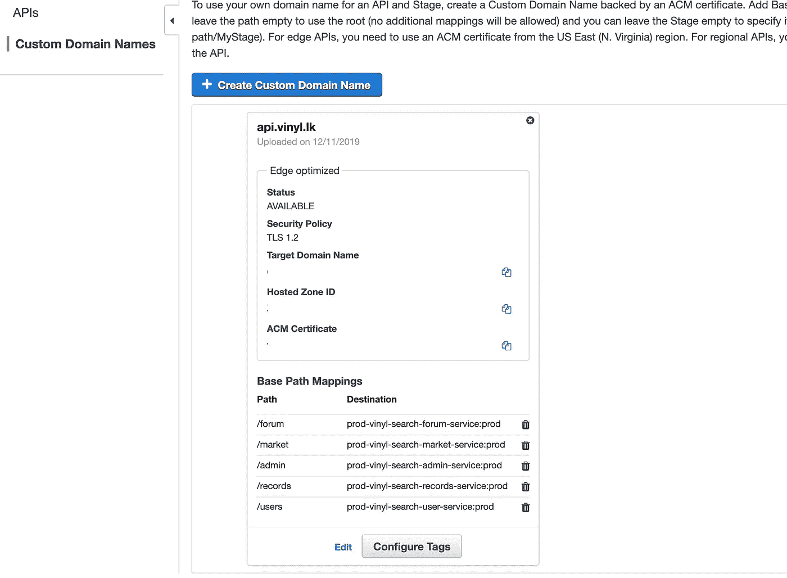
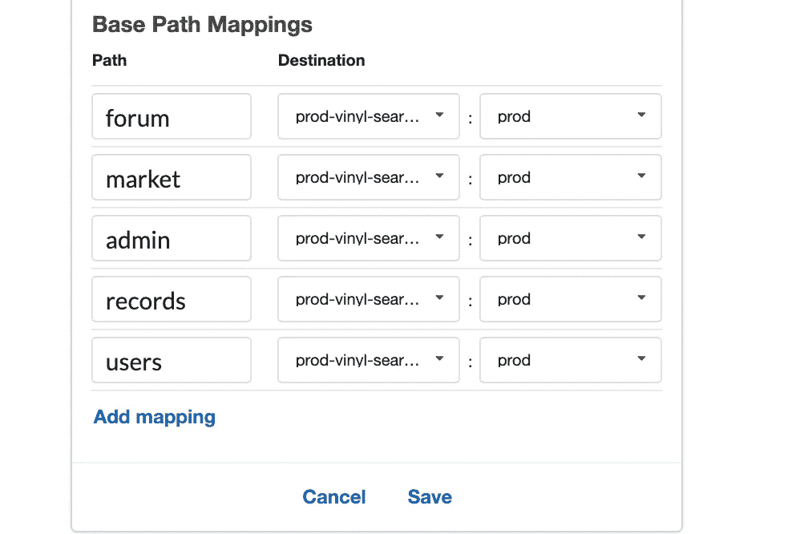

# 无服务器:无痛的 AWS 样板文件

> 原文：<https://towardsdatascience.com/serverless-a-painless-aws-boilerplate-e5ec3b4fb609?source=collection_archive---------16----------------------->

## 为 AWS lambda 部署提供支持离线测试的样板文件



[AWS Lambda](https://aws.amazon.com/lambda/)

无服务器开发由于易于部署而受到关注。此外，鉴于 AWS lambda 能够将其他服务与 AWS SDK 集成，它已经成为一种流行的选择。然而，如果你不具备可伸缩性，当你扩展你的 API 时，从小处着手可能会给你留下巨大的重构空间。因此，在这里，我将总结我在一家初创公司的经验，并分享一个很好的样板文件，通过以一个简单的 REST API 作为起点，它将使您的开发变得快速和可伸缩。我假设您对 AWS 部署如何工作和云形成有所了解。

## 要记住的要点

1.  Cloudformation 模板将只允许每个部署 200 个资源。([文档](https://docs.aws.amazon.com/AWSCloudFormation/latest/UserGuide/cloudformation-limits.html))。因此，服务部署应该以更细粒度的方式完成。
2.  每个部署的服务将拥有多个资源，并独立访问其他服务。
3.  如果我们有单独的服务，我们可以单独捆绑，使捆绑包的大小更小。

在本文中，让我们关注第一个限制。针对这一限制的唯一可行的解决方法是使用只关注一个任务的隔离服务(这确实是使用微服务的动机。).让我们使用无服务器框架来制作样板文件(入门指南:[此处为](https://serverless.com/framework/docs/getting-started/))。还有，你需要无服务器离线插件(获取:[这里](https://github.com/dherault/serverless-offline))。

# 构建无服务器配置

简而言之，我们将为每个服务建立单独的文件夹，并为每个文件夹建立一个`service.yml`。在无服务器框架中，当我们部署或运行离线插件时，我们可以使用`--option VALUE`提供任何选项。我们将利用这个工具来选择单独的服务进行部署或离线运行。我们将在命令行中使用`--service`选项加载每个服务，并使用`--stage`选项进行分段。

在这个样板文件中，我将如下组织我的文件夹结构。

```
- serverless.yml (main serverless config file)
- prod.env.yml (configs for the prod environment)
- dev.env.yml (configs for the dev environment)
- offline-serverless.js (offline runner for testing)
- package.json (node modules neede, for nodejs)// Folders containing the application logic- first-service
-- service.yml
-- main.js- second-service
-- service.yml
-- main.js// Utils for routing
- utils
-- lambda-router.js
-- errors.js (Error message, not essential)
-- db-util.js (Managing the database connection)
```

## serverless.yml 的内容

这是我们服务结构的核心。在 YML 中，我们可以构造符号，以便在运行时填充部分文件。在我们的例子中，从每个服务的`service.yml`文件中选择与服务相关的内容。

我们的`serverless.yml`如下所示。

无服务器. yml

这里,`package`将携带要包含的文件夹，而`functions`将携带每个服务内部的功能。这些将从每个服务的文件夹的`service.yml`文件中加载。

部署脚本命令示例:

`serverless deploy --stage dev --service service1`

## 用于测试的离线配置

离线运行命令的示例如下所示:

`serverless offline start --stage dev --service service1 --port 3000`

然而，为了测试，我们必须在不同的端口上运行每个服务。下面是一个脚本，使我们的任务变得简单。

无服务器-offline.js

这里`PATH1`和`PATH2`是基本路径(例如；`users/`为用户服务，`posts/`为帖子服务)。这在服务内部是不相关的，因此，请注意，我已经删除了基本路径；在第 24 行。每个服务都专注于一件事，所以拥有一个单独的基本路径是多余的(然而我们将在最终的 API 部署中拥有它)。

我们可以简单地离线运行我们所有的服务进行测试；

`node offline-serverless.js`

## 每个服务内部的内容

每个服务应包含所需的资源。在这个例子中，我们将放置 REST API 端点。这段代码将如下所示。

service.yml

注意，这里我们包括了`node_modules` `utils`和携带逻辑的文件。

# 部署

部署就像普通的无服务器框架部署一样。然而，在 API 网关中有一些值得注意的事情。



具有多个服务的示例部署视图

如前所述，尽管我们的应用程序有端点，如`users/profile-detail`，但我们的用户服务将只接受`profile-details`，因为它的唯一目的是处理用户。然而，我们需要 API 知道`users/`请求必须提供给用户服务 lambda。我们就是这么做的。

转到—API，然后转到自定义域名。您将看到以下视图。



自定义域名

在这里，您可以单击编辑并添加自定义映射。例如，在上面的设置中，我将它们添加如下。



基本路径、服务和阶段的映射

对于这个 API，生产环境只有一个映射。如果你有几个在线测试的环境，你必须这样设置。在这里，我已经购买了一个域，并为我的 API 链接了子域。然而，您可以使用无域 API，但是这样您将不得不依赖 AWS 为每个服务随机生成的 URL(不整洁！).

# 清盘

*   路径是相对于`serverless.yml`记录的，所以加载外部文件时要小心。总是使用`__dirname + ‘/file.extension’`来加载文件。
*   我为这个样板文件做了一个 [repo](https://github.com/anuradhawick/aws-lambda-serverless-boilerplate) ，包括我的 lambda 路由器和 DB 处理器。看一看，星，叉，提高，发个 PR 给我。
    [https://github . com/anuradhawick/AWS-lambda-server less-boilerplate](https://github.com/anuradhawick/aws-lambda-serverless-boilerplate)
*   看看 lambda 路由器吧，它非常简单，支持`LAMBDA_PROXY`集成(请看这里的)。你可以在这里看到我是如何使用它的[。](https://github.com/anuradhawick/aws-lambda-serverless-boilerplate/blob/master/first-service/first-main.js)
*   如果您计划向`serverless-offline.js`添加更多服务，请选择不同的端口及其基本路径。更新第 4 行中的`services`数组。

相信这篇文章会对日以继夜辛勤工作的开发者有所帮助。
感谢阅读！干杯！