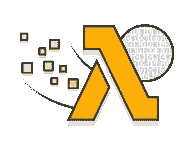
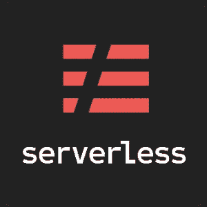
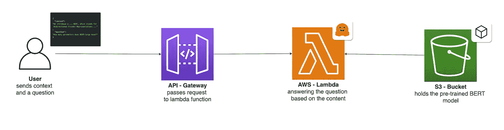
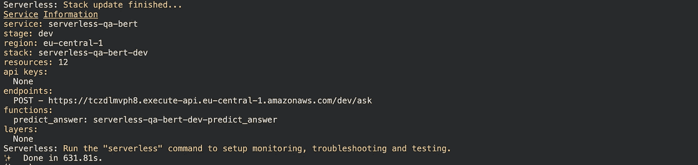
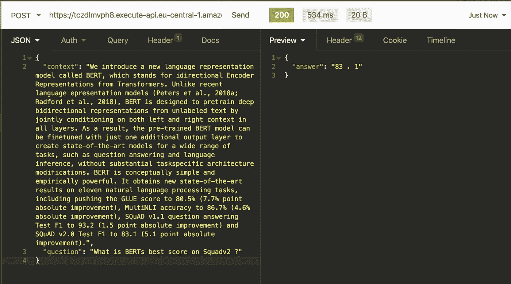

# 带 HuggingFace 和 AWS Lambda 的无服务器 BERT

> 原文：<https://towardsdatascience.com/serverless-bert-with-huggingface-and-aws-lambda-625193c6cc04?source=collection_archive---------12----------------------->

## 用 BERT、HuggingFace、无服务器框架和 AWS Lambda 构建一个无服务器问答 API。

[Samule 孙](https://unsplash.com/@samule?utm_source=unsplash&utm_medium=referral&utm_content=creditCopyText)在 [Unsplash](https://unsplash.com/?utm_source=unsplash&utm_medium=referral&utm_content=creditCopyText) 上的照片

*原载于 2020 年 6 月 30 日*[*https://www . philschmid . de*](https://www.philschmid.de/serverless-bert-with-huggingface-and-aws-lambda)*。*

# 介绍

“无服务器”和“BERT”是强烈影响计算世界的两个主题。[无服务器架构](https://hackernoon.com/what-is-serverless-architecture-what-are-its-pros-and-cons-cc4b804022e9)允许我们动态扩展和缩小软件，无需管理和配置计算能力。[它允许我们，开发者，专注于我们的应用](https://www.cloudflare.com/learning/serverless/why-use-serverless/)。

伯特可能是最有名的自然语言处理模型。你可以说它改变了我们处理文本数据的方式以及我们可以从中学习到什么。[*“BERT 将帮助[Google]搜索[实现]更好地理解[ing]10 个搜索中的一个”*](https://www.blog.google/products/search/search-language-understanding-bert/) 。伯特及其伙伴罗伯塔、GPT-2、艾伯特和 T5 将在未来几年推动商业和商业理念，并将像互联网曾经做过的那样改变/颠覆商业领域。

[搜索语言理解伯特](https://www.blog.google/products/search/search-language-understanding-bert/)

想象一下，将这两者结合在一起，您将获得怎样的商业价值。但是 BERT 并不是最容易在无服务器架构中部署的机器学习模型。BERT 很大，需要相当大的计算能力。您在网上找到的大多数教程都演示了如何在“简单”的环境中部署 BERT，比如一个具有 16GB 内存和 4 个 CPU 的 VM。

我将向您展示如何利用无服务器架构的优势，并在无服务器环境中部署 BERT 问答 API。我们将使用 HuggingFace 的[变形金刚](https://github.com/huggingface/transformers)库、[无服务器框架](https://serverless.com/)和 AWS Lambda。

# 通过 Huggingface 创建变压器库

[变形金刚 logo by huggingface](https://huggingface.co/)

[变形金刚库](https://github.com/huggingface/transformers)为自然语言理解(NLU)和自然语言生成(NLG)提供最先进的机器学习架构，如 BERT、GPT-2、罗伯塔、XLM、DistilBert、XLNet、T5。它还提供了 100 多种不同语言的数千个预训练模型，并在 PyTorch & TensorFlow 2.0 之间具有深度互操作性。它使开发人员能够针对不同的 NLP 任务(如文本分类、情感分析、问答或文本生成)微调机器学习模型。

# 自动气象站λ

AWS Lambda 是一种无服务器计算服务，让你无需管理服务器就能运行代码。它只在需要的时候执行你的代码，并且自动伸缩，从每天几个请求到每秒几千个请求。您只需为您消耗的计算时间付费，当您的代码不运行时，则不收费。

AWS [Lambda](https://docs.aws.amazon.com/lambda/latest/dg/welcome.html) 标志

# 无服务器框架

无服务器框架帮助我们开发和部署 AWS Lambda 功能。它是一个 CLI，开箱即可提供结构、自动化和最佳实践。它还允许我们专注于构建复杂的、事件驱动的、无服务器的架构，由函数和事件组成。

[无服务器框架标志](https://serverless.com)

如果你不熟悉或者还没有设置无服务器框架，看看这个[无服务器框架快速入门](https://serverless.com/framework/docs/providers/aws/guide/quick-start/)。

# 辅导的

在我们开始之前，确保您已经配置并设置了[无服务器框架](https://serverless.com/)。你还需要一个工作的 Docker 环境。Docker 环境用于构建我们自己的 python 运行时，我们将其部署到 AWS Lambda。此外，您需要访问 AWS 帐户来创建 S3 桶和 AWS Lambda 函数。

在教程中，我们将使用预先训练好的`BERT`模型构建一个问答 API。这个想法是我们发送一个上下文(小段落)和一个问题给 lambda 函数，它会用问题的答案来响应。

由于本指南不是关于构建模型，我们将使用一个预构建的版本，这是我用`distilbert`创建的。你可以在这里查看 colab 笔记本[。](https://colab.research.google.com/drive/1eyVi8tkCr7N-sE-yyhDB_lduowp1EZ78?usp=sharing)

在我们开始之前，我想说我们这次不会深入细节。如果你想更多地了解如何在 AWS Lambda 中使用深度学习，我建议你看看我的其他文章:

*   [从零到英雄的缩放机学习](https://www.philschmid.de/scaling-machine-learning-from-zero-to-hero)
*   [如何使用 GitHub 操作和无服务器为 AWS Lambda 设置 CI/CD 管道](https://www.philschmid.de/how-to-set-up-a-ci-cd-pipeline-for-aws-lambda-with-github-actions-and-serverless)

我们正在构建的架构将会是这样的。

**我们要做什么:**

*   使用无服务器框架创建 Python Lambda 函数
*   创建一个 S3 桶并上传我们的模型
*   配置`serverless.yaml`，添加`transformers`作为依赖项，并设置一个 API 网关用于推理
*   将 [colab 笔记本](https://colab.research.google.com/drive/1eyVi8tkCr7N-sE-yyhDB_lduowp1EZ78?usp=sharing#scrollTo=pUdW5bwb1qre)中的`BERT`型号添加到我们的功能中
*   部署和测试功能

你可以在这个 [GitHub 库](https://github.com/philschmid/serverless-bert-with-huggingface-aws-lambda/blob/master/model/model.py)和 [colab 笔记本中找到我们正在做的一切。](https://colab.research.google.com/drive/1eyVi8tkCr7N-sE-yyhDB_lduowp1EZ78?usp=sharing#scrollTo=pUdW5bwb1qre)

# 创建 Python Lambda 函数

首先，我们通过使用带有`aws-python3`模板的无服务器 CLI 创建 AWS Lambda 函数。

该 CLI 命令将创建一个包含`handler.py`、`.gitignore`和`serverless.yaml`文件的新目录。`handler.py`包含一些基本的样板代码。

# 添加`transformers`作为依赖项

除了`requirements.txt`，无服务器框架几乎创建了我们需要的任何东西。我们手动创建`requirements.txt`并添加以下依赖项。

# 创建一个 S3 存储桶并上传模型

AWS S3 和 Pytorch 提供了一种独特的方法来处理大于 250MB 的机器学习模型。为什么是 250 MB？Lambda 函数解压缩后的大小限制为 250MB。

但是 S3 允许文件直接从 S3 加载到内存中。在我们的函数中，我们将把来自 S3 的模型`squad-distilbert`加载到内存中，并作为 Pytorch 中的缓冲区从内存中读取它。

如果您运行 [colab 笔记本](https://colab.research.google.com/drive/1eyVi8tkCr7N-sE-yyhDB_lduowp1EZ78?usp=sharing#scrollTo=pUdW5bwb1qre)，它将创建一个名为`squad-distilbert.tar.gz`的文件，其中包含我们的模型。

要创建 S3 存储桶，您可以使用管理控制台或以下命令来创建。

在我们创建桶之后，我们可以上传我们的模型。您可以手动或使用提供的 python 脚本来完成。

# 配置`serverless.yaml`

这次我为我们提供了完整的`serverless.yaml`。如果你想知道每一节是做什么用的，建议你去看看[从零到英雄的缩放机学习](https://www.philschmid.de/scaling-machine-learning-from-zero-to-hero)。在本文中，我介绍了每种配置，并解释了它们的用法。

# 将 [colab 笔记本](https://colab.research.google.com/drive/1eyVi8tkCr7N-sE-yyhDB_lduowp1EZ78?usp=sharing#scrollTo=pUdW5bwb1qre)中的`BERT`模型添加到我们的功能中

典型的`transformers`型号由`pytorch_model.bin`、`config.json`、`special_tokens_map.json`、`tokenizer_config.json`和`vocab.txt`组成。`pytorch_model.bin`已经被提取并上传到 S3。

我们将把`config.json`、`special_tokens_map.json`、`tokenizer_config.json`和`vocab.txt`直接添加到我们的 Lambda 函数中，因为它们的大小只有几 KB。因此，我们在 lambda 函数中创建了一个`model`目录。

*如果这听起来很复杂，可以查看一下* [*GitHub 资源库*](https://github.com/philschmid/serverless-bert-with-huggingface-aws-lambda) *。*

下一步是在保存我们的模型类`ServerlessModel`的`model/`目录中创建一个`model.py`。

在`handler.py`中，我们创建了一个`ServerlessModel`的实例，并可以使用`predict`函数得到我们的答案。

# 部署和测试功能

为了部署该功能，您只需运行`serverless deploy`。

这个过程完成后，我们应该看到类似这样的东西。

# 测试和结果

为了测试我们的 Lambda 函数，我们可以使用失眠症、邮差或任何其他 REST 客户端。只需在请求体中添加一个带有`context`和`question`的 JSON。让我们用 colab 笔记本中的例子来尝试一下。

我们的`ServerlessModel`用`83.1`正确回答了我们的问题。此外，您可以看到完整的请求花费了 319 毫秒，而 lambda 执行时间大约为 530 毫秒。老实说，这是相当快的。

最棒的是，如果有几个传入请求，我们的 BERT 模型会自动扩展！它可以扩展到数千个并行请求，而不用担心任何问题。

如果您重新构建它，您必须小心第一个请求可能需要一段时间。首先，Lambda 正在解压和安装我们的依赖项，然后从 S3 下载模型。

感谢阅读。你可以在这里找到带有完整代码[的](https://github.com/philschmid/scale-machine-learning-w-pytorch) [GitHub 库](https://github.com/philschmid/serverless-bert-with-huggingface-aws-lambda/blob/master/model/model.py)，在这里找到 colab 笔记本[。](https://colab.research.google.com/drive/1eyVi8tkCr7N-sE-yyhDB_lduowp1EZ78?usp=sharing#scrollTo=pUdW5bwb1qre)

感谢阅读。如果你有任何问题，随时联系我或评论这篇文章。你也可以在推特(Twitter)或领英(LinkedIn)上与我联系。