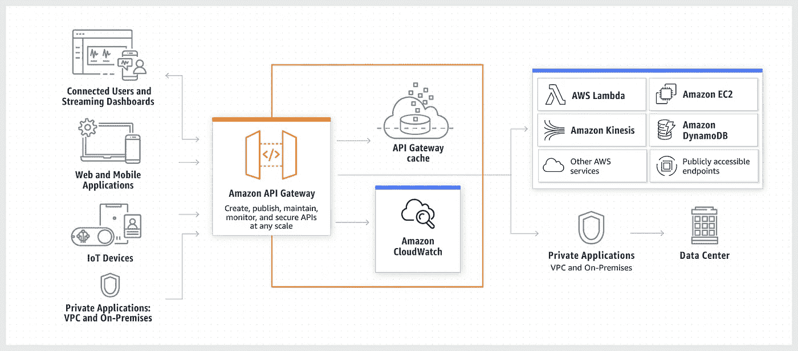
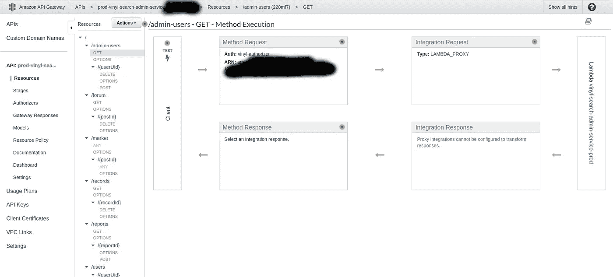
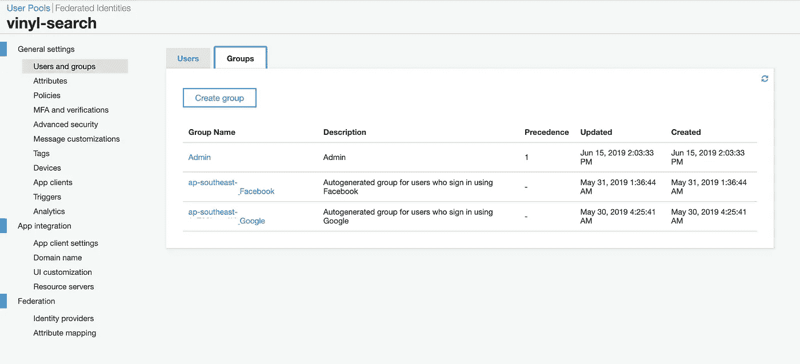

# 无服务器:构建自己的路由器

> 原文：<https://towardsdatascience.com/serverless-building-your-own-router-c2ca3071b2ec?source=collection_archive---------10----------------------->

## 如何为基于角色访问的 REST API 开发自己完整的 lambda 路由器

在我的[上一篇文章](/serverless-a-painless-aws-boilerplate-e5ec3b4fb609)中，我介绍了如何开发一个样板文件来支持 AWS lambda 部署。在本文中，我将展示如何为 REST API 开发一个合适的 lambda 路由器。这是开发可伸缩 AWS lambda 实例的重要一步。



[AWS API 网关架构](https://aws.amazon.com/api-gateway/)

# 为什么是路由器，而不是 NodeJS 服务器？

人们通常会在 lambda 中部署一个成熟的 NodeJS HTTP 服务器。然而，在理想的情况下，我们应该避免这样做，因为它会在 lambda 函数内部产生延迟。此外，我们肯定会错过 API 网关的唯一目的和特性，如身份验证和授权。

在这种情况下，我们将实现一个简单的路由器，它不启动单独的服务器，而是利用 lambda 代理实现头将请求导航到我们实现的功能逻辑。通过这种方法，当 lambdas 被调用时，我们将拥有请求的即时路由。

# AWS Lambda 代理集成请求事件

使用无服务器框架的默认部署将通过 Lambda 代理集成来部署 lambdas。



Lambda 代理集成 API 示例

lambdas 由带有三个参数 ***事件*** 、 ***上下文、*** 和 ***回调*** 的函数组成。事件对象包含所有有用的信息，包括请求体、路径参数、查询参数、请求路径、源、cookie 信息、头和其他请求参数。在代理集成中，我们的 lambdas 的行为类似于 Nginx 路由器(其中我们有所有的重写规则、转发、静态文件呈现等)。我们将利用来自事件对象的信息来构建我们的路由器。首先，让我们看一下事件对象。

示例请求的事件对象

观察事件对象，我们可以清楚地注意到以下两个主要有用的属性。

```
- resource
- httpMethod
```

这基本上是我们纯路由所需要的。哪个`method`中的哪个`path`应该被转发给目标`function`。这简单地类似于开关情况。但是 switch case 应该有更多的功能，包括响应构建和处理不同类型的请求方法。

# 构建路由器

## 路由器的输入

路由器必须与 AWS 函数调用一致，即使用 ***事件*** 、 ***上下文*** 和 ***回调*** 作为参数。

## 创建路由器类或函数

在经典的 javascript 中，类是用函数来模拟的。因此，在这个例子中，我将使用一个考虑到朴素场景的函数(这通常是 Lambdas 中的首选均值)。

我们将实现一个名为`Router`的函数，它将接受`event`、`context`和`callback`作为参数(类似于构造函数属性)。在其中，我们可以有一个函数来调用分配给方法和路径的相关处理程序。让我们看看我们的代码会是什么样子。

路由器实施

你也可以看到我还有另一个功能`builResponse`。它负责构建响应、字符串化主体和分配状态代码。这将使事情变得简单得多，在下一个关于如何使用路由器的代码片段中，您将会看到这一点。

# **使用路由器**

现在我们已经实现了路由器，让我们看看如何使用它。在下面的代码中，我将展示如何让路由器处理路径`data`和`data/{taskId}`上的 GET 请求。如您所见，第二个路径是一个路径模板。路由必须相对于由服务的 **service.yml** 文件确定的服务来完成。我在之前的文章中已经讨论过这个问题([此处阅读](/serverless-a-painless-aws-boilerplate-e5ec3b4fb609))。*如果整个程序只有一个****server less . yml****文件，可以使用完整路径忽略我前面那句话。*

路由器使用

您可以看到，我们可以使用路由器并传递一个处理函数，该函数具有与我们从 lambda 调用中获得的参数相同的参数。我们必须用`error`和`response`值调用`callback`函数。但是，我们以 HTTP 状态代码的形式返回错误。因此，`error`参数将始终为`null`。

# 授权和认证

如果没有适当的访问控制，应用程序基本上是无用的。**认证**是授权访问具有用户身份的 API 端点。授权是确保任务由有适当权限的人来完成。最好使用 *Cognito 用户池*进行身份验证，其中每个用户的头都根据用户池进行验证([从此处了解更多信息](https://medium.com/@anuradhawick/understanding-aws-cognito-and-iam-roles-af2dfefef996))。这将允许带有有效令牌的请求到达 lambda 调用。

## 角色认知组

当您拥有角色并且角色有权执行特定操作时，需要更细粒度的控制。换句话说，必须对报头进行验证，以检查令牌持有者的权限。这可以通过使用*认知用户组*来完成。这些可以通过 *Cognito 控制台*轻松创建。下面是来自真实世界应用程序的几个组。您可以看到一个管理组。



为管理员创建的管理员组

可以创建这些组来向用户分配特定的角色。一个用户可以被分配到多个组。注意，这些组可以使用 AWS SDK 动态创建，不需要访问这个 UI。

**验证 Lambda 事件对象的角色**

我们分配的这些角色必须在我们的路由器中进行验证，在路由器中我们实际实现了基于角色的访问。我们可以在 AWS 中使用 IAM 角色来执行此操作。但是，这种方法更复杂，更适合限制对 AWS 资源的访问；即 S3 桶、用户池等。因此，我们将在 lambda 内部的路由器级别实现基于角色的访问，以便操纵对数据库和其他资源的访问。

**事件**对象将在路径`event.requestContext.authorizer.claims`中具有授权属性。这个对象将有一个名为`cognito:groups`的属性。这可以是一个数组，也可以是一个值，匹配组或者这个人所属的组。这个值可以用来实现我们的授权。

# 带角色验证的路由器

这可以简单地作为我们路由器的`route`功能的扩展。让我们看一下修改情况。

增强型路由器实施

你可以看到我已经检查了`cognito:groups`是否是一个数组。由于无服务器离线仿真和实际 lambda 行为的不匹配，我不得不这样做。无论如何，它使函数对可能的错误更强。我们的 route 函数调用只需要一个额外的参数，roles 数组。仅此而已！。比如说；

```
router.route(
    "GET", 
    "/path", 
    (event, context, callback) => { /* Logic + callback */      }, 
    ["Admin", "Some other group", ...]
);
```

现在你有了一个完整的 lambda 路由器，你可以导入并使用它。lambdas 或重代码处理路由中没有服务器实例。这是一个遵循 ***【责任链】*** 设计模式的大开关案例。在每个函数调用中，如果函数调用负责给定的**方法**和**路径**，处理它们，或者忽略。

这个路由器设计是我们创业时努力的结果，我一直在改进最初设计的一些细节，以适应新的需求。完整的样板文件可以在 [GitHub](https://github.com/anuradhawick/aws-lambda-serverless-boilerplate) 中找到。

感谢阅读！干杯！