# 使用 Python 和 AWS Lambda 的无服务器新冠肺炎数据刮刀

> 原文：<https://towardsdatascience.com/serverless-covid-19-data-scraper-with-python-and-aws-lambda-d6789a551b78?source=collection_archive---------8----------------------->

## 一个重要的 PYTHON 技巧

## 分步教程:使用 AWS Lambda 调度 Python 脚本


插图作者:[金彩云](http://medium.com/@chaeyunkim)

在数据科学中，获得完整的数据源是最重要的事情之一。在几个项目中，数据源是动态变化的，更新速度很快。对新冠肺炎·疫情来说，病例数一直在变化。大多数可用的开放新冠肺炎源仅在每天的时间间隔内可用；然而，较高分辨率的数据似乎对发现与其他参数如空气质量、环境条件等的关系很重要。通过从实时更新源抓取数据来收集数据是获得您想要的数据的解决方案之一。一些文章已经展示了如何用 Python 轻松做到这一点的例子。然而，安排这样一个 Python 项目需要一台一直运行的服务器。对于一个小项目来说，自己为此目的租用/托管服务器可能不值得。

## 你好，AWS Lambda！λ

出于这个原因，我想介绍亚马逊的一项计算服务，你可以运行或调度任何 Python 脚本(或其他编程语言，如 Java、Go、Node.js、Ruby、c# …),而无需自己维护服务器。有了 AWS Lambda，我们还可以轻松地与 AWS S3 存储桶中的文件同步。

## 定价呢？💵

最棒的是， **AWS Lambda** 处于永远免费层服务中！(截至 2020 年 5 月)它允许我们每月提出多达 100 万个请求！例如，如果我们每 1 分钟从互联网上抓取一次数据集，那么每月只有 43200 个请求*(60[请求/小时]* 24[小时/天]* 30[天/月])* 。

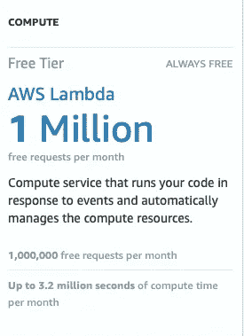

**AWS Lambda 免费领带津贴**(作者从 [AWS](https://aws.amazon.com/free/) 获取)

本文展示了使用 AWS Lambda 和 AWS S3 桶存储来调度用于抓取新冠肺炎数据的 Python 脚本的分步说明。

## 我们开始吧

# 步骤 1:获取新冠肺炎案例的 Python 脚本

首先，我们将准备一个 Python 脚本( *covid19scraper.py* )，使用`Requests` 和`Beautiful Soup`库从 [Worldometer](https://www.worldometers.info/coronavirus/) 中抓取实时全球新冠肺炎数据。总体而言，用于抓取新冠肺炎数据的 Python 脚本如下例所示:

[covid19scraper.py](https://gist.github.com/JoeThunyathep/9c0b4440f6d043d4653ae1e48eb2838d) (作者举例)

这项技术已经展示过几次了。所以我将只给这个脚本一个简短的介绍。`requests`用于向 URL 发出 GET 请求，然后`BeautifulSoup`用于查询 HTML 主体的特定类。在我们的例子中，新冠肺炎案例数据在名为“maincounter-number”的类中，因此调用`bsObj.find_all(…)`来查找我们感兴趣的所有值。通过调用`scrapeGlobalCase()`，我们将得到以下结果:

```
**testResult = scrapeGlobalCase()**testResult: -**{
        ActiveCases: 2302944,
        ConfirmedCases: 3908271,
        Deaths: 270216,
        RecoveredCases: 1335111,
        date: "2020-05-08 00:33:05.775806"
    }**
```

# 步骤 2:准备 Python 包

为了在 AWS Lambda 服务上托管我们的 Python 脚本，我们需要用 zip 文件中的脚本准备 Python 模块。首先，我们必须用`pip`和`-t ./`标签在本地安装所有模块，以指定保存在本地目录中。在我们的示例中，我们需要`datetime` `beautifulsoup4`和`request`模块，您可以运行以下命令来本地安装它们:

```
**$ pip3 install datetime beautifulsoup4 requests -t ./**
```

然后，使用 zip 命令创建这个 python 文件夹的 zip 文件，或者使用您喜欢的 zip 软件(Winzip，7zip，..).

```
**$ zip -r python_package.zip ***
```

# 步骤 3:准备 S3 桶

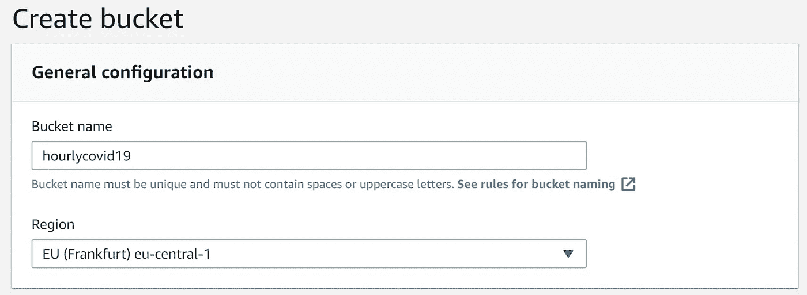

**在 AWS 上创建 S3 桶**(作者从 AWS 控制台捕捉)

因为我们将把我们的结果保存到 AWS S3 存储桶，所以让我们通过 web 浏览器访问您的 AWS 控制台来创建一个存储桶。单击 create a bucket，并为此项目指定一个有意义的名称。您可以根据自己的喜好选择任何地区。我将它命名为“hourlycovid19 ”,用于每小时保存新冠肺炎案例数据。

# 步骤 4:准备 AWS Lambda 执行角色

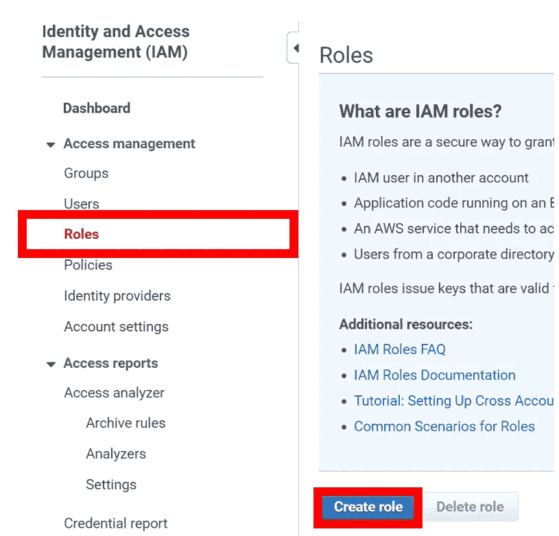

**在 AWS 身份和访问管理上创建 Lambda 执行角色** (IAM) — 1(由作者从 AWS 控制台捕获)

我们需要为 AWS Lambda 生成一个角色，以便能够访问我们刚刚在上一步中创建的 S3 存储桶。请访问 AWS IAM 控制台。([此处](https://console.aws.amazon.com/iam))在菜单中选择“角色”，点击“创建角色”，然后选择“Lambda”用例。找到一个名为“AWSLambdaExecute”的策略，它将允许 Lambda 访问 S3 存储桶。确认后，您可以将此角色命名为“lambda-s3-role”。


**在 AWS 身份和访问管理(IAM)上创建 Lambda 执行角色** — 2(由作者从 AWS 控制台捕获)

# 步骤 5:上传我们的 Python 脚本到 AWS Lambda 层

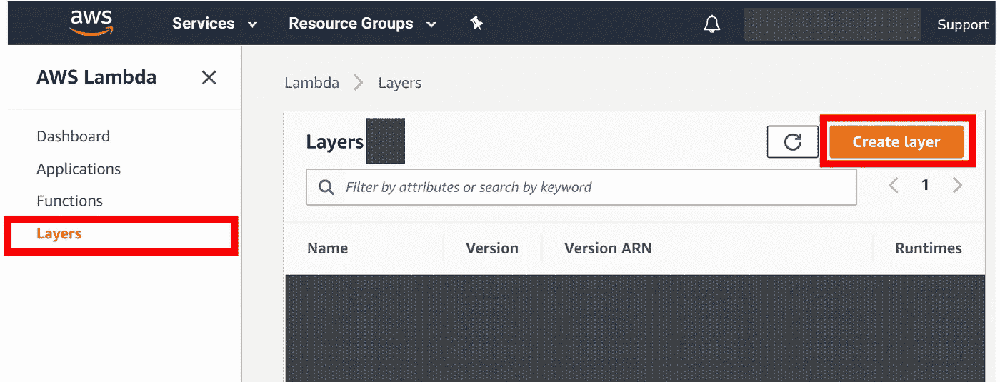

**将我们的 Python 脚本上传到 AWS Lambda 层**(作者从 AWS 控制台捕获)

现在，一切都差不多了，是时候将我们的 zip Python 包上传到 Lambda 层，以使我们的 Python 脚本在 Lambda 上可执行。我们可以通过浏览 AWS Lambda 页面，点击“层”菜单，然后点击“创建层”，给出一个名称，选择我们的 zip 文件，然后选择 Python 运行时。

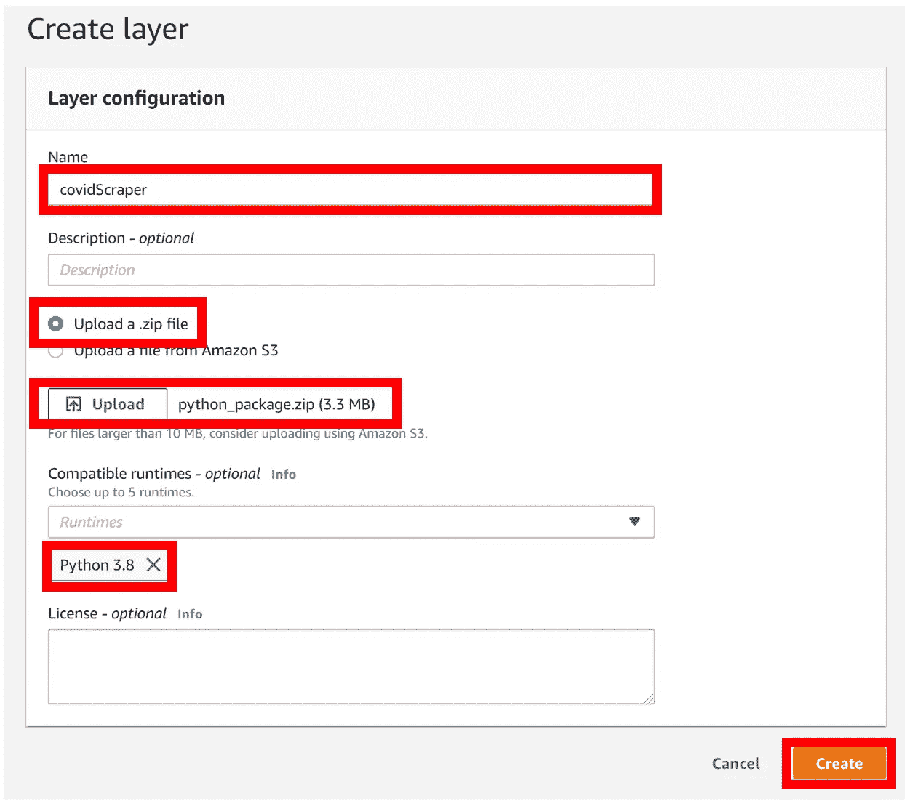

**创建 AWS Lambda 层**(作者从 AWS 控制台捕捉)

# 步骤 6:创建 Lambda 函数

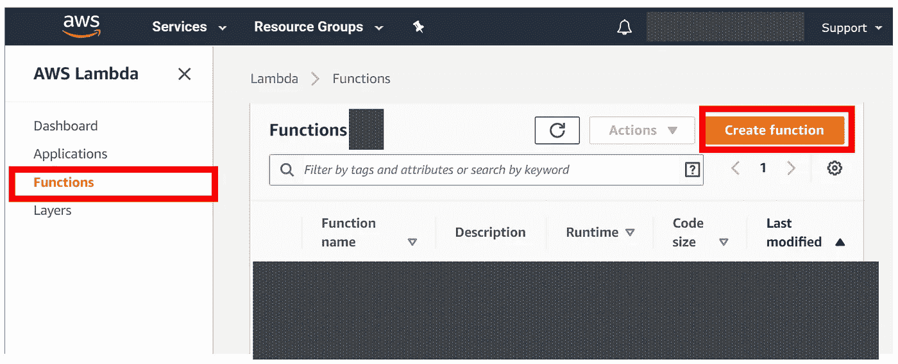

**创建 AWS Lambda 函数— 1** (作者从 AWS 控制台获取)

现在，让我们创建一个 Lambda 函数来执行我们准备的脚本。浏览到 AWS Lambda 页面，点击“功能”菜单，点击“创建功能”，如上图所示。然后，用“Python 3.x”运行时选择“从头创作”。重要的是选择您在步骤 4 中创建的现有角色“lambda-s3-role ”,以允许此功能访问 s3 时段。您可以遵循下图中的示例设置。

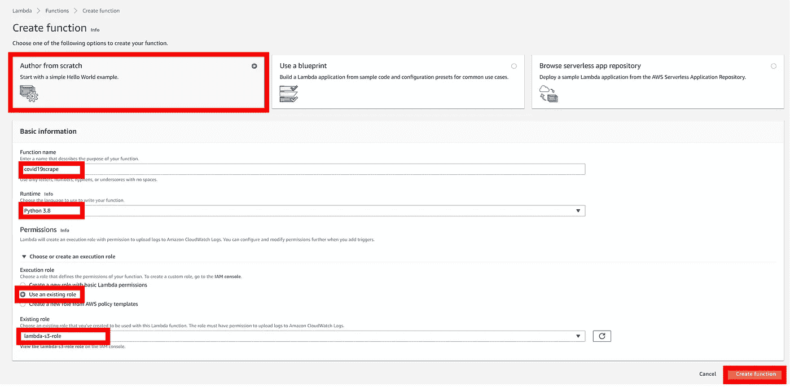

**创建 AWS Lambda 函数— 2** (作者从 AWS 控制台获取)

在创建了“covid19scrape”函数之后，然后将我们在步骤 5 中创建的“covidScraper”层附加到这个函数上。该操作将使我们的函数能够读取和调用我们在步骤 1 中创建的 Python 脚本。

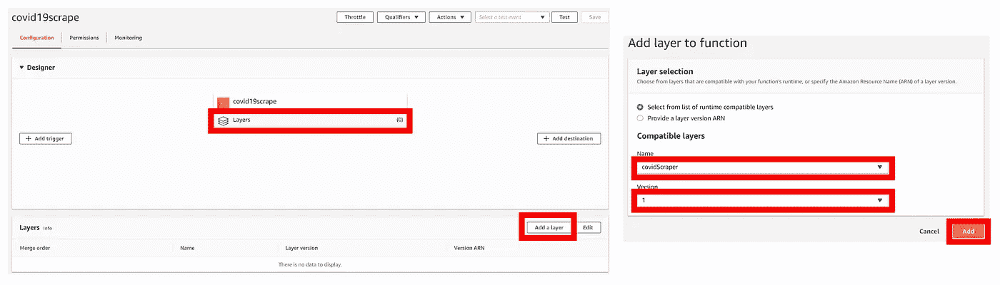

**将 covidScraper 层**(来自步骤 5) **附加到 AWS Lambda 函数**(作者从 AWS 控制台捕获)

现在，请转到 lambda 函数中的函数代码部分。在这里，我们将编写一个 Python 脚本，它定义了 Lambda 处理程序，该处理程序从“covid scrape”层的“covid 19 scrape”Python 脚本(如您在步骤 1 中所命名的)中导入“scrapeGlobalCase”函数。我们还导入了“boto3”库来访问 S3 服务。总的来说，用于抓取新冠肺炎数据并保存到 S3 桶的函数代码中的 Python 脚本将如下图所示，或者您可以在此[要点](https://gist.github.com/JoeThunyathep/663a580d09988303b385a224b523c177)查看该脚本。(* *请更改* `BUCKET_NAME` *以匹配您在步骤 3* 中创建的 S3 存储桶)

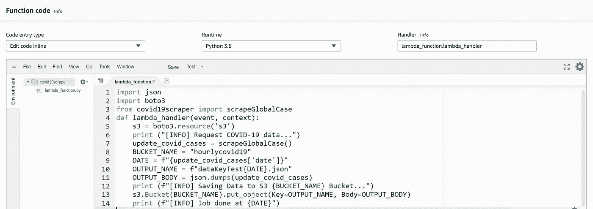

**AWS Lambda 中用于抓取实时新冠肺炎数据并保存到 S3 桶的功能代码。**(作者从 AWS 控制台捕捉)

你可以点击“测试”按钮进行测试。有时，可能会出现超时错误，解决这一问题的技巧是调整基本设置以获得更高的 ram/更长的超时时间。对于我来说，我将 ram 设置为 3000 MB，超时时间为 5 秒。

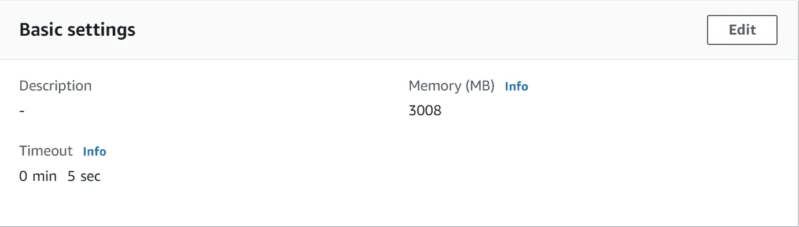

**AWS Lambda 功能基本设置。**(作者从 AWS 控制台捕捉)

恭喜你！！🎉如果你一直进行到这一步，现在这个 Lambda 函数已经准备好抓取新冠肺炎数据了。

# 最后一步:调度 Lambda 函数

由于我们的函数已经准备好了，现在让我们使用 CloudWatch 安排我们创建的函数每小时运行一次(或者根据您的喜好)。请转到 AWS CloudWatch 页面并转到事件/规则。在那里，我们可以使用固定的时间比率或使用 Cron 表达式创建一个调度规则，在一天中的特定时间调度作业。如果你是 Cron expression 的新手，请阅读关于如何创建一个 Cron expression 的文档[这里](https://docs.aws.amazon.com/AmazonCloudWatch/latest/events/ScheduledEvents.html)。在我们 1 小时计划的例子中，您可以使用这个表达式:`0 * * * ? *`

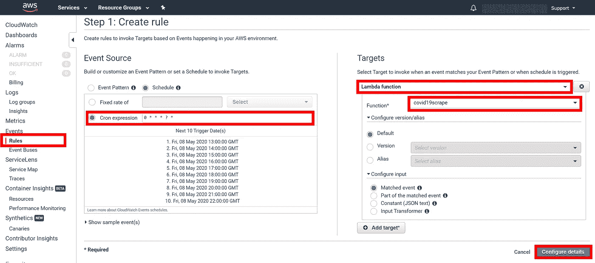

**使用 AWS CloudWatch 安排 Lambda 函数每小时运行一次**(作者从 AWS 控制台获取)

**检查结果:**

所有结果都作为单独的 JSON 文件保存在“hourlycovid 19”S3 桶中。您可以通过访问 S3 铲斗概述来检查它们。您可以通过 AWS CLI 从 S3 bucket 下载所有 JSON 文件到您的本地机器。如果你想用 easy GUI 从 S3 下载多个文件，我推荐 [Cyberduck](https://cyberduck.io/) 🦆工作得很好。

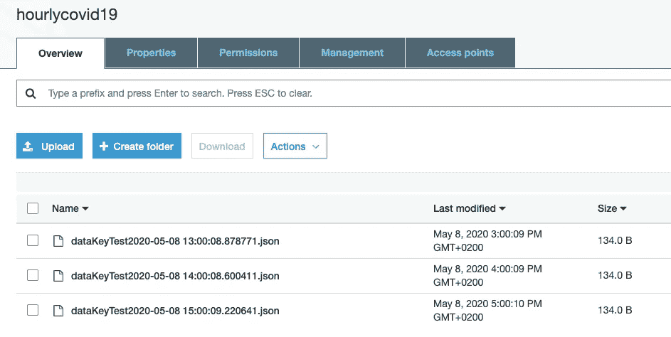

**S3 桶**中的前三个 JSON 结果(作者从 AWS 控制台获取)

为了展示如何使用该数据集的示例，您可以使用下面的示例脚本来读取输出文件夹中的所有 JSON 文件，并将它们添加到 dataframe 中。

**将多个 JSON 文件加载到 Pandas dataframe 的示例 Python 脚本。**(作者提供的示例脚本)

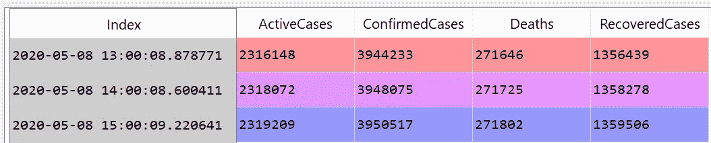

**每小时一次的新冠肺炎全球病例结果数据帧。**(作者截图自 Spyder IDE)

至此，我相信您可以很容易地找到几个教程来继续使用 Python Pandas Dataframe 进行一些非常棒的数据分析或数据可视化。尽情享受吧！！✌

# 结论

所以，就这样吧！如果你是云计算服务的新手，一开始你可能会觉得这很复杂，但是我相信一旦你让它运行起来，你会爱上它的。我希望你喜欢这篇文章，并且能够在将来应用这个无服务器 Lambda 服务来运行你的工作流。

如果您有任何问题或意见，请随时给我留言。

安全**健康**健康**！💪**

**感谢您的阅读。📚**