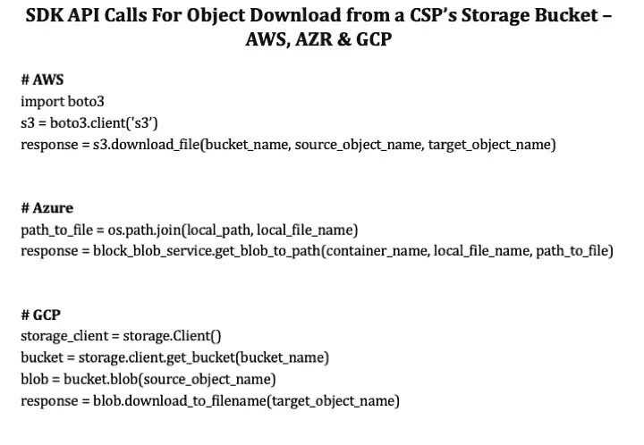

# 无服务器数据集成——绝地大师尤达的十颗智慧珍珠(2020)

> 原文：<https://towardsdatascience.com/serverless-data-integration-jedi-master-yodas-ten-pearls-of-wisdom-2020-fa536cf3724a?source=collection_archive---------65----------------------->

图片来源:flickr.com:atomtetsuwan2002

## 在无服务器数据集成项目中获得的重要经验

# 序文

问候爱、和平、健康与和谐！那是 1980 年，我还是个十几岁的少年，正在看我的第一部*星球大战*电影——《T2》《帝国反击战《T4》【第五集】。它让我难以置信地着迷，留下了不可磨灭的印象。差不多四十年过去了，我还是一个粉丝。绝地大师尤达是《星球大战》三部曲中我最喜欢的角色。

为了更好地阅读这篇文章，我使用了*尤达大师的*反序演讲格式，这使得分享*智慧的珍珠*更加有趣。当你大声朗读 10 颗珍珠时，想象它是用大师的声音呈现的:)

这些珍珠是我在第一个无服务器数据集成项目中学到的经验。这相当于绝地第一次用她的光剑做有意义的事。这段经历过去是(现在仍然是)无价的，我希望你能从中获得价值。说到无服务器数据集成，我想起了尤达大师的一句名言— *做…还是不做。没有尝试！我们开始吧。*

# 智慧的结晶

数据集成在企业中创建了“数据真相”的单一版本。它为企业提供高质量的标准化数据，从而实现分析、机器学习和人工智能。无服务器数据集成使组织能够交付大量数据，同时优化运营成本。以下是我学到的经验:

## #1 —将您必须的无服务器功能从状态中分离出来！

无服务器微服务本质上是短暂的。它由一个事件触发，并执行一个特定的动作作为响应，然后就完成了。微服务的微容器的内存内容不应该试图在当前调用之外直接共享。强制无服务器应用程序或函数调用直接共享其范围之外的状态，将导致次优设计。这会影响可伸缩性，并引入大量不必要的副作用。当需要时，微服务应该将暂时的状态信息写入数据库( *Memcached 或 Redis* )。在写入永久日志的情况下，应该使用其他可靠和持久的数据持久性机制。即使对于数据集成中心(Hub)也是如此。

## #2 —测量您应该测量的系统安静时间！

并非所有工作负载都真正适合无服务器计算。集线器是无服务器实现的典型代表，它的特点是先有突发的活动，然后是一段安静的时间。它本质上是不可预测的。除了正常操作之外，中心还需要支持不同的每日数据量，在没有预设时间(没有计划的作业)的情况下接收和处理数据，并根据需要执行专门的一次性转换。通常，中心日常处理的这种不可预测性需要动态和即时的计算扩展来实现最佳性能。一旦操作完成，集线器进入安静状态。了解枢纽的*安静时间*特征，使我们能够准确量化运营成本节约。最后，空闲时间不会对我们造成任何损失，这意味着——无服务器计算的运营成本优化是*安静时间*的一个功能。

## #3 —优化您的函数运行时间，不要因为函数资源分配而分心！

在系统性能优化领域，以下公式被视为圣杯:

*响应时间(经过时间)=服务时间+等待时间*

响应时间需要成为集线器所有组件的优化目标。每个微服务都需要优化到尽可能短的运行时间。这个概念可能适用于所有计算应用程序，而不仅仅是集线器。

在 *AWS Lambda* 中，分配给 *Lambda* 函数的内存量与其预计成本之间存在直接关联。成本(每秒)与分配的内存量成比例增加。众所周知，内存分配越大，vCPU 内核分配比例越大。 *AWS Lambda* 根据内存量(最多约 1.75–1.8 GB)分配单个 vCPU 内核。超过此内存阈值，将分配 2 个 vCPU 内核并按比例扩展。

借助双线程微服务设计，可以利用额外调配的资源(CPU 和内存)来提高性能。这直接导致运行时间的减少和成本的降低。请记住，您需要为程序的运行时间付费，运行时间优化应该是您唯一的关注点。不用说，*收益递减规律*会在资源分配(内存)上发挥作用。目标是在“拐点”之前分配足够的内存。因此，集线器中的大容量数据操作非常适合双线程微服务，这种服务利用 3GB 内存和 2 个 vCPUs。

## #4 —不一定是约束，这些函数运行时限制！

一个 *AWS Lambda* 函数的当前运行时间限制是 ***900 秒*** 。这个限制很容易克服(如果需要的话)，在一个 *AWS 步骤函数*中有简单的编排逻辑。使用一个简单的计时器和一个数据处理跟踪器(跟踪处理进度的指针)，程序的运行时执行被监控。*功能*在适当的时间重新启动(比如定时器到期前 10 秒)，确保程序持续运行时间超过 *Lambda 的* 900 秒限制。

说了上面的话，我想提醒我们所有人一个*微服务*意味着一个轻量级架构和一个短的运行时间(非常谦虚地说——我们没有理解*微服务*的哪一部分:)).我相信，当一个微服务被优化设计时，它不应该要求运行时间超过 15 分钟。在需要处理大量数据的情况下，可以使用*步进功能*协调同一个微服务，以启动多个并行执行，所有执行都在 15 分钟内单独完成。

## #5 —这些功能延迟和冷启动辩论无关紧要！

函数延迟是用来量化启动一个 *AWS Lambda* 函数所用时间的术语。它表示*重用*一个已经配置好的微容器所花费的时间。当在短时间内发生多个独立的执行时，这是一个相关的讨论点。当功能执行频率大于 30 分钟时，微型容器需要重新*配置*。这被称为*冷启动*。解决这个问题的方法之一是利用 *Lambda* 函数配置中的“供应并发”。但是有一个与之相关的固定成本，它否定了*安静时间*和成本节约的概念。本质上，集线器对功能延迟甚至冷启动不敏感。它不是一个永不停机的应用程序，每小时每分钟每秒都要处理数百个 API 调用。因此，功能延迟和冷启动的问题与集线器无关。

## #6 —您必须区分幂等处理和重复处理！

幂等元是计算机科学的一个基本构造，它定义了程序执行的最终状态。幂等执行要求在输入值相同的情况下，无论程序运行多少次，程序的最终状态都保持完全相同。例如，一个将客户地址修改为' 123 Main Street '的程序是幂等的，无论我们运行它多少次。客户地址的最终状态是“123 Main Street”。多次运行这个程序没有负面影响。因此，一个程序是否是幂等的，取决于程序的需求、上下文、设计和操作的数据。

关于为什么 *AWS Lambda* 不能保证*幂等*的执行，存在疑问和争论。由于 *Lambda* 函数如何实现的动态和异步特性(包括在冷启动期间启动微容器)，在一些边缘情况下，可以针对单个执行请求同时启动多个容器。作为云计算的实践者，我们需要用一个重要的原则来设计—‘一切可以打破的，都将打破’。因此，需要主动解决上面讨论的*AWSλ*的环境副作用。这是防止重复数据处理的一个简单例子。

作为数据从业者，我们都赞同保护系统免受同一数据集的任何意外重复处理的设计。这些安全措施建立在程序逻辑的范围内。这是绝对正确的，也是一个枢纽所需要的。重复数据处理的场景类似于消息队列的消费管理。为确保加工的完整性，设计结构如*总是一次*加工应优先于*至少一次*加工。当消费结构至少有一次是*时，不能责怪队列产生重复数据。因此，*λ*函数不是幂等的是没有意义的。不管一个程序是否幂等，在一个中枢中为重复数据处理设计安全措施是不可协商的，并且必须合并。*

## #7 —避免将功能硬连线到您的 VPC 上！

*AWS Lambda 的*计算资源全部在 *Lambda 的*服务 *VPCs* 内运行。 *Lambda* 调用可以通过 *AWS Lambda API* 仅**发生**。没有对函数运行的执行环境的“网络访问”的规定，因此不能仅仅侵入*λ*调用及其执行微容器。 *AWS Lambda* (当没有硬连接到你的 *VPC* 时)的默认行为是，它可以访问公共域中的任何东西，甚至是在 *AWS* 之外。仅仅因为一个短暂的函数可以访问公共资源，并不自动意味着它会。人们可以不厌其烦地讨论安全角度*，但是对于短暂的无服务器计算环境(不访问你的 *VPC* 资源)*VPC*——硬连线是不必要的。*

*当一个*λ*函数硬连线到你的 *VPC* 时，它会在你的 *VPC* 内创建一个*弹性网络接口(ENI)* ，允许访问私有资源。这将计入您所在地区的帐户限额(IP 地址、API 费率、网络费率)。当您试图增加和扩展函数调用时，您将面临这些帐户限制的挑战，因为每次调用一个 *VPC* 连接的函数都需要一个 *ENI* 。在集线器的情况下，*λ*功能需要访问 *VPC* 资源(数据)，因此出于安全和隔离的目的，建议通过专用子网进行访问。功能互联网接入通常与集线器无关，但在需要和适用时，应通过 *VPC NAT 网关*进行控制。*

*2019 年 9 月，AWS 推出了一种更高效的方法，让函数使用 *AWS 超平面 ENIs* 与您的 *VPCs* 进行通信。这个新的和改进的 *VPC* 网络，消除了之前在你的 *VPC* 中创建的众多运行时 *ENIs* 。使用新方法， *Lambda* 函数连接到*超平面 ENIs* ，超平面 ENIs 反过来管理到您的 *VPC* *ENIs* 的连接(每个安全组一个:子网)。这样做，它消除了直接的 *ENI* 连接，使 *VPC* 网络更具可伸缩性，并减少了 *VPC* 有线函数调用的延迟时间。*

## *# 8——观察无服务器功能的工作方式！*

*无服务器环境明显缺乏*功能可观察性*。这是由于计算环境的瞬时性。相反，在基于服务器的环境中，人们总是能够通过各种跟踪方法来观察程序的执行。因此，功能可观察性是观察执行行为和相关细节的行为。*

*虽然在 AWS 的 *CloudWatch* 日志中记录了一组默认的标准指标，但是每天有大量函数调用的应用程序会在从 *CloudWatch 中挖掘特定于函数的细节时产生问题。*这类似于*大海捞针*。当然还有 *AWS X 光*进行功能调试和追溯。然而，我认为我们需要更好地控制我们观察到的东西。*

*在 Hub 中，每个微服务都应该配备一个日志记录功能，写入我们选择的*日志表*。我们现在控制我们想要在函数执行中观察什么。在*日志表*的设计上做一点投资就可以走很长的路。以下是日志记录的一些基本属性— *函数名、运行日期、运行时间、总运行时间、对象名、行数和调用参数*。这些属性给了我们一个良好的开端，我们可以根据我们不断发展的需求来扩充它。这为您的无服务器中心增加了重要的生产监控价值。以下是亮点:*

*1)为*功能执行日志*的持久化量身定制结构，即没有*一刀切*的标准*

*2)基于执行标准和日志记录级别的灵活日志记录粒度，即调试/故障排除期间的*较高粒度*与正常操作期间的*较低粒度**

*3)易于将日志转换为可操作信息(*AWS elastic cache*)，即清晰了解中心的健康状况*

*4)定制*日志历史记录*的保留，由您对性能基线的要求控制，并具有您定义的时间段*

*因此，功能可观察性，一个中心运营管理的关键方面，是我们需要拥有的东西，而不仅仅依赖于 *CloudWatch* 。*

## *#9 —您必须抽象，以避免被云供应商锁定！*

*给无服务器讨论足够的时间，它将变成云服务提供商(CSP)锁定辩论。诚然，不需要必要的前期设计工作，CSP 锁定也是可能发生的。如果您的无服务器函数中有硬编码的专有 SDK API 调用，您可能会被锁定。即使对于基于服务器的应用程序也是如此——硬编码是一种糟糕的做法！*

***问题**——一个 *AWS Lambda* 函数，用 *Python 3 编程。至少有一个 *AWS Python SDK* 调用的 x*(*boto 3 或 botocore* )不能被提升并“按原样”转移到另一个 CSP。这是因为没有任何 CSP 间 SDK。然而，有一种方法可以通过一些“计算抽象”来获得 CSP 独立性。考虑一个简单的微服务，它采用两个参数(*storage _ bucket _ name&object _ name*)从 CSP 的存储桶中检索和下载一个对象。这个任务的主要 Python SDK API 调用(跨 3 个示例 CSP)如图 1 所示:*

**

**图 1 — Python SDK API 调用 AWS、GCP & Azure 从存储桶下载对象**

*从图 1 中可以清楚地看到，由于 CSP 拥有专有的 SDK，因此每个 CSP 的微服务都是不同的。您将需要为 3 个不同的 CSP 提供 3 个不同的程序，从而维护 3 个不同的代码库。这对大型代码库来说是痛苦的。*

***解决方案** —如果微服务和基础程序设计保持简单，那么跨 CSP 的微服务执行和编排将成为现实。这是通过一点 JSON 杂耍和一个简单的代码部署配置完成的。目标是只维护基础程序的一个副本。CSP 特定调用的封装是用 JSON 文档完成的。图 2 提供了一个使用 JSON 的抽象方法，在代码部署时用一个基础程序设计一个特定于 CSP 的微服务:*

**

**图 2——使用 JSON 对 GCP AWS 的微服务进行简单的 Python 程序抽象& Azure**

*如图 2 所示，将每个 CSP 的 SDK API 调用分离到自己的列表中，可以促进基础程序的单一版本，同时保持代码的可移植性。以下是方法:*

*1.通过 SDK API 调用抽象所有 CSP 的微服务*

*2.创建一个名为 *get_obj_from_bkt* 的 JSON 文档，将每个特定于 CSP 的定义封装在一个列表中(如图 2 所示)*

*3.将 JSON 文档的内容— *get_obj_from_bkt* 存储在一个 NoSQL 文档集合中— *让我们称这个表/集合为 CodeAbstract**

*4.创建一个 Python 函数— *CodePreProc* ，它显式地为所有微服务生成代码。在我们的例子中，我们将为 *get_object_from_bkt* 微服务生成代码。*

*5.在代码部署期间(CI/CD 管道)，使用运行时参数( *aws/azr/gcp* )调用 *CodePreProc* 。比如*—CodePreProc(‘AWS’)；**

*6.基于这个运行时参数， *CodePreProc* 从 *CodeAbstract* 表中查询和检索 *get_obj_from_bkt* JSON 文档。*

*7.AWS 代码数组( *aws_get_obj_from_bkt* )选自 JSON 对象{}，假定' *aws'* 传递给了 *CodePreProc* 。*

*8. *CodePreProc* 然后在给定 CSP 代码数组的元素之间“连接”换行符(“\n”)(使用 *join()* 函数)并创建适当的 Python 程序—*AWS _ get _ obj _ from _ bucket . py 文件*。*

*9.特定于 AWS 的 *get-obj_from_bkt* 微服务现在已经准备好在 CI/CD 管道的下一阶段进行测试和部署。*

*因此，通过将特定于 CSP 的 SDK API 调用封装在 JSON 文档的列表中，并使用简单的预处理脚本动态生成特定于 CSP 的函数，就有可能解决供应商锁定问题。同样，这种方法不是解决所有代码可移植性问题的灵丹妙药，但它确实为硬编码 CSP SDK API 调用提供了一种可行的替代方案。只有在预先完成了必要的抽象和设计工作，从而提供了跨云代码可移植性的自由时，这才是正确的。上述方法有两个优点:*

*a)利用单个基础/包装程序的能力，该程序没有特定于 CSP 的函数调用。这允许通过独立的 CSP 专用 SDK API 微服务(功能)支持具有相同代码库的多个 CSP。*

*b)对 SDK(参数/名称等)的更改。)对于给定的 CSP，只影响 JSON 文档中一个特定 CSP 的代码数组。对其他 CSP 和 orchestrator 计划没有任何影响。如果需要进一步分离，可以修改 JSON 文档的结构，将每个 CSP 的代码分离到一个独立的 JSON 文档中。*

*总之，特定于 CSP 的 SDK API 调用抽象需要预先设计，并且可能不适用于所有现有项目。然而，对于新的项目，它确实提供了一种将微服务从特定于 CSP 的 SDK API 调用中分离出来的方法。这有助于维护通用基础程序，并使我们摆脱供应商的束缚！*

## *#10 —测试您应该…在本地测试云的这些功能！*

*好的集成开发环境(IDE)是程序员的工作台。设计良好的 ide 支持高效的程序开发和测试。“本地”测试云功能的需求是您在项目中很快会遇到的一个需求。没有云感知的 IDE，测试变得非常耗时，因为我们将花费更多的时间通过 CSP 的代码管理管道推送代码，而不是实际的测试。因此，本地测试大大提高了生产率。幸运的是，有一些云友好的 ide 可以拯救程序员。这种 IDE 的一个很好的例子就是 [Stackery](https://www.stackery.io/) 。*

# *结论*

*无服务器数据集成中心以尽可能低的运营成本提供企业数据真相的单一版本。持续学习、适应和成长的重要性需要在我们生活的各个方面成为一种长期的习惯。无服务器数据集成也不例外。我将带着尤达大师著名的智慧之珠离开你，它让我保持谦逊和脚踏实地——你还有很多要学的！*