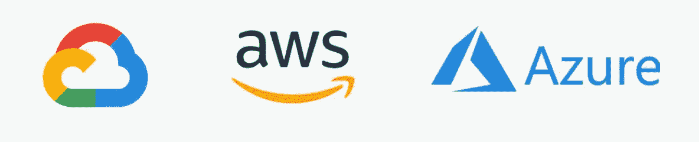
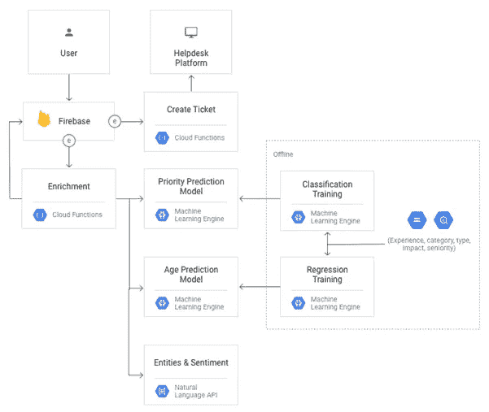
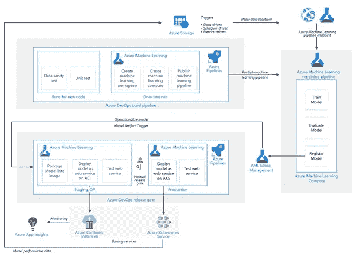

# 领先云平台上的无服务器机器学习架构

> 原文：<https://towardsdatascience.com/serverless-machine-learning-architecture-on-leading-cloud-platforms-c630dee8df15?source=collection_archive---------47----------------------->

## 亚马逊网络服务(AWS)、谷歌云平台(GCP)和微软 Azure 上的机器学习架构

云平台 GCP、AWS、Azure

云平台本身有各种各样的服务，这些服务可以混合和匹配，以满足任何具有分配预算的业务案例的需求。在这里，我将挑选一个[这里提到的通用示例](https://cloud.google.com/solutions/architecture-of-a-serverless-ml-model)，并讨论上述云平台上的架构。

因为架构是无服务器的，所以有一堆功能可以确保事物在服务之间向前移动。

# **要求:**

这项业务有源源不断的支持票。支持代理从客户那里获得的信息很少，因此他们会花更多的时间来了解客户的需求。

在代理开始处理问题之前，他们需要完成以下工作:

*   理解支持票的上下文。
*   确定问题对客户的严重程度。
*   决定使用多少资源来解决问题。

通常，与客户的几次来回交流会获得更多的细节。如果您添加基于票证数据的自动化智能，您可以帮助代理在处理支持请求时做出战略性决策。

通常，用户在填写包含几个字段的表单后，会记录一个票据。对于这个用例，假设没有一个支持票已经被机器学习丰富。另外，假设当前的支持系统已经处理票据几个月了。

要开始丰富支持票证，您必须训练一个使用预先存在的标签数据的 ML 模型。在这种情况下，训练数据集包含在已关闭的支持票证中找到的历史数据。

# 谷歌云架构

1.  基于 Firebase 的数据库更新创建一个云函数事件。
2.  客户端向 Firebase 数据库写一张票。
3.  云函数触发器执行一些主要任务:

*   使用部署的机器学习算法运行预测。
*   用丰富的数据更新 Firebase 实时数据库。
*   使用整合的数据在您的帮助台系统中创建票证。

**无服务器技术和基于事件的触发**

*   “无服务器技术”可以有多种定义方式，但大多数描述都包含以下假设:
*   服务器应该是一个遥远的概念，对客户来说是看不见的。
*   动作通常由事件触发的功能来执行。
*   函数运行的任务通常是短暂的(持续几秒或几分钟)。
*   大多数时候，函数只有一个目的。

Firebase 和云功能相结合，通过最大限度地减少基础架构管理来简化开发运维。操作流程如下:

*   基于 Firebase 的数据库更新创建一个云函数事件。
*   客户端向 Firebase 数据库写一张票。
*   云函数触发器执行一些主要任务:
*   使用部署的机器学习算法运行预测。
*   用丰富的数据更新 Firebase 实时数据库。
*   使用整合的数据在您的帮助台系统中创建票证。

[https://cloud . Google . com/solutions/architecture-of-a-a-server less-ml-model](https://cloud.google.com/solutions/architecture-of-a-serverless-ml-model)

Firebase 本身是一个大规模的服务，并且该架构使用了给定的上下文:

*   Firebase 是一个客户端可以更新的实时数据库，它向其他订阅的客户端显示实时更新。
*   Firebase 可以使用[云功能](https://cloud.google.com/functions)来调用外部 API，比如您的帮助台平台提供的 API。
*   Firebase 可以在桌面和移动平台上工作，可以用各种语言开发。当 Firebase 遇到不可靠的互联网连接时，它可以在本地缓存数据。

# AWS 云架构

*   亚马逊 S3 的结构化数据湖，用于保存原始数据、建模数据、增强数据和转换数据。
*   该功能的暂存桶设计和转换的数据将被纳入 Amazon SageMaker。
*   AWS Lambda 上托管的数据转换代码，用于为消费和 ML 模型培训准备原始数据，并转换数据输入和输出。
*   Amazon SageMaker automation 通过 Lambda 函数为新模型构建、管理和创建 REST 端点，基于一个时间表或由数据湖中的数据变化触发。
*   API 网关端点托管公共 API，使开发人员能够获得其应用程序的历史数据或预测。
*   Amazon Kinesis 数据流，支持在接收、建模、增强和转换阶段实时处理新数据。
*   亚马逊 Kinesis Data Firehose 将模型和增强阶段的结果传送到亚马逊 S3 进行持久存储。
*   AWS IAM 在每个处理组件上执行最小特权原则。IAM 角色和策略只限制对必要资源的访问。
*   一个为每日亚马逊弹性计算云(Amazon EC2)现货定价构建和更新预测模型的演示场景。

来源:[https://D1 . AWS static . com/partner-network/quick start/datasheets/pari veda-data-lake-sage maker-on-AWS-architecture . 50175 e 74 B2 b 654 a 12 a B2 CBE 933 f 47 a3 a 018 f0d 12 . png](https://d1.awsstatic.com/partner-network/QuickStart/datasheets/pariveda-data-lake-sagemaker-on-aws-architecture.50175e74b2b654a12ab2cbe933f47a3a018f0d12.png)

# 蔚蓝建筑

该架构由以下组件组成:

*   [天蓝色管道](https://docs.microsoft.com/azure/devops/pipelines/get-started/index?view=azure-devops)。这个构建和测试系统基于 [Azure DevOps](https://azure.microsoft.com/services/devops/) ，用于构建和发布管道。Azure Pipelines 将这些管道分成称为任务的逻辑步骤。例如， [Azure CLI](https://docs.microsoft.com/azure/devops/pipelines/tasks/deploy/azure-cli?view=azure-devops) 任务使得使用 Azure 资源变得更加容易。
*   [Azure 机器学习](https://docs.microsoft.com/azure/machine-learning/service/overview-what-is-azure-ml)。Azure Machine Learning 是一个云服务，用于大规模培训、评分、部署和管理机器学习模型。这个架构使用用于 Python 3 的 Azure 机器学习 [SDK 来创建工作空间、计算资源、机器学习管道和评分图像。Azure 机器学习](https://docs.microsoft.com/azure/machine-learning/service/quickstart-create-workspace-with-python)[工作区](https://docs.microsoft.com/azure/machine-learning/service/concept-workspace)提供了实验、训练和部署机器学习模型的空间。
*   [Azure Machine Learning Compute](https://docs.microsoft.com/azure/machine-learning/service/how-to-set-up-training-targets)是一个按需虚拟机集群，具有自动扩展和 GPU 及 CPU 节点选项。训练作业在该集群上执行。
*   [Azure 机器学习管道](https://docs.microsoft.com/azure/machine-learning/service/concept-ml-pipelines)提供可重用的机器学习工作流，可以跨场景重用。对于这个用例，训练、模型评估、模型注册和图像创建发生在这些管道中的不同步骤中。管道在构建阶段结束时发布或更新，并在新数据到达时触发。
*   [Azure Blob 存储](https://docs.microsoft.com/azure/storage/blobs/storage-blobs-overview)。Blob 容器用于存储来自评分服务的日志。在这种情况下，将收集输入数据和模型预测。经过一些转换后，这些日志可以用于模型再训练。
*   [Azure 容器注册表](https://docs.microsoft.com/azure/container-registry/container-registry-intro)。计分 Python 脚本打包为 Docker 映像，并在注册表中进行版本控制。
*   [Azure 容器实例](https://docs.microsoft.com/azure/container-instances/container-instances-overview)。作为发布管道的一部分，通过将评分 web 服务映像部署到容器实例来模拟 QA 和暂存环境，这提供了一种简单、无服务器的方式来运行容器。
*   [蔚蓝库伯内特服务](https://docs.microsoft.com/azure/aks/intro-kubernetes)。一旦评分 web 服务映像在 QA 环境中经过全面测试，它就会被部署到受管 Kubernetes 集群上的生产环境中。
*   [Azure 应用洞察](https://docs.microsoft.com/azure/azure-monitor/app/app-insights-overview)。该监控服务用于检测性能异常。

来源:[https://docs . Microsoft . com/en-us/azure/architecture/reference-architectures/ai/m lops-python](https://docs.microsoft.com/en-us/azure/architecture/reference-architectures/ai/mlops-python)

希望这篇文章能帮助我们从高层次上了解在给定的业务案例中哪些服务在起作用。必须记住，这还不是一成不变的，因为有几个假设，最重要的是没有考虑预算限制。

# 参考资料和来源:

 [## 无服务器机器学习模型的架构|解决方案

### 这一系列文章探索了无服务器机器学习(ML)模型的架构，以丰富支持票…

cloud.google.com](https://cloud.google.com/solutions/architecture-of-a-serverless-ml-model)  [## 使用 Azure 机器学习的 Python 模型的 mlop-Azure 参考架构

### 该参考体系结构展示了如何实施持续集成(CI)、持续交付(CD)和…

docs.microsoft.com](https://docs.microsoft.com/en-us/azure/architecture/reference-architectures/ai/mlops-python)  [## 亚马逊 SageMaker 的预测数据科学和 AWS 上的数据湖-快速入门

### 存储和转换数据以构建预测性和规范性应用程序这一快速入门构建了一个数据湖…

aws.amazon.com](https://aws.amazon.com/quickstart/architecture/predictive-data-science-sagemaker-and-data-lake/)