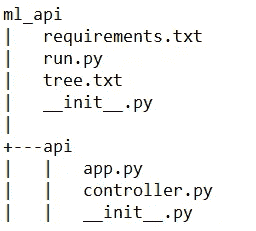
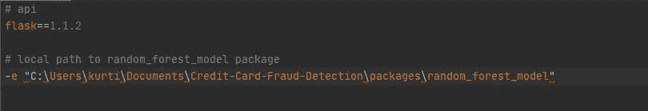
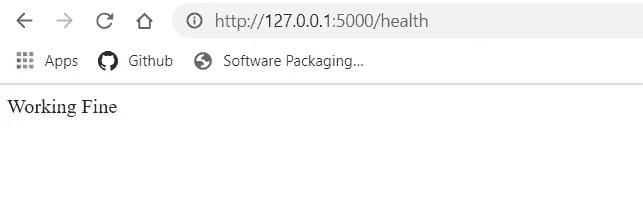
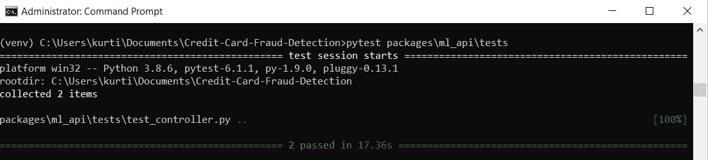

# 通过 REST API 服务于机器学习模型

> 原文：<https://towardsdatascience.com/serving-a-machine-learning-model-via-rest-api-5a4b38c02e90?source=collection_archive---------22----------------------->

## 利用 Flask 服务于机器学习模型

照片由 [Lefteris kallergis](https://unsplash.com/@lefterisk?utm_source=medium&utm_medium=referral) 在 [Unsplash](https://unsplash.com?utm_source=medium&utm_medium=referral) 拍摄

对于那些不熟悉我的作品的人，在过去一篇题为“ [***使用机器学习检测欺诈***](/using-machine-learning-to-detect-fraud-f204910389cf) ”的帖子中，我们开始制造我们机器学习包的第一部分。

现在，包装完成了，但是我们下一步做什么呢？我们如何将它集成到我们需要使用它的任何地方——Github 上的包存储库。

 [## kurtispykes/信用卡欺诈检测

### 此时您不能执行该操作。您已使用另一个标签页或窗口登录。您已在另一个选项卡中注销，或者…

github.com](https://github.com/kurtispykes/credit-card-fraud-detection/tree/master/packages/random_forest_model) 

在此向大家介绍一下 REST API。

> **注意**:这个项目很大程度上受到 Udemy 上的“[部署机器学习模型](https://www.udemy.com/course/deployment-of-machine-learning-models/)”课程的启发，因此会有来自那个项目的源代码片段。

## 什么是 REST API？

**API** 是 **A** 应用 **P** 编程 **I** 接口的缩写。从本质上讲，它是一个软件中介，允许两个应用程序相互对话。如果你不熟悉 API，那么你就不会知道你很可能每天都在使用它。不相信我？你上一次发即时短信是什么时候？你当时用的是 API。

**REST** 缩写代表**RE**presentation**S**state**T**transfer，它决定了 API 的外观。像任何其他的架构风格一样，REST 有它自己的指导约束，如果一个接口被称为 RESTful，那么应该满足这些约束——关于 REST 的更多信息，请参见“ [***什么是 REST***](https://restfulapi.net/) ”。

简单地说，REST API 将被请求资源的状态传输给客户机。在我们的例子中，请求的资源将是来自我们的机器学习模型的预测。因此，我们的服务器将把预测传递给客户端，客户端可能是从 web 应用程序到移动设备的任何东西。

**为什么要使用 REST API？**

这样设计我们的系统有很多好处。例如，通过 REST API 服务我们的模型也允许我们这样做；

*   即时提供预测以增加客户数量
*   可能在不同的 API 端点组合多个模型
*   通过在负载平衡器后添加更多应用程序实例来进行扩展
*   将我们的模型环境从面向客户的层中分离出来——团队可以独立工作

**烧瓶介绍**

为了构建我们的 API，我们将利用 Flask 微框架。由于各种原因，例如极其强大、易于使用和非常好的文档，Flask 是 Python 中微服务的流行选择——参见[文档](https://flask.palletsprojects.com/en/1.1.x/)。

> “微型”并不意味着您的整个 web 应用程序必须适合一个 Python 文件(尽管它确实可以)，也不意味着 Flask 缺乏功能。微框架中的“微”意味着 Flask 旨在保持核心简单但可扩展。

**来源** : [烧瓶文件](https://flask.palletsprojects.com/en/1.1.x/)

## 我们的 REST API

**基本结构**

让我们先来看看我们的目录结构…

**图 1:** 回购目录结构

最顶层的目录是`ml_api`，在这个目录中有`requirements.txt`和`run.py`。`requirements.txt`就是我们在虚拟环境中需要的产品包。

**图 2**:requirements . txt 的内容—我们正在安装 flask 版本 1.1.2 和我们做了包的 random _ forest _ model 因此，我们将能够执行导入语句来调用包。

因此，我们开始用`pip install -r path\to\requirements.txt`将`requirements.txt`文件安装到我们的虚拟环境中，这将安装`flask`并找到我们的`random_forest_model`包的发行版。

`run.py`文件是一个入口点，我们将使用在`app.py`模块中定义的`create_app()`函数来启动 flask。

**图 3** :启动砂箱的入口点。

让我们看看`app.py`模块。从*图 1* 我们可以看到，我们可以通过`api`子目录导航到该文件。

**图 4**

在`app.py`中，我们有自己的工厂函数，它创建了我们的 flask API 并设置了蓝图，蓝图创建了一个位于`controller.py`中的端点。

**图 5**

控制器是一个简单的健康端点，在 HTTP **GET** 请求期间出现，它返回“工作正常”。

在我们启动这个实例之前，在命令提示符下设置 flask 应用程序的入口点是很重要的。在命令提示符下导航到我们的`ml_api`目录，然后简单地输入`set FLASK_APP=run.py`就可以了。当我们完成后，我们只需输入`python run.py`,结果如下…

**图 6** :终点

太好了，我们的终点也如我们所希望的那样工作了。现在我们有了基本的框架，我们可以添加一些更复杂的东西。

> **注意**:添加配置和日志超出了本文的范围，但是在更新的存储库中，你会看到它们存在。因此，下一节将讨论添加预测端点。

下一步是在`controller.py`中为我们的健康端点添加一个推理端点

**图 7** :追加预测终点

我们已经从我们的`random_forest_model`包中调用了`predict`函数来从我们的模型中获取结果。任何软件工程项目的一个非常重要的部分是测试，所以让我们测试我们的端点，看看它是否如我们所期望的那样工作。

**图 8** :测试我们的预测终点是否按预期工作

PyTest 超出了本文的范围，但是为了运行我们的测试，我们必须运行`pytest path\to\test_dir`，这将运行我们的测试目录中的所有测试——如果我们通过了测试，那么我们的预测端点是健康的并且正在运行。

**图 9** :端点通过测试！

现在你知道了！

谢谢你看完，我们在 LinkedIn 上连线吧…

 [## Kurtis Pykes -人工智能作家-走向数据科学| LinkedIn

### 在世界上最大的职业社区 LinkedIn 上查看 Kurtis Pykes 的个人资料。Kurtis 有一个工作列在他们的…

www.linkedin.com](https://www.linkedin.com/in/kurtispykes/)