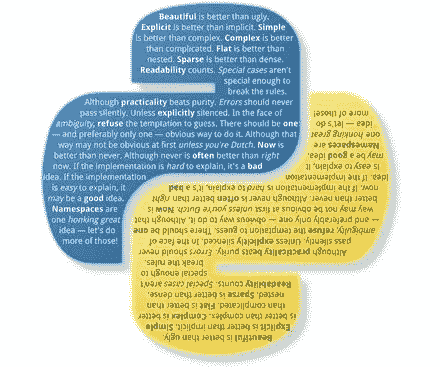

# 将深度学习算法作为服务运行

> 原文：<https://towardsdatascience.com/serving-deep-learning-algorithms-as-a-service-6aa610368fde?source=collection_archive---------12----------------------->

## 现实世界中的 DS

## 如何将深度学习算法作为服务

所以，你想把深度学习算法作为服务来服务。


马里乌斯·马萨拉尔在 [Unsplash](https://unsplash.com?utm_source=medium&utm_medium=referral) 上的照片

你有一个用 Python 和 tensor flow/Keras/一些其他平台编写的非常酷的算法库，它需要在 GPU 上运行工作负载，你希望能够大规模地服务它，并让它快速运行。

[芹菜](https://docs.celeryproject.org/en/stable/)是基于分布式消息传递的开源异步任务队列。在阅读了所有可能的博客帖子和 Youtube 上所有关于芹菜的视频后，我决定这是手头任务的正确解决方案。

有请我们的剧情主角:

1.  API :获取一个请求，创建一个 Celery 异步任务，并将其放入一个队列中。(我推荐使用 flask 来完成这项任务，它很轻，但是可以扩展)
2.  **消息队列**:又名芹菜的经纪人。将 API 创建的任务存储在队列中。最好的做法是选择 RabbitMQ。
3.  **Workers** :我们将在 GPU 上运行的 python/celery 进程，它将从队列中获取任务。这是完成所有繁重工作的地方。
4.  **结果的后端**:将存储任务返回值。最佳实践是使用 redis，它支持复杂的工作流(一个任务依赖于另一个任务)而无需轮询。

最佳实践是使用 Celery，用 [RabbitMQ](https://www.rabbitmq.com/) 作为消息的代理，用 [redis](https://redis.io/) 作为结果的后端，以便使用 Celery 能够提供的所有独特特性。我们知道软件需求的变化经常比我们预期的要快，这应该给我们提供最大的灵活性，这样我们甚至可以使用芹菜最复杂的特性。当选择 RabbitMQ 和 redis 时，每个新任务都被转换成一条消息，然后 Celery 将这条消息发送到 RabbitMQ 中的一个队列，一个工人执行的任务的每个返回值都会自动写回 redis(您可以使用" [click to deploy](https://console.cloud.google.com/marketplace/details/google/rabbitmq?pli=1) "在 GCP 上轻松托管 RabbitMQ，使用 [AWS Elastic Cache](https://aws.amazon.com/elasticache/) 托管 redis)。

一旦表示任务的消息在队列中，我们需要一个 GPU 工作器来计算它。GPU 工作器将从队列中读取一条消息并执行任务。例如，如果这是一个计算机视觉算法，一名工作人员将从 S3 自动气象站下载原始图像，对其进行处理，然后将新图像上传回 S3。图像的 URL 将作为任务的一部分被传递。

但是等等，有个问题。

总有一个陷阱。

GPU 是非常昂贵的机器。P2 的一个例子。AWS 中的 Xlarge 每月花费超过 2，000 美元(在写这几行的时候， [3.06 美元一小时](https://aws.amazon.com/ec2/instance-types/p3/)),如果是 spot 实例，大约 600 美元。这显然意味着，如果没有必要，我们不希望它们一直处于运行状态。它们必须按需开启，然后关闭。事实是，Elastic Beanstalk 没有根据 RabbitMQ 队列指标自动伸缩的特性。

我们该怎么办？

我们必须编写自己的自定义自动缩放器。这是一个小 Python 脚本的大名，它每 30 秒运行并轮询 RabbitMQ 队列中的任务数。如果队列中有消息，它会调用 AWS API 并相应地启动 GPU workers。

每个工人都是用算法库的 docker 容器引导的(存储在 ECR，弹性容器注册表中)。一旦容器启动并运行，它就连接到 RabbitMQ 和 redis。然后，它从队列中取出一个任务并计算它。输出由工人写给 S3。如果任务成功完成，那么芹菜任务的返回值是一个 json，包含保存到 S3 的输出的 URL 及其元数据。Celery 会自动将返回值保存到 redis 中，也会保存到 Postgres DB 中。如果任务未能完成，异常将保存到 redis。

查看下图，了解上面解释的架构:


Nir Orman 将深度学习算法作为服务运行

听起来很轻松？使用芹菜的一个主要挑战是如何正确配置它。

这里有一个很好的配置，当你试图大规模执行深度学习任务时，它可以节省你的时间和眼泪。请查看以下内容，然后我们将深入了解它的每个细节:

```
from celery import Celery
from api.celery_jobs_app.celery_config import BROKER_URI, BACKEND_URI

APP = Celery(
    'celery_app',
    broker=BROKER_URI,
    backend=BACKEND_URI,
    include=['api.celery_jobs_app.tasks']
)

APP.conf.update({
    'imports': (
        'api.celery_jobs_app.tasks.tasks'
    ),
    'task_routes': {
        'calculate-image-task': {'queue': 'images-queue'}
        }
    },
    'task_serializer': 'json',
    'result_serializer': 'json',
    'accept_content': ['json'],
    'worker_prefetch_multiplier': 1,
    'task_acks_late': True,
    'task_track_started': True,
    'result_expires': 604800,  # one week
    'task_reject_on_worker_lost': True,
    'task_queue_max_priority': 10
})
```

> **注**:为了更容易理解，对配置进行了简化。

我们来分解一下。

打破它！

片段中的第一段只是一些导入，微不足道。

第二段定义了芹菜 app 本身，它有一个代理和后端(如前所述，最佳实践是使用 RabbitMQ 和 redis)。

第三段更新了芹菜的配置，这是有趣的部分。

“**导入**”部分说明了芹菜应该在我们的哪个 python 包中寻找任务。

' **tasks_routes** '部分在任务名称和它应该被存储的队列之间进行映射。在上面的代码片段中，所有类型为“*计算-图像-任务*”的任务将被推入一个名为“*图像-队列*”的队列中。如果你不写你的任务应该被路由到哪个队列，它将默认地被路由到名为‘celery’的默认队列。顺便说一句，如果你愿意，可以通过定义“task_default_queue”属性来更改默认队列的名称。

仅供参考:一旦第一个任务被路由到 RabbitMQ 上，队列本身就会自动创建。酷:)

酷毙了。

[**task _ serializer**](https://docs.celeryproject.org/en/stable/userguide/configuration.html#task-serializer)’:这是任务一旦被放入队列后将被序列化的方式，也是任务到达工作线程后被反序列化的方式。在图像处理的情况下，我们不希望图像本身被序列化和反序列化，最佳实践是存储它并只传递它的位置或 URL。我们将使用 json 作为序列化器。

[**result _ serializer**](https://docs.celeryproject.org/en/stable/userguide/configuration.html#result-serializer)**’:**请记住，如果您将序列化类型声明为 json 并返回一个对象或异常的结果(这是在出现未被捕获的异常的情况下的返回类型)，那么您的结果序列化将会抛出一个异常，因为任何不是 json 的对象都会抛出一个未能序列化的异常。你可以在这里阅读更多关于连载器的内容。

**'**[**accept _ content**](https://docs.celeryproject.org/en/stable/userguide/configuration.html#accept-content)**':**允许的内容类型/序列化程序的白名单。

**提示**:不推荐使用‘pickle’序列化器，因为它存在安全问题。从芹菜 4.0 版开始，json 其实就是序列化的默认选项，但是“显式比隐式好”([Python 的禅宗](https://en.wikipedia.org/wiki/Zen_of_Python))。



Python 的禅

[**worker _ prefetch _ multiplier**](https://docs.celeryproject.org/en/stable/userguide/configuration.html#std:setting-worker_prefetch_multiplier)’:Celery 的缺省值是每个 worker 接受 4 个任务，并在返回进行下一个任务之前计算完所有任务。他们的想法是优化网络往返。在我们的情况下，深度学习任务往往很长(比网络时间长得多)。这意味着我们不希望一个工人拿着一堆任务，一个接一个地执行它们。我们希望每个工人一次接受一个**单**任务，然后在前一个任务完成后回来接受下一个任务。这样，如果一个任务需要很长的计算时间，其他工作人员可以同时处理下一个任务，因为只要第一个工作人员没有处理它们，它们就会被保留在队列中。

**'**[**task _ acks _ late**](https://docs.celeryproject.org/en/stable/userguide/configuration.html#task-acks-late)**':**默认情况下，当工人接受一个任务时，该任务会在 执行前 ***被“确认”。在深度学习任务的情况下，这需要很长时间来计算，我们希望它们只在计算完*** 之后 ***被“确认”。这在我们使用 [spot 实例](https://aws.amazon.com/ec2/spot/)时特别有用，它降低了我们的平均任务价格，但如果 GPU 实例短缺，并且我们的投标价格不够有竞争力，也可能会失去它。***

[**task _ track _ started**](https://docs.celeryproject.org/en/stable/userguide/configuration.html#task-track-started)’:有助于跟踪任务已经开始，因为当您的任务长时间运行时，您希望知道它不再在队列中(它将被标记为“pending”)。)我推荐使用 [Flower](https://flower.readthedocs.io/en/latest/) 作为芹菜的监控解决方案，它可以让你确切地看到每个任务的状态。

[**result _ expires**](https://docs.celeryproject.org/en/stable/userguide/configuration.html#result-expires)’:默认情况下，芹菜在 redis 上只保留你的结果 1 天。如果您希望保留更长时间，请在配置文件中以不同方式定义“result_expires”。我建议最多保留 1 周，并将结果写入一个更有组织的数据库，比如 PostgreSQL。

[**【task _ reject _ on _ worker _ lost**](https://docs.celeryproject.org/en/stable/userguide/configuration.html#task-reject-on-worker-lost)’:我们将此设置为 True。当我们使用 spot 实例时，当一个 spot 实例从我们身边拿走时，有可能会丢失一个工人。我们希望将任务放回队列中，由另一个工作者来计算。小心，如果一个工人丢失是由于硬件错误，如“内存不足”等。，那么任务将在一个循环中一次又一次地被部分计算，因为工作者将在每次试图计算它时丢失。如果您看到一个无限循环的任务，这就是您应该怀疑的配置。

**task _ queue _ max _ priority**’:这是你可以确保重要任务先完成的地方。您可以为每个 Celery 任务设置一个优先级(通过给它分配一个表示其优先级的 int)。如果设置该属性，还必须将其设置到 RabbitMQ 队列中，它不会自动设置。如果具有优先级的任务进入没有 priority 属性的队列，将会引发异常，并且该任务不会进入队列。如果您有一个任务应该首先计算的高级客户，则此属性很有用。

如果您正在考虑使用该属性，以便将快速运行的任务优先于慢速任务(例如长 GPU 计算任务)，那么可以考虑添加另一组工作人员，即 CPU 工作人员，而不是昂贵的 GPU 工作人员。这会更便宜也更快。

正如您在顶部的架构图中看到的，您也可以让工作人员在完全不同的云上运行。

完全不同的云

例如，您可以在 Azure AKS 上运行您的员工，这是 Azure 的 Kubernetes。但那是一篇完全不同的博文。

祝你用芹菜服务你的深度学习算法好运，如果你有任何问题，请随时在 [LinkedIn](https://il.linkedin.com/in/nir-orman) 上联系我。