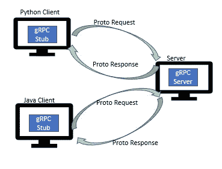
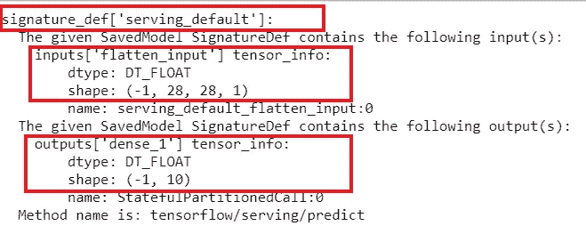
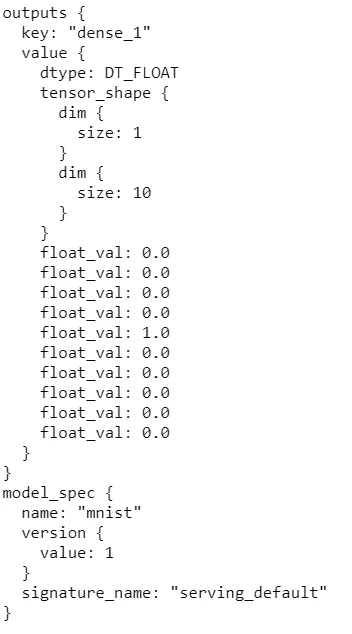
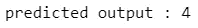
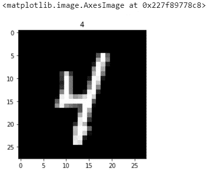

# 如何使用 gRPC API 服务一个深度学习模型？

> 原文：<https://towardsdatascience.com/serving-deep-learning-model-in-production-using-fast-and-efficient-grpc-6dfe94bf9234?source=collection_archive---------18----------------------->

## 理解什么是 gRPC 以及如何使用 gRPC API 服务深度学习模型的快速简单指南。

***在本帖中，你将学习什么是 gRPC，它是如何工作的，gRPC 的好处，gRPC 和 REST API 的区别，最后用 Tensorflow Serving 实现 gRPC API 来服务生产中的一个模型？***

**gRPC 是 Google 开发的远程过程调用平台。**

> GRPC 是一个现代的开源、高性能、低延迟和高速吞吐量的 RPC 框架，它使用 HTTP/2 作为传输协议，使用协议缓冲区作为接口定义语言(IDL)以及它的底层消息交换格式

## ***gRPC 是如何工作的？***



灵感来源:[https://www.grpc.io/docs/what-is-grpc/introduction/](https://www.grpc.io/docs/what-is-grpc/introduction/)

创建了一个 **gRPC 通道**，该通道在指定的端口上提供到 gRPC 服务器的连接。**客户端调用存根**上的方法，就好像它是本地对象一样；**服务器被通知客户端 gRPC 请求**。gRPC 使用 **协议缓冲区在客户端和服务器**之间交换消息。协议缓冲区是一种以高效、可扩展的格式对结构化数据进行编码的方式。

一旦**服务器接收到客户端的请求，它就执行该方法，并将客户端的响应连同状态代码和可选元数据一起发回**。gRPC 允许客户端指定等待时间，以允许服务器在 RPC 调用终止之前做出响应。

## 使用 gRPC 有什么好处？

*   gRPC 使用二进制有效负载，这对于创建和解析是有效的，因此是轻量级的。
*   双向流在 gRPC 中是可能的，但在 REST API 中却不是这样
*   gRPC API 建立在 HTTP/2 之上，支持传统的请求和响应流以及双向流
*   **消息传输速度比 REST API 快 10 倍**，因为 gRPC 使用序列化协议缓冲区和 HTTP/2
*   **客户机和服务器之间的松散耦合**使得修改变得容易
*   gRPC 允许**集成用不同语言编程的 API**

## gRPC 和 REST API 有什么区别？

*   **有效载荷格式** : REST 使用 JSON 在客户端和服务器之间交换消息，而 gRPC 使用协议缓冲区。协议缓冲区比 JSON 压缩得更好，从而使 gRPC 更有效地通过网络传输数据。
*   **传输协议** : REST 大量使用 HTTP 1.1 协议，这是文本的，而 gRPC 是建立在新的 HTTP/2 二进制协议之上的，这种协议通过高效的解析来压缩报头，并且安全得多。
*   **流与请求-响应** : **REST 支持 HTTP1.1 中可用的请求-响应**模型。 **gRPC 使用 HTTP/2 中可用的双向流**功能，其中客户端和服务器使用读写流相互发送一系列消息。

## 深度学习模型如何用 Python 实现 gRPC AI？

## 使用 TF 服务为深度学习模型创建 gRPC API 的步骤

1.  创建从客户端到服务器的请求负载作为协议缓冲区(。原型)文件。客户端通过存根调用 API。
2.  运行 docker 映像，公开端口 8500 以接受 gRPC 请求并将响应发送回客户端
3.  运行服务器和客户端。

## 实现 ***gRPC API***

要使用 Tensorflow 服务实现 REST API，请关注这个[博客](/deploying-a-tensorflow-model-to-production-made-easy-4736b2437103)。

对于 Windows 10，我们将使用 TensorFlow 服务图像。

## 第一步:[安装 Docker App](https://docs.docker.com/docker-for-windows/install-windows-home/)

## 步骤 2:提取 TensorFlow 服务图像

```
**docker pull tensorflow/serving**
```

一旦你有了张量流服务图像

*   为 gRPC 显示端口 8500
*   可选环境变量`**MODEL_NAME**`(默认为`model`)
*   可选环境变量`**MODEL_BASE_PATH**`(默认为`/models`)

## 步骤 3:创建并训练模型

这里，我从张量流数据集中提取了 MNIST 数据集

```
#Importing required libraries
**import os
import json
import tempfile
import requests
import numpy as np
import tensorflow as tf
import tensorflow_datasets as tfds**#Loading MNIST train and test dataset
#as_supervised=True, will return tuple instead of a dictionary for image and label
**(ds_train, ds_test), ds_info = tfds.load("mnist", split=['train','test'], with_info=True, as_supervised=True)**#to select the 'image' and 'label' using indexing coverting train and test dataset to a numpy array
**array = np.vstack(tfds.as_numpy(ds_train))
X_train = np.array(list(map(lambda x: x[0], array)))
y_train = np.array(list(map(lambda x: x[1], array)))
X_test = np.array(list(map(lambda x: x[0], array)))
y_test = np.array(list(map(lambda x: x[1], array)))**#setting batch_size and epochs
**epoch=10
batch_size=128**#Creating input data pipeline for train and test dataset
# Function to normalize the images**def normalize_image(image, label):
  #Normalizes images from uint8` to float32
  return tf.cast(image, tf.float32) / 255., label**# Input data pipeline for test dataset
#Normalize the image using map function then cache and shuffle the #train dataset 
# Create a batch of the training dataset and then prefecth for #overlapiing image preprocessing(producer) and model execution work #(consumer)**ds_train = ds_train.map(
    normalize_img, num_parallel_calls=tf.data.experimental.AUTOTUNE)
ds_train = ds_train.cache()
ds_train = ds_train.shuffle(ds_info.splits['train'].num_examples)
ds_train = ds_train.batch(batch_size)
ds_train = ds_train.prefetch(tf.data.experimental.AUTOTUNE)**# Input data pipeline for test dataset (No need to shuffle the test #dataset)
**ds_test = ds_test.map(
    normalize_image, num_parallel_calls=tf.data.experimental.AUTOTUNE)
ds_test = ds_test.batch(batch_size)
ds_test = ds_test.cache()
ds_test = ds_test.prefetch(tf.data.experimental.AUTOTUNE)**# Build the model
**model = tf.keras.models.Sequential([
  tf.keras.layers.Flatten(input_shape=(28, 28, 1)),
  tf.keras.layers.Dense(128,activation='relu'),
  tf.keras.layers.Dense(196, activation='softmax')
])**#Compile the model
**model.compile(
    loss='sparse_categorical_crossentropy',
    optimizer=tf.keras.optimizers.Adam(0.001),
    metrics=['accuracy'],)**#Fit the model
**model.fit(
    ds_train,
    epochs=epoch,
    validation_data=ds_test,
    verbose=2)**
```

## 步骤 4:保存模型

通过将 save_format 指定为“tf”将模型保存到协议缓冲文件中。

```
**MODEL_DIR='tf_model'
version = "1"
export_path = os.path.join(MODEL_DIR, str(version))**#Save the model 
**model.save(export_path, save_format="tf")
print('\nexport_path = {}'.format(export_path))
!dir {export_path}**
```

您可以使用***saved _ model _ CLI***命令检查模型。

```
**!saved_model_cli show --dir {export_path} --all**
```



对输入和输出及其数据类型和大小进行建模

## 步骤 5:使用 gRPC 服务模型

为 gRPC 实施导入库

```
**import grpc
from tensorflow_serving.apis import predict_pb2
from tensorflow_serving.apis import prediction_service_pb2_grpc
from tensorboard.compat.proto import types_pb2**
```

使用 gRCP 端口 8500 在客户端和服务器之间建立通道。为客户机创建客户机存根，以便与服务器通信

```
**channel = grpc.insecure_channel('127.0.0.1:8500')**
**stub = prediction_service_pb2_grpc.PredictionServiceStub(channel)**
```

通过指定模型名称和模型输入、数据类型以及数据大小和形状，为服务器创建请求负载作为协议缓冲区。

```
**request = predict_pb2.PredictRequest()
request.model_spec.name = 'mnist'
request.inputs['flatten_input'].CopyFrom(tf.make_tensor_proto(X_test[0],dtype=types_pb2.DT_FLOAT,  shape=[28,28,1]))**
```

如果数据类型和数据大小与模型输入不匹配，您将得到错误“**输入大小与签名**不匹配”。

**要解决此错误，请检查模型输入数据的类型和大小，并将其与发送给 gRPC 的请求进行匹配。**

**运行 docker 镜像，展示端口 8500 以接受 gRPC 请求**

```
**docker run -p 8500:8500 --mount type=bind,source=C:\TF_serving\tf_model,target=/models/mnist/ -e MODEL_NAME=mnist -t tensorflow/serving**
```

源应该是绝对路径。

服务器现在准备好接受客户端请求

**为了预测请求的结果，从存根调用 predict 方法**

```
**result=stub.Predict(request, 10.0)
result**
```



来自 gRPC 服务器的结果响应

```
**res=np.argmax(result.outputs['dense_1'].float_val)
print(" predicted output :", res)**
```



使用 matplotlib 显示输入图像

```
**import matplotlib.pyplot as plt
%matplotlib inline
img = X_test[0].reshape(28,28)
plt.title(res)
plt.imshow(img, cmap="gray")**
```



## 结论:

gRPC 是 Google 新的远程过程调用 API，比 REST API 快大约 10 倍。gRPC 建立在 HTTP/2 之上，它使用协议缓冲区在客户机和服务器之间高效地交换双向消息。

## 参考资料:

【https://grpc.io/docs/what-is-grpc/core-concepts/ 