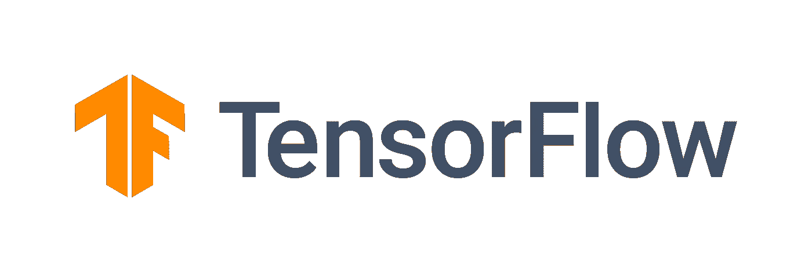

# 使用 tensor flow Serving-TF 2 . x 部署 Keras 模型

> 原文：<https://towardsdatascience.com/serving-keras-models-locally-using-tensorflow-serving-tf-2-x-8bb8474c304e?source=collection_archive---------13----------------------->

## 如何使用 TensorFlow Serving 和 Docker 在本地主机上部署自己的 Keras 模型



张量流— 2.1.0

# 概观

创造了一个很棒的深度学习模型？恭喜你！

不知道如何使用 Keras 创建深度学习模型？别担心！

我将介绍如何创建一个基本的和超级简单的 Keras 模型，以及如何在您的本地机器上部署它。这个模型肯定比您计划部署的任何模型都要简单(嗯，我希望如此！).但是由于这篇文章的目标是使您能够部署您的 Keras 模型，所以我想确保我们不会偏离我们的目标。

现在，我们为什么需要在本地服务器上部署它呢？验证我们用模型想要解决的任何问题都可以在现实世界中得到解决。您会期望您的模型以相同的方式工作，并在真实世界的数据上提供与您在本地 IDE 或笔记本上的测试输入相同的性能。但事实是，它很难做到这一点。如果是的话，太好了！但是，在您部署了供消费的模型之后，您不会希望意识到您的测试数据和真实世界数据之间的差距。

如果真实世界的图像不同于您用来训练、验证和测试模型的白色背景工作室图像，该怎么办？如果由于延迟问题，在网络调用中处理数据的时间比在 IDE 中长，该怎么办？尽早发现这些问题是将你的模型从舒适的笔记本电脑成功过渡到现实世界的关键。

# 张量流服务

## TensorFlow 提供的是什么？

[TensorFlow Serving](https://www.tensorflow.org/tfx/guide/serving) 是一个面向机器学习模型的灵活、高性能的服务系统，专为生产环境而设计。TensorFlow 服务可以轻松部署新的算法和实验，同时保持相同的服务器架构和 API。TensorFlow 服务提供了与 TensorFlow 模型的现成集成，但可以轻松扩展为服务于其他类型的模型和数据。

## 为什么 TensorFlow 服务？

如果您习惯于使用 TensorFlow 或 Keras 构建模型，那么部署模型最简单的方法就是使用 TensorFlow 服务器。

大多数 TensorFlow 文档是为 TensorFlow-1.0 编写的，遗憾的是，它不能像 TensorFlow-2.0 那样工作。因此需要这个博客。

# 构建一个超级简单的 Keras 模型

你可以在这里找到我的笔记本[:(你也可以在](https://github.com/bankarpranit26/deep-learning/blob/master/learnings/TFServing_Local_LinearModel.ipynb)[谷歌实验室](https://colab.research.google.com/drive/1OaGLgnP7QXy0_C0wq0ndq7hwOVr2pEBk)运行)

[如果您已经以 SavedModel 格式准备好了模型，请跳过这一部分。]

在这里，我将创建一个预测线性关系的模型:

```
y = 2x + 1
```

我使用了 Google Colab，但是你可以使用你选择的任何工具，只要生成的模型保持不变。

让我们开始吃吧。

我们首先加载必要的库

然后我们创建数据集

然后我们建立我们的模型。既然是简单的线性关系，单个神经元就够了。

我们现在为我们的模型训练 20 个纪元。经过 20 个时期后，我们的模型在训练和验证时的损失约为 2e-12。然后，我们在测试数据上评估我们的模型。我们的测试损失大约是 2e-12。你可以尝试预测一些值来验证结果，就像我在这里做的那样。我收到的输出是 15.866。

一切看起来都很棒。现在让我们以 SavedModel 格式保存并下载我们的模型。

从这一步开始，该过程将独立于所使用的输入和输出数据的类型。它可以是数字数组、文本、图像、音频或视频。在 Colab 中，您应该能够看到在您的目录中创建了一个名为“linear_model”的文件夹。这里的“export_path”变量表示我们的模型被命名为“linear_model ”,这是它的第一个版本。使用 TensorFlow 服务进行部署时，必须有版本号，因此请确保您的“export_path”采用{MODEL}/{VERSION}的形式，其中版本是不带任何字母或特殊字符的数字。

现在要下载这个模型，我们将压缩这个文件夹，然后使用“google.colab.files”来下载压缩文件。

一旦您在本地机器上解压缩这个 zip 文件，您应该能够看到一个名为' linear_model '的文件夹，其中包含一个名为' 1 '的文件夹，该文件夹包含您的变量和模型架构。

# 设置您的机器

这是一次性设置活动。

要启动本地服务器，我们需要在本地机器上安装一个 TensorFlow 服务实例。我们将使用推荐的 Docker 使用方式，而不是下载并安装所有必要的库。

你可以在指南[这里](https://www.tensorflow.org/tfx/serving/docker)阅读更多细节。

我们不会遵循指南中提到的所有步骤，因为有些事情是特定于 TF 1.0 的，有些事情是特定于重用已经可用的模型的。

一旦你从[这里](https://www.docker.com/products/docker-desktop)下载 Docker 到你的系统上，继续完成安装步骤。您需要重新启动系统，以便保存您的所有工作。

安装成功完成后，进入命令提示符(Mac 和 Linux 用户，请使用适当的工具)并键入

```
docker pull tensorflow/serving
```

就是这样！现在让我们开始部署我们的模型。

# 在本地主机上部署 Keras 模型

如果我告诉您，部署模型只是一行命令脚本，会怎么样呢？

你所需要的是**到你的“线性模型”文件夹的绝对路径**。不要忘记使用绝对路径，因为这将导致错误，你需要花时间和打破你的头来解决。

我的“线性模型”保存在“D:/my_own_models/”中。所以我的命令看起来像:

```
docker run -p 8038:8501 — mount type=bind,source=D:/my_own_models/linear_model,target=/models/linear_model -e MODEL_NAME=linear_model -t tensorflow/serving
```

这都是一条线。对于您的后续模型，您只需要更改您的“源”路径。更改您的“目标”和 MODEL_NAME 是可选的，但是，根据上下文，这当然是必要的。

现在，让我们试着理解上面的命令脚本意味着什么。这个脚本的一般形式是

```
docker run -p {LOCAL_PORT}:8501 — mount type=bind,source={ABSOLUTE_PATH},target=/models/{MODEL_NAME} -e MODEL_NAME={MODEL_NAME} -t tensorflow/serving
```

{LOCAL_PORT}:这是您机器的本地端口，所以请确保您没有在那里运行任何其他程序。我们将它映射到 TensorFlow Serving 为 REST API 调用公开的 8501 端口

{绝对路径}:这是模型的绝对路径。这告诉 TensorFlow 服务你的模型位于哪里(很明显)。

{MODEL_NAME}:这是带有前缀“/models/”的 REST API 调用的服务端点。不要更改目标变量中的“/models/”前缀，只根据您的需要更改{MODEL_NAME}部分

当您在命令窗口中看到以下消息时，您的模型已成功托管。您还可以在 Docker 仪表板中看到一个成功运行的容器。

```
[evhttp_server.cc : 238] NET_LOG: Entering the event loop …
```

# 测试我们的模型

我使用 Postman 来测试我的查询，但是您可以使用任何形式的 API 调用。

[注意:您将无法从浏览器或任何其他主机直接调用您的 REST API，因为 TensorFlow 服务不支持 CORS。然而，有一些方法可以实现从浏览器到您的模型的调用，我将在另一篇文章中介绍。]

您需要一个 POST 查询来测试我们的模型。我们的请求 URL 看起来像:

```
[http://localhost:8509/v1/models/linear_model:predict](http://localhost:8509/v1/models/linear_model:predict)
```

同样，一般形式是:

```
[http://localhost:{LOCAL_PORT}}/v1/models/{MODEL_NAME}:predict](http://localhost:{LOCAL_PORT}}/v1/models/{MODEL_NAME}:predict)
```

在标题中添加“内容类型”作为“应用程序/json ”,在正文中添加:

```
{
     "instances": [[
          0
     ]]
}
```

请确保您的 JSON 键是“instances ”,并且您的值在一个数组中。因为我们的输入是[0]，所以我们把它写成[[0]]。

请记住，我们创建了一个模型来预测 **y = 2x + 1** ，这意味着对于输入值 0，我们的预测值应该为 1(或接近 1)。

让我们发送我们的查询。响应看起来像:

```
{
     "predictions": [[
          0.999998748
     ]]
}
```

对我来说这看起来很像 1。通过进行 POST 查询来摆弄您的模型。

# 结论

我们能够从头开始创建一个模型，并将其部署在本地服务器上。这是一个很好的方法，可以看看您的模型在真实世界中的工作方式是否和在您的 IDE 中一样。

然而，正如我前面提到的，除了 Postman(或类似的工具)，您将无法调用这个模型。如何克服这一点？我将在另一篇文章中讨论这个问题，因为这篇文章已经太长了。

如果您已经到达这里，感谢您的阅读。如果你有任何疑问，建议或意见，请随时评论这篇文章。这是我第一个关于机器学习的博客，我会很高兴地感谢所有的反馈。