# 服务化和排队论:导出 M/M/1 模型

> 原文：<https://towardsdatascience.com/servitization-and-queueing-theory-deriving-m-m-1-model-589175b23054?source=collection_archive---------19----------------------->

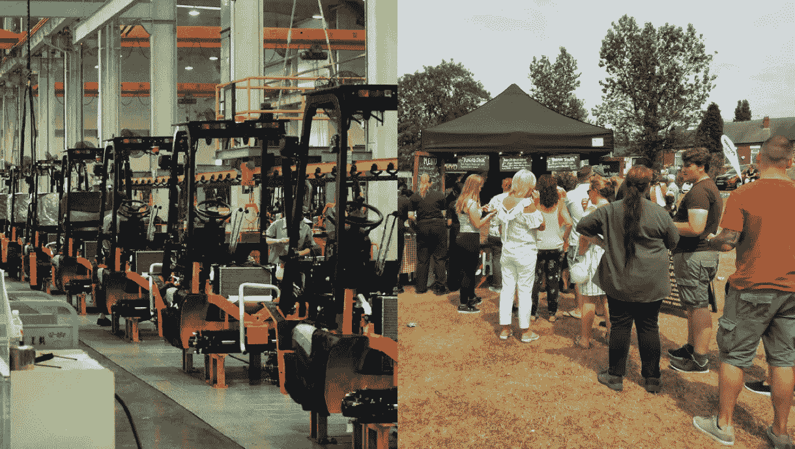

注意到两者的共同点了吗？两个都是队列！图片来源:[https://www.flickr.com/photos/psit/5605605412](https://www.flickr.com/photos/psit/5605605412)和[https://www.geograph.org.uk/photo/5831116](https://www.geograph.org.uk/photo/5831116)

服务化是制造企业从销售纯产品转向提供解决方案(服务)的一种现象。 [Neely (2013)](http://andyneely.blogspot.com/2013/11/what-is-servitization.html) 简要介绍了各行各业的公司如何采用这种商业模式。

有趣的是，服务化也导致制造企业和服务企业之间的界限变得不那么清晰。事实上，我们可以看到，制造业和服务业的某些方面可以抽象成类似的数学概念。比如，把一条流水线比作一群排队买食物的人。请注意，两者基本上都是队列，并且通常具有相似的特征(吞吐量或卖家服务客户的速度、队列长度或有多少人在等待，等等)。

我最近了解到数学中有一个分支专门研究这个问题，叫做[排队论](https://en.wikipedia.org/wiki/Queueing_theory)。根据理论，任何队列都可以用这 6 个参数建模: [**A | B | c | D | E | F**](http://www.mathcs.emory.edu/~cheung/Courses/558/Syllabus/00/queueing/queueing.html) 。a 是到达过程，B 是服务者过程，c 是服务者数量，D 是队列容量，E 是群体大小，F 是排队规则。在这篇博文中，我们将关注最简单的队列类型 **M|M|1|∞|∞|FIFO** 或者通常缩写为 **M|M|1** 。

# **M|M|1** 型号

想象一个无限容量的队列( **∞** )，也就是说，等待的长度没有限制。假设人口规模也是无限的(∞)，即潜在客户的数量是无限的。顾客是在先进先出( **FIFO** )的基础上得到服务的。让我们假设我们正在运行一条只有一个服务器的生产线( **1** )，例如，想象一辆有一条队列的基本食品卡车。然后，我们可以用速率为λ ( **M** )的泊松过程对客户到达率进行建模。我们还假设我们的服务时间是指数分布的，因此也可以用速率为μ ( **M** )的泊松过程建模。

我们把这个过程表示为马尔可夫链。状态(节点)表示队列中有多少物品，而转移率表示接收/服务客户的概率。例如，S2 表示在该州的队列中有 2 个项目。因为只有一台服务器，所以只能一个接一个地顺序处理项目。λ的到达率意味着平均在 1 个时间单位内，将有λ个项目到达队列。μ的服务率意味着平均来说，在 1 个时间单位内，μ个项目将被服务并因此从队列中移除。

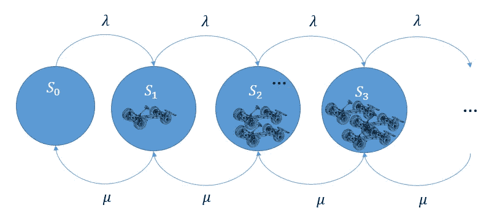

M/M/1 排队马尔可夫链

假设到达和服务同步发生，即我们在 h 的同一时间窗内从一个状态移动到另一个状态，马尔可夫转移概率可以这样写。

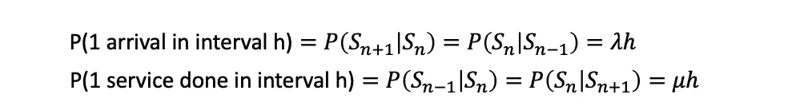

我们的目标是只根据λ和μ(不考虑初始状态是什么)，计算长期处于任何状态 Sn 的概率。

要做到这一点，我们必须首先对 n = 0 的 P(Sn)进行边缘化。我们可以用两种方式边缘化 P(Sn ),要么是相对于先前的状态，要么是相对于随后的状态。请注意，S0 有 1 个前一状态(s 1)和 1 个后一状态(S1)。只有从长远来看，这才是正确的。

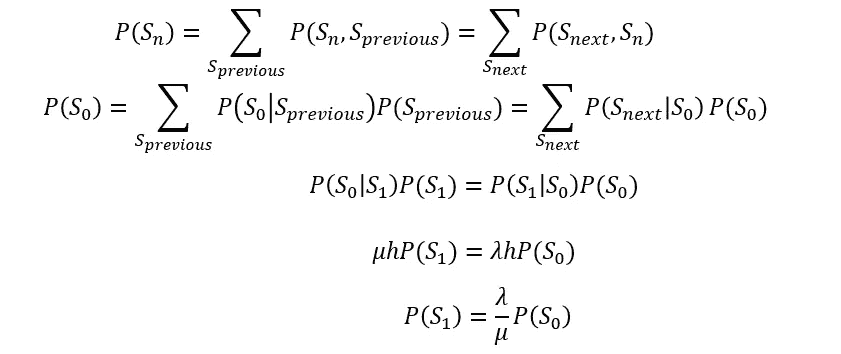

经过替换和重新排列，我们得到了 P(S1)和 P(S0)之间的关系。对于其他 n > 0，我们现在对 P(Sn)执行相同的边缘化。在这种情况下，Sn 具有 2 个先前状态(Sn-1，Sn+1)和 2 个后续状态(Sn-1，Sn+1)。

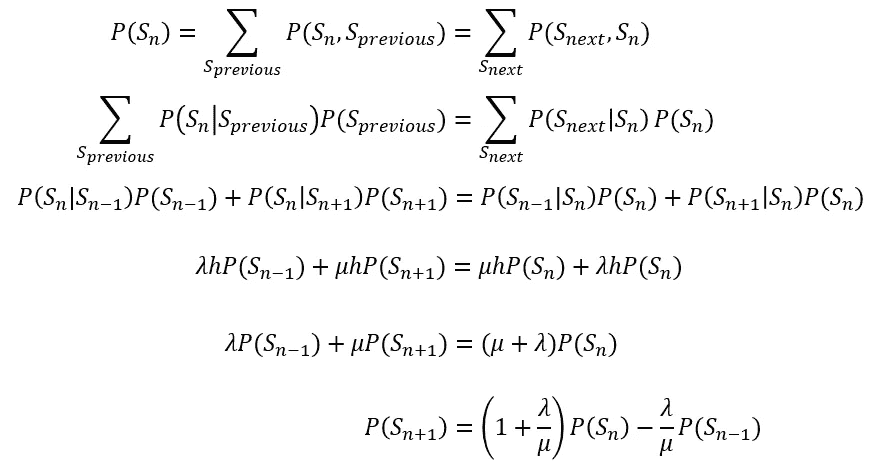

我们现在有了一个关于 P(Sn+1)，P(Sn)和 P(Sn-1)的等式。我们可以计算出 n=2 时的这个值。用我们以前得到的结果代替 P(S1)得到下面的等式。

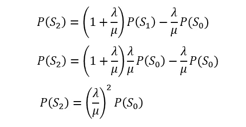

现在我们可以对更高的 n 值做同样的替换和重排，得到如下迭代方程(需要更严格的证明；我们将在本帖中跳过这一点)。

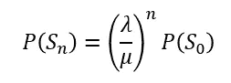

我们快到了！唯一的问题是我们还有一个未知项 P(S0)。好消息是，我们也可以基于λ和μ来表征 P(S0)。为此，我们将利用概率的和性质，即所有状态的概率之和等于 1。因为我们有无限多的可能状态，求和项趋于无穷大。

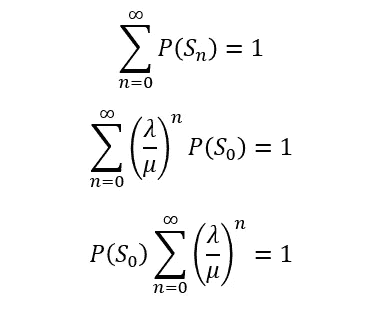

该等式表明，只有当到达率小于服务率时，和的收敛才成立。直观地说，这意味着只有当我们能够以比客户到达速度更快的速度服务客户时，我们才会有一个正常工作的队列。否则，队列将无限增长。

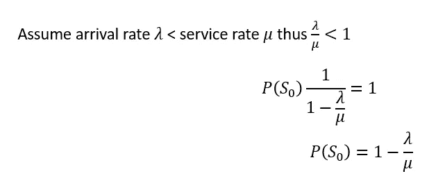

我们现在可以根据λ和μ来刻画 P(S0)的特征。将该值代入 P(Sn)的迭代方程，得到以下结果。

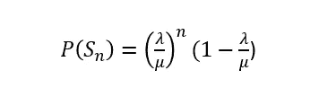

我们已经实现了最初的目标，即仅根据到达率和服务率来衡量处于任何状态的概率。

# 那又怎样？

有了这个模型，我们可以回到我们最初的问题，并试图回答它们。举个例子，

> 假设我们每周三开一辆快餐车。在过去的几个月里，我们已经大致了解了顾客来的频率以及我们能以多快的速度为他们服务。使用我们新学到的排队论知识，我们现在可以估计我们的队列平均有多长。然后，我们可以将这个数字与我们操作的场地大小进行比较，看看是否有足够的空间让人们排队。我们还可以决定我们应该在加快服务时间以减少排队长度方面进行多少投资。

这个用例在数学上等同于计算队列 n 中的预期项目数。

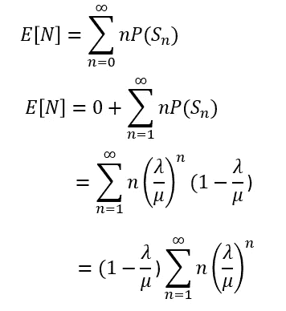

不幸的是，等式中有一个无穷和项。为了找出这相当于什么(再次假设λ < μ), we’ll make use of the derivation of a geometric series sum.

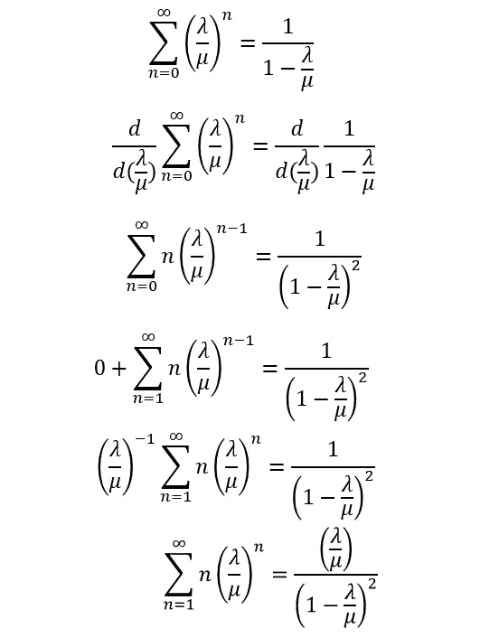

We can now substitute this to the original equation, resulting in an expected value that is characterised based on λ and μ alone.

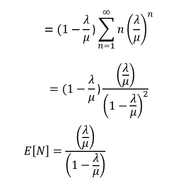

Let’s return to our food truck example. Suppose 4 customers arrive per hour to our food truck and we have enough capacity to serve 6 of them per hour. Using the above equation, we can calculate the expected number of people in our queue across time.

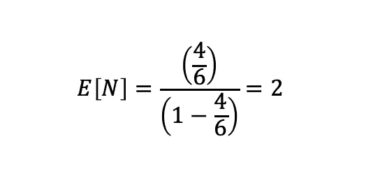

On average, we expect 2 people to queue in our waiting line. We can calculate also calculate [更多的 KPI](https://uk.mathworks.com/help/simevents/examples/m-m-1-queuing-system.html)如服务器利用率、平均等待时间、平均排队时间都基于λ和μ)。

# **结论**

我们已经看到了排队论是如何帮助我们描述排队等候的特点的。制造业和服务业都可以使用这种数学抽象。在实践中，我们可能希望用更现实的参数来建模我们的队列，例如，我们可以有多个服务器，而不是一个服务器；或者我们可以假设容量有限而不是无限。然后，该模型可以提供关于如何改进排队系统的管理见解。

主要的限制是对到达和服务过程有很强的假设。在这种情况下，我们假设泊松过程，但更好的方法是更加数据驱动，看看哪个分布更适合。请记住，使用参数分布(无论是泊松分布还是其他分布)需要完全理解每个模型假设的潜在前提。