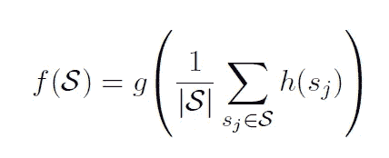
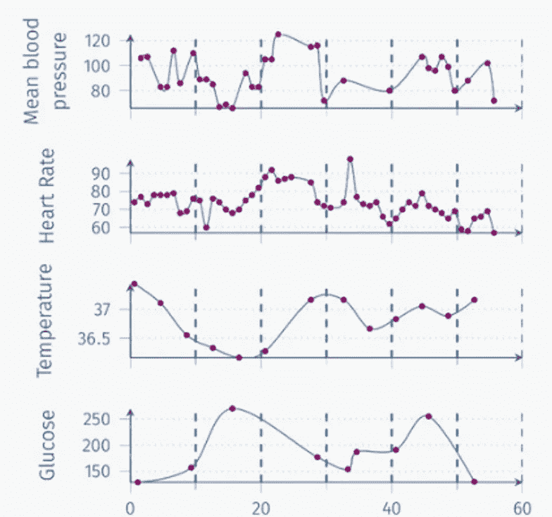
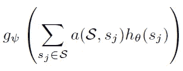
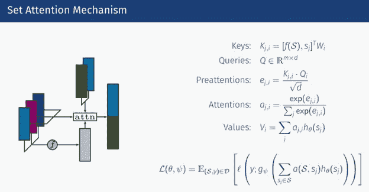
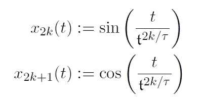
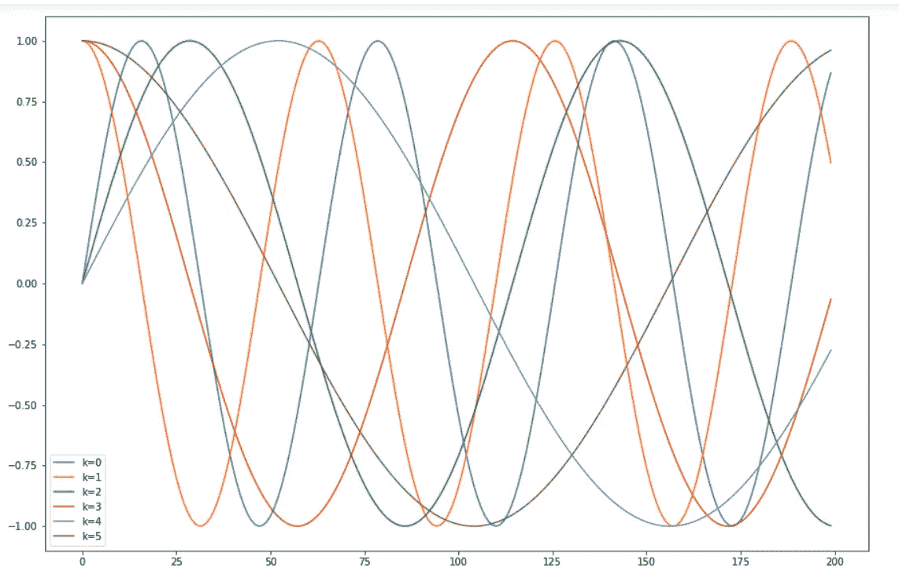

# 用于时间序列分类的集合注意模型

> 原文：<https://towardsdatascience.com/set-attention-models-for-time-series-classification-c09360a60349?source=collection_archive---------27----------------------->

## [ICML2020](https://towardsdatascience.com/tagged/icml-2020)

## 真实世界时间序列数据的深度学习算法

由 [Fabrizio Verrecchia](https://unsplash.com/@fabrizioverrecchia?utm_source=medium&utm_medium=referral) 在 [Unsplash](https://unsplash.com?utm_source=medium&utm_medium=referral) 上拍摄

作为一名主要处理业务数据(有时也称为“表格数据”)的数据科学家，我总是在寻找数据科学领域的最新发展，以帮助处理更现实的数据。其中一个领域解决了这样一个事实，即业务数据很少是“表格”形式的，而通常本质上是关系型的。我已经在另一篇博文的[中讨论了使用关系数据。深度集算法帮助您从不具有矩形形状的数据中学习，但可以表示为表的集合或图形。因此，在今年 7 月参加](/graph-neural-network-and-permutation-invariance-979754a08178) [ICML 2020](https://icml.cc/Conferences/2020) 大会时，我特别关注了那些使用深度集合学习的论文。

其中一篇论文是 Max Horn 等人的《时间序列的集合函数》[1]:

 [## 为时间序列设置函数

### 尽管深度神经网络取得了显著的成功，但许多架构通常很难移植到…

arxiv.org](https://arxiv.org/abs/1909.12064) 

在我看来，这是会议的最佳文件。如题，这篇论文是关于学习时间序列的集合函数。在继续之前，让我提醒你什么是 set 函数。

# 设置功能

**集合函数**是对一组数据的函数，可以包含零到无穷大的元素。集合函数的例子有 count()、min()、max()、sum()、mean()、std()等。在 SQL 中，我们称之为聚合函数。集合中的元素也可以是复杂的，例如，表示一行数据。集合函数不同于机器学习中常见的表格函数。相比之下，表格函数将一行固定数量的变量作为参数。处理潜在大型集合的方法是使用两个辅助函数和一个聚合函数来表示集合函数[2，3]:

来源:[https://arxiv.org/abs/1909.12064](https://arxiv.org/abs/1909.12064)

函数 h()应用于集合中的单个元素(假设是一行数据)，并将集合中的元素映射到一个高维向量空间。聚合函数将一个集合中的所有这样的向量组合成一个向量，从而处理不定数量的元素。然后，一个新的函数 g()将向量映射到最终结果。这里的聚合函数是 mean()，但也可以使用其他聚合函数，例如 sum()。函数 f()和 g()可以被训练为神经网络，并且整个模型在所有可用的集合上被训练。

# 不规则和错位的时间序列

经典的时间序列分析总是假设测量是以固定的时间间隔进行的，如果进行了几次测量，它们是对齐的。使用插补技术来填补偶然缺失的测量值。

实际上，时间序列经常是不对齐的，测量是以不规则的间隔进行的。电子病历(EMR)和其他类型的医疗数据就是一个很好的例子。看看这张报纸海报上的图表:

来源:[https://slides live . com/38928275/set-functions-for-time-series](https://slideslive.com/38928275/set-functions-for-time-series)

这四次测量以不同的频率和不规则的时间进行。是的，您仍然可以使用插补，但是因为这里您需要插补大量数据，所以预测的方差会非常高。

# 主要思想

文献[1]的主要思想是把时间序列看作一个集合。如果你这样做，你可以使用集合函数学习算法，而不必估算任何数据。整个时间序列是一组元组(t，z，m)，其中 t 是时间，z 是测量值，m 是模态。在我们的例子中，m 取血压、心率、体温和葡萄糖的值。请注意，时间仍然是一个变量，但是模型失去了下一个度量对上一个度量的显式依赖性。

这种范式的转变类似于由论文[引发的变形金刚革命](https://arxiv.org/abs/1706.03762)【4】。此外，作为递归神经网络的显式序列建模被表示为集合的序列和使用注意机制的学习所取代。

# 立正

如果你再看一下文章开头的等式，你会发现集合中的所有元素对结果的贡献是相等的。实际上，情况可能并非如此。例如，与超过 6 小时的平均血压相比，血压的突然变化是败血症发作的更好指标。正如我已经提到的，聚合函数不一定是 sum()或 mean()，事实上可以是任何接受一组向量并返回单个向量的函数。您可以尝试手工制作聚合函数，但是如果神经网络可以学习该函数，岂不是很酷？

同样，受[4]的启发，作者引入了集合注意力作为权重，决定集合中每个元素对整体结果的贡献。

来源:https://arxiv.org/abs/1909.12064

因此，您有一个加权集合函数，而不是普通的集合函数:

来源:https://arxiv.org/abs/1909.12064

权重α(S，s_j)取决于整个集合以及特定的集合元素。这张幻灯片示意性地展示了完整的模型:

来源:[https://slides live . com/38928275/set-functions-for-time-series](https://slideslive.com/38928275/set-functions-for-time-series)

索引 I 表示几个注意头。索引 j 表示集合中的一个元素。密钥矩阵表示为:

来源:[https://arxiv.org/abs/1909.12064](https://arxiv.org/abs/1909.12064)

这里 f '(S)是第二个**集合函数，它使用 mean 作为聚合函数。这意味着多了两个学习 f '()的神经网络。所得向量与 s_j 连接，并乘以权重矩阵 W。注意，W 的维数不取决于集合中元素的数量，而是由神经网络架构定义。**

来源:[https://arxiv.org/abs/1909.12064](https://arxiv.org/abs/1909.12064)

这里 d 是潜在层的尺寸。查询矩阵还定义了维度:

来源:[https://arxiv.org/abs/1909.12064](https://arxiv.org/abs/1909.12064)

和[4]一样，权重使用 softmax 定义:

资料来源:https://arxiv.org/abs/1909.12064

完整的神经网络架构图如下:

来源:[https://arxiv.org/abs/1909.12064](https://arxiv.org/abs/1909.12064)

# 时间的位置编码

受[4]启发的另一件事是时间的位置编码。

我们这些处理表格数据的人习惯于从日期/时间变量中提取特征。通常我们提取日期/时间成分，比如一天中的小时，一周中的天，等等。然后应用 sin()和 cos()等周期性函数来确保平滑度。当[4]的作者在研究 Transformer 体系结构时，他们决定使用这种技术对单词位置进行编码。这一思想被带到[1]没有太大的变化。时间编码如下:

来源:https://arxiv.org/abs/1909.12064

这里粗体的 **t** 是最大时标(实际上是一个超参数), k 是整数

来源:https://arxiv.org/abs/1909.12064

您可以使用一个简单的 python 脚本轻松实现这一点。

使用上面的脚本生成的位置编码函数图。

如你所见，时间有几个周期函数，有几个频率值。我相信位置编码是[4]和[1]成功的主要因素之一。然而，当处理实时而不是单词的位置时，编码对时间缩放非常敏感，因为与 NLP 中的位置相反，时间是连续变量。它还添加了额外的超参数来调整模型。虽然它对 NLP 很有效，但没有讨论其他类型的编码对时间序列是否更有效。这让我想起了手动卷积滤波器，尤其是计算机视觉系统。有没有可能增强这种神经网络架构，让它自动学习时间编码，而不是手动设置？也许一维卷积可以解决这个问题。

# 结论

Set functions 提供了一个关于时间序列数据的新视图，允许将它们视为独立的观测值，这简化了不规则和非对齐测量情况下的数据预处理。注意力机制允许模型学习对结果至关重要的观察结果(从而提高模型的可解释性)。实验研究表明，该算法是有竞争力的最先进的，而更快，更容易解释。所有代码都可以在作者 [github repo](https://github.com/BorgwardtLab/Set_Functions_for_Time_Series) 中找到。

# 参考

[1]马克斯·霍恩等人 al，为时间序列设置函数， [arXiv:1909.12064](https://arxiv.org/abs/1909.12064)

[2]曼齐尔·扎希尔等人。艾尔，深套， [arXiv:1703.06114](https://arxiv.org/abs/1703.06114)

[3]彼得·巴塔格利亚等人。al，关系归纳偏差、深度学习和图网络， [arXiv:1806.01261](https://arxiv.org/abs/1806.01261)

[4]阿希什·瓦斯瓦尼等人。艾尔，你所需要的只是关注， [arXiv:1706.03762](https://arxiv.org/abs/1706.03762)