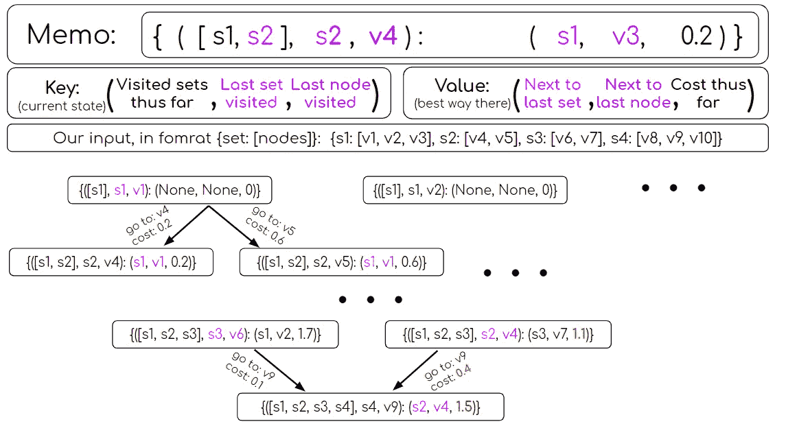
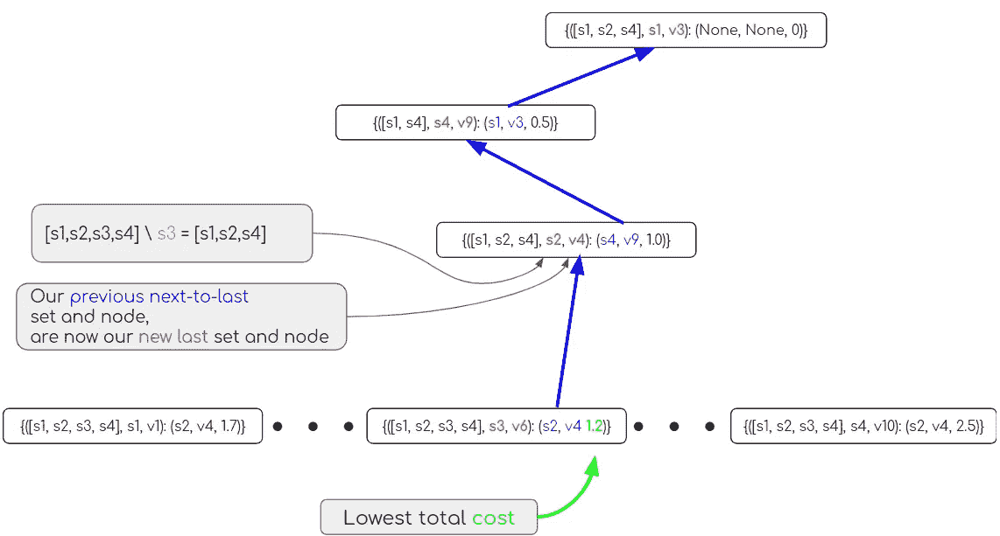
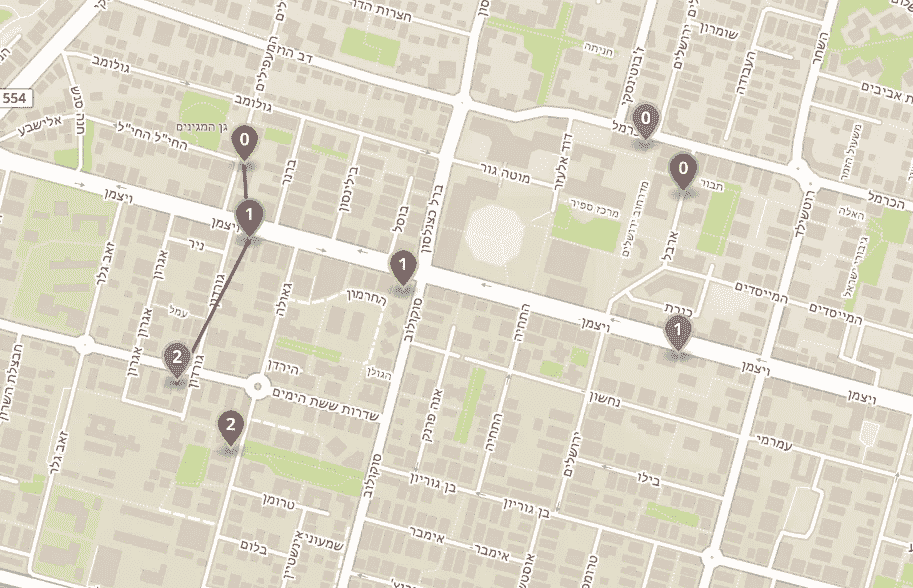

# Set-TSP 的动态规划方法

> 原文：<https://towardsdatascience.com/set-tsp-because-there-is-more-than-one-place-to-get-bread-712fdb5b381?source=collection_archive---------32----------------------->

## 因为有不止一个地方可以买到面包

[旅行推销员问题](https://en.wikipedia.org/wiki/Travelling_salesman_problem) (TSP)提出了一个简单的难题:你想要访问一组地方，例如，你在镇上的差事，并且想要以最有效的方式这样做。这个问题已经用无数不同的方法解决了，既有[最优](/solving-tsp-using-dynamic-programming-2c77da86610d)也有[启发式](https://medium.com/hackernoon/yats-yet-another-tsp-solution-6a71aeabe1f8)。

你会问，我们今天在这里做什么？嗯，生活的事实是，有不止一个地方可以买到面包，或者意大利面，或者你的差事单上的任何东西。在生活中，很多时候我们想要完成一组任务，而不太关心每项任务是如何完成的。

想象一个星期五的早晨，我想(a)从我所在地区的三家面包店之一买面包，(b)从我所在地区的三家商店之一买蔬菜，(c)在镇中心的两家酒吧之一喝杯啤酒。

既然有人问我，我就分享一下:想知道我是如何制作这些插图的吗？我从 [s2map](http://s2map.com/) 中拍摄了一张快照，并在稍后使用 Google Slides 添加了这些图像。是的，那是我懒惰的秘密；)

那么，完成这三项任务的最快方法是什么呢？
这正是 [Set-TSP](https://en.wikipedia.org/wiki/Set_TSP_problem) (Set -旅行推销员问题)的动机——完成所有任务，每个任务只完成一次，这样每个任务就有几个选项可以完成。

在这篇文章中，我们将使用[动态规划](https://en.wikipedia.org/wiki/Dynamic_programming) (DP)构建一个解决方案，这将为我们提供一个最优的解决方案，并且在未来我们还将找到一个启发式的解决方案，它可以用于更大的输入，而不会在最优性上损失太多(或者是这样吗？？？敬请期待一探究竟！).

> **关于这篇文章后面的完整代码，你可以去** [**这里**](https://github.com/DalyaG/CodeSnippetsForPosterity/tree/master/SetTSP) **。**

# 奠定基础

为了解决我们的问题，我们需要决定一种表示输入数据的方式，并从中导出用于计算所需最短路径的距离度量。

在处理地理数据时，正如我们在这里所做的，习惯上使用经纬度坐标来标识位置。令我们沮丧的是，这些是[非欧几里得坐标](https://en.wikipedia.org/wiki/Non-Euclidean_geometry)，因此计算简单的[欧几里得距离](https://en.wikipedia.org/wiki/Euclidean_distance)大多是错误的。

> 声明:在[之前的一篇帖子](https://medium.com/hackernoon/yats-yet-another-tsp-solution-6a71aeabe1f8)中，我确实使用了欧几里德距离来表示非欧几里德坐标，但是……这是一篇介绍性的帖子，我不想跑题；)

所以——让我们来谈谈房间里的大象吧！我们如何计算距离？

很高兴，这个世界已经为我们搭好了舞台——我们可以使用[哈弗辛公式](https://en.wikipedia.org/wiki/Haversine_formula)，并从[这个](https://stackoverflow.com/a/21623206/2934048)得到一些帮助:

现在我们可以正确计算距离，我们可以建立我们的解决方案。

# 构建 DP 树

构建动态规划(DP)算法需要了解我们希望如何遍历解空间，以及我们希望如何跟踪我们的当前状态。

就我个人而言，我发现直接进入集合-TSP 问题相当令人困惑，因此决定先解决一个更简单的问题——“只是”TSP，没有“集合”。

我现在将描述使用 DP 的 Set-TSP 解决方案的整个管道，但是如果你发现自己有些困惑，就像我一样，我建议首先阅读[这个](/solving-tsp-using-dynamic-programming-2c77da86610d)。

类似于许多经典的 DP 算法，我们将使用一个字典存储器，其关键字是*状态*，值是到达该状态的最佳方式的“方向”。更准确地说，该值是一个到键的最短路径中的*直接前任*。让我们举例说明一下，以便更好地理解这个过程:

这里，关键字([s1，s2，s3，s4]，s4，v9)表示已经访问了所有集合的状态，使得 s4 是最后访问的集合，而 v9 是该集合中访问的点。该键的值是(s2，v4，1.5)，因为以步骤 v4->v9 结束的路径最短。

代码可能看起来很混乱，而且充满了变量，但是一旦你理解了 DP 的一般方法，并且理解了你想要使用的备忘录的逻辑，它就“只是”另一个 DP 实现。

# 回溯最短路径

一旦我们到达了树的末端，意味着我们在备忘录中保存的路径是完整的，那么“剩下的一切”就是折回我们的步骤以找到最佳路径。

幸运的是，我们记住了每个部分路径中的最后一个和倒数第二个集合和点！

我们的红色最优路径:[(s1，v3)，(s4，v9)，(s2，v4)，(s3，v6)]

因此，第一步将是查看最终图层，包括所有完整的路径，并选择总成本最低的最后一个集合和点。

从那里，我们可以使用倒数第二个集合和点来追溯我们的步骤。

# 宝贝，不画出来就不会结束

在我为这篇文章准备的 [jupyter 笔记本](https://github.com/DalyaG/CodeSnippetsForPosterity/tree/master/SetTSP)中，你可以找到一个有用的绘图功能，让你在 [geojson.io](http://geojson.io/) 上绘制你的解决方案:

在同一个笔记本里，你还可以找到一个输入量大得多的例子。由于集合 TSP 的复杂度在集合数量上是*指数*，在每个集合中的点的数量上是*多项式*，所以我们可以得到相当大的输入的最优解:

# 收场白

当我第一次了解 Set-TSP 时，关于这个问题的结构的一些东西向我尖叫，它应该有一个使用动态编程(DP)的优雅的解决方案。的确，这篇文章中的算法让我相信我的直觉是正确的。

老实说，这个算法对我来说并不容易。因此，我的过程的一部分是首先解决一个类似的，但更简单的问题。我决定先找到 TSP 的 [DP 解，然后才把解扩展到 Set-TSP。这对我来说是一个巨大的成功，因为我没有一次绞尽脑汁，而是获得了两次轻松的胜利！而且，两次解决*几乎*同一个问题的经历，帮助我更好地“铭记”了 DP 技能，给了我“我得到了这个”的定心丸。](/solving-tsp-using-dynamic-programming-2c77da86610d)

所以下次你手头有一个棘手的任务时，试着先解决一个简单的。你很可能会更快地找到解决方案，而且你也会从第二次更好的成功中获得信心💪🏿

希望你喜欢我的旅程，并在下一篇文章中看到，我们将找到一个启发式的解决方案来设置 TSP，并比较结果🤓

> **这篇文章后面的完整代码你可以去** [**这里**](https://github.com/DalyaG/CodeSnippetsForPosterity/tree/master/SetTSP) **。**

