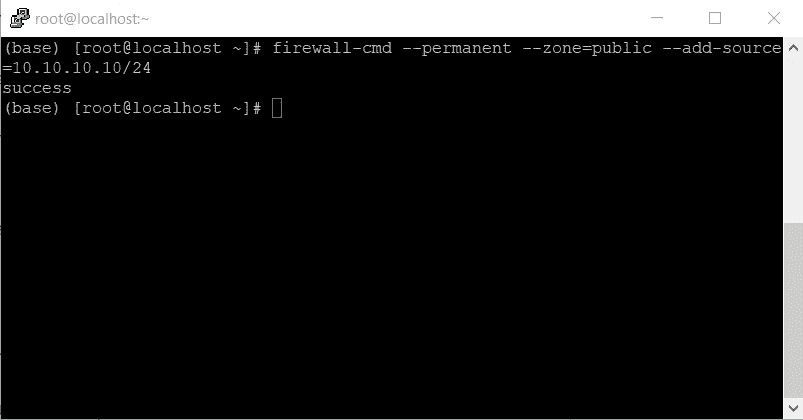
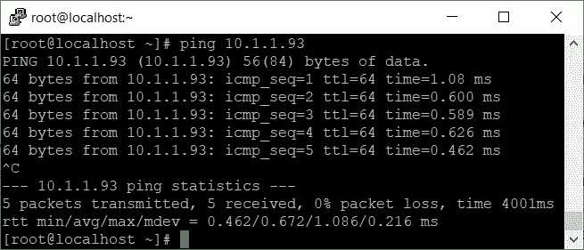
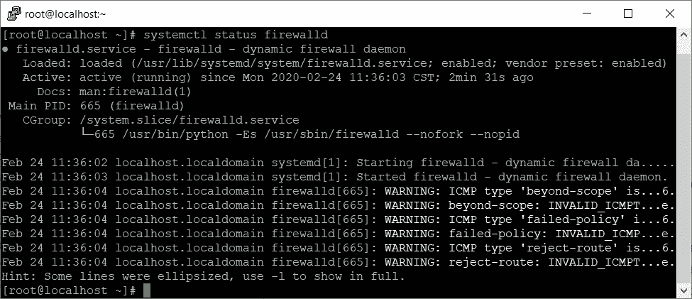
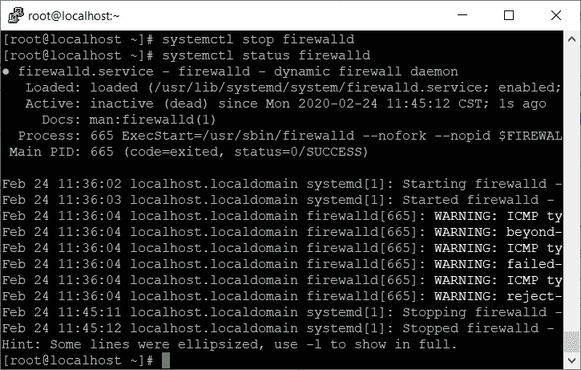
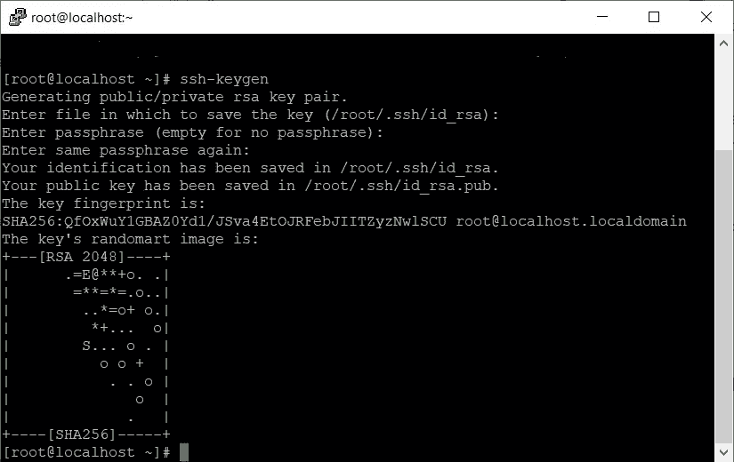
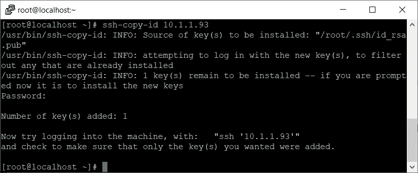
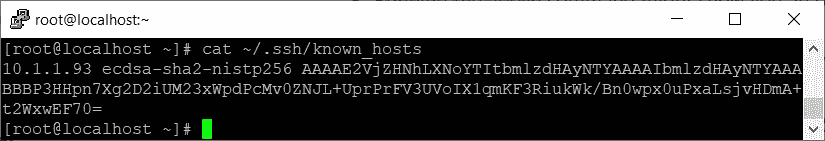
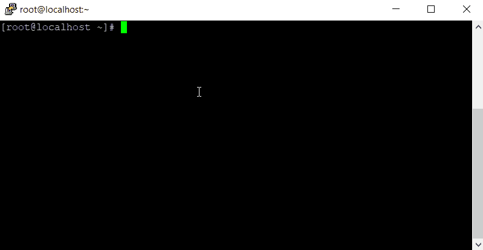
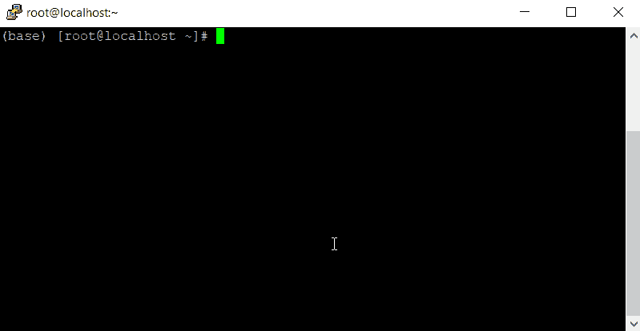

# 为分布式机器学习建立一个 Dask 集群

> 原文：<https://towardsdatascience.com/set-up-a-dask-cluster-for-distributed-machine-learning-31f587b1b553?source=collection_archive---------12----------------------->

## [使用 Python 和 Dask 的分布式机器学习](http://towardsdatascience.com/tagged/daskdistributedml)

## 通过使用 SSH 连接机器来创建 Dask 环境

由 [Pablo Salvador Lopez](https://medium.com/u/360640c0a123?source=post_page-----31f587b1b553--------------------------------) 和 [Aadarsh Vadakattu](https://medium.com/u/bb4e30a633db?source=post_page-----31f587b1b553--------------------------------) 合作撰写


如果你知道 Dask 有什么能力，以及它如何*分发*你的机器学习过程，那你就来对地方了！本文将解释如何创建一个简单的 SSH 集群，您可以使用它作为实现 Dask 环境的基础，该环境可以分发您的机器学习工作流。

## 顺便问一下，我们可以用多少种方法来加速 Dask 集群？

Dask 集群可以通过多种方式加速:

1.  使用 SSH 连接
2.  在 Hadoop 集群上，本质上是借助 HDFS 和 YARN 的力量运行
3.  在 Kubernetes 和一堆 Docker 容器的帮助下
4.  在超级计算机上
5.  在像 AWS 或 Azure 这样的云环境中

在本文中，我们将展示如何通过使用 **SSH 连接**构建一个工作的 Dask 测试环境。

## 这是最好的方法吗？

使用 SSH 连接建立 Dask 集群似乎是最容易的，但是它也是最不稳定、最不安全和最乏味的。这种方法仅用于测试目的，不用于生产中的某个地方。基于您的生产环境，您可以尝试使用 Hadoop、Kubernetes 或云解决方案来实现 Dask，因为它们更有组织性和稳定性。

## 应该建什么？

Dask 运行在调度器-工作器网络上，调度器分配任务，节点相互通信以完成分配的任务。因此，网络中的每台机器都必须能够相互连接和联系。Dask 有时也会尝试从一个源节点连接到同一个源节点，所以我们应该确保所有机器上的每个连接网关都可用，包括到自身的连接。

在您找到一堆可以用来实现分布式集群的机器之后，

*   必须设置防火墙规则，使连接成为可能
*   必须使用 SSH 设置无密码登录
*   必须在所有机器上建立一个唯一的安装目录，该目录将包含我们的训练/测试数据，并提供给 Dask
*   Python 必须安装在所有要安装相同版本库的机器上。

下面的测试设置是在一堆运行 Red Hat Enterprise Linux 7 (RHEL 7)的机器上实现的。您可以在任何地方开发或部署这种架构，方法是在本地或云中启动一组虚拟机，或者在可通过网络访问的真实机器上启动。

## 设置防火墙

*   确保关闭防火墙或允许通过防火墙访问所有其他机器。
*   如果您想使您的测试设置安全，允许从每台机器到每台机器的访问，包括它自己。假设您正在从任何其他机器上访问 IP `10.10.10.10`,执行如下命令。在这里，24 决定了通用的 TCP 端口，8786 是 Dask 通常需要进行通信的端口。通过使用相同的命令并更改端口号，您可以根据需要打开任何其他端口。

```
firewall-cmd --permanent --zone=public --add-source=10.10.10.10/24
firewall-cmd --permanent --zone=public --add-source=10.10.10.10/8787
```



如果您的防火墙连接规则被添加，您将看到如下消息。

您可以使用`ping`命令确认您的连接没有被阻塞。如果您没有通过 ping 收到传输的数据包，则说明您的网络有问题。



您的 ping 应该返回传输的数据包，如上所示。如果没有，您将看到收到 0，这确定您的网络可能有问题。

如果安全性对您的测试设置不重要，您可以禁用防火墙以减少一些麻烦。为此，请在所有计算机上运行此命令。这将关闭您运行的计算机上的防火墙。

```
systemctl stop firewalld
```

您可以通过运行以下命令来检查防火墙状态:

```
systemctl status firewalld
```



如果您有活动的防火墙，您可以看到状态为活动。



如果您停止了防火墙，防火墙的状态将变为非活动。

## 设置无密码 SSH

当您的所有机器都可以被其他机器发现后，您需要让它们使用 SSH 连接，以便它们可以通信和传输数据。

通常，登录到一台机器需要一个系统的 IP 和一个认证密码。这种类型的登录可以手动完成，但是如果目标机器请求密码，Dask 不知道如何以及在哪里输入密码。为了克服这个问题，我们可以将计划的集群中所有其他可能的目的地机器作为 SSH 已知主机，使登录安全且无需密码。

如果您以前没有创建过 SSH 密钥，运行如下所示的`ssh-keygen`命令。如果需要，您可以输入密码，也可以留空。



这将创建一个 SSH 密钥，您可以使用它跨设备进行身份验证，从而使您的登录更加安全且无需密码。

现在运行下面的命令来复制目标机器的 SSH ID。假设是`10.1.1.93`，

```
ssh-copy-id 10.1.1.93
```

运行上面的命令可能会显示类似如下的输出:



添加密钥后，您无需输入密码即可从当前机器登录到该机器。

您还可以通过检查`~/.ssh/known_hosts`文件来确认集群中所有可能的目的地是否都被设置为主机。



在您复制了所有机器的 id 之后，您应该在这个文件中看到所有机器的 id 以及它们的 IP。

确保对计划包含在集群中的每台计算机运行此步骤(包括您可能正在使用的当前计算机的 IP)。如前所述，Dask 有时会尝试连接到自己，但会失败，因为没有 SSH 授权。)

在所有机器上运行这些程序后，您应该能够不使用密码无缝地从一台机器登录到另一台机器。下面的例子显示了两台机器，其中`10.1.1.107`没有复制 SSH ID，而`10.1.1.93`在当前工作的机器上复制了它的 ID。



SSH 请求密码，因为它没有找到 id 令牌。您必须在此输入密码才能登录机器。



复制 ID 后的 SSH。在这里，您无需密码即可登录，因为登录是通过您之前复制的 ID 进行身份验证的。

## 跨集群设置挂载目录

现在，您可以设置一个地方，让 Dask 可以访问您的数据。您可以在一个名为 **SSHFS** 的应用程序的帮助下完成这项工作，该应用程序会在您在任何机器上指定的目录下创建挂载点。当您在目标计算机上指定装载源时，这会将数据从源传输到目标，并从目标传输到源，以保持该特定目录中的所有文件和文件夹在计算机之间同步。这种方法的好处是—它从两个位置拷贝和同步数据，而不仅仅是在创建装载点源的位置。

如果您将要处理的数据放在机器上不同的目录路径中，Dask 有时会感到困惑。因此，请确保选择一个跨机器通用的特定目录。简单的例子可以是`/tmp/daskdata/`。

要将该目录指定为挂载点，

*   在所有机器上创建公共目录
*   使用以下命令在所有机器上安装 SSHFS(如果您在 RHEL 上)

```
wget [https://download-ib01.fedoraproject.org/pub/epel/7/x86_64/Packages/e/epel-release-7-12.noarch.rpm](https://download-ib01.fedoraproject.org/pub/epel/7/x86_64/Packages/e/epel-release-7-12.noarch.rpm)yum install fuse-sshfs
```

*   登录到所有机器，并在该目录下创建一个挂载点，将其指向源机器的目录。假设您的源机器是`10.10.10.10`，输入如下命令:

```
sshfs 10.10.10.10:/tmp/daskdata /tmp/daskdata
```

上面的命令假设您已经登录到一台机器，并且您正在将这台机器上的`/tmp/daskdata/`指向`10.10.10.10`上的`/tmp/daskdata/`，这可能是源。

正确实现挂载点后，通过在任何机器的挂载目录中创建一个文件来确保它正在运行。您可以使用`touch dummy`轻松创建一个测试文件，它会创建一个名为“dummy”的空文件。在任何一个位置创建这个文件都必须将文件复制到所有位置，这意味着它应该可以在所有机器的`/tmp/daskdata/`目录中找到。

## 在集群中匹配 Python 库的版本

最后，您必须确保您需要的所有 Python 库都在所有集群上以相同的版本运行。为此，

*   尝试使用调度器在本地运行和调试一个简单的 Dask 分布式程序。如果这行得通，您就可以确定 Dask 需要运行的特定库版本集。通常，这一步会失败，因为 Dask 需要安装其他版本的库。根据这个程序抛出的错误获取必要的库，并尝试安装它们。

```
from dask.distributed import Client
import dask# Import a sample dataset
df = dask.datasets.timeseries()# Connect to distributed cluster. To run locally, pass no arguments # in the Client function.
client = Client()# This now runs on the distributed system
df.groupby('name').x.mean().compute()
```

*   这里有一个[链接](https://docs.dask.org/en/latest/install.html#optional-dependencies)指向 Dask 可能需要的依赖项，以及支持的最低版本。检查这个，确保你已经满足所有要求。
*   有了库的版本后，您可以使用`pip freeze`命令收集所有已安装的版本，并安装所有这些需求，如下所示:

```
pip freeze > requirements.txt #on a machine where all libraries are #installedpip install -r requirements.txt #on another machine where all #libraries should be installed
```

*   同样为了减少麻烦，您可以创建一个 pip 或 conda 环境，并使用`venv-pack`或`conda-pack`将库导出到其他机器。这将在目标机器上复制您创建的环境。这里有很好的视频解释如何做到这一点:
*   [https://conda.github.io/conda-pack/](https://conda.github.io/conda-pack)
*   [https://jcrist.github.io/venv-pack/](https://jcrist.github.io/venv-pack)

现在，您可以将数据放入挂载的文件夹中，并编写 Dask 应用程序了！

## 为 Dask 构建 SSH 集群的利弊是什么？

**优点:**

*   这是一个完全从零开始构建的集群，可以在不安装 HDFS 的情况下运行，这可能很繁琐。如果您有一个包含许多机器的小型集群，可以使用这种方式快速测试 Dask。

**缺点:**

*   挂载点需要精确地位于所有机器上的相同位置。HDFS 在这里大获全胜，因为如果以这种方式实现，Dask 只需要知道文件在 HDFS 的什么地方。
*   大量文件会破坏每台机器上的磁盘，并且会破坏网络上的 SSHFS 连接。
*   SSHFS 挂载可能很难跟踪，并且 SSHFS 应用程序在跟踪正在运行的挂载点方面做得不好。

请继续关注有效运行 Dask 的其他方式，包括通过 HDFS 和 YARN 设置的**，使用 Kubernetes 设置的**和在 Azure Cloud 设置的**。**

**非常感谢你的阅读！既然您已经设置了集群，那么您可以创建并运行 Dask 程序，并在 Dask 仪表板中查看所有运行统计数据！**