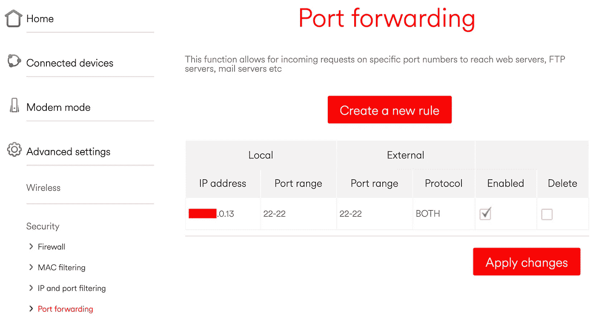
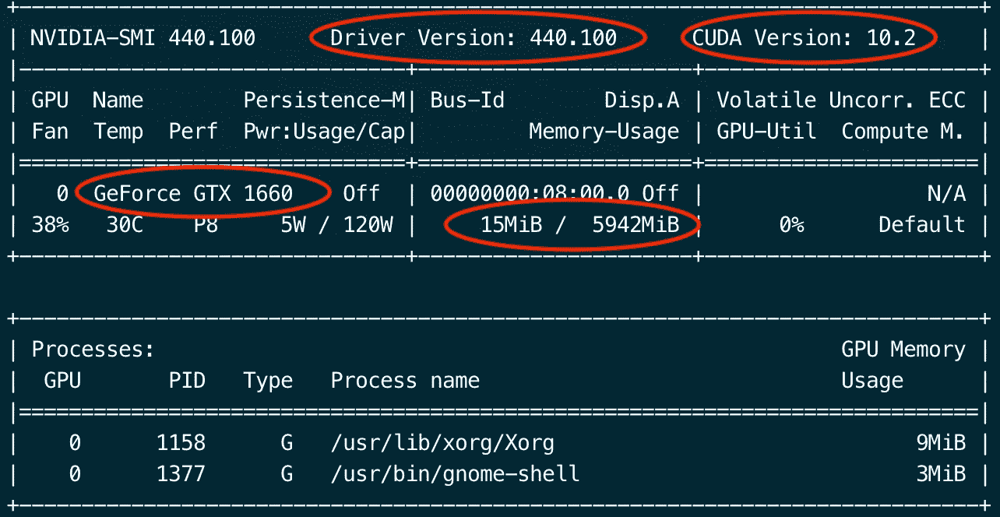
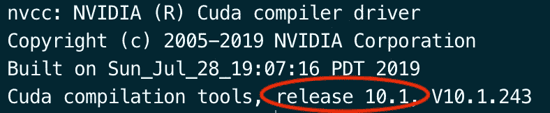
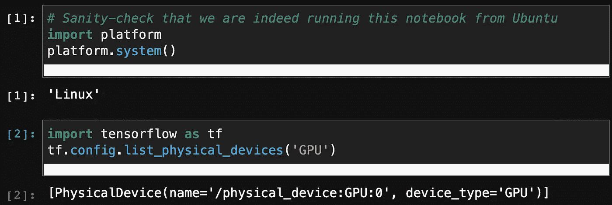

# 使用 Ubuntu 20.04 设置用于机器学习的个人 GPU 服务器

> 原文：<https://towardsdatascience.com/set-up-of-a-personal-gpu-server-for-machine-learning-with-ubuntu-20-04-100e787105ad?source=collection_archive---------2----------------------->

## TensorFlowGPU，JupyterLab，CUDA，cuDNN，端口转发，DNS 配置，SSHFS，bash


卡斯帕·卡米尔·鲁宾在 [Unsplash](https://unsplash.com?utm_source=medium&utm_medium=referral) 上的照片。奶昔是可选的 GPU 设置。

在你的 ML 工作流程中使用 GPU 的好处[已经在前面](/what-is-a-gpu-and-do-you-need-one-in-deep-learning-718b9597aa0d)讨论过了。本文的目标是总结为个人 ML 项目设置机器的步骤。我从 2017 年开始遵循[一个类似的指南](https://medium.com/@aragalie/build-your-own-top-spec-remote-access-machine-learning-rig-a-very-detailed-assembly-and-dae0f4011a8f)，发现从那时起到 2020 年，很多步骤都变了——变得更好。此外，根据我在攻读博士学位期间使用 DAQ 系统的经验，我将建议一些程序，使您的远程工作流程更简单、更安全。

到本文结束时，您将能够从您的笔记本电脑启动运行在 GPU 主机上的远程 JupyterLab 会话。此外，您将能够从任何地方远程打开机器，并将它的文件系统直接安装到您的笔记本电脑上。

# 大纲:

1.  安装和设置 *Ubuntu 20.04* (独立/双引导/WLS2)
2.  设置远程访问( *ssh* 、WOL、DNS 配置、端口转发)
3.  照顾 NVIDIA 驱动程序和库(CUDA，cuDNN)
4.  为 ML 创建 Python 环境
5.  易用工具:用 SSHFS 挂载远程目录，将一些常用命令设置为 *bash* 别名

# 要求:

1.  您通常在其上工作的笔记本电脑/台式机。我用的是运行 macOS 10.15 的 MacBook Pro 2015。
2.  一台带有 GPU 的机器，例如，这可以是你当前的游戏 PC。你不需要花费预算在昂贵的 GPU 上来开始训练你的 DNNs！我的硬件目前比较一般:
    **CPU:** AMD 锐龙 5 2600X (3.6 GHz，六核)
    **GPU:** 英伟达 GTX 1660(6GB VRAM)
    **RAM:**16gb(DDR 4 3200 MHz)
    **存储:** 512 GB NVMe M.2 (SSD)、512 GB HDD

3.  **对路由器设置的管理员级访问权限(可选)**
4.  **熟悉 Linux 和终端**

# **1.安装和设置 Ubuntu 20.04**

**在我和其他人看来，Windows 操作系统都不适合做任何 ML 开发或网络工作。因此，我们将为此目的设置一个 Linux 操作系统。Ubuntu Desktop 20.04 ( [在这里下载](https://ubuntu.com/download/desktop))是一个理想的选择，因为许多功能都是现成的，与其他 Linux 发行版相比，它允许我们节省设置时间。您有三种选择:**

1.  **[只安装 Ubuntu](https://ubuntu.com/tutorials/install-ubuntu-desktop#1-overview)。**
2.  **双启动 Ubuntu 和现有的 Windows 操作系统。**此处按照 i** [**指令**](https://www.linuxtechi.com/dual-boot-ubuntu-20-04-lts-along-with-windows-10/) **(推荐选项)。****
3.  **使用 WSL2 (Windows 子系统 for Linux)；这就是这里讨论的。**警告**:我从来没有测试过这个选项(这里你自己看吧！).**

****我推荐选项#2** ，保留对窗口的访问(例如，出于游戏相关的目的)。确保在安装期间将您的计算机连接到互联网，以获取最新的更新和驱动程序。**

**安装后，登录并更新和安装必要的软件包，例如**

```
sudo apt-get update &&
sudo apt-get -y upgrade &&
sudo apt-get -y install build-essential gcc g++ make binutils &&
sudo apt-get -y install software-properties-common git &&
sudo apt-get install build-essential cmake git pkg-config
```

# **2.设置远程访问**

**在本节中，我们将设置一种安全的远程登录机器的方式。还讨论了从任何网络访问 GPU 机器的选项。**

# **嘘**

**现在，登录 Ubuntu，打开终端并安装 ssh-server:**

```
sudo apt update &&
sudo apt install openssh-server
```

**之后，验证 ssh-server 安装是否正确**

```
sudo systemctl status ssh
```

**打开防火墙**

```
sudo ufw allow ssh
```

**通过从您的笔记本电脑 (假设与您的 GPU 机器连接到同一个网络)运行 ***来测试您的 ssh 连接*****

```
ssh **user**@<**local-ip-address**>
```

**其中 ***用户*** 是你的 Ubuntu 用户名，而你在 Ubuntu 上的本地 IP 地址(如 172.148.0.14)可以用`ip add`找到，产生(如)**

```
*link/ether* ***b3:21:88:6k:17:24*** *brd ff:ff:ff:ff:ff:ff
inet* ***172.148.0.14****/32 scope global noprefixroute* ***enp7s3***
```

**记下您的 MAC 地址(如 **b3:21:88:6k:17:24** )和网卡名称(如 **enp7s3** )，以备后用。**

**接下来，按照此处 描述的 [**设置无密码登录的 ssh 密钥。之后，*假设你只想从这台笔记本电脑*登录到你的机器，**禁用使用密码登录的选项**。这将只允许来自已经交换了 ssh-key 对的设备的 ssh 连接，**提高了安全性**。在 Ubuntu 上编辑`/etc/ssh/sshd_config`(使用 sudo 权限)以添加**](https://www.digitalocean.com/community/tutorials/how-to-set-up-ssh-keys--2)**

```
#only ssh-key logins 
PermitRootLogin no
ChallengeResponseAuthentication no
PasswordAuthentication no
UsePAM no
AllowUsers user
PubkeyAuthentication yes# keep ssh connection alive 
ClientAliveInterval 60
TCPKeepAlive yes
ClientAliveCountMax 10000
```

**不要忘记重新启动 ssh-service，让它通过**

```
sudo restart ssh
```

# **域名服务器(Domain Name Server)**

**如果您想从家庭网络之外通过 ssh 连接到您的计算机，您需要建立一个永久的 DNS“主机名”,它独立于您的计算机的全局 IP 地址，您的 ISP 可以随时更改该地址。我个人使用过 no-IP 的免费服务([链接此处](https://www.noip.com/)，从 Ubuntu 的浏览器 )开始使用“立即创建你的免费主机名”***)；存在替代 DNS 服务，如 FreeDNS、Dynu 等。请创造性地使用您的主机名；我真不敢相信 mlgpu.ddns.net 还没被录取。这个主机名将在本文中作为一个例子。*****

**之后，按照此处描述的[安装动态更新客户端(DUC)。这可以确保当您的全局 IP 发生变化时，它会重新链接到您的主机名(即**mlgpu.ddns.net**)。为了确保每次使用 Ubuntu 都能启动 DUC，添加一个新的 *cronjob* 和`sudo crontab -e`(即在文件末尾添加这一行)](https://my.noip.com/#!/dynamic-dns/duc)**

```
@reboot su -l **user** && sudo noip2
```

**重启你的机器。**

# **端口转发**

**默认情况下，ssh 使用端口 22 进行连接。我们需要通过路由器打开这个端口(TCP 和 UDP 协议),以便能够从外部网络 ssh 到机器(您仍然希望从咖啡店提交那些 GPU 密集型作业，对吗？).此设置通常位于“高级/安全”选项卡下。下面是我的路由器设置的截图**

****

**UDP 和 TCP 协议都允许通过 Ubuntu 网卡的端口 22。**

***可选*:在挖掘你的路由器设置时，将你的 Ubuntu 的网卡 **MAC 地址**和**本地 IP** 添加到保留列表(“添加保留规则”)，并将你的路由器设置保存到一个文件中(以防你日后需要重新加载)。**

***最后，在你的笔记本电脑* 上 ***，编辑`~/.ssh/config`用你的 Ubuntu 用户名替换**用户**，用你的 DNS 主机名替换主机名*****

```
# keep ssh connection alive
TCPKeepAlive yes
ServerAliveInterval 60# assign a 'shortcut' for hostname and enable graphical display over ssh (X11) 
Host                 **mlgpu**
HostName             **mlgpu.ddns.net**
GSSAPIAuthentication yes
User                 **user**
ForwardX11Trusted         yes
ForwardX11                yes
GSSAPIDelegateCredentials yes
```

**这将允许您快速 ssh 到您的机器，并测试 DNS 和端口转发正在工作**

```
ssh mlgpu
```

**这应该不会要求您输入密码，您现在可以从任何网络 ssh 到您的 GPU 机器！**

# **局域网唤醒**

**想象一个场景，你正在参加一个会议(在 2020 年之前，这些会议在远离你家的地方举行——我知道这很奇怪！)并且你想在你的 GPU 机器上训练你的 DNN。但是等等，你在离开家之前把它关掉了——哦，天哪！**

**这就是 [**沃尔和**](https://www.techrepublic.com/article/how-to-enable-wake-on-lan-in-ubuntu-server-18-04/) 的神奇之处！**

**在 Ubuntu 上，编辑`/etc/systemd/system/wol@.service`**

```
[Unit]
Description=Wake-on-LAN for %i
Requires=network.target
After=network.target[Service]
ExecStart=/sbin/ethtool -s %i wol g
Type=oneshot[Install]
WantedBy=multi-user.target
```

**之后，通过以下方式启用 WOL 服务**

```
sudo systemctl enable wol@enp7s3 && 
systemctl is-enabled wol@np7s3
```

**这将返回“enabled”； **enp7s3** 是用`ip add`命令返回的网卡名称。最后，检查您的 BIOS 设置“wake-on-LAN”= enabled。**

**现在，**在你的笔记本电脑**上，通过**

```
brew install wakeonlan
```

**要测试 WOL 是否正常工作，请关闭 Ubuntu，并使用您的 DNS 主机名(或 IP 地址)和 MAC 地址从您的笔记本电脑发出以下命令**

```
wakeonlan -i **mlgpu.ddns.net** -p 22 **b3:21:88:6k:17:24**
```

**这将唤醒你的 GPU 机器从睡眠或关机状态(当然，确保它仍然连接到电源！).如果你选择了双引导选项，并且 Ubuntu 不是引导菜单中的第一个操作系统，[用 *GRUB*](https://www.linuxuprising.com/2018/12/how-to-change-grub-boot-order-or.html) 调整它。**

**就是这样:从你的 GPU 机器上拔下你的显示器、键盘和鼠标，从这里我们将从你的笔记本电脑上运行的远程 ssh 会话中发出所有命令——太棒了！**

# **3.管理 NVIDIA 驱动程序和库**

**更多好消息在前方。Ubuntu 20.04 应该会自动为你安装 Nvidia 驱动(而不是*新出的*那些)。让我们用`nvidia-smi`来验证一下**

****

**确认检测到您的 GPU 后，使用正确数量的 VRAM，记下驱动程序和 CUDA 版本。**

**这不是最新版本的驱动程序。然而，我们可能想让他们从标准的 Ubuntu 库安装 CUDA 和 cuDNN。**

## **库达**

**只需安装 CUDA**

```
sudo apt update &&
sudo apt install nvidia-cuda-toolkit
```

**用`nvcc --version`验证**

****

**CUDA toolkit (v10.1)是从 Ubuntu 库获得的。**

**最后，使用这里的文件[构建您的第一个 CUDA“Hello World”示例](https://github.com/glukicov/ML_GPU/blob/master/hello.cu)**

```
nvcc -o hello hello.cu &&
./hello
```

**“最大误差:0.000000”意味着您的 CUDA 库工作正常！**

# **cuDNN**

**最后，为 CUDA 10.1 (或为您从`nvcc --version`发布的 CUDA 版本)下载[cud nn v 7 . 6 . 5(2019 年 11 月 5 日)。你需要注册一个 NVIDIA 开发者计划的免费帐户来下载 cuDNN。](https://developer.nvidia.com/rdp/cudnn-download#a-collapse765-101)**

**使用以下命令从解压缩的 tarball 中复制库:**

```
sudo cp cuda/include/cudnn.h /usr/lib/cuda/include/ &&
sudo cp cuda/lib64/libcudnn* /usr/lib/cuda/lib64/ &&
sudo chmod a+r /usr/lib/cuda/include/cudnn.h  /usr/lib/cuda/lib64/libcudnn*
```

**并将库导出到$LD_LIBRARY_PATH**

```
echo 'export LD_LIBRARY_PATH=/usr/lib/cuda/lib64:$LD_LIBRARY_PATH' >> ~/.bashrc &&
echo 'export LD_LIBRARY_PATH=/usr/lib/cuda/include:$LD_LIBRARY_PATH' >> ~/.bashrc &&
source ~/.bashrc
```

**任务完成了。**

# **4.为 ML 创建 Python 环境**

**在 Linux 和 macOS 上，我个人的偏好是使用 *pip* 而不是 *conda* 来管理 Python 包和环境。下面是设置 ML Python3 环境的说明:**

**首先，获取最新的 Python3**

```
sudo apt update &&
sudo apt install python3-pip python3-dev
```

**然后，升级 *pip* 并安装环境管理器**

```
sudo -H pip3 install --upgrade pip
sudo -H pip3 install virtualenv
```

**接下来，我们将为基于 GPU 的项目创建一个新目录**

```
mkdir ~/gpu_ml &&
cd ~/gpu_ml
```

**并在那里实例化一个新的 Python 环境**

```
virtualenv gpu_ml_env
```

**这将允许我们直接在那个环境中安装软件包，而不是“全局”安装。该环境需要用以下命令激活(每次登录)**

```
source ~/gpu_ml/bin/activate
```

**你应该在你的终端里看到`(gpu_ml_env)`。现在，让我们在那个环境中安装 Python 包(在那个环境中 pip == pip3)**

```
pip install jupyterlab &&
pip install tensorflow &&
pip install tensorflow-gpu
```

**您需要的任何其他 Python 包都可以类似地安装。**

# **5.易用的工具**

# **尝试**

**我推荐你在 Ubuntu 的`~/.bash_aliases`中添加一些命令。他们会在每次登录时激活`gpu_ml`环境，以及添加一些有帮助的“终端快捷方式”(人生苦短，不能键入‘jupyter lab’而不是‘jlab’，对！？).命令如下([替代链接](https://gist.github.com/glukicov/e882798949f19d374409752afc56cc91))**

****在您的笔记本电脑**上，您可能希望将这些行添加到您的`~/.profile,` 中，用您的 DNS 主机名(或 IP 地址)替换 ML，并使用步骤#2 中的 MAC 地址。这些命令如下([替代链接](https://gist.github.com/glukicov/de4b1f37ce383db3aa1c3e9906988df9))**

# **SSHFS**

**从这里安装 macOS 的 FUSE[，调整下面的脚本，其中`remotedir="user@$ML:/home/user/"`，和`mountdir="/Users/user/Documents/Ubuntu_mount"`是你的 macOS 上的目录，Ubuntu 上的文件将被挂载到这个目录。脚本如下(](https://osxfuse.github.io/)[备选链接](https://gist.github.com/glukicov/d843dec124de27c9c158b1b1aec5e723))**

**使用运行脚本**

```
. ./mount.sh
```

**在你的 macOS 上导航到`/Users/user/Documents/Ubuntu_mount`(或者简单地输入`cd_ML`)来查看作为“本地文件”的 Ubuntu 文件。你现在可以在你的笔记本电脑上用你最喜欢的编辑器打开和编辑远程 Ubuntu 文件，等等——太棒了！**

**让我们做这个设置的最后测试(手指交叉！).**从您的笔记本电脑上****

```
sg
```

**在我们的“bash shortcuts”中，它代表`ssh -L 8899:localhost:8899 mlgpu.ddns.net`。这应该会在端口 8899 上打开一个 ssh 隧道，并从该会话类型登录到 Ubuntu**

```
jlab
```

**哪个是`jupyter lab --port=8899`的 bash 快捷键？**

**现在，在笔记本电脑上打开您最喜欢的网络浏览器，导航至`[http://localhost:8899/lab](http://localhost:8899/lab)`。第一次，您需要将令牌从终端粘贴到浏览器中(例如`The Jupyter Notebook is running at:http://localhost:8899/?token=**583049XXYZ…**`)**

**在 JupyterLab 中，检查我们确实是从 Linux 运行这台笔记本**

```
import platform
platform.system()
```

**张量流检测 GPU**

```
import tensorflow as tf
tf.config.list_physical_devices(‘GPU’)
```

****

**我们通过笔记本电脑在远程 GPU 服务器上运行 JupyterLab 笔记本。不太令人兴奋的输出#2 实际上是一个好消息，TensorFlow 检测到了我们的 GPU。**

**从这里开始，你就可以实施你的 DNN 培训等。使用图形处理器。如果您遵循了第 1 节到第 5 节中的所有步骤，那么您的工作流程相当简单:**

**1.用`sg`
2 打开一个到你的 GPU 服务器的 ssh 隧道。用`jlab`
3 在 GPU 服务器上启动 JupyterLab。在笔记本电脑上打开网络浏览器，并转至`[http://localhost:8899/lab](http://localhost:8899/lab)`
4。快乐训练——真正的工作从这里开始！**

# **编后记**

**我希望这篇文章对帮助你设置远程 GPU 服务器以满足你的 ML 需求有所帮助。如果您发现本文中的过程有任何改进，请告诉我，我会尽我所能在这里添加它们。**