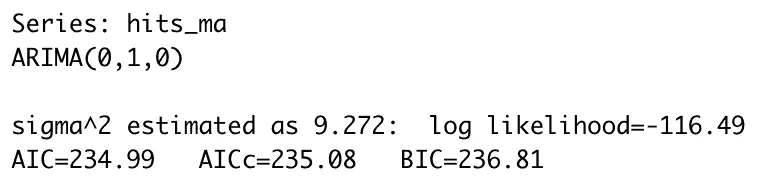
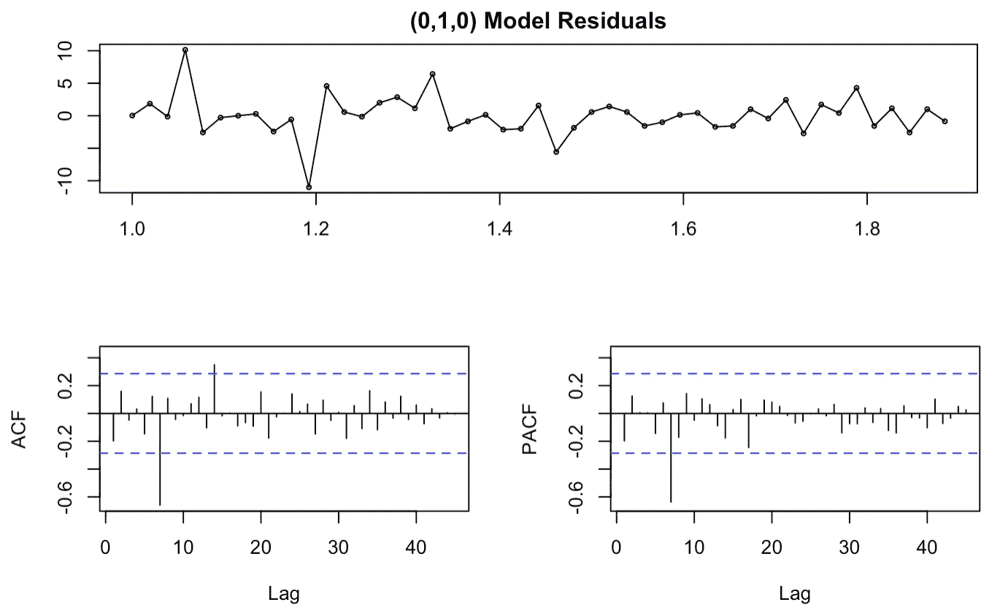
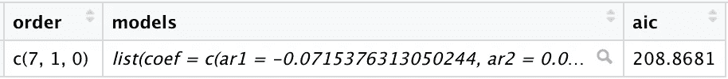
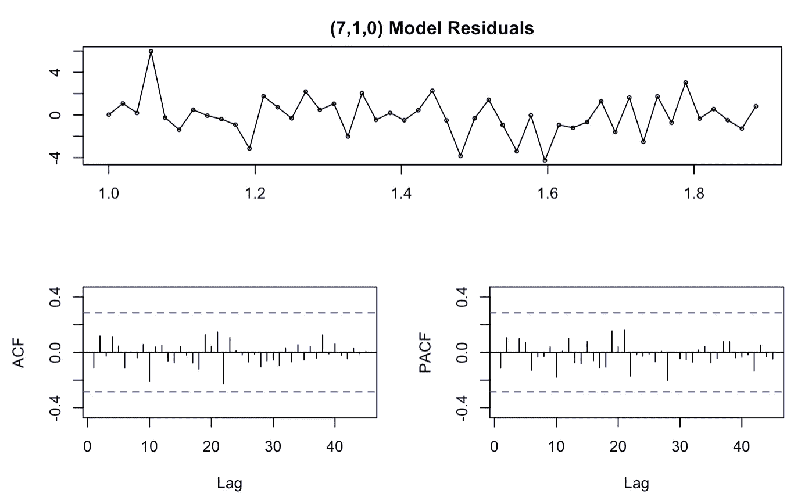

# 在 R: Grid search 与 auto.arima()中设置 ARIMA 模型参数

> 原文：<https://towardsdatascience.com/setting-arima-model-parameters-in-r-grid-search-vs-auto-arima-19055aacafdf?source=collection_archive---------22----------------------->

## 让最佳模型适合您的时间序列数据。

# 概观

表示和预测时间序列数据的最流行的方法之一是通过自回归综合移动平均(ARIMA)模型。这些模型由三个参数定义:

*   **p** :滞后阶数(包括滞后观测数)
*   **d** :平稳性所需的差分程度(数据被差分的次数)
*   **q** :均线的顺序

如果你是 ARIMA 模特界的新手，有很多很棒的指导网页和分步指南，比如来自 otexts.com 的[和来自 oracle.com 的](https://otexts.com/fpp2/arima-r.html)和[的](https://blogs.oracle.com/datascience/introduction-to-forecasting-with-arima-in-r)，它们给出了更全面的概述。

然而，这些指南中的绝大多数都建议使用 auto.arima()函数或手动使用 ACF 和 PACF 图来设置 p、d 和 q 参数。作为一个经常使用 ARIMA 模型的人，我觉得我仍然需要一个更好的选择。auto.arima()向我推荐的模型通常具有较高的 AIC 值(一种用于比较模型的方法，最好的模型通常是 AIC 最低的模型)和显著的滞后，这表明模型拟合度较差。虽然我可以通过手动更改参数来实现较低的 AIC 值并消除显著的滞后，但这个过程感觉有些武断，我从来没有信心为我的数据真正选择了最好的模型。

我最终开始使用网格搜索来帮助我选择参数(借用本指南[中的一些代码](https://www.r-bloggers.com/2018/11/searching-for-the-optimal-hyper-parameters-of-an-arima-model-in-parallel-the-tidy-gridsearch-approach/))。虽然对数据进行探索性分析、测试假设和批判性思考 ACF 和 PACF 图总是很重要，但我发现有一个数据驱动的地方来开始我的参数选择非常有用。下面我将通过示例代码和输出来比较 auto.arima()和 grid 搜索方法。

# 代码和输出比较

首先，您需要加载 tidyverse 和 tseries 包:

```
library('tidyverse')
library('tseries')
library('forecast')
```

还需要使用您的训练数据创建移动平均对象:

```
training_data$hits_ma = ma(training_data$seattle_hits, order = 7)hits_ma = ts(na.omit(training_data$hits_ma), frequency = 52)
```

## auto.arima()

创建和查看 auto.arima()对象非常简单:

```
auto_1 = auto.arima(hits_ma, seasonal = TRUE)
auto_1
```



使用 auto.arima()选择的参数为( *0，1，0* ) ，该模型的关联 AIC 为 234.99。寻找 ACF 和 PACF 图中的显著滞后也很重要:

```
tsdisplay(residuals(auto_1), lag.max = 45, main = '(0,1,0) Model Residuals')
```



显著的滞后延伸到蓝色虚线之外，表明模型拟合不佳。两个图在 7 处显示出显著的滞后，ACF 图在 14 处具有额外的显著滞后。

## 网格搜索

首先，您必须指出您想要在网格搜索中测试哪些参数。鉴于这些值的显著滞后，我决定考虑 0 到 7(p 和 d)和 0 到 14(q)之间的所有参数。最终结果是一个名为“orderdf”的数据帧，包含所有可能的参数组合:

```
order_list = list(seq(0, 7),
                   seq(0, 7),
                   seq(0, 14)) %>%
    cross() %>%
    map(lift(c))orderdf = tibble("order" = order_list)
```

接下来，绘制该数据帧，确定 AIC 最低的型号:

```
models_df = orderdf %>%
    mutate(models = map(order, ~possibly(arima, otherwise = NULL)(x = hits_ma, order = .x))) %>% 
    filter(models != 'NULL') %>% 
    mutate(aic = map_dbl(models, "aic"))best_model = models_df %>%
    filter(aic == min(models_df$aic, na.rm = TRUE))
```

我已经将具有最低 AIC 的模型提取为“best_model ”,以便我稍后可以使用该对象，但是您也可以通过最低 AIC 对数据进行排序，以便探索最佳的几个选项。

查看“最佳模型”对象会显示网格搜索方法选择的参数:



网格搜索已经确定( *7，1，0* )为最佳参数，并且与该模型相关联的 AIC 208.89 远低于来自 auto.arima()方法的 234.99。



此外，在 ACF 或 PACF 图中不再出现任何显著的滞后，并且残差更小。这个模型似乎比使用 auto.arima()生成的模型更适合我的数据。

与使用 auto.arima()函数或手动选择相比，我一直使用网格搜索获得更好的结果，我强烈建议在将 arima 模型拟合到您的数据时使用这种方法。