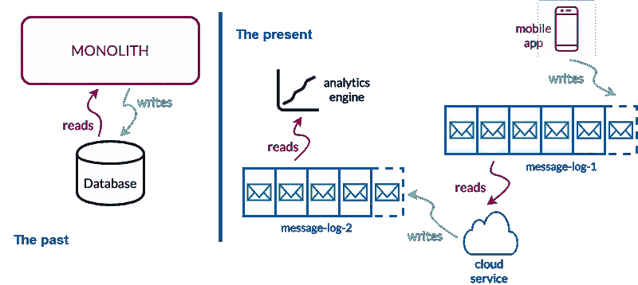
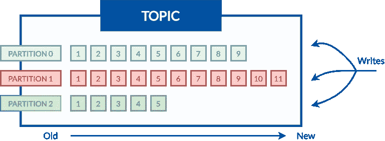
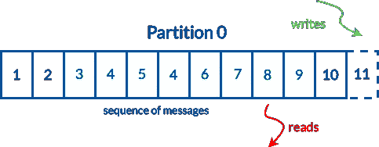

# 为阿帕奇·卡夫卡设定场景

> 原文：<https://towardsdatascience.com/setting-the-scene-for-apache-kafka-f4c051f08ecd?source=collection_archive---------72----------------------->

## 此高级事件流平台的简介和关键概念解释。

*(图片来自* Photogenica Sp。授权给 Wojciech Nowak)

**简介**

据说卡夫卡是一个信息系统。许多人认为它是将消息从一个地方移动到另一个地方的消息总线。这当然是真的，但事实上远不止如此。

Kafka 是一个开源的分布式事件流平台，可以处理整个系统中的所有数据和所有事件。这是一个可以构建实时应用程序的平台，它可以通过事件的力量将不同的系统集成在一起。

它以容错、持久的方式传输记录，提供背压、集成点，并将源系统与接收系统分离。这些特性与灵活的架构相结合，使 Kafka 成为保证高性能和低延迟的强大工具。

Kafka 是基于发布-订阅模式构建的，这种模式使应用程序能够向多个感兴趣的消费者异步发布消息，而无需将发送者与接收者耦合起来。Kafka 是作为一个集群在一个或多个服务器上运行的，这使得满足 Kafka 的创造者给出的保证变得容易。

卡夫卡建筑的这种(某种)正式/普遍的概念可能看起来势不可挡。因此，卡夫卡的核心概念已在下一章介绍。

**核心理念**

过去，信息存储在数据库中。这种方法使得开发人员从事物的角度来理解编程(例如，票、卡车、照相机)。每一件事物都有它自己的状态，并存储在数据库中。

最近，一些人提出用事件来理解编程。每个事件都有其状态(就像存储在 DB 中的“事情”)，但也有对发生的事情的描述和“事情”发生的时间指示。

将事件存储在数据库中似乎是过去和现在的一个很好的调和，然而这有点不方便。取而代之的是被称为“日志”的结构。一旦事件发生，就写入日志。这意味着日志是事件有序序列。

日志很容易思考。它们也很容易大规模构建，这在历史上对数据库来说并不完全正确。Apache Kafka 是一个用于管理这些日志的系统(或平台),具有一系列高级功能，其中一部分已经提到过。

在过去，当数据库统治编程世界时，构建一个使用单个数据库的巨大应用程序是非常流行的。出于许多原因，这种方法是合理且常见的。然而，随着时间的推移，这些应用程序的复杂性也在增加。他们变得难以思考，难以理解，最终难以改变。

目前，有一种趋势是编写大量的小程序，每一个程序都小到足以思考、改变和进化。这些程序可以通过面向日志的代理相互通信。

过去与现在(作者图片)

每个服务都可以使用给定日志中的一条消息，执行一些计算或处理一条消息，并将结果生成一个日志(或数据库)。输出可以持久地(甚至永久地)记录在那里，用于系统中的其他应用。

现在你应该对卡夫卡背后的关键概念有了一个不错的想法。此外，你不仅应该真正理解 kafka 是什么，还应该真正理解 kafka 倾向于提出的构建软件的方法。

**消息，话题&分区**

您已经知道 kafka 有助于在源系统和接收系统之间移动数据。让我们深入了解阿帕奇卡夫卡的一些要点。

一个单独的数据片段被称为**消息**。当信息被发送时，卡夫卡对其进行索引，并将其放入适当的 T4 主题 T5。

主题是特定的数据流(你可以把它们想象成 RDBMS 中的一个表，但是没有关系和约束)。每个主题由其名称标识，并被分成**个分区**。每个分区都有标识号。这些数字从 0 开始，一直到 n-1，其中 n 是给定主题内的分区数量。

主题剖析(图片由作者提供)

分区是有序且不可变的消息序列。每个分区独立于所有其他分区，这意味着在一个主题内创建的分区之间没有顺序。当需要平衡负载时，它们也可以作为一个并行单元工作。分区中的每条消息都有一个称为 **offset** 的顺序 id 号，它唯一地标识分区内的每条消息。

深入了解分区(图片由作者提供)

**总结**

现在，当你知道卡夫卡是什么，它是如何工作的，幕后是什么，你能做的最好的事情就是在实践中使用这些知识。此外，了解了一些关键定义，如**消息**、**主题**、**分区**和**偏移**，您可以了解 kafka 更高级的方面，如生产者、消费者、交付语义或 kafka 集群的内部。

本文附有一些可能有助于你探索卡夫卡的资料。如果你想了解更多关于卡夫卡的知识，它的文档是最好的地方。当你想获得更详细的信息时,《卡夫卡——权威指南》应该能满足你的需求。最后，如果你的目标是找到更多关于日志概念的第三个位置——“我心日志:事件数据、流处理和数据集成”将是最好的知识来源。

继续前进，祝你好运！

WN。

**来源**

[1]阿帕奇卡夫卡 2.3 文档【https://kafka.apache.org/documentation/ 

[2]卡夫卡:权威指南|尼哈·纳克赫德、格温·沙皮拉、托德·帕利诺|奥莱利媒体公司| 2017 年 11 月 1 日

[3] I Heart Logs:事件数据、流处理和数据集成| Jay Kreps | O'Reilly Media，Inc . | 2014 年 9 月 23 日