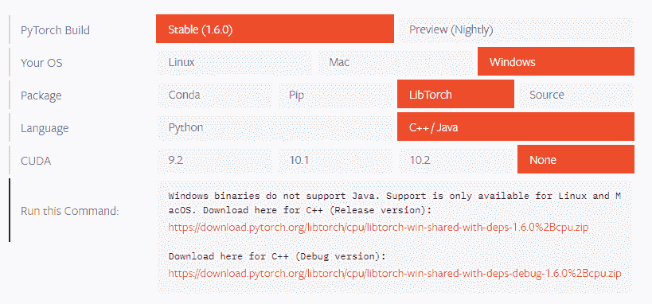
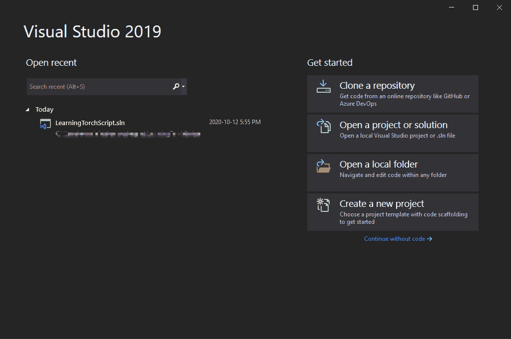
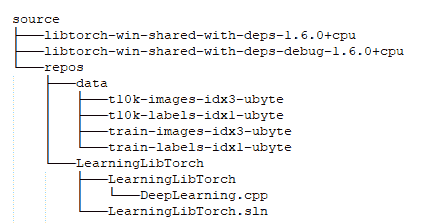
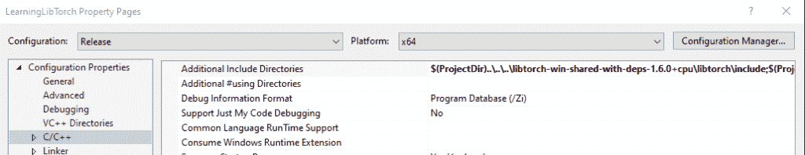
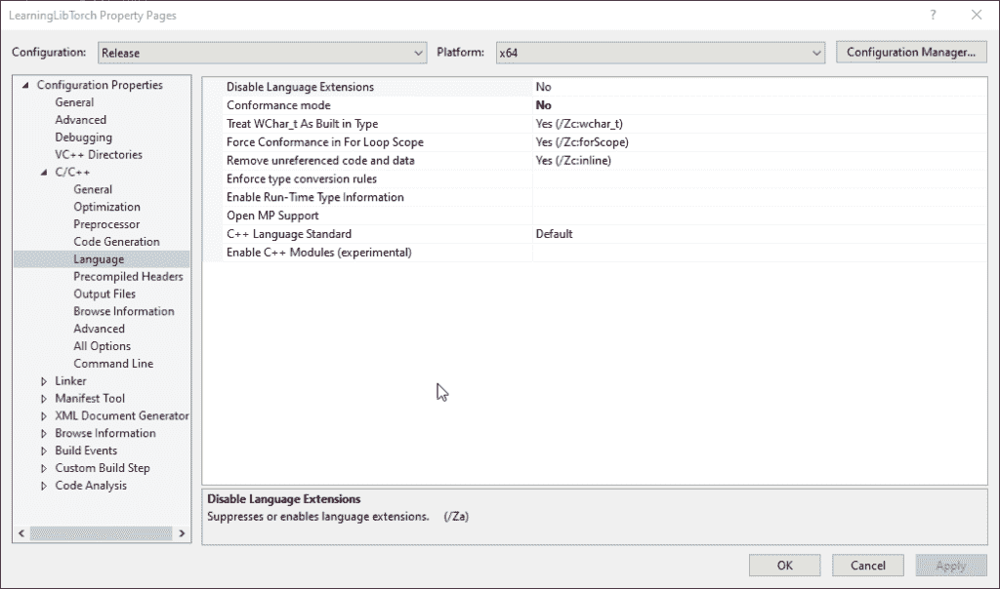
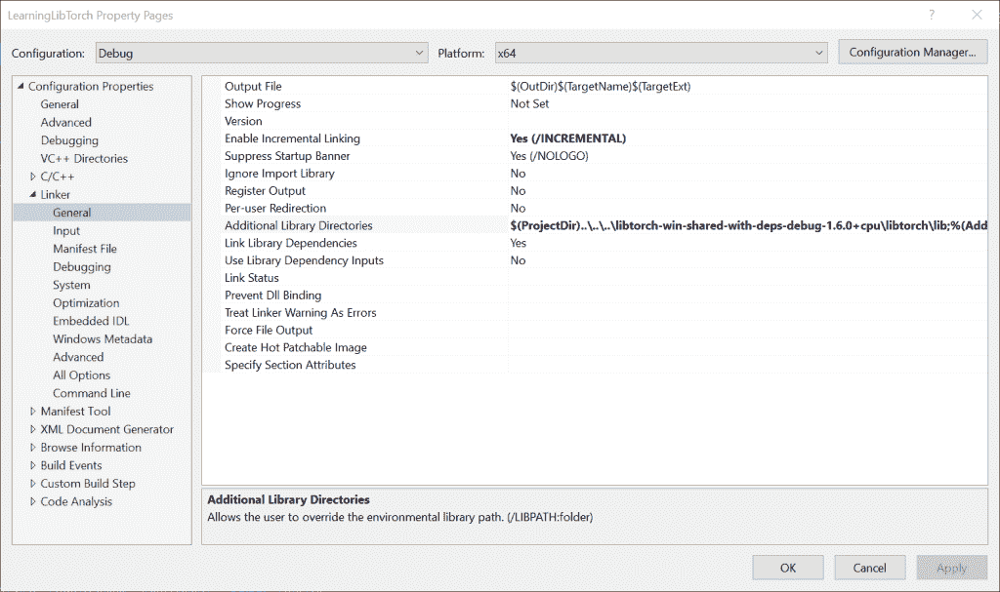
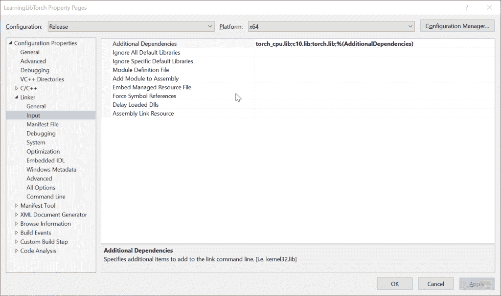
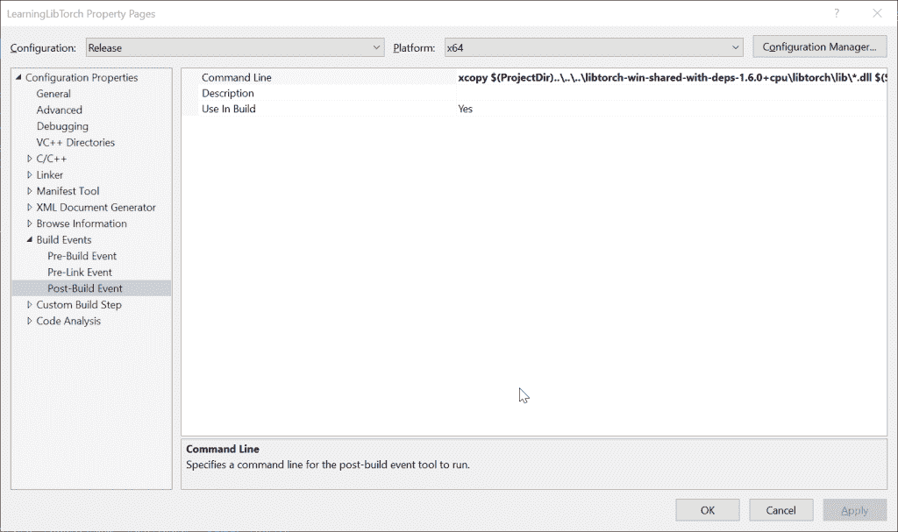
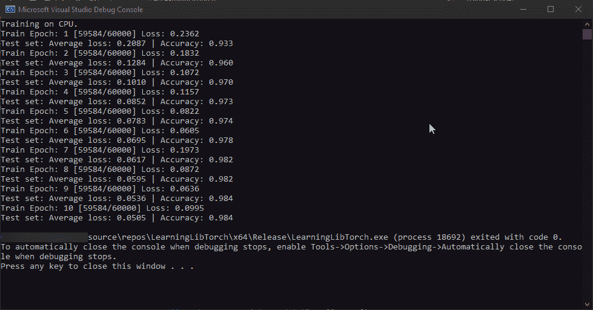

# 使用 LibTorch 1.6 在 Visual Studio 2019 中设置 C++项目

> 原文：<https://towardsdatascience.com/setting-up-a-c-project-in-visual-studio-2019-with-libtorch-1-6-ad8a0e49e82c?source=collection_archive---------8----------------------->

关于如何使用 python 在 PyTorch 中训练模型，如何使用 flask 或者 Amazon SageMaker 部署模型等等的教程数不胜数。然而，关于如何在 C++中工作的资源是有限的，对于 Visual Studio 项目设置来说更是如此。当你想在现实世界的应用程序中使用你的模型时，速度是你关心的问题，并且由于隐私/安全的考虑，你不想把模型存储在云上，那么你需要求助于我们的老朋友 C++。

Pytorch 现在对 C++有了很好的支持，从 v1.3.0 开始就有了。他们有很好的关于如何使用 C++前端的教程，可以在这里找到:[https://pytorch.org/tutorials/advanced/cpp_frontend.html](https://pytorch.org/tutorials/advanced/cpp_frontend.html)

他们利用 cmake 来构建他们的应用程序，并且没有针对广泛用于 C++开发的 Visual Studio 的官方文档。在本教程中，我将解释如何在最新的 Visual Studio 2019 版本上以发布和调试模式设置 torchlib 项目。

# 第一步

从这个[链接](https://visualstudio.microsoft.com/downloads/)下载安装 Visual Studio 2019 社区版。安装时选择“使用 C++进行桌面开发”,这将安装所有必需的组件。

# 第二步

你必须从 PyTorch 下载[页面下载 LibTorch 压缩文件。](https://pytorch.org/get-started/locally/)我选择了不支持 Cuda 的 Windows 版本。如果您有 GPU，可以选择安装在您机器上的 Cuda 版本。下载链接出现在“运行此命令”行中。我已经把 CPU 版本的贴在这里了。

*   [Windows CPU Only C++发布版本](https://download.pytorch.org/libtorch/cpu/libtorch-win-shared-with-deps-1.6.0%2Bcpu.zip)
*   [Windows CPU Only C++调试版本](https://download.pytorch.org/libtorch/cpu/libtorch-win-shared-with-deps-debug-1.6.0%2Bcpu.zip)

您必须解压缩这两个文件，然后有选择地移动到存储库文件夹。

来源:[https://pytorch.org/get-started/locally/](https://pytorch.org/get-started/locally/)

# 第三步

先说 Visual Studio 中的 C++项目。创建新项目

来源:作者

# 第四步

项目设置中需要为项目正常工作而设置的设置很少。文件夹结构如下。

来源:作者

我们从 C/C++设置下的附加包含目录开始。请注意，您可以用提取 LibTorch 库的绝对路径来替换它们。您需要添加以下两个条目:

**发布配置:**

*   $(项目目录)..\..\..\ lib torch-win-shared-with-deps-1 . 6 . 0+CPU \ lib torch \ include
*   $(项目目录)..\..\..\ lib torch-win-shared-with-deps-1 . 6 . 0+CPU \ lib torch \ include \ torch \ CSRC \ API \ include

**调试配置:**

*   $(project dir)……\ lib torch-win-shared-with-deps-debug-1 . 6 . 0+CPU \ lib torch \ include
*   $(project dir)……\ lib torch-win-shared-with-deps-debug-1 . 6 . 0+CPU \ lib torch \ include \ torch \ CSRC \ API \ include

$(ProjectDir)是一个扩展到项目目录路径的 visual studio 宏。我们返回三个目录以获得 LibTorch 文件夹，然后指定相对路径。

来源:作者

接下来，我们将 C/C++ →语言→一致性模式下的一致性模式设置设置为 No。或者选择所有配置并更改此设置。

来源:作者

接下来，是链接器设置。我们从 General 选项卡下的附加库目录开始。

**发布配置:**

*   $(project dir)……\ lib torch-win-shared-with-deps-1 . 6 . 0+CPU \ lib torch \ lib

**调试配置:**

*   $(project dir)……\ lib torch-win-shared-with-deps-debug-1 . 6 . 0+CPU \ lib torch \ lib

来源:作者

接下来是输入选项卡。我们需要在这里指定附加的依赖项。

*   **CPU 版本:** torch_cpu.lib，c10.lib，torch.lib
*   **GPU 版本:** torch.lib，torch_cuda.lib，caffe2_nvrtc.lib，c10.lib，c10_cuda.lib，torch_cpu.lib，-包含:？warp _ size @ cuda @ at @ @ YAHXZ([https://github . com/py torch/py torch/issues/31611 # issue comment-594383154](https://github.com/pytorch/pytorch/issues/31611#issuecomment-594383154)

来源:作者

最后，我们需要将 DLL 文件复制到项目中。您可以手动执行此操作，或者将这些 xcopy 命令添加到构建事件→后期构建事件→命令行中。我已经编写了复制所有 dll 的命令。但是，您可以只选择和复制您需要的那些。

`xcopy $(ProjectDir)..\..\..\libtorch-win-shared-with-deps-1.6.0+cpu\libtorch\lib\*.dll $(SolutionDir)$(Platform)\$(Configuration)\ /c /y`

来源:作者

这就完成了在 Visual Studio 2019 中设置您的 LibTorch 1.6 项目。

最后，为了测试您的项目是否有效，让我们添加一个来自 PyTorch repo examples for c++的示例项目[。](https://github.com/pytorch/examples/tree/master/cpp/mnist)

你必须从[这个链接下载 MNIST 数据集。](http://yann.lecun.com/exdb/mnist/)请下载所有四个文件，并将它们解压缩到之前结构中显示的数据文件夹中。只要确保提取工具没有用点替换其中一个连字符，因为那会导致代码抛出异常。我已经在这个资源库中提供了解决方案文件和代码:[https://github . com/msminhas 93/lib torch-Mn ist-visual-studio/tree/main/learning lib torch](https://github.com/msminhas93/libtorch-mnist-visual-studio/tree/main/LearningLibTorch)。输出应该如下所示:

希望这有用。欢迎您的建议、反馈和评论。

## 参考

[1][https://medium . com/@ boontongbuasirilai/building-py torch-c-integration-lib torch-with-ms-visual-studio-2017-44281 f 9921 ea](https://medium.com/@boonboontongbuasirilai/building-pytorch-c-integration-libtorch-with-ms-visual-studio-2017-44281f9921ea)

[2][https://github.com/pytorch/examples/tree/master/cpp/mnist](https://github.com/pytorch/examples/tree/master/cpp/mnist)

[http://yann.lecun.com/exdb/mnist/](http://yann.lecun.com/exdb/mnist/)

[4][https://github . com/py torch/py torch/issues/31611 # issue comment-594383154](https://github.com/pytorch/pytorch/issues/31611#issuecomment-594383154)