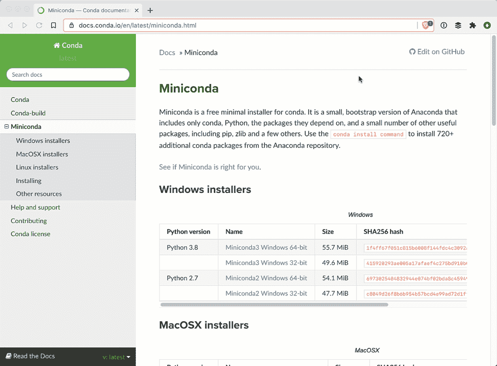
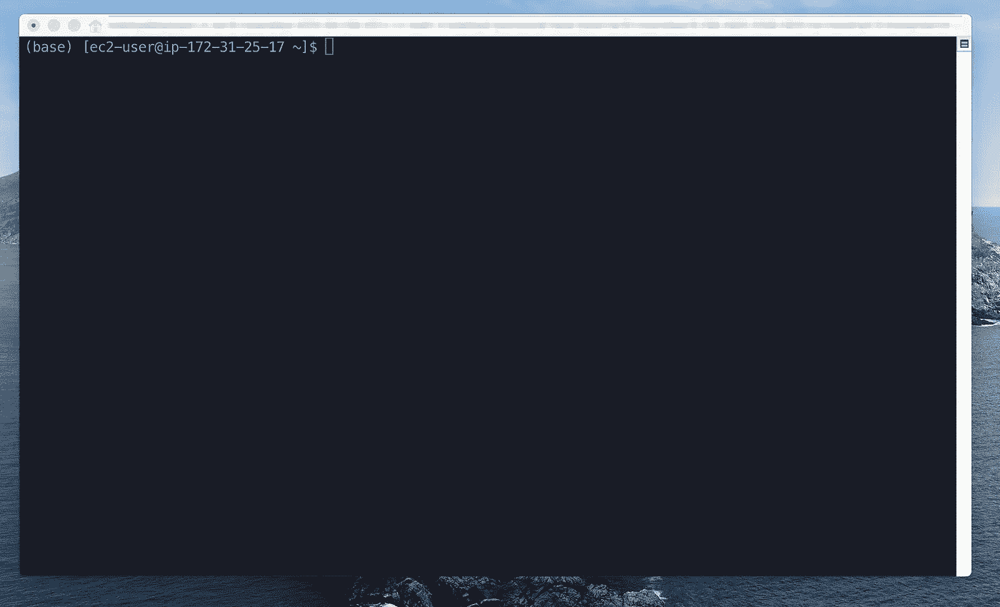
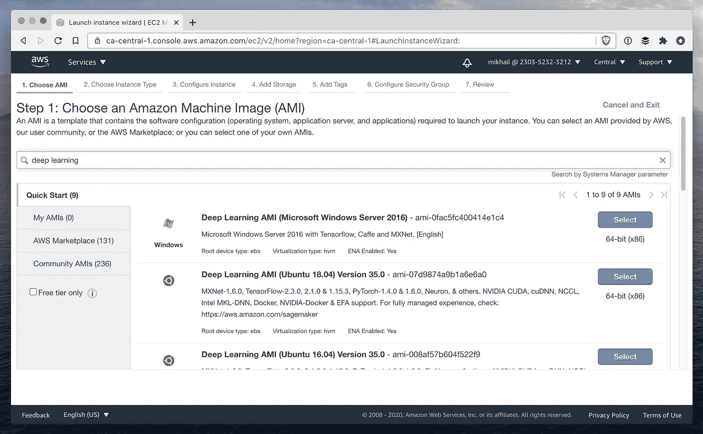

# 建立新的 PyTorch 深度学习环境

> 原文：<https://towardsdatascience.com/setting-up-a-new-pytorch-deep-learning-environment-313d8d1c2df0?source=collection_archive---------11----------------------->


照片由[阿齐兹·阿查基](https://unsplash.com/@acharki95?utm_source=medium&utm_medium=referral)在 [Unsplash](https://unsplash.com?utm_source=medium&utm_medium=referral) 上拍摄

无论您是开始一个新项目，还是在远程机器上运行，您都不想浪费时间去寻找依赖项和安装软件库。

本教程将提供一种从空白开始设置的最快方法。

我测试了这种方法，在 Amazon Web Services 上运行的一个简单的 EC2 实例上完成。

## 管理您的包

PyTorch 中的深度学习工作流是用 Python 编程语言编写的，您会发现自己需要安装许多额外的 Python 包才能获得作为数据科学家所需的所有功能。

为了保持整洁，您需要一个工具来帮助您管理 Python 环境。Conda 是管理软件包、依赖项和环境的强大工具。我们将首先安装它。

Miniconda 是 conda 的免费极简安装程序。为您的操作系统找到[正确的 Miniconda。](https://docs.conda.io/en/latest/miniconda.html)



请注意，虽然我是在 Mac 上工作，但我是在 AWS 上运行的 Linux 实例上安装 Miniconda 的。

我在 64 位 Linux 上使用 Python 3.8:

```
$ wget [https://repo.anaconda.com/miniconda/Miniconda3-latest-Linux-x86_64.sh](https://repo.anaconda.com/miniconda/Miniconda3-latest-Linux-x86_64.sh)
```

上面的命令下载了一个 bash 脚本，我们现在运行它:

```
$ bash Miniconda3-latest-Linux-x86_64.sh
```

您需要查看许可协议。按下<space>翻到底部，在那里你将键入`yes`同意它的条款。</space>

接受并安装。在安装过程中，您可能需要接受或修改一些设置，但这应该很简单。您可能会收到此警告:

```
WARNING:You currently have a PYTHONPATH environment variable set. This may cause unexpected behavior when running the Python interpreter in Miniconda3.For best results, please verify that your PYTHONPATH only points to directories of packages that are compatible with the Python interpreter in Miniconda3: /home/klassm/miniconda3
```

`PYTHONPATH`环境变量告诉您的系统在哪里寻找 Python 和适用的包。你可以检查这个被设置到什么目录。在 Linux 上:

```
$ echo $PYTHONPATH
```

列出该目录的内容后，我发现它只用于少量系统范围的站点包。我认为不重新分配我的`PYTHONPATH`变量是安全的。

退出并返回以重置外壳。康达已经把你安置在它的“基础”环境中。



请注意命令行前面的“(base)”。

现在`conda`应用程序已经安装好了，可以从命令行使用了。我可以通过键入以下内容来验证这一点

```
$ conda
```

在命令行中。您应该会看到如下所示的输出:

```
usage: conda [-h] [-V] command ...conda is a tool for managing and deploying applications, environments and packages.Options:positional arguments:...
```

## 创建虚拟环境

现在我们来创建一个深度学习的虚拟环境。最佳实践是为每个项目创建一个虚拟环境。这样，您可以分离每个项目的所有依赖项。即使您认为您将重用相同的 Python 包，有时您将需要相同库的不同版本。事情会很快失去控制。帮你自己一个忙，创造一个虚拟的环境。

当你不在虚拟环境中运行 Python 代码时，我的反应是。

以下内容指导 Conda 创建一个名为“pytorch”的虚拟环境:

```
$ conda create -n pytorch
```

Conda 会让你知道它计划做什么，并询问你是否同意。同意继续。您应该会看到类似这样的内容:

```
## Package Plan ##environment location: /home/ec2-user/miniconda3/envs/pytorchProceed ([y]/n)? yPreparing transaction: done
Verifying transaction: done
Executing transaction: done
#
# To activate this environment, use
#
#     $ conda activate pytorch
#
# To deactivate an active environment, use
#
#     $ conda deactivate
```

使用以下命令激活 pytorch 环境

```
conda activate pytorch
```

您将注意到命令行中的“(base)”如何变成了“(pytorch)”，通知您现在处于新的虚拟环境中。

## 安装 CUDA(可选)

下一步是可选的。如果不打算在 GPU 上运行，可以直接跳到前面。

如果你计划在大型数据集上训练大型神经网络，GPU 几乎是必不可少的。由于其架构与 CPU 的不同，GPU 是运行大型并行矩阵计算的理想选择。顺便说一下，训练一个神经网络主要是矩阵计算。

CUDA 是 Nvidia 的一个库，允许开发人员与 GPU 进行交互。由于安装说明会因操作系统而异，请遵循 Nvidia 的[安装指南](https://docs.nvidia.com/cuda/cuda-quick-start-guide/index.html)中的说明。

## 安装软件包

现在安装您需要的 Python 包。Matplotlib 对于创建数据图很有用，但不是绝对必要的。

以下命令将安装这些包及其依赖项。这在我的机器上占用了大约 1 GB 的空间。

```
conda install -c conda-forge matplotlib pytorch torchvision
```

根据您的项目，您可能需要一些其他的 Python 库，如 scikit-learn 或 pandas。这些你可以用同样的方法轻松安装。

## 确认

让我们确保一切安装正确。打开 Python shell 并键入:

```
>>> import torch
>>> x = torch.rand(5,3)
>>> print(x)
```

这创建了一个填充了随机值的 5x3 维张量。输出应该如下所示:

```
tensor([[0.1279, 0.4032, 0.7045],
        [0.2979, 0.1128, 0.7660],
        [0.9651, 0.1172, 0.2716],
        [0.9355, 0.1351, 0.3755],
        [0.3469, 0.9118, 0.0110]])
```

## 全部完成

恭喜你！您已经为在 PyTorch 中运行深度学习工作负载做好了准备。

当然，现在由你来设计一个神经网络并训练它。注意你的计算成本。

## 警告

所以这个教程给人的印象是建立一个深度学习环境很容易，而且*可以*做到。然而，困难/冗长的部分是正确设置 CUDA。

避免任何头痛的最简单方法是从预配置的深度学习环境开始。有一些很好的资源可以帮你完成繁重的工作。

在 AWS 上，您可以从预先构建了所有必要的深度学习库和 CUDA 的 Amazon 机器映像启动 EC2 实例。选择 AMI 时只需搜索“深度学习”，你会发现几个选项。



为您的 EC2 实例选择 AMI 时，只需搜索“深度学习”。

为深度学习而预先配置的虚拟机也可以在谷歌的云和微软 Azure 上使用。使用你最喜欢的云。

当选择在哪种类型的机器上运行时，如果您打算利用 GPU，请记住[选择一个连接了 GPU 的实例](https://docs.aws.amazon.com/dlami/latest/devguide/gpu.html)。使用完实例后，不要忘记关闭它们！这些机器运行起来往往很昂贵。

如果您只想在自己的机器上运行，另一个选择是使用一体化的预构建 Docker 映像。查看 [Deepo](https://github.com/ufoym/deepo) 的一些例子。如果你家里有一个强大的钻机，这可能是更划算的选择。