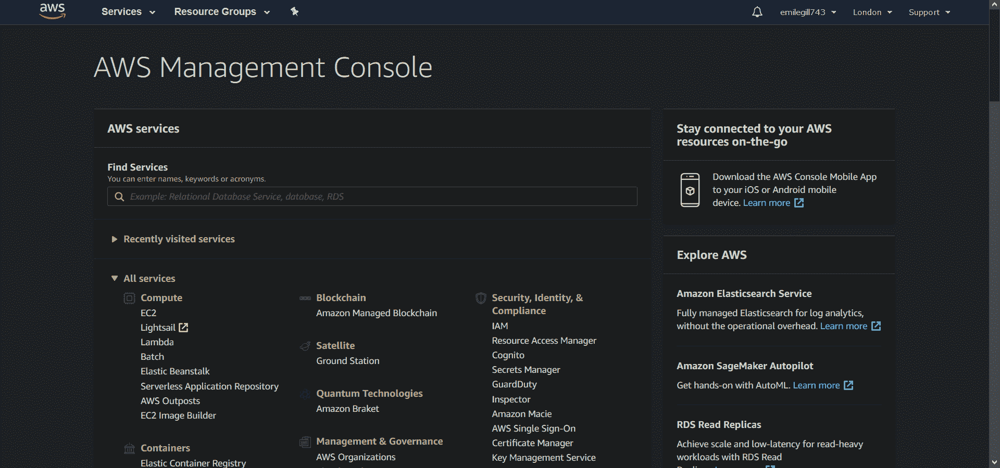
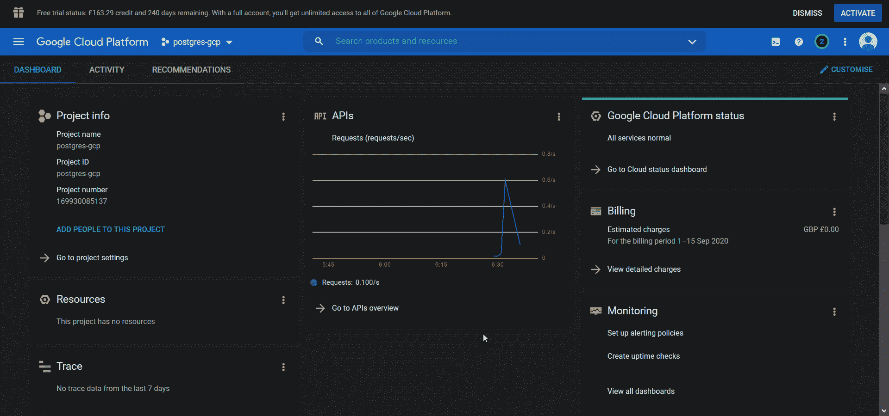
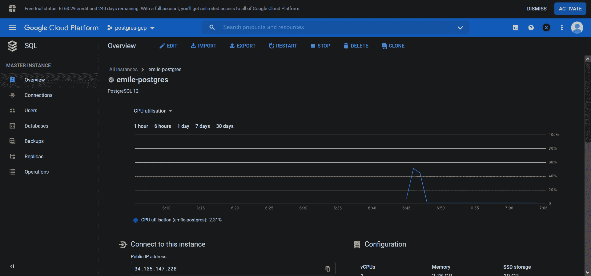
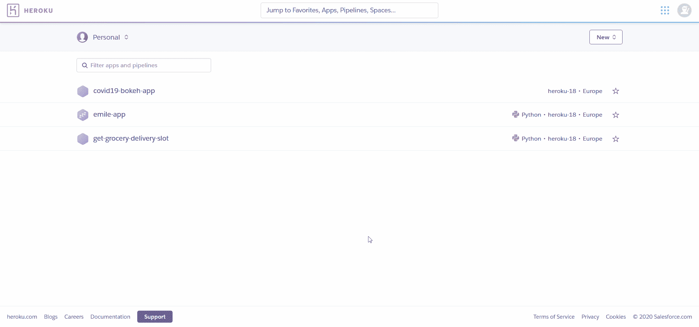
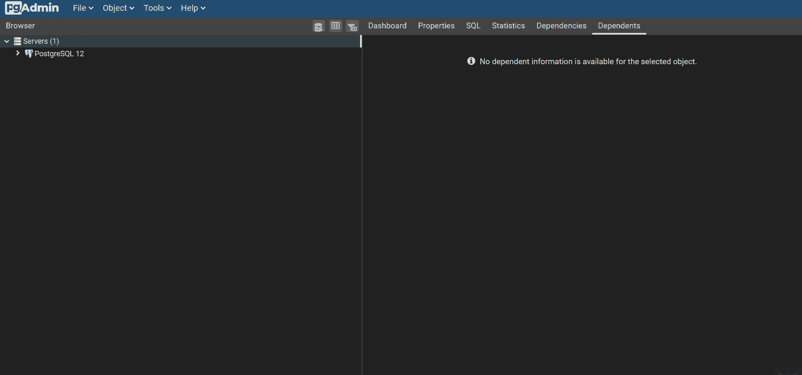

# 在云上设置 PostgreSQL 实例，免费⛅

> 原文：<https://towardsdatascience.com/setting-up-a-postgresql-instance-on-the-cloud-4ec4cf168239?source=collection_archive---------13----------------------->

## 比较 AWS、GCP 和 Heroku 的“免费层”产品，以建立一个云 Postgres 实例。

图片由[穆罕默德·哈桑](https://pixabay.com/users/mohamed_hassan-5229782/?utm_source=link-attribution&utm_medium=referral&utm_campaign=image&utm_content=3458033)拍摄，来自[皮克斯拜](https://pixabay.com/?utm_source=link-attribution&utm_medium=referral&utm_campaign=image&utm_content=3458033)

在[最近的一篇文章](/a-practical-guide-to-getting-set-up-with-postgresql-a1bf37a0cfd7)中，我详细介绍了如何开始使用本地安装的 PostgreSQL，使用 pgAdmin 和 SQLAlchemy 来建立数据库，加载数据并从 Python 脚本中查询数据。然而，有时候，仅仅有一个本地安装是不够的。如果我们想将一个 web 应用程序连接到我们的数据库，该怎么办？或者设置一个 ETL 过程，按照计划将数据从 API 提取到我们的数据库？

本文旨在向您展示任何人都可以完全免费地建立自己的云托管 Postgres 实例。我们将比较三大云提供商的产品:AWS、GCP 和 Heroku。

如果你想在继续之前看看我以前的文章，你可以在这里找到它:

 [## PostgreSQL 入门实用指南🐘

### Python 的 PostgreSQL、pgAdmin 和 SQLAlchemy 入门。将 SQL 融入 Python 的核心…

towardsdatascience.com](/a-practical-guide-to-getting-set-up-with-postgresql-a1bf37a0cfd7) 

# 亚马逊网络服务

卢卡斯·坎波伊在 [Unsplash](https://unsplash.com?utm_source=medium&utm_medium=referral) 上的照片

## AWS 自由层

AWS 可能是目前云计算领域最大的名字，它提供了一个丰富的“*免费层*”，非常适合想要学习和尝试预算的爱好者。在 12 个月里，我们可以免费使用所有这些。本文特别感兴趣的是，我们每月被提供 750 小时的 RDS，这是亚马逊的托管关系数据库服务。要访问 AWS 免费层，我们只需要注册一个帐户，并用信用卡验证；我们为期 12 个月的“*免费层*”访问将从此开始。

## 设置 RDS Postgres 实例

一旦您设置了 AWS 帐户并通过信用卡验证，要在 AWS RDS 上设置 Postgres 实例，我们只需从管理控制台导航到 RDS 页面，并填写简单的配置表单。

我们可以选择一个 Postgres 实例，然后选择“*自由层*”模板来开始。其他需要配置的重要选项有'*'和' ***备份'*** ，，这两个选项都应该禁用，以防止我们超出可能会产生费用的限制。我们还需要导航到' ***附加连接配置* '** ，并确保我们将' ***公共访问*** *'* 设置为' ***是'*** ，以允许我们从 EC2 实例外部访问数据库，即在我们的本地机器上。*

*为了连接到我们已经建立的数据库，我们首先需要从我们的 IP 地址启用入站流量。为此，我们可以编辑分配给 RDS 实例的安全组的' ***入站规则*** *'* ，以允许来自'***My IP****'*的流量。*

**

*一旦这一步完成，我们可以使用 pgAdmin 或 Python 连接到我们的数据库，正如我在[之前的帖子](/a-practical-guide-to-getting-set-up-with-postgresql-a1bf37a0cfd7?gi=dc41432e4ee7)中所解释的。我们所需要的是实例的端点和端口，这在我们的数据库页面的' ***连接性和安全性*** *'* 部分中提供。*

## *优势*

*   *免费一年(只要我们不超过使用限制)。*
*   *访问大量其他"*免费层*"云解决方案。*

## *不足之处*

*   *如果你不小心，很容易超过使用限制。*
*   *需要信用卡详细信息才能注册。*

# *GCP(谷歌云平台)*

**

*由 [Pero Kalimero](https://unsplash.com/@pericakalimerica?utm_source=medium&utm_medium=referral) 在 [Unsplash](https://unsplash.com?utm_source=medium&utm_medium=referral) 上拍摄的照片*

## *GCP 免费试用*

*谷歌云平台还有一个[“免费试用”选项](https://cloud.google.com/free)，相当于 AWS 免费层。尽管这里我们结合了两种产品:*

*首先，在注册和验证信用卡后，我们有资格在前 3 个月内获得 300 美元的固定预算。这样做的好处是，我们可以访问全套的谷歌云产品，因为我们只受限于我们账户上剩余的点数，而不是特定的产品。我们在这里还增加了安全性，我们不能在不知不觉中超过使用限制，因为我们必须明确地将我们的帐户升级到要收费的“付费帐户”([见此处](https://cloud.google.com/free/docs/gcp-free-tier))。*

*除此之外，如果我们升级到“*付费账户*，谷歌还提供几个“*永远免费*的产品。这些以类似于 AWS 免费层的方式运作，每月有津贴。只要我们保持在使用限制范围内，我们就不会被收费，而且我们还有一个额外的好处，那就是这项服务没有截止日期；与 AWS " *免费层*"不同，我们的访问权限永远不会过期，我们可以无限期地继续使用我们的配额。然而不幸的是，Postgres 不包括在 Google 提供的“*永远免费的*”产品中，因此，为了本文的目的，我们将限于 3 个月的“*免费试用*”选项。*

## *设置云 SQL Postgres 实例*

*要启动并运行 Postgres，我们只需创建一个新项目，在导航菜单中选择“ ***SQL*** ”，并选择一个 Postgres 实例。和以前一样，我已经禁用了自动备份功能以降低成本。*

**

*同样，我们需要允许访问我们的 IP 地址，以便我们可以在本地连接到这个实例。为此，我们可以导航到“ ***连接”*** ，在“ ***公共 IP*** ”下，我们可以添加我们希望允许访问的 IP 地址。*

**

*我们可以在实例页面的"***【Connect to this instance】****、* 下的" ***Overview"*** 部分中找到实例的公共 IP 地址，它与端口一起允许我们以通常的方式连接到数据库。*

## *优势*

*   *没有不必要费用的机会(除非我们明确升级到“*付费账户*”)。*
*   *获得全套 GCP 产品。*

## *不足之处*

*   *试用仅持续 3 个月。*
*   *一旦我们的信用没了，就永远没了。*

# *赫罗库*

**

*图片来自 [Pixabay](https://pixabay.com/?utm_source=link-attribution&utm_medium=referral&utm_campaign=image&utm_content=736887) 的 [Bessi](https://pixabay.com/users/bessi-909086/?utm_source=link-attribution&utm_medium=referral&utm_campaign=image&utm_content=736887)*

## *Heroku 自由层*

*Heroku 与我们之前讨论的两个例子略有不同，它更像是一个 PaaS(平台即服务),而不是一个云服务提供商。它倾向于提供更多可管理的、低配置的服务，如果你刚开始接触云技术领域，这很好，但是如果你是一个经验丰富的开发人员，这就有点限制了。对于给定的任务，Heroku 通常也会比 AWS/GCP 更昂贵，尽管它的简单性使它非常容易启动和运行——消除了 AWS 和 GCP 服务的广度有时可能带来的选择悖论。Heroku 还有一个额外的好处，它的“*免费层*”不需要信用卡验证，因此如果你担心产生费用，它提供了一个安全的赌注。也就是说，Heroku 在其" *Free Tier* " Postgres 实例中的 10，000 行限制对我们实际上可以用它做什么造成了很大的限制，使得它不太可能在项目中有用，除了简单的实验。*

## *设置 Heroku Postgres*

**

*建立一个 Heroku Postgres 数据库。*

*建立一个 Heroku Postgres 数据库再简单不过了。首先，我们需要在 Heroku 建立一个账户(不需要信用卡验证，但如果我们这样做，我们会得到额外的好处)。我们可以创建一个新的应用程序来存放我们的数据库，并导航到[data.heroku.com](https://data.heroku.com/)，在那里我们可以指定我们想要设置一个 Heroku Postgres 实例。然后，我们可以安装，将我们的数据库分配给我们创建的应用程序，并检查“ ***设置*** ”选项卡以显示我们的数据库凭证。*

*从这一点开始，与 pgAdmin 连接并查询我们的数据库的过程与 GCP 和 AWS 相同(在我以前的文章 [**中解释过，这里**](/a-practical-guide-to-getting-set-up-with-postgresql-a1bf37a0cfd7) )。这里唯一的警告是，我们需要将数据库访问限制到我们凭证中的特定数据库名称，否则我们将会看到许多其他数据库以及我们自己的数据库。*

**

*正在连接 Heroku Postgres 并使用 pgAdmin 限制 DB。*

## *优势*

*   *不需要卡验证。*
*   *不可能被收费，除非我们特别选择付费选项。*

## *不足之处*

*   *限于 10，000 行*
*   *Heroku 只提供 GCP 或 AWS 上可用服务的一小部分。*

# *结论*

**

*图片来自 [Pixabay](https://pixabay.com/?utm_source=link-attribution&utm_medium=referral&utm_campaign=image&utm_content=3048299)*

*现在我们已经看到了三种方法，通过这三种方法我们可以建立一个云托管的 Postgres 实例，根据您的需求和舒适程度，这三种方法各有利弊。*

*总的来说，如果你愿意遵守使用限制，我会推荐 AWS，因为我们有全年访问 RDS 和一套其他“*免费层*”服务的优势。如果你想在收费上更安全一点，但又拥有 AWS 提供的同等灵活性和成套服务，GCP 可能是一个不错的中间选择。最后，如果你是一个完全的初学者，或者想在没有信用卡验证承诺的情况下使用云 Postgres 数据库，Heroku 可能是一个很好的起点。*

****感谢阅读！****

*如果你喜欢这篇文章，可以看看我的其他文章:*

* [## PostgreSQL 入门实用指南🐘

### Python 的 PostgreSQL、pgAdmin 和 SQLAlchemy 入门。将 SQL 融入 Python 的核心…

towardsdatascience.com](/a-practical-guide-to-getting-set-up-with-postgresql-a1bf37a0cfd7)  [## 聪明的方法是找到一个杂货递送点

### 使用 Python、Heroku 和 Twilio 从一个杂货网站的 API 中抓取数据，并在出现插槽时获得文本通知…

towardsdatascience.com](/finding-a-grocery-delivery-slot-the-smart-way-f4f0800c4afe)  [## 使用 GitHub 页面，通过 5 个简单的步骤免费创建一个网站

### 不到 10 分钟就能在网上建立你的个人投资组合网站。

towardsdatascience.com](/launch-a-website-for-free-in-5-simple-steps-with-github-pages-e9680bcd94aa)*