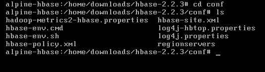
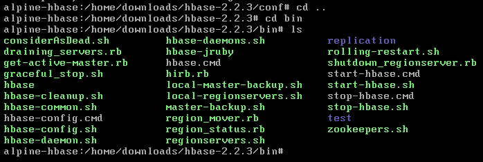
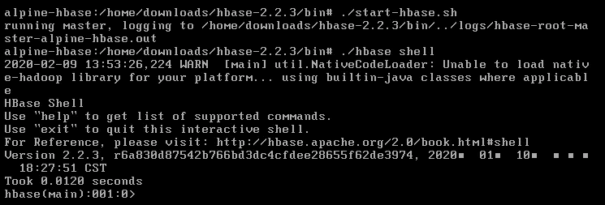
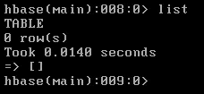
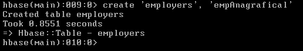
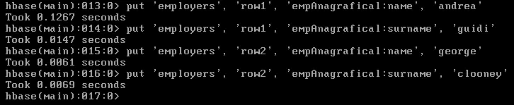
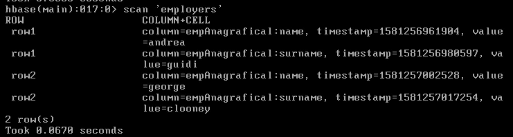
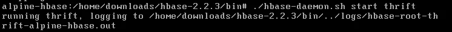
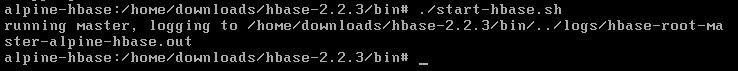
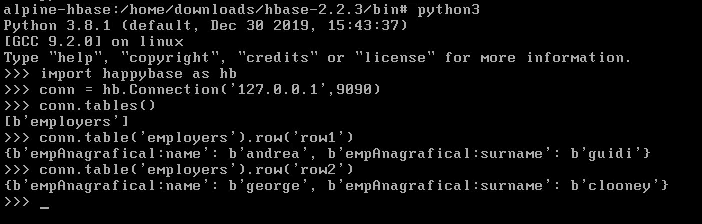

# 设置一个独立的 HBase 本地实例，并使用 Python Happybase 连接到它

> 原文：<https://towardsdatascience.com/setting-up-a-standalone-hbase-local-instance-and-connect-to-it-with-python-happybase-9751c9fe6941?source=collection_archive---------24----------------------->

最近，在我作为数据科学顾问开始的冒险中，我参与了一个项目，我们从中获取数据的数据库是著名的 Apache HBase。

HBase 是一个分布式的 Hadoop 非关系数据库，在处理海量数据方面非常强大。

在 HBase 数据模型中，行由行键标识，行键或多或少相当于关系主键，它们按行键排序。

列被分组到所谓的列族中，列族是列的物理和逻辑分组，一个族中的列与另一个族中的列分开存储，以便只能对您需要的数据执行查询。

你可以在这里阅读更多关于 HBase [的内容。](https://hbase.apache.org/book.html#faq)

我决定安装 HBase 本地实例的原因是，我必须带着无尽的好奇心生活，我喜欢尝试。

# 步骤 1:设置 Linux 虚拟机

我做的第一件事是用 [Alpine Linux](http://dl-cdn.alpinelinux.org/alpine/v3.11/releases/x86_64/alpine-standard-3.11.3-x86_64.iso) 创建一个 Linux 虚拟机，挂载在 VMWare 上。虚拟机运行后，我通过键入以下命令登录安装程序:

```
localhost login: root
setup-alpine
```

我按照 shell 指令操作，最后，我重启了系统。我需要 Java 支持才能让 HBase 工作，所以我安装了 openjdk8:

```
apk add openjdk8-jre
```

之后，为了方便起见，我在 */home* 中创建了几个文件夹:

```
cd home
mkdir downloads
mkdir andrea
cd downloads
```

现在我在 */home/downloads* 中，我可以下载 HBase 压缩文件夹，解压缩并更改目录:

```
wget [https://www.apache.org/dyn/closer.lua/hbase/2.2.3/hbase-2.2.3-bin.tar.gz](https://www.apache.org/dyn/closer.lua/hbase/2.2.3/hbase-2.2.3-bin.tar.gz)tar xzvf hbase-2.2.3-bin.tar.gzcd hbase-2.2.3
```

这个文件夹里面有两个重要的文件夹: *bin* 和 *conf* 。


我走进了 *conf* :



然后将**h base _ env . sh**内的 **JAVA_HOME** 环境变量修改为*/usr/lib/JVM/open JDK 8-JRE*(文件夹可能不同):

```
export JAVA_HOME=/usr/lib/jvm/openjdk8-jre
```

此外，对于独立的 hbase，我用示例 1 中的[这里的](https://hbase.apache.org/book.html#quickstart)报告了文件 *hbase-site.xml* 的内容。

然后，我向上导航一个文件夹，回到 Hbase 主文件夹，转到 *bin* 目录:



要检查 HBase 是否正常工作:

```
./start-hbase.sh./hbase shell
```



瞧啊！

要查看表格，请键入 *list:*



当然，这里没有表，但是我们可以按照以下约定创建一个表:

```
create 'table_name','columnFamily1',...,'columnFamilyN'
```

在外壳中:



现在让我们添加两行:



要检索该表，让我们运行一次扫描:



现在，表就在那里，我们可以使用 Python 包 **Happybase** 连接到它，这个包是使用 Python Thrift 构建的。

首先，停止 HBase 实例，安装 **Python 3** 和 **Happybase** 包:

```
apk add python3pip install happybase
```

然后，启动节俭服务器:



和 HBase:



现在，我们打开一个交互式 Python 会话，并连接到 HBase，以查看使用 Happybase APIs 时一切正常:



感谢您的阅读，有任何问题请联系我！