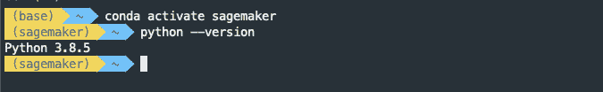
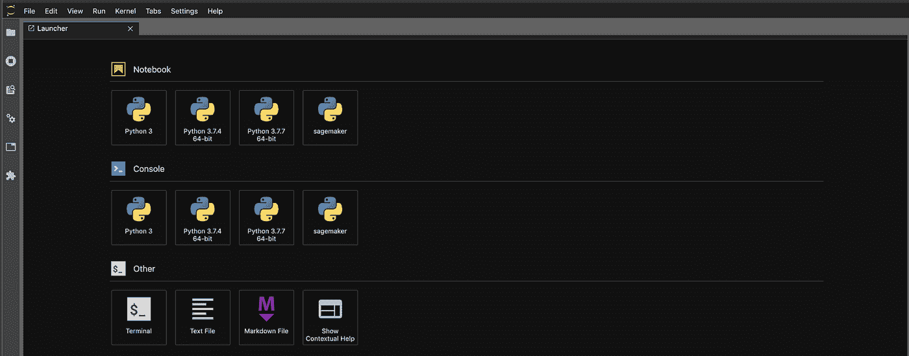
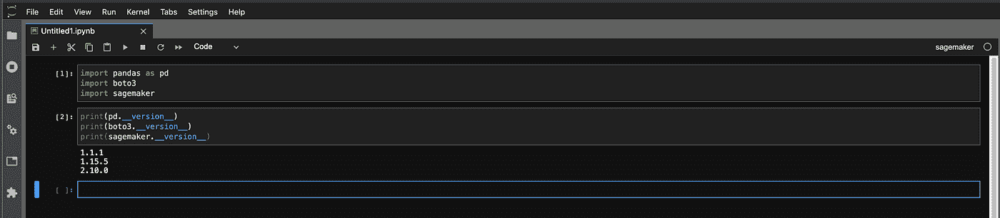
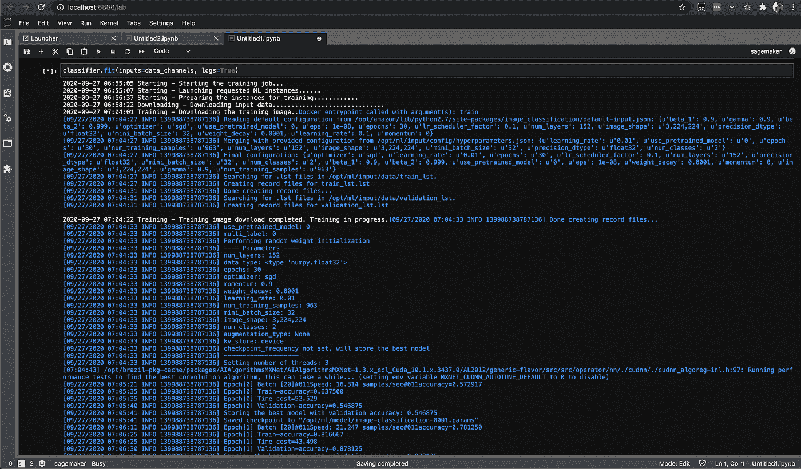

# 在本地机器上设置 Amazon SageMaker 环境

> 原文：<https://towardsdatascience.com/setting-up-amazon-sagemaker-environment-on-your-local-machine-7329e0178adc?source=collection_archive---------10----------------------->


埃里克·马塞利诺在 [Unsplash](https://unsplash.com?utm_source=medium&utm_medium=referral) 上的照片

亚马逊 SageMaker 不仅仅是托管的 Jupyter 笔记本电脑，它是一种完全托管的服务，使您能够构建、训练、优化和部署机器学习模型。一个常见的误解是，为了使用这些服务，您需要一个 SageMaker Notebook 实例或 SageMaker (Studio)笔记本，特别是当您开始使用 SageMaker 时。事实上，您可以直接从您的本地机器或者甚至从您喜欢的 IDE 中启动所有这些服务。

在我们继续之前，让我们考虑一下如何与 Amazon SageMaker 服务交互。您有两个 API

**SageMaker Python SDK** —这是 Python 中的一个高级 API，它抽象了构建、训练和部署机器学习模型的代码。具体来说，它提供了第一类或内置算法的估计器以及支持的框架，如 TensorFlow、MXNET 等。在大多数情况下，您将使用它来与您的交互式机器学习任务进行交互。

**AWS SDK** —这是一个低级 API，用于与所有受支持的 AWS 服务进行交互，并不特定于 SageMaker。AWS SDK 可用于大多数流行的编程语言，如 Java、Javascript、Python (boto)等。在大多数情况下，您将使用这个服务级 API 来为自动化创建资源，或者与 SageMaker Python SDK 不支持的其他 AWS 服务进行交互。

# 为什么是本地环境

成本可能是第一个出现的问题，但它也是使用自己的 IDE 的灵活性，以及离线工作的能力，并在您准备好的时候启动 AWS 云上的工作。

# 本地环境如何工作

您像平常一样编写代码来构建您的模型，但不是 SageMake Notebook 实例(或 SageMaker Studio Notebook ),而是在运行 Jupyter 的本地机器上或从您的 IDE 中完成。当您准备好了，就可以开始在 AWS 上进行 SageMaker 实例的培训了。一旦训练完成，模型就存储在 AWS 中。然后，您可以从本地机器开始部署或运行批处理转换作业。

# 使用 conda 的环境设置

建议您将其设置为 Python 虚拟环境。在我们的例子中，我们使用`conda`来管理我们的虚拟环境，但是您也可以使用`virtualenv`。亚马逊 SageMaker 也使用`conda`来管理环境和包。假设你已经有了`conda`的设置，如果没有，这里头[处](https://docs.conda.io/projects/conda/en/latest/user-guide/install/index.html)

## **创建新的 conda 环境**

```
conda create -n sagemaker python=3
```

## **激活并验证环境**



作者图片

## 安装标准数据科学包。

您可以使用`conda`或`pip`来安装软件包。我们会坚持`conda`

```
conda install -y pandas numpy matplotlib
```

## **安装 AWS 软件包**

安装 AWS SDK for Python (boto)，awscli 和 SageMaker Python SDK。SageMaker Python SDK 不作为`conda`包提供，所以我们在这里将使用`pip`

```
pip install boto3 awscli sagemaker
```

如果您是第一次使用`awscli`，您必须对其进行配置。关于如何配置`awscli`请参见[这里的](https://docs.aws.amazon.com/cli/latest/userguide/cli-chap-configure.html)

默认情况下，将安装 SageMaker Python SDK 的版本 2。请务必检查 SDK 版本 2 中的更改，特别是这里的重大更改。

## **安装 Jupyter 并创建一个内核**

```
conda install -c conda-forge jupyterlab
python -m ipykernel install --user --name sagemaker
```

## **验证环境并检查版本**

通过发出一个`jupyter lab`来启动 Jupyter，并选择上面创建的 sagemaker 内核



作者图片

接下来验证笔记本中的版本，以确保一切如预期。



作者图片

# 建造和训练

现在，您可以开始在本地构建您的模型，并在准备就绪后开始 AWS 培训

## **进口包装**

导入必要的包并指定角色。这里的关键区别是直接指定角色的`arn`而不是`get_execution_role()`。因为您是使用您的 AWS 凭证从您的本地机器运行它，而不是使用一个附加了角色的笔记本实例，所以 get_execution_role()将不起作用。

## 创建评估者

像平常一样创建估计器并设置*超参数*。在下面的例子中，我们使用内置的图像分类算法训练一个图像分类器。您还可以指定 SageMaker 实例的类型以及希望用于训练的实例数量

## **培训渠道**

指定培训渠道，同样，与您在笔记本实例上的操作相比，这里没有任何变化

## 开始培训工作

在 SageMaker 上启动培训作业，调用 fit 方法，该方法启动 AWS 上 SageMaker 实例上的培训作业

```
classifier.fit(inputs=data_channels, logs=True)
```



作者图片

您可以使用`[list-training-jobs](https://docs.aws.amazon.com/cli/latest/reference/sagemaker/list-training-jobs.html)`来检查培训工作的状态

就是这样。在这里，我们看到了如何在本地设置 SageMaker 环境，并使用 Jupyter 在本地机器上构建机器学习模型。除了使用 Jupyter，您还可以从您的 IDE 中做同样的事情。

快乐训练！