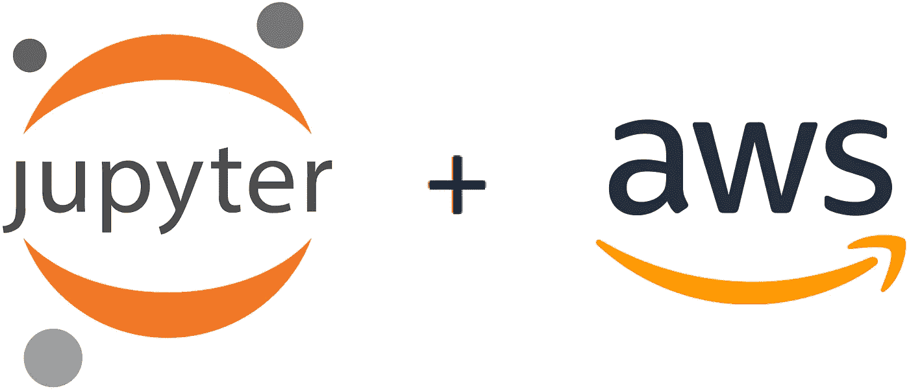

# 在 AWS 上设置 Jupyter

> 原文：<https://towardsdatascience.com/setting-up-jupyter-on-aws-6b3018dff41f?source=collection_archive---------21----------------------->

## 一个可脚本化的命令行列表，用于在 AWS 中安全、经济高效地部署 Jupyter，并增加了练习



图片来源:[commons.wikimedia.org](https://commons.wikimedia.org/wiki/File:Jupyter_logo.svg)和[aws.amazon.com](https://a0.awsstatic.com/libra-css/images/logos/aws_logo_smile_1200x630.png)

*在我之前的帖子中，我给出了在 Google Cloud* *上设置 Jupyter 的相同说明——如果你更喜欢 Google Cloud，可以去看看那篇文章。*

AWS 是三巨头之一(猜猜，其他是谁？)强大的当代云环境，为数据科学家和数据工程师提供了大量很酷的服务和工具。作为一名数据科学家，当您在本地笔记本电脑上运行分析项目时，您经常会面临技术资源方面的挑战，比如下载大型数据集的网络速度、磁盘大小限制、CPU 能力限制或内存限制。在当代的云环境中，对于这些障碍，您基本上都有简单的解决方案。您的网络连接速度很快。你总是可以用小的、精益的和吝啬的资源开始任何任务。每当你面临磁盘存储问题时，你只需点击几下鼠标，就可以租用一个更大的磁盘。或者你可以将数据集加载到 S3，然后通过 Amazon Athena 查询。或者使用一些其他合适的存储服务来进行成本有效的处理。CPU 能力太小？不用担心，将您的实例类型更改为具有更多 CPU 的类型(当您不再需要它时，可以立即缩减)。内存不足？几次点击之后，你就有了更多的内存，同样，如果你不再需要它，你可以把它拿回来。对于分布式计算来说，任何类型的集群形成通常也只需点击几下鼠标，这时您只需知道要做什么:启动集群以执行更繁重的计算任务，将结果保存在集群外部的某个存储服务中，并关闭集群以防止其闲置(并产生不必要的成本)。

如果你有使用 Jupyter Notebook 的经验，并且对类似 Debian 的环境感到舒适，那么你可能会发现下面的说明很有帮助。

# 安装并设置 AWS CLI v2(如果尚未安装)

如果您还没有设置 AWS 命令行界面(CLI ),请进行设置。安装 CLI 并为其设置访问密钥，使其能够正常工作。其余说明假设您已经设置了 CLI 和访问密钥。

说明如下:

1.[安装 CLI](https://docs.aws.amazon.com/cli/latest/userguide/install-cliv2.html)

2.[设置访问键](https://docs.aws.amazon.com/cli/latest/userguide/cli-chap-configure.html#cli-quick-configuration)

从这一点开始，一切都可以从本地计算机的命令行 shell 界面进行。对我来说，下面提供的说明既适用于 Windows 上的 Git Bash，也适用于 Debian Linux。

# 创建一个密钥对(如果还没有)

3.根据需要调整密钥名、区域和输出文件名(区域必须与您计划的 Jupyter VM 位置相匹配，并且需要 chmod 400，否则 Debian ssh 客户端会阻止它的使用):

```
aws ec2 create-key-pair \
        --key-name my-jupyter-kp \
        --region eu-north-1 \
        --query 'KeyMaterial' \
        --output text \
    > my_jupyter_private_key.pemchmod 400 my_jupyter_private_key.pem
```

# 启动并设置合适的虚拟机

3.创建并运行虚拟机。我在这里使用`t3.micro`作为实例类型，因为在编写这些指令时，`t3.micro`是符合自由层条件的(您可以根据自己的使用需求随意切换，但要注意成本):

```
IMAGE_ID=`aws ec2 describe-images \
        --owners aws-marketplace \
        --filters "Name=name,Values=debian-10-amd64*" \
        --query 'sort_by(Images, &CreationDate)[-1].ImageId' \
        --output text`AWS_MY_JUPYTER_INSTANCE_ID=`aws ec2 run-instances \
        --image-id $IMAGE_ID \
        --count 1 \
        --instance-type t3.micro \
        --key-name my-jupyter-kp \
        --tag-specifications 'ResourceType=instance,\
                Tags=[{Key=Name,Value=my-jupyter-vm}]' \
        --query 'Instances[0].InstanceId' \
        --placement AvailabilityZone=eu-north-1a \
        --output text`
```

4.等待虚拟机准备就绪。在我的例子中，在状态检查开始在新创建的虚拟机的 EC2 仪表板 UI 上显示“2/2 检查通过”之前，花了 2 分多钟。

5.**注意:**从这里开始，我们假设`AWS_MY_JUPYTER_INSTANCE_ID`变量成立。如果出于某种原因，您的 shell 终端关闭了，然后您重新打开它，您需要重新初始化该变量，以便下面的命令能够工作。我建议您备份您的实例 ID(这样，如果需要，您可以稍后用`AWS_MY_JUPYTER_INSTANCE_ID=<your instance id>`重新初始化它):

```
# Take a backup note of the value of this variable:
echo $AWS_MY_JUPYTER_INSTANCE_ID
```

6.我们需要设置适当的安全组(防火墙规则)来启用 ssh 连接:

```
VPC_ID=`aws ec2 describe-instances \
        --instance-ids $AWS_MY_JUPYTER_INSTANCE_ID \
        --query 'Reservations[0].Instances[0].VpcId' \
        --output text`SG_ID=`aws ec2 create-security-group \
        --group-name my-jupyter-sg \
        --description "My Jupyter security group" \
        --vpc-id $VPC_ID \
        --query ‘GroupId’ \
        --output text`aws ec2 authorize-security-group-ingress \
        --group-id $SG_ID \
        --protocol tcp \
        --port 22 \
        --cidr 0.0.0.0/0aws ec2 modify-instance-attribute \
        --instance-id $AWS_MY_JUPYTER_INSTANCE_ID \
        --groups $SG_ID
```

7.测试 ssh 连接是否正常工作(对 ssh 指纹问题回答“是”):

```
DNS_NAME=`aws ec2 describe-instances \
        --instance-ids $AWS_MY_JUPYTER_INSTANCE_ID \
        --query 'Reservations[0].Instances[0].PublicDnsName' \
        --output text`ssh -i my_jupyter_private_key.pem admin@$DNS_NAMEexit # to get back to your local compyter prompt
```

8.为了能够在以后方便地重新启动虚拟机(这里我们假设我们上面创建的私钥文件在当前工作目录中，并且一直在那里—如果密钥文件的位置不同，那么适当地调整这里构造的别名):

```
echo >> ~/.bashrcecho "AWS_MY_JUPYTER_INSTANCE_ID=$AWS_MY_JUPYTER_INSTANCE_ID" \
    >> ~/.bashrcecho "AWS_MY_JUPYTER_KEY=\"`pwd`/my_jupyter_private_key.pem\"" \
    >> ~/.bashrcecho "alias aws_start_my_jupyter_vm=\"aws ec2 start-instances \\
        --instance-ids \$AWS_MY_JUPYTER_INSTANCE_ID\"" \
    >> ~/.bashrcecho "alias aws_connect_my_jupyter_vm=\"
        DNS_NAME=\\\`aws ec2 describe-instances \\
            --instance-ids \$AWS_MY_JUPYTER_INSTANCE_ID \\
            --query 'Reservations[0].Instances[0].PublicDnsName' \\
            --output text\\\`
        ssh -i \\\"\$AWS_MY_JUPYTER_KEY\\\" admin@\\\$DNS_NAME\"" \
    >> ~/.bashrc
```

9.测试新创建的别名:

```
aws ec2 stop-instances --instance-ids $AWS_MY_JUPYTER_INSTANCE_ID
```

等到实例正确停止。您可以从 AWS EC2 仪表板检查它——实例状态必须显示“已停止”。我用了不到一分钟。

```
exit
```

重新打开本地 shell 命令提示符(让它重新加载`~/.bashrc`文件)。输入以下命令:

```
aws_start_my_jupyter_vm
```

您应该在 json 中看到一条消息(取决于您的 AWS CLI 配置),说明您的 VM 的当前和以前的状态。

**等待虚拟机启动。**这可能需要大约 2 分钟，您可以从 AWS EC2 仪表板上看到:当状态检查显示“2/2 检查通过”时，实例准备好执行下一个命令:

```
aws_connect_my_jupyter_vm
```

这将通过 ssh 将您带到 VM 命令提示符。

10.您的 VM 现在已经准备好了，您现在可以随时从本地计算机的命令行轻松地重新启动它，以便继续您的工作。

# 设置 Jupyter

我们将安装 JupyterLab，Jupyter 笔记本的新版本。

11.连接到您的虚拟机(如果您在上面的命令后退出):

```
aws_connect_my_jupyter_vm
```

12.在虚拟机命令提示符下运行以下命令:

```
sudo apt update
sudo apt upgrade **# Hit 'Y' and Enter key when asked**
sudo apt install python3-pip **# Hit 'Y' and Enter key when asked** sudo pip3 install --upgrade jupyterlab boto3
sudo mkdir -p /opt/my_jupyterlab/bin
sudo sh -c \
    'echo "#!/bin/bash" > /opt/my_jupyterlab/bin/run_jupyterlab'
sudo chmod a+x /opt/my_jupyterlab/bin/run_jupyterlab
```

**重要！！！！**在下一个命令中，出于安全原因，需要使用-IP = 127 . 0 . 0 . 1 来阻止任何外部访问尝试，特别是因为我们在这里关闭了密码和安全令牌，以方便使用。

```
sudo sh -c 'echo "jupyter lab \\
        --ip=127.0.0.1 \\
        --NotebookApp.token=\"\" \\
        --NotebookApp.password=\"\" \\
        --NotebookApp.allow_origin=\"*\"" \
    >> /opt/my_jupyterlab/bin/run_jupyterlab'exit
```

13.带有 Jupyterlab 的虚拟机现在已经配置好了，您现在回到了本地计算机的命令行。让我们将使 JupyterLab 易于启动和使用的要点联系起来:

```
echo "alias aws_connect_my_jupyterlab=\"
        DNS_NAME=\\\`aws ec2 describe-instances \\
            --instance-ids \$AWS_MY_JUPYTER_INSTANCE_ID \\
            --query 'Reservations[0].Instances[0].PublicDnsName' \\
            --output text\\\`
        ssh -i \\\"\$AWS_MY_JUPYTER_KEY\\\" admin@\\\$DNS_NAME \\
            -L 8888:localhost:8888 \\
            -t '/opt/my_jupyterlab/bin/run_jupyterlab'\"" \
    >> ~/.bashrcexit
```

14.再次打开本地命令提示符(让它重新加载`~/.bashrc`文件)，测试我们刚刚创建的命令行别名:

```
aws_connect_my_jupyterlab
```

15.打开浏览器，在地址栏中输入 [http://localhost:8888/](http://localhost:8888/) 。

16.**瞧！你在 JupyterLab！**您已经安装了 AWS python API(参见上面的 pip 3 install-upgrade 命令)。您的 JupyterLab python 环境已经设置好，并且能够与 AWS 服务进行交互(在一定程度上，您已经通过 CLI 访问密钥向正在使用的帐户授予了权限)。

# 停止虚拟机以避免不必要的云成本

17.每当您停止使用笔记本电脑时，不要忘记关闭虚拟机，以避免不必要的云成本。要从本地计算机命令行停止虚拟机，请执行以下操作:

```
aws ec2 stop-instances --instance-ids $AWS_MY_JUPYTER_INSTANCE_ID
exit
```

# 重新启动已经设置好的 Jupyter 虚拟机

18.当您稍后回到笔记本上工作时，打开本地命令提示符，使用以下命令重新启动虚拟机:

```
aws_start_my_jupyter_vm
```

19.等待虚拟机启动。这可能需要大约 2 分钟—您可以从 AWS EC2 仪表板上看到:当状态检查显示“2/2 检查通过”时，该实例准备好执行下一个命令:

```
aws_connect_my_jupyterlab
```

20.打开浏览器，在地址栏中输入 [http://localhost:8888/](http://localhost:8888/) 。

如果您不想启动 JupyterLab，而只是一个到 VM 的 shell 连接，那么您可以使用另一个命令行别名:`aws_connect_my_jupyter_vm`

# 添加额外磁盘

虚拟机根文件系统链接到的默认卷大小为 8gb。我建议让它保持原样，只有当您需要处理更大的数据集时，才向虚拟机添加额外的 EBS 卷。如果您已经完成了项目，将额外的空间作为单独的磁盘可以让您放下并删除它(在删除磁盘之前，将您想要保留的文件备份到 S3)。根据官方记录，AWS 免费层包括 30GB 的存储空间，但超出免费层的服务在典型的个人预算水平下可能会相当昂贵，所以让它们闲置，让你按月付费是没有意义的。同样，由于同样的成本原因，在创建另一个持久磁盘之前，考虑一下您实际需要多大的磁盘。确切的定价取决于您在创建 EBS 卷时可以调整的多个参数，但是 200GB 卷(带每日快照)的价格可能会超过每月 30 美元，而 25GB 对于您当前的项目来说可能已经足够大了(每月 6 美元)？

# 家庭作业的附加练习

以上内容足以让您开始使用 AWS 中的 Jupyter 环境。但是，为了迫使你思考，练习一些 AWS 修补程序，并增强你对环境的信心，这里有一些额外的练习，可以让你的生活更加轻松，我建议你尝试自己解决。请随意在下面张贴您的解决方案描述或您可能得到的问题作为回应，我将尝试对它们进行评论以获得您的反馈。

## 练习 1

使 Jupyter 虚拟机的启动更加方便。改进本地命令行别名检查虚拟机是否已经运行的方式——如果没有，则自动启动虚拟机，等待它启动并准备好，并在其中启动 Jupyter。这样，您将消除启动虚拟机并手动等待其准备就绪的单独手动步骤。

## 练习 2

改进您的本地命令行别名，在使用 ctrl+c 停止 Jupyter 服务后，它还会让您停止虚拟机(默认操作是停止虚拟机)，这样您可以避免因意外忘记关闭虚拟机而导致的不必要的云成本。

## 练习 3

自动部署新的 Jupyter VM，避免每次创建时手动复制粘贴上面的所有命令。如果您想为不同的项目维护单独的环境，这种方式会使您的生活更加灵活和敏捷。有几种方法可以做这件事。这里有几个想法(选择你的选择并实现它)。

**Ex。4 备选方案 1。**编写上述指令中的所有内容，以便从一个命令行命令中触发。

例如。4 备选方案 2。创建一个 Jupyter 虚拟机映像，当您想要启动另一个独立于其他项目的干净的 Jupyter 环境时，可以将它用作模板。

**尽情享受吧！**