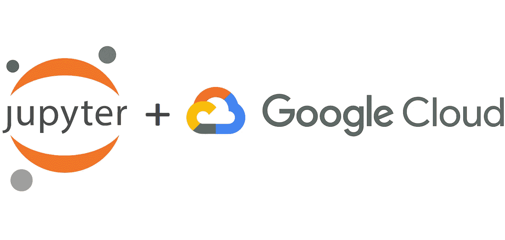
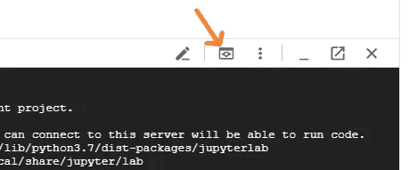
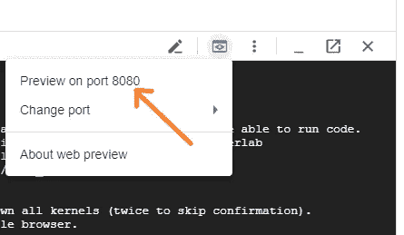

# 在 Google Cloud 上设置 Jupyter

> 原文：<https://towardsdatascience.com/setting-up-jupyter-on-google-cloud-6ad75562ac1c?source=collection_archive---------23----------------------->

## 一个可脚本化的命令行列表，用于在 Google Cloud 中安全、经济地部署 Jupyter，并增加了练习



图片来源:commons.wikimedia.org 的 Jupyter 和谷歌云的标志

***更新:*** *在我的下一篇文章中，我给出了关于* [*在 AWS 上设置 Jupyter 的等效说明*](/setting-up-jupyter-on-aws-6b3018dff41f)*——如果你对 AWS 更感兴趣，可以去看看那篇文章。*

Google Cloud 是一个伟大、强大和快速发展的当代云环境，它为数据科学家和数据工程师提供了大量很酷的服务和工具。作为一名数据科学家，当您在本地笔记本电脑上运行分析项目时，您经常会面临技术资源方面的挑战，比如下载大型数据集的网络速度、磁盘大小限制、CPU 能力限制或内存限制。在当代的云环境中，对于这些障碍，您基本上都有简单的解决方案。您的网络连接速度很快。你总是可以用小的、精益的和吝啬的资源开始任何任务。每当你面临磁盘存储问题时，你只需点击几下鼠标，就可以租用一个更大的磁盘。或者，您可以将数据集加载到 BigQuery 或其他合适的存储服务中，以便进行经济高效的处理。CPU 能力太小？别担心，给你的虚拟机增加更多的 CPU(当你不再需要它的时候，你可以立即缩减)。内存不足？几次点击之后，你就有了更多的内存，同样，如果你不再需要它，你可以把它拿回来。对于分布式计算来说，任何类型的集群形成通常也只需点击几下鼠标，这时您只需知道要做什么:启动集群以执行更繁重的计算任务，将结果保存在集群外部的某个存储服务中，并关闭集群以防止其闲置(并产生不必要的成本)。

# Jupyter vs 谷歌云数据实验室

由于目前大多数数据科学家都习惯于使用 Jupyter Notebook 或 Jupyter lab(Jupyter Notebook 的新版本)，任何数据科学家在开始使用 Google Cloud 时面临的首要问题之一是如何以一种合理方便的方式设置它，并避免不必要的云成本。谷歌云吸引你注意的一点是他们的 Datalab 产品，这基本上是谷歌对 Jupyter 笔记本电脑的翻新，部署在一个专用的虚拟机中，添加了额外的持久磁盘和一些额外的服务(如自动备份和 Ungit)。

使用 GC Datalab 而不是您自己部署的 Jupyter 的一个主要优点是，它的部署是为您准备好的，并且是自动化的——您只需在云外壳中键入特定的命令行，等待一段时间进行配置，然后您就可以通过 GC Cloud Shell Web Preview 功能、SDK-s(用于与已部署的不同云服务轻松集成)轻松访问整个 UI 环境。因此，快速使用气相色谱数据实验室非常容易。

然而，这种快速入门的便利性也带来了一些缺点，如 Linux 底层环境和设置过于受限和定制化(不是一个熟悉的 Debian 系列——没有基于 apt*的工具来安装额外的包),以及一些其他意想不到的不必要的麻烦，至少对我来说是这样。因此，我想出了一种建立 Jupyter Lab(Jupyter 笔记本的新版本)的方法，这种方法实现了类似的(甚至更好的)易用性和云集成，并且成本更低(通过避免 Datalab 附带的强制性额外持久磁盘，而实际上并不总是必要的)。从那以后，在谷歌云环境下工作时，我更喜欢使用 Jupyter Lab 而不是 Datalab。

如果你有使用 Jupyter Notebook 的经验，并且对类似 Debian 的环境感到舒适，那么你可能会发现下面的说明很有帮助。

# Jupyter 安装说明

**出于可脚本化/可自动化的目的，以下指令依赖于 Google Cloud Shell 命令行，即我们避免通过云控制台 UI 做同样的事情。**

1.[创建](https://cloud.google.com/resource-manager/docs/creating-managing-projects)或者选择一个想要部署 Jupyter 虚拟机的云项目。

2.打开 Google 云控制台，从云控制台激活云壳。您可以通过云控制台右上角的工具栏按钮来完成此操作:


单击以启动云壳

3.在 Cloud Shell 命令提示符下，输入以下命令(根据需要调整项目名称、实例虚拟机名称、区域和机器类型——我建议保留这里的其他选项，除非您知道自己要做什么):

```
PROJECT_NAME=my-project-name **#change this to actual project name**
VM_NAME=my-jupyterlab
ZONE=europe-west1-b
MACHINE_TYPE=n1-standard-1gcloud compute --project=$PROJECT_NAME \
    instances create $VM_NAME \
        --zone=$ZONE \
        --machine-type=$MACHINE_TYPE \
        --maintenance-policy=MIGRATE \
        --image-family=debian-10 \
        --image-project=debian-cloud \
        --scopes=cloud-platformgcloud compute ssh my-jupyterlab --zone europe-west1-b
```

4.上面的最后一个命令会将您带到新创建的虚拟机的命令提示符下。在那里输入以下命令:

```
sudo apt update
sudo apt upgrade **# Hit 'Y' and Enter key when asked**
sudo apt install python3-pip **# Hit 'Y' and Enter key when asked**
sudo pip3 install --upgrade jupyterlab google-api-python-client
sudo mkdir -p /opt/my_jupyterlab/bin
sudo sh -c \
    'echo "#!/bin/bash" > /opt/my_jupyterlab/bin/run_jupyterlab'
sudo chmod a+x /opt/my_jupyterlab/bin/run_jupyterlab
```

**重要！！！**在下一个命令中，出于安全原因，`--ip=127.0.0.1`是必需的，以阻止任何外部访问尝试，特别是因为我们在这里关闭了密码和安全令牌，以实现与 Datalab 相同的使用便利性。当您以后更加熟悉 Google Cloud 并了解如何配置网络时，为了增加安全性，您可以完全关闭虚拟机的外部 IP，并创建防火墙设置，以便虚拟机仍然能够与外部世界通信(安装软件包和下载数据集需要)。然而，为了不使防火墙功能的当前说明过于复杂，这是已经实现的设置，您可以通过 GC 帐户验证访问您的笔记本电脑，而无需 Jupyter 进行额外的密码交互，同时不会将您的笔记本电脑暴露给公众:

```
sudo sh -c 'echo "jupyter lab \\
        --ip=127.0.0.1 \\
        --NotebookApp.token=\"\" \\
        --NotebookApp.password=\"\" \\
        --NotebookApp.allow_origin=\"*\"" \
    >> /opt/my_jupyterlab/bin/run_jupyterlab'exit
```

5.带有 JupyterLab 的虚拟机现在已经配置好了，使用上面最后的`exit`命令，您可以返回到云 Shell 命令行。让我们将使 JupyterLab 易于启动和使用的要点联系起来:

```
echo "" >> .bashrc
echo "alias my_jupyterlab=\"gcloud compute ssh my-jupyterlab \\
        --zone europe-west1-b \\
        -- -L 8080:localhost:8888 -4 \\
        '/opt/my_jupyterlab/bin/run_jupyterlab'\"" \
    >> .bashrcexit
```

6.上面最后的`exit`命令关闭了云外壳。再次打开云 Shell，输入以下命令来测试我们刚刚创建的命令行别名:

```
my_jupyterlab
```

7.上面的最后一个命令打开了到新创建的虚拟机的 ssh 连接，创建了云控制台 Web 预览特性所需的隧道，并在虚拟机内部启动了 JupyterLab 服务——您应该可以在控制台 Shell 终端输出中看到 JupyterLab 的日志输出。如果您在这里按 Ctrl+C 并终止 JupyterLab 服务，连接将关闭，您将返回到控制台 Shell 命令行提示符。但是，如果您希望下一步也能成功，请不要这样做(即不要按 Ctrl+C——如果您按了，请再次输入上面的命令:)。

8.要打开 JupyterLab UI，请单击云壳工具栏上的“Web 预览”按钮，然后单击“在 8080 端口上预览”



1.单击打开 Web 预览菜单



2.单击“在端口 8080 上预览”

9.瞧！你在 JupyterLab！您已经安装了谷歌云的 python API(参见上面的`pip3 install --upgrade`命令)，并且它可以访问谷歌云服务(参见上面创建虚拟机时的`--scopes=cloud-platform`选项)。您的 JupyterLab python 环境与所有 Google 云服务完全集成，并且能够以与 Datalab 相同的方式与这些服务进行交互。

从这里开始，你可以创建和编辑笔记本，与底层的 Debian 平台交互(通过笔记本命令行 magic 或者从 JupyterLab 启动一个终端)，或者在基于 Debian 的 Jupyter 环境中做任何你觉得舒服的事情。添加任何你觉得有必要的包(`apt install git`；`pip3 install pandas`；等等)。

# 重新启动已经设置好的 Jupyter 虚拟机

每当您停止使用笔记本电脑时，不要忘记关闭虚拟机，以避免不必要的云成本。当您稍后回到笔记本上工作时，请执行以下操作:

1.重新启动虚拟机。

2.打开云控制台命令提示符。

3.输入以下命令:

```
my_jupyterlab
```

4.点击云壳工具栏上的“Web 预览”按钮，然后点击“8080 端口预览”。

# 添加额外的永久磁盘

默认虚拟机主磁盘大小为 10GB。我建议让它保持原样，只有当您需要处理更大的数据集时，才向 VM 添加一个额外的持久磁盘。如果您已经完成了项目，将该额外空间作为额外的磁盘让您有机会丢弃并删除它(在删除磁盘之前，将您想要保留的那些文件备份到云存储中)。在典型的个人预算水平下，永久磁盘是一项相当昂贵的服务，因此让它们闲置，让您按月付费是没有意义的。同样，由于同样的成本原因，在创建另一个持久磁盘之前，考虑一下您实际需要多大的磁盘。默认情况下，Datalab 会为您创建一个 200GB 的磁盘(在撰写本文时，普通 200GB SSD 的欧洲-西方 1 价格为€31.30 英镑/月)，但也许 25GB 对于您当前的项目已经足够大了(€3.91 英镑/月)？

你可以在[这里](https://cloud.google.com/compute/docs/disks/add-persistent-disk)找到给虚拟机添加持久磁盘的说明。

# 解决纷争

基于 Google Cloud Web Preview 的 web UI 隧道可能会发生的一件事情是，您突然看到 Jupyter web UI 失去了与 Jupyter 服务的连接(顺便说一下，同样的事情可能也会发生在 Datalab 上)。在这种情况下，请检查您的云 Shell 是否仍然连接着，并在必要时重新连接它。这种情况下的原因是，云外壳拥有隧道，如果云外壳以某种方式断开连接，它会带走隧道，并导致 Jupyter web UI 失去与后端的连接。如果这种断开是由于临时网络连接而发生的，那么单击 Cloud Shell 工具栏上的“reconnect”链接可能足以恢复 JupyterLab 连接，甚至不会丢失会话状态。但是，如果 Cloud Shell 和 Jupyter VM 之间的连接已经丢失(即，这不仅仅是您的浏览器和 Google Cloud Console 服务之间的网络连接问题)，那么您必须从 Cloud Shell 再次输入`my_jupyterlab`命令，以再次启动 Jupyter 服务。

# 家庭作业的附加练习

以上内容足以让您开始使用 Google Cloud 中的 Jupyter 环境。但是，为了迫使你思考，练习一些谷歌云修补程序，并增强你对这种环境的信心，这里有一些额外的练习，可以让你的生活变得更加轻松，我建议你尝试自己解决。请随意在下面张贴您的解决方案描述或您可能得到的问题作为回应，我将尝试对它们进行评论以获得您的反馈。

## 练习 1

使 Jupyter 虚拟机的启动更加方便。改进`my_jupyterlab`云外壳别名，它检查虚拟机是否已经在运行——如果没有，那么自动启动虚拟机，等待它启动并准备好，并在其中启动 Jupyter。这样，您将消除启动虚拟机的单独手动步骤。

## 练习 2

改进`my_jupyterlab`云外壳别名，在使用 ctrl+c 停止 Jupyter 服务后，它还会让您停止 VM(默认操作是停止 VM)——这样您可以避免由于意外忘记关闭 VM 而导致的不必要的云成本。

## 练习 3

将 Cloud SDK 安装到您的本地台式机或笔记本电脑中，并尝试实现这样的设置:您可以将 ssh 隧道连接到云托管的 Jupyter VM，并从您的本地台式机或笔记本电脑启动 Jupyter 服务，而不是使用云 Shell 和 Web Preview。这样，您就可以从日常工作流程中消除另一个额外的步骤(打开云控制台并启动控制台 Shell)。

## 练习 4

自动部署新的 Jupyter VM，避免每次创建时手动复制粘贴上面的所有命令。如果您想为不同的项目维护单独的环境，这种方式会使您的生活更加灵活和敏捷。有几种方法可以做这件事。这里有几个想法(选择你的选择并实现它)。

例如。4 备选方案 1。编写上述指令中的所有内容，以便从一个命令行命令中触发。

**Ex。4 备选方案 2。**创建一个 Jupyter 虚拟机映像，当您想要启动另一个独立于其他项目的干净的 Jupyter 环境时，可以将它用作模板。

**尽情享受吧！**