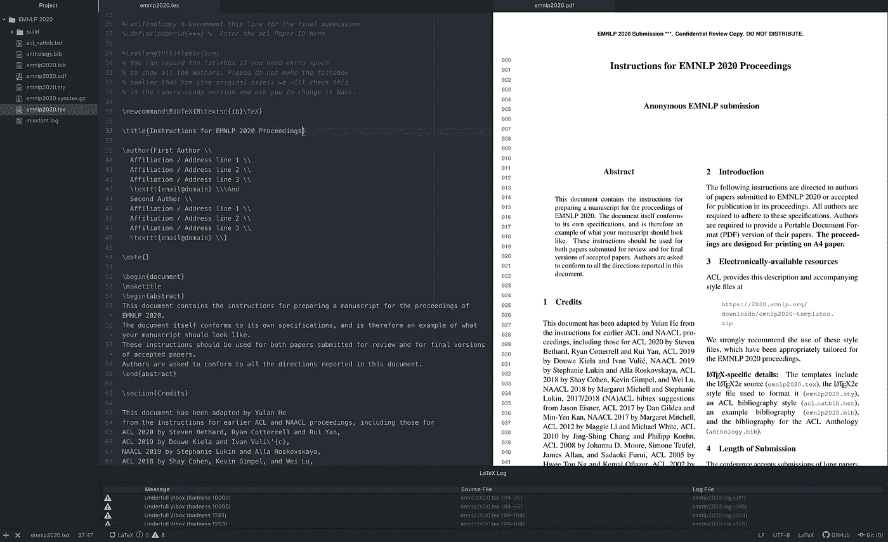
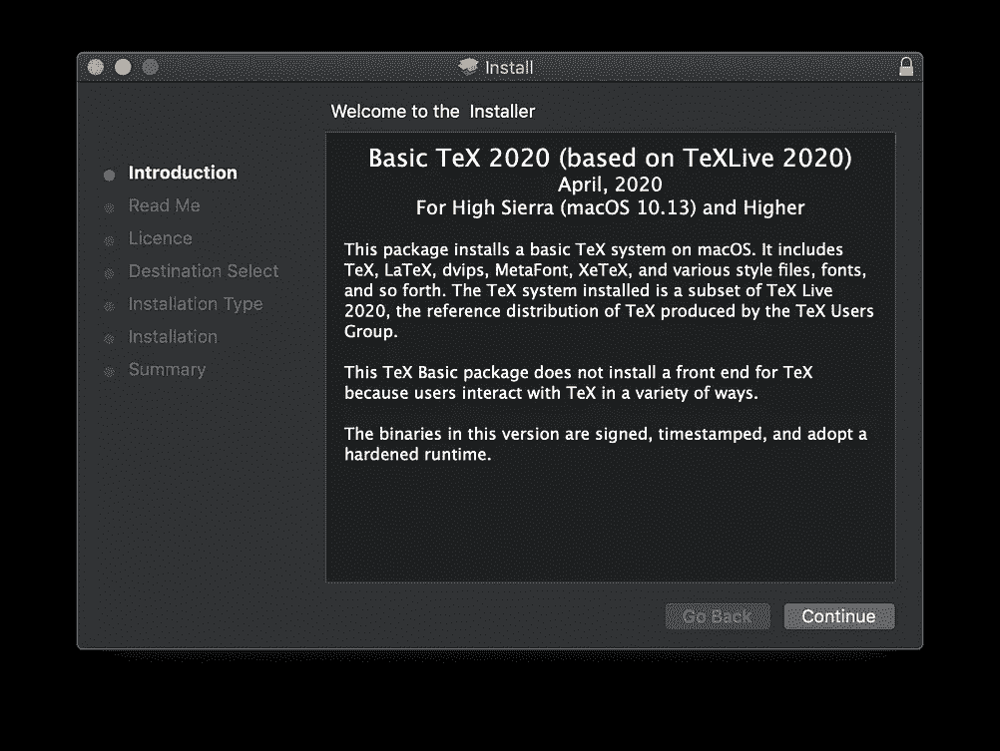
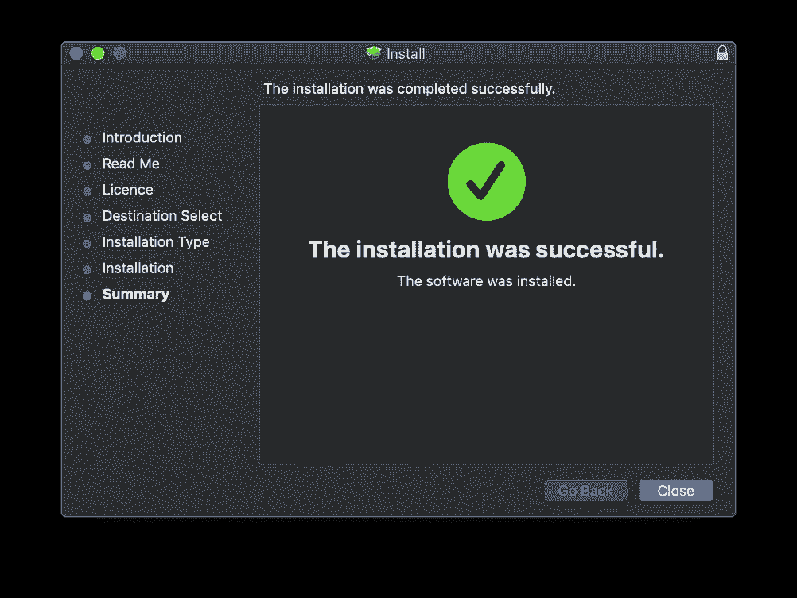
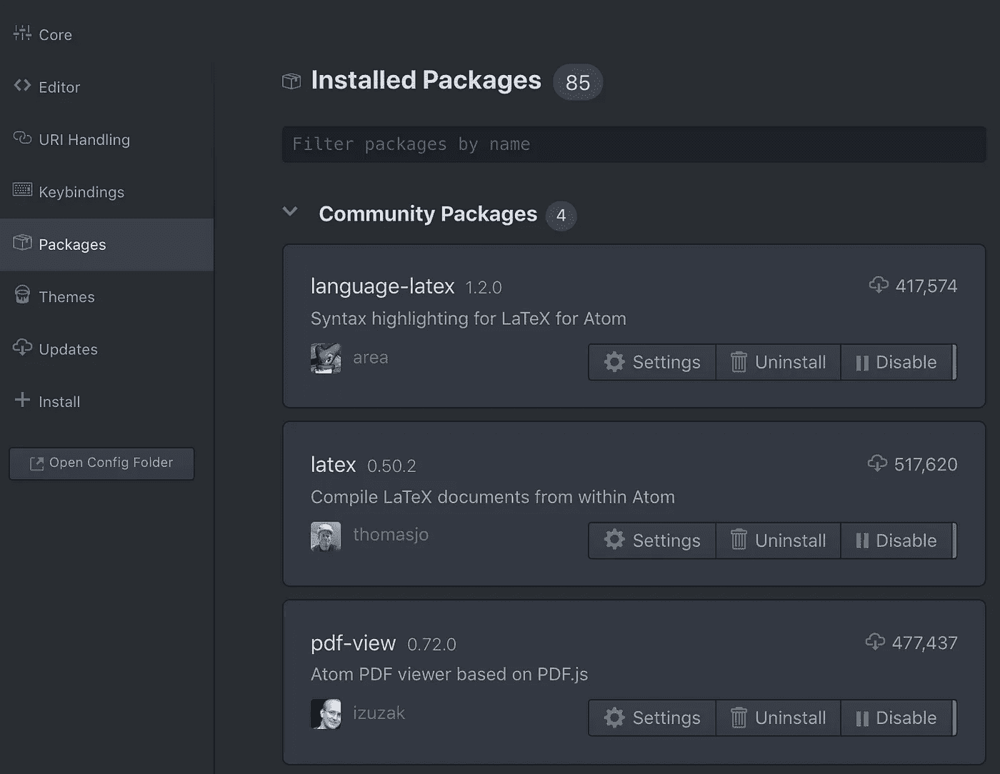
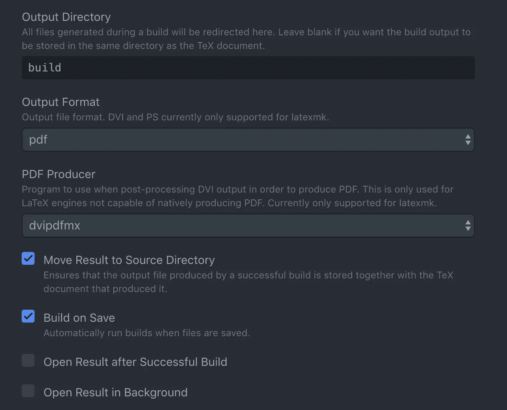

# 在 Atom 编辑器上设置 LaTeX

> 原文：<https://towardsdatascience.com/setting-up-latex-on-your-atom-editor-7ea624571d50?source=collection_archive---------5----------------------->

## 编辑、生成和预览 TeX 文件，全部在 Atom 编辑器中完成



Atom 上的 LaTeX 编辑器

在本教程中，我将指导您在 [Atom](https://atom.io/) 上设置 LaTeX 编辑器，以下是这样做的一些原因和好处:

*   保存工作时并排预览您的工作
*   快速，在 3 秒钟内生成预览
*   单击预览会将光标带到语法的位置
*   Dropbox 和 GitHub 集成，用于备份和与合作者协作
*   自由的

# 什么是乳胶

[LaTeX](https://www.latex-project.org/about/) 是一个文档准备系统，在学术界广泛用于发布科学文档。作者使用标记语法来定义文档的结构、设置文本样式、插入图像、添加引用和交叉引用。

因为出版商那么多，各有各的设计标准。例如，标题为 18pt 乘以 Roman，名称为 12pt 乘以 Italic，依此类推。LaTeX 的目的是让作者专注于写作，而不是浪费时间遵循出版商的文档设计指南。作者只需下载出版商的 LaTeX 模板并开始写作。

如果你是 TeX 新手，或者只是想用 LaTeX 做一个一次性项目，最快的入门方式是使用在线服务，比如 [Papeeria](http://papeeria.com/) 、 [Overleaf](https://www.overleaf.com/) 和 [LaTeX base](https://latexbase.com/) 。它们提供了编辑、预览和下载 PDF 格式作品的能力。

*既然有在线解决方案，那么为什么要在你的机器上设置 LaTeX 编辑器呢？*

除非你为他们的计划付费，否则免费层有一些限制，让我列举几个:

1.  有限的私有文档[Papeeria]，或者没有私有文档[Latex base]
2.  没有 GitHub 集成[下页]，或者只有公共存储库[Papeeria]
3.  没有合作者[背页]
4.  需要在线。

就我个人而言，我选择在本地安装 LaTeX，这样我和我的合作者就可以处理同一个 LaTeX 文档，并与私有的 GitHub 库同步。

其次，与在线服务不同，在本地机器上生成预览也要快得多。当我点击 *Cmd+S* 时，预览将在不到 3 秒的时间内生成。

# 在 Atom 上设置 LaTeX 编辑器

在本节中，我将指导您在 macOS 上的 [Atom](https://atom.io/) 上设置 LaTex 编辑器。该设置由 4 部分组成:

*   设置纹理分布
*   设置原子
*   安装 Latexmk
*   在 Atom 中安装包

## 特克斯分布

在 OS X，下载 [MacTeX](http://www.tug.org/mactex/) 。截至 2020 年 4 月，分布为 MacTeX-2020。可以选择下载完整包，4GB。它包含大多数用户需要的所有文件，您不必面对搜索缺失组件的艰巨任务。强烈推荐。

如果你不想安装整个 MacTeX 发行版——它很大，如果你像我一样喜欢选择安装什么，你可以下载 [BasicTeX](https://www.tug.org/mactex/morepackages.html) ，它只有 80MB。BasicTeX 包含了满足从*生成 PDF 的需求的 [TeX Live](https://www.tug.org/texlive/) 发行版。tex* 文件；它不包括 GUI 应用程序、Ghostscript 和其他库。但这意味着你必须搜索并下载你可能需要的所有软件包。我稍后会谈到这一点。



BasicTeX 安装

MacTeX 是针对 OS X 的，但是如果你在 Linux 或者 Windows 上，下载 [TeX Live](https://www.tug.org/texlive/) 。

## 原子


[https://atom.io/](https://atom.io/)

Atom 是一个漂亮的文本编辑器，可以在 OS X、Windows 和 Linux 上使用。它有一个包管理器，允许你安装数千个开源包，为你的编辑器增加新的特性和功能。您可以在单一界面上轻松浏览项目文件。您可以将界面分成多个窗格，以便在文件间编辑/引用代码。[下载并安装 Atom](https://atom.io/) 。

## Latexmk

Latexmk 用于自动生成 LaTeX 文档。这里没什么好解释的，我们需要它来工作。安装很简单，从终端输入:

```
sudo tlmgr install latexmk
```

这将提示您输入密码并安装 *latexmk* 软件包。

## Atom 包

这些包使您能够将 Atom 用作 LaTeX 编辑器。

*   **编译**。 [Latex 包](https://atom.io/packages/latex)从 Atom 内部编译 Latex 文档。它将执行 Latexmk 来构建您的工作。
*   预览 PDF 文件。 [PDF 查看包](https://atom.io/packages/pdf-view)使您能够在 Atom 中查看 PDF 文件。这允许您并排预览您的工作。单击预览会将光标带到语法的位置。
*   **语法高亮**。 [Language-LaTeX package](https://atom.io/packages/language-latex) 在 Atom 中突出显示 LaTeX 语法。这对于帮助您检查语法是否具有有效的 LaTeX 语法特别有用。



已安装的 Atom 包

# 你做到了！

此时，您的 Atom 上应该有一个可以工作的 LaTeX 编辑器。我建议对配置进行一些更改。进入*Atom->Preferences->Packages*。转到*乳胶*包的*设置*，并:

*   [检查]保存时构建(或使用`build`快捷键保持默认)
*   [取消选中]成功构建后打开结果
*   [取消选中]在后台打开结果
*   在输出目录下，键入" *build* "



乳胶包的配置

在*语言-乳胶*包中:

*   [检查]软包装

## 附加乳胶包

如果你有下载 BasicTeX，你可能不得不下载出版商在他们的模板中使用的包。最简单的方法是谷歌搜索丢失的包，或者搜索[综合特克斯档案网(CTAN)](https://ctan.org/pkg) 。

例如，*算法*是常用的包之一，我们可能会在文档中看到这一点。

```
\usepackage{algorithmic}
```

要安装软件包，请打开终端，键入:

```
sudo tlmgr install algorithms
```

这就对了。我希望你喜欢你的 LaTeX 编辑器，并且更加热爱 Atom。要感谢所有开源的贡献者 [Atom](https://github.com/atom/atom) 、 [atom-latex](https://github.com/thomasjo/atom-latex) 、 [atom-pdf-view](https://github.com/izuzak/atom-pdf-view) 、 [language-latex](https://github.com/area/language-latex) 。