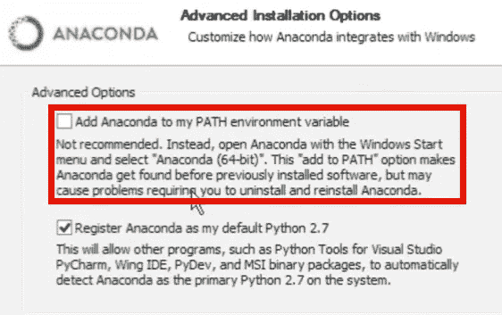
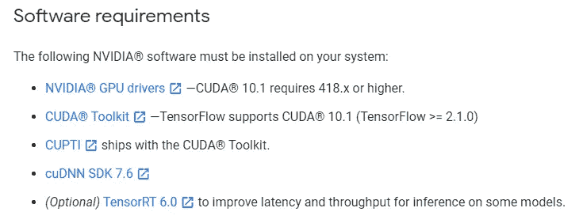
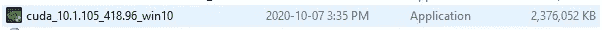
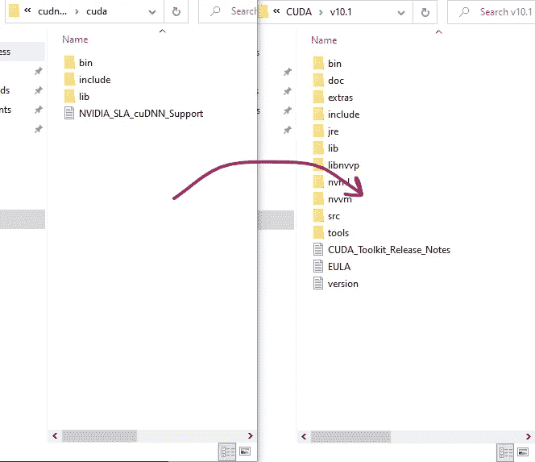
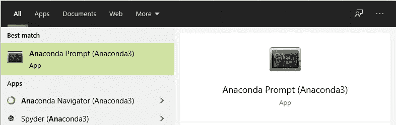
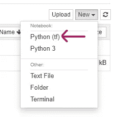
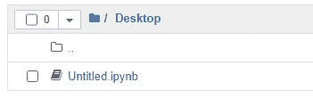
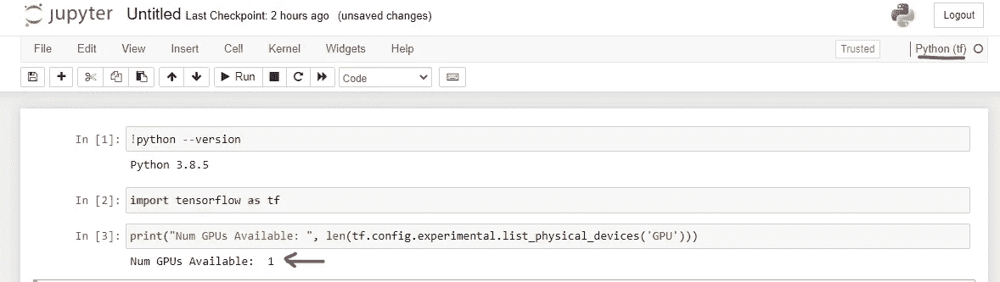

# 在 Windows 10 上设置 TensorFlow (GPU)

> 原文：<https://towardsdatascience.com/setting-up-tensorflow-on-windows-gpu-492d1120414c?source=collection_archive---------2----------------------->

就我个人而言，我讨厌花费数小时来设置机器学习工具进行培训——尤其是在 Windows 上。

在过去几年的多次尝试和错误之后(即 Googling 和 StackOverflow-ing)，我决定分享一个我想出的设置 TensorFlow 的方法。

我将这篇文章献给其他数据科学家，他们一直在查看充满错误消息的命令提示符。

**警告:**你必须有一个[支持 CUDA 的 GPU 卡](https://developer.nvidia.com/cuda-gpus)。

# 1)安装所需的软件

## 概观

安装(按顺序):

*   可视化工作室
*   蟒蛇
*   NVIDIA CUDA 工具包+ cuDNN

## 可视化工作室

首先，在这里安装来自[的 Visual Studio](http://visualstudio.microsoft.com)。安装社区版，因为专业版和企业版需要订阅。

**注意:** Visual Studio 是**不是**跟 VS 代码 IDE 一样！


Visual Studio 下载页面

## 蟒蛇

从[这里](https://www.anaconda.com/products/individual)下载并安装 Anaconda。

您不需要在安装过程中向 PATH 环境变量添加 Anaconda。



蟒蛇装置

## 英伟达软件

安装 Visual Studio 后，安装 NVIDIA CUDA Toolkit 和 cuDNN。



来自[https://www.tensorflow.org/install/gpu](https://www.tensorflow.org/install/gpu)的软件要求

到当前日期(2020 年 10 月)，必须安装 CUDA **10.1** 和 cuDNN SDK **7.6** ( **这个极其重要**)。

警告:支持的版本可能会改变，因此请务必查看[官方 TensorFlow 文档](https://www.tensorflow.org/install/gpu)。

最新的 CUDA 版本是 11——请访问 [CUDA 档案库](https://developer.nvidia.com/cuda-toolkit-archive)和 [cuDNN 档案库](https://developer.nvidia.com/rdp/cudnn-archive)获取更早的版本。

安装 CUDA 只需运行可执行文件。exe)。



CUDA 10.1。可执行程序的扩展名

**解压** cuDNN 库，将所有文件移动到 CUDA 目录下。如果您没有更改安装目录，您的 CUDA 将位于以下位置:

```
C:\Program Files\NVIDIA GPU Computing Toolkit\CUDA
```



解压 cuDNN 下载并移动文件到 CUDA

# 2)安装张量流

打开 Anaconda 提示符并检查 Python 的版本。



Anaconda 提示

您可以输入下面的命令来检查您当前运行的 Python 版本。

```
python --version
```

然后，创建一个新的 Anaconda 虚拟环境:

```
conda create -n tf python=PYTHON_VERSION
```

*   *tf* 可以改为任何其他名称(如 *python_tensorflow*
*   记得用你的 PYTHON 版本替换 *PYTHON_VERSION* (例如 *3.8.5* )

然后，激活您刚刚创建的环境:

```
conda activate tf
```

最后安装 TensorFlow:

```
pip install tensorflow
```

Do **not** *pip 安装 tensorflow****-GPU****因为它将安装 tensor flow 的旧版本(YouTube 上的*旧教程使用此命令)。**

# **3)测试张量流(GPU)**

**通过运行以下命令，测试 TensorFlow 是否已正确安装，以及是否可以检测到 CUDA 和 cuDNN:**

```
**python -c "import tensorflow as tf; print(tf.reduce_sum(tf.random.normal([1000, 1000])))"**
```

**如果没有错误，那么恭喜您，您已经成功安装了 TensorFlow。**

# **4)安装必要的库/包**

**我个人经常使用 Jupyter Notebook、Seaborn 和 Matplotlib，所以我确保通过运行以下命令来安装这些库:**

```
**pip install jupyter ipykernel seaborn matplotlib**
```

# **5)蟒蛇和朱庇特**

**将您之前创建的 Anaconda 环境添加到 Jupyter Notebook 中。**

```
**python -m ipykernel install --user --name ENVIRONMENT_NAME --display-name "KERNEL_DISPLAY_NAME"**
```

# **6)最终测试**

**返回到基本 conda 环境，打开 Jupyter 笔记本:**

```
**conda activate base
jupyter notebook**
```

**创建一个新的 Jupyter 笔记本并打开它:**

****

**Jupyter 笔记本上的 Anaconda 环境**

****

**新创建的笔记本**

****

**Jupyter 笔记本**

**运行下面这三行代码:**

```
**!python --versionimport tensorflow as tfprint("Num GPUs Available", len(tf.config.experimental.list_physical_devices('GPU')))**
```

**如果它能检测到你的 Python 和你的 GPU，你就成功安装了 TensorFlow (GPU)和机器学习必备工具！**