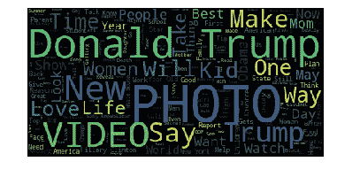

# 使用 scikit-learn 和 spaCy 设置文本预处理管道

> 原文：<https://towardsdatascience.com/setting-up-text-preprocessing-pipeline-using-scikit-learn-and-spacy-e09b9b76758f?source=collection_archive---------5----------------------->

## 了解如何使用 sklearn 管道进行标记化、词条化、删除停用词和标点符号

文本预处理是将原始文本转换成可[矢量化](http://jaympatel.com/2019/02/natural-language-processing-nlp-text-vectorization-and-bag-of-words-approach/)的形式，随后由机器学习算法用于自然语言处理(NLP)任务，如文本分类、主题建模、命名实体识别等。

原始文本由所有文本分析 API 进行广泛预处理，如 [Azure 的文本分析 API](https://azure.microsoft.com/en-in/services/cognitive-services/text-analytics/)或我们在 [Specrom Analytics](http://www.specrom.com/products-services/) 开发的 API，尽管预处理的程度和类型取决于输入文本的类型。例如，对于我们的历史新闻 API，输入由抓取的 HTML 页面组成，因此，在将文本输入到 NLP 算法之前，从文本中去除不需要的 HTML 标签是很重要的。然而，对于一些新闻媒体，我们从他们的官方 REST APIs 获得 JSON 格式的数据。在这种情况下，根本没有 HTML 标记，对这样一个干净的文本运行基于正则表达式的预处理程序是浪费 CPU 时间。因此，根据数据源对文本进行不同的预处理是有意义的。

如果您想要创建如下所示的词云，那么通常建议您删除停用词。但是在诸如名称实体识别(NER)的情况下，这并不是真正必需的，您可以安全地将语法完整的句子添加到您选择的 NER 中。



从搜集的新闻语料库中生成的词云(2016-2020)。杰伊·帕特尔

有许多好的[博客文章](/nlp-text-preprocessing-a-practical-guide-and-template-d80874676e79)开发了文本预处理步骤，但是为了完整起见，让我们在这里浏览一下。

# 1.标记化

将段落或句子中包含的文本转换为单个单词(称为标记)的过程称为标记化。在我们将文本转换成充满数字的向量之前，这通常是文本预处理中非常重要的一步。

直观而又相当天真的是，对文本进行标记的一种方法是简单地在空格处断开字符串，python 已经提供了非常好的字符串方法，可以轻松地完成这一任务，让我们将这种标记方法称为“空白标记化”。

然而，空白标记化无法理解单词缩写，例如当我们将两个单词“can”和“not”组合成“can”、don(do+not)和 I ve(I+have)时。这些都不是无关紧要的问题，如果我们不把“不能”分成“能”和“不能”，那么一旦我们去掉标点符号，我们将只剩下一个单词“cant”，它实际上不是一个字典单词。

Python 中用于文本处理的经典库 NLTK 附带了其他标记化器，如 WordPunctTokenizer 和 TreebankWordTokenizer，它们都按照不同的约定运行，试图解决单词缩写问题。对于高级标记化策略，还有一个 RegexpTokenizer，它可以根据正则表达式拆分字符串。

所有这些方法基本上都是基于规则的，因为没有真正的“学习”发生，所以作为用户，您必须处理所有可能因令牌化策略而出现的特殊情况。

Spacy 和 Apache Spark NLP 等下一代 NLP 库在很大程度上解决了这个问题，并在语言模型中使用标记化方法处理常见缩写。

# 1.1 NLTK 标记化示例

```
# Create a string input 
sample_text = "Gemini Man review: Double Will Smith can't save hackneyed spy flick U.S.A"from nltk.tokenize import WhitespaceTokenizer
tokenizer_w = WhitespaceTokenizer()# Use tokenize method 
tokenized_list = tokenizer_w.tokenize(sample_text) 
tokenized_list# output['Gemini',
 'Man',
 'review:',
 'Double',
 'Will',
 'Smith',
 "can't",
 'save',
 'hackneyed',
 'spy',
 'flick',
 'U.S.A']
```

WordPunct Tokenizer 将在标点符号上拆分，如下所示。

```
 from nltk.tokenize import WordPunctTokenizer 
tokenizer = WordPunctTokenizer()
tokenized_list= tokenizer.tokenize(sample_text)
tokenized_list# Output['Gemini',
 'Man',
 'review',
 ':',
 'Double',
 'Will',
 'Smith',
 'can',
 "'",
 't',
 'save',
 'hackneyed',
 'spy',
 'flick',
 'U',
 '.',
 'S',
 '.',
 'A']
```

NLTK 的 treebanktokenizer 将单词缩写拆分成两个标记，如下所示。

```
from nltk.tokenize import TreebankWordTokenizer
tokenizer = TreebankWordTokenizer()
tokenized_list= tokenizer.tokenize(sample_text)
tokenized_list
#Output['Gemini',
 'Man',
 'review',
 ':',
 'Double',
 'Will',
 'Smith',
 'ca',
 "n't",
 'save',
 'hackneyed',
 'spy',
 'flick',
 'U.S.A']
```

# 1.2 空间标记化示例

在 SpaCy 中执行标记化也很简单，在后面关于词条化的部分，您会注意到为什么标记化作为语言模型的一部分可以解决单词缩写的问题。

```
# Spacy Tokenization example
sample_text = "Gemini Man review: Double Will Smith can't save hackneyed spy flick U.S.A"from spacy.lang.en import English
nlp = English()
tokenizer = nlp.Defaults.create_tokenizer(nlp)
tokens = tokenizer(sample_text)
token_list = []
for token in tokens:
    token_list.append(token.text)
token_list
#output
['Gemini',
 'Man',
 'review',
 ':',
 'Double',
 'Will',
 'Smith',
 'ca',
 "n't",
 'save',
 'hackneyed',
 'spy',
 'flick',
 'U.S.A']
```

# 2.词干化和词汇化

词干化和词汇化试图为不同的词形变化(raining，rained 等)获得词根(例如 rain)。Lemma algos 给你的是真正的词典单词，而词干法只是简单地去掉了单词的最后部分，所以速度更快，但不太准确。词干分析返回的单词并不是真正的字典单词，因此你将无法在 Glove、Word2Vec 等中找到它的预训练向量，这是取决于应用程序的一个主要缺点。

然而，使用像波特和更高级的雪球词干分析器这样的词干算法是非常流行的。Spacy 没有附带任何词干算法，所以我们将使用 NLTK 来执行词干；这里我们将展示两种词干提取算法的输出。为了便于使用，我们将把空白符号化器封装到一个函数中。如你所见，两位词干学家都将动词形式(raining)简化为 rain。

# 2.1 NLTK 的词干示例

```
sample_text = '''Gemini Man review: Double Will Smith can't save hackneyed spy flick U.S.A raining rained ran'''from nltk.tokenize import WhitespaceTokenizerdef w_tokenizer(text):

    tokenizer = WhitespaceTokenizer()   
# Use tokenize method 
    tokenized_list = tokenizer.tokenize(text) 
    return(tokenized_list)from nltk.stem.snowball import SnowballStemmerdef stemmer_snowball(text_list):
    snowball = SnowballStemmer(language='english')
    return_list = []
    for i in range(len(text_list)):
        return_list.append(snowball.stem(text_list[i]))
    return(return_list)
stemmer_snowball(w_tokenizer(sample_text))#Output['gemini',
 'man',
 'review:',
 'doubl',
 'will',
 'smith',
 "can't",
 'save',
 'hackney',
 'spi',
 'flick',
 'u.s.a',
 'rain',
 'rain',
 'ran']
```

你可以从 NLTK 的波特·斯特梅尔那里得到同样的结果，这个也可以把单词转换成非字典形式，比如 spy -> spi 和 double -> doubl

```
from nltk.stem.porter import PorterStemmerdef stemmer_porter(text_list):
    porter = PorterStemmer()
    return_list = []
    for i in range(len(text_list)):
        return_list.append(porter.stem(text_list[i]))
    return(return_list)
stemmer_porter(w_tokenizer(sample_text))#Output['gemini',
 'man',
 'review:',
 'doubl',
 'will',
 'smith',
 "can't",
 'save',
 'hackney',
 'spi',
 'flick',
 'u.s.a',
 'rain',
 'rain',
 'ran']
```

# 2.2 SpaCy 的引理化示例

如果您使用 SpaCy 进行标记化，那么它已经为每个标记存储了一个名为`.lemma_`的属性，您可以简单地调用它来获得每个单词的词汇化形式。请注意，它不像词干分析器那样具有攻击性，它将单词缩写(如“不可以”)转换为“可以”和“不可以”。

```
# [https://spacy.io/api/tokenizer](https://spacy.io/api/tokenizer)
from spacy.lang.en import English
nlp = English()tokenizer = nlp.Defaults.create_tokenizer(nlp)
tokens = tokenizer(sample_text)
#token_list = []
lemma_list = []
for token in tokens:
    #token_list.append(token.text)
    lemma_list.append(token.lemma_)
#token_list
lemma_list
#Output['Gemini',
 'Man',
 'review',
 ':',
 'Double',
 'Will',
 'Smith',
 'can',
 'not',
 'save',
 'hackneyed',
 'spy',
 'flick',
 'U.S.A',
 'rain',
 'rain',
 'run']
```

# 3.停止单词删除

上面有一些特定的词，如“它”、“是”、“那个”、“这个”等。这对基本句子的意思没有多大帮助，实际上在所有英语文档中都很常见；这些词被称为停用词。在通过计数矢量化器对记号进行矢量化之前，通常需要移除这些“常用”单词，以便我们可以减少向量的总维数，并减轻所谓的“维数灾难”。

基本上有三种方法可以删除停用字词:

*   第一种方法是最简单的，您可以创建一个列表或一组单词来从令牌中排除；比如 list 已经是 sklearn 的 countvectorizer、NLTK 以及 SpaCy 的一部分。这种去除停用词的方法已经被接受了很长时间，然而，在研究人员和工作专业人员中有一种意识，即这种一刀切的方法实际上对学习文本的整体含义是非常有害的；有[篇论文指出](https://www.aclweb.org/anthology/W18-2502/)反对这种方法。

```
# using hard coded stop word listfrom spacy.lang.en import English
import spacy
spacy_stopwords = spacy.lang.en.stop_words.STOP_WORDS
# spacy_stopwords is a hardcoded set
nlp = English()
tokenizer = nlp.Defaults.create_tokenizer(nlp)
tokens = tokenizer(sample_text)
#token_list = []
lemma_list = []
for token in tokens:
    if token.lemma_.lower() not in spacy_stopwords:
    #token_list.append(token.text)
        lemma_list.append(token.lemma_)
#token_list
lemma_list
#Output['Gemini',
 'Man',
 'review',
 ':',
 'Double',
 'Smith',
 'save',
 'hackneyed',
 'spy',
 'flick',
 'U.S.A',
 'rain',
 'rain',
 'run']
```

不出所料，单词“will”和“can”等被删除了，因为它们出现在 SpaCy 中可用的硬编码停用词集中。让我们将它封装到一个名为 remove_stop_words 的函数中，这样我们就可以在第 5 节中将它用作 sklearn 管道的一部分。

```
import spacy
def remove_stopwords(text_list):
    spacy_stopwords = spacy.lang.en.stop_words.STOP_WORDSreturn_list = []
    for i in range(len(text_list)):
        if text_list[i] not in spacy_stopwords:
            return_list.append(text_list[i])
    return(return_list)
```

*   第二种方法是让语言模型判断给定的标记是否是停用词。Spacy 的标记化已经为此提供了一个名为 is `.is_stop`的属性。现在，有些时候，spacy 的标志不会排除常见的停用词，但这仍然比要排除的硬编码单词列表要好。仅供参考，在一些 SpaCy 模型[ [1](https://stackoverflow.com/questions/52263757/spacy-is-stop-doesnt-identify-stop-words) ][ [2](https://github.com/explosion/spaCy/issues/1574) ]中有一个记录良好的错误，它避免了在第一个字母大写的情况下检测停用词，因此如果它不能正确检测停用词，您需要应用变通方法。

```
# using the .is_stop flagfrom spacy.lang.en import Englishnlp = English()
tokenizer = nlp.Defaults.create_tokenizer(nlp)
tokens = tokenizer(sample_text)

lemma_list = []
for token in tokens:
    if token.is_stop is False:

        lemma_list.append(token.lemma_)

lemma_list#Output['Gemini',
 'Man',
 'review',
 ':',
 'Double',
 'Will',
 'Smith',
 'not',
 'save',
 'hackneyed',
 'spy',
 'flick',
 'U.S.A',
 'rain',
 'rain',
 'run']
```

这显然做得更好，因为它检测到这里的“Will”是一个人的名字，只是从示例文本中去掉了“can”。让我们将它封装在一个函数中，以便在最后一节中使用。

```
# 
from spacy.lang.en import Englishdef spacy_tokenizer_lemmatizer(text):

    nlp = English()
    tokenizer = nlp.Defaults.create_tokenizer(nlp)
    tokens = tokenizer(text)

    lemma_list = []
    for token in tokens:
        if token.is_stop is False:
            lemma_list.append(token.lemma_)

    return(lemma_list)
```

*   对抗停用词的第三种方法是排除在给定语料库中出现太频繁的词；sklearn 的 countvectoriser 和 tfidfvectorizer 方法有一个名为“max_df”的参数，它让您可以忽略文档频率严格高于给定阈值的标记。您也可以通过“max_features”参数指定标记总数来排除单词。如果您打算在 count vectorizer 之后使用 tf-idf，那么与对句子的整体含义有贡献的单词相比，它会自动为停用词分配一个低得多的权重。

# 4.删除标点符号

一旦我们标记了文本，转换了单词的缩写，文本中的标点符号和特殊字符就不再有用了。当然，当我们处理可能有 twitter 句柄、电子邮件地址等的文本时，这是不正确的。在这些情况下，我们改变我们的文本处理管道，只从令牌中去除空白，或者完全跳过这一步。我们可以使用 regex ' ]* > '清除所有的 HTML 标签；所有非单词字符都可以用“[\W]+”删除。不过，在单词缩写被 lemmatizer 处理之前，您应该小心不要去掉标点符号。在下面的代码块中，我们将修改我们的空间代码，以考虑停用词，并从令牌中删除任何标点符号。如下面的例子所示，我们已经成功地删除了特殊字符标记，例如“:”，它们在单词矢量化的包中实际上没有任何语义贡献。

```
import re
def preprocessor(text):
    if type(text) == string: text = re.sub('<[^>]*>', '', text)
    text = re.sub('[\W]+', '', text.lower())
    return textfrom spacy.lang.en import English
nlp = English()
tokenizer = nlp.Defaults.create_tokenizer(nlp)
tokens = tokenizer(sample_text)lemma_list = []
for token in tokens:
    if token.is_stop is False:
        token_preprocessed = preprocessor(token.lemma_)
        if token_preprocessed != '': lemma_list.append(token_preprocessed)
lemma_list
#Output:['gemini',
 'man',
 'review',
 'double',
 'will',
 'smith',
 'not',
 'save',
 'hackneyed',
 'spy',
 'flick',
 'usa',
 'rain',
 'rain',
 'run']#A more appropriate preprocessor function is below which can take both a list and a string as inputdef preprocessor_final(text):
    if isinstance((text), (str)):
        text = re.sub('<[^>]*>', '', text)
        text = re.sub('[\W]+', '', text.lower())
        return text
    if isinstance((text), (list)):
        return_list = []
        for i in range(len(text)):
            temp_text = re.sub('<[^>]*>', '', text[i])
            temp_text = re.sub('[\W]+', '', temp_text.lower())
            return_list.append(temp_text)
        return(return_list)
    else:
        pass
```

另一个常见的文本处理用例是当我们试图从社交媒体评论、推文等 web 数据中执行文档级情感分析时。所有这些都广泛使用表情符号，如果我们简单地去掉所有特殊字符，我们可能会错过一些非常有用的符号，这些符号对文本的语义和情感有很大的贡献。如果我们计划使用一包单词类型的文本矢量化，那么我们可以简单地找到所有这些表情符号，并将它们添加到标记化列表的末尾。在这种情况下，作为标记化之前的第一步，您可能必须运行预处理器。

```
# find emoticons functionimport re
def find_emo(text):
    emoticons = re.findall('(?::|;|=)(?:-)?(?:\)|\(|D|P)',text)
    return emoticons
sample_text = " I loved this movie :) but it was rather sad :( "
find_emo(sample_text)
# output
[':)', ':(']
```

# 5.Sklearn 管道

正如您在上面看到的，文本预处理很少是一刀切的，大多数真实世界的应用程序要求我们根据文本源和我们计划做的进一步分析使用不同的预处理模块。

有许多方法可以创建这样的自定义管道，但一个简单的选择是使用 sklearn 管道，它允许我们顺序组装几个不同的步骤，唯一的要求是中间步骤应该已经实现了 fit 和 transform 方法，并且最终的估计器至少有一个 fit 方法。

现在，这对于许多小函数来说可能是一个过于繁重的要求，比如预处理文本的函数；但幸运的是，sklearn 还附带了一个 functionTransformer，它允许我们将任意函数包装成一个 sklearn 兼容的函数。不过有一个问题:函数不应该直接对对象进行操作，而是将它们包装成列表、pandas 系列或 Numpy 数组。不过这并不是主要的障碍，您可以创建一个助手函数，将输出打包成一个列表理解。

```
# Adapted from [https://ryan-cranfill.github.io/sentiment-pipeline-sklearn-3/](https://ryan-cranfill.github.io/sentiment-pipeline-sklearn-3/) from sklearn.preprocessing import FunctionTransformerdef pipelinize(function, active=True):
    def list_comprehend_a_function(list_or_series, active=True):
        if active:
            return [function(i) for i in list_or_series]
        else: # if it's not active, just pass it right back
            return list_or_series
    return FunctionTransformer(list_comprehend_a_function, validate=False, kw_args={'active':active})
```

最后一步，让我们构建一个 sklearn 管道，它使用 NLTK 的 w_tokenizer 函数和 2.1 节中的 stemmer_snowball，并使用第 4 节中的预处理函数。

```
from sklearn.pipeline import Pipelineestimators = [('tokenizer', pipelinize(w_tokenizer)), ('stemmer', pipelinize(stemmer_snowball)),('stopwordremoval', pipelinize(remove_stopwords)), ('preprocessor', pipelinize(preprocessor_final))]pipe = Pipeline(estimators)

pipe.transform([sample_text])Output:[['gemini',
  'man',
  'review',
  'doubl',
  'smith',
  'cant',
  'save',
  'hackney',
  'spi',
  'flick',
  'usa',
  'rain',
  'rain',
  'ran']]
```

您可以很容易地更改上面的管道来使用如下所示的 SpaCy 函数。请注意，第 3 节中介绍的标记化函数(spacy_tokenizer_lemmatizer)返回不带任何停用词的标记化标记，因此这些步骤在我们的管道中是不必要的，我们可以直接运行预处理器。

```
spacy_estimators = [('tokenizer', pipelinize(spacy_tokenizer_lemmatizer)), ('preprocessor', pipelinize(preprocessor_final))]
spacy_pipe = Pipeline(spacy_estimators)
spacy_pipe.transform([sample_text])# Output:[['gemini',
  'man',
  'review',
  'double',
  'will',
  'smith',
  'not',
  'save',
  'hackneyed',
  'spy',
  'flick',
  'usa',
  'rain',
  'rain',
  'run']]
```

我希望我已经展示了使用 Sklearn 管道和基于空间的预处理工作流来有效地执行几乎所有 NLP 任务的预处理的巨大优势。