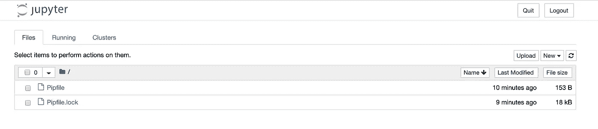
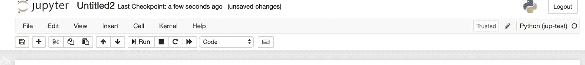
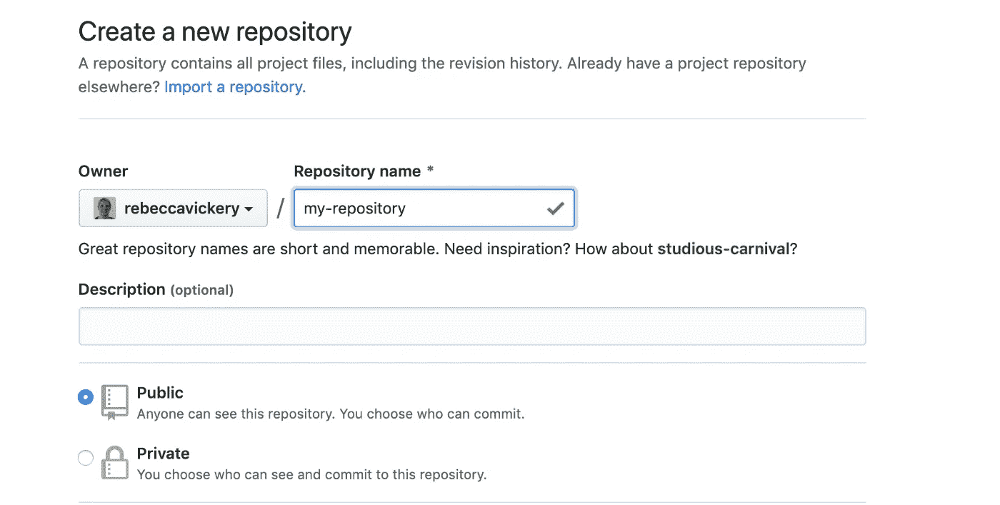

# 设置您的数据科学工作台

> 原文：<https://towardsdatascience.com/setting-up-your-data-science-work-bench-4a8d3a28205c?source=collection_archive---------12----------------------->


在 [Unsplash](https://unsplash.com/s/photos/laboratory?utm_source=unsplash&utm_medium=referral&utm_content=creditCopyText) 上拍摄的 [ThisisEngineering RAEng](https://unsplash.com/@thisisengineering?utm_source=unsplash&utm_medium=referral&utm_content=creditCopyText)

## 让您的计算机准备好学习数据科学

在我的上一篇[帖子](/a-data-scientists-tool-kit-ecf9eda285ad)中，我介绍了数据科学工作所需的核心工具。在这篇文章中，我将一步一步地指导您设置计算机来执行典型的数据科学和机器学习任务。

我个人在 mac 上工作，所以大部分设置指令都是为这个操作系统设置的。

## 安装 python

正如我在上一篇文章中所讨论的，python 现在是数据科学从业者最流行的编程语言。因此，配置计算机的第一步是安装 python。

要在您的计算机上安装和配置 python，您需要使用终端。如果你还没有设置，你需要下载并安装 [Xcode](https://developer.apple.com/xcode/) (苹果的集成开发环境)。

Mac OS X 已经安装了 python 2.7。然而，对于许多数据科学项目，您需要能够使用各种不同的 python 版本。

有许多工具可以用来安装和管理不同的 python 版本，但是 [pyenv](https://github.com/pyenv/pyenv) 可能是最简单易用的工具之一。Pyenv 支持在用户和项目级别管理 python 版本。

要安装 pyenv，你需要先安装 [homebrew](https://treehouse.github.io/installation-guides/mac/homebrew) ，这是一个 Mac 的软件包管理器。一旦你有了这个，你可以用这个命令安装 pyenv(对于 Windows 安装，参见这些[指令](https://github.com/pyenv/pyenv#installation))。

```
brew install pyenv
```

然后，您需要将 pyenv 初始化器添加到您的 shell 启动脚本中，并通过运行以下代码来重新加载 bash_profile。

```
echo 'eval "$(pyenv init -)"' >> ~/.bash_profile
source ~/.bash_profile
```

要查看系统上安装的 python 版本，请运行以下命令。

```
pyenv install --list
```

要安装 python 的新版本，只需运行。

```
pyenv install <python-version>#e.g.pyenv install python-3.7
```

## 安装 python 包

Pip 是安装 python 包的首选安装程序，默认情况下包含在 python 3.4 及更高版本中。您将需要它来安装任何开源 python 库。

要使用 pip 安装软件包，只需运行以下命令。

```
pip install <package>#e.g.pip install pandas
```

## 虚拟环境

不同的 python 项目将需要不同的依赖项和 python 版本。因此，为每个项目创建隔离的、可重复的环境是非常重要的。虚拟环境实现了这一点。

有很多工具可以创建 python 虚拟环境，但我个人使用的是 [pipenv](https://github.com/pypa/pipenv) 。

Pipenv 可以用自制软件安装。

```
brew install pipenv
```

使用特定版本的 python 创建新环境。创建一个新目录，然后从新目录运行以下命令。

```
mkdir pip-test
cd pip-test
pipenv --python 3.7
```

要激活环境运行`pipenv-shell`，您现在将进入一个名为“pip-test”的新环境。

如果我们检查目录的内容，您将看到 pipenv 已经创建了一个名为`Pipfile`的新文件。这是需求文件的 pipenv 等价物，包含环境中使用的所有包和版本。

要将软件包安装到 pipenv 环境中，只需运行以下命令。

```
pipenv install pandas
```

任何安装的软件包都将反映在 pip 文件中，这意味着可以使用该文件轻松地重新创建环境。

## Jupyter 笔记本

Jupyter Notebooks 是一款基于网络的代码编写应用。它们特别适合数据科学任务，因为它们使您能够直接根据您的代码呈现文档、图表、表格和图表。这为开发数据科学项目创造了一个高度互动和可共享的平台。

要安装 Jupyter 笔记本，只需运行`pip install notebook`，或者如果你正在使用 pipenv shell `pipenv install notebook`。

由于这是一个基于 web 的应用程序，您需要启动笔记本服务器来开始编写代码。您可以通过运行以下命令来完成此操作。

```
jupyter notebook
```

这将在您的网络浏览器中打开应用程序，默认网址是`http://127.0.0.1:8888`。



在浏览器中运行的笔记本应用程序

Jupyter 笔记本电脑能够在虚拟环境中工作，因此您可以在正确的项目环境中运行项目笔记本电脑。要使 pipenv 环境在 web 应用程序中可用，您需要运行以下命令。

```
python -m ipykernel install --user --name myenv --display-name "Python (myenv)"#e.g.python -m ipykernel install --user --name jup-test --display-name "Python (jup-test)"
```

如果您现在重启 web 应用程序并到达`new`，您将看到您的 pipenv 环境可用。选择此项将启动一个新的笔记本，它将运行您在 pipenv shell 中设置的所有依赖项。



运行在 Python(jup-test)环境中的笔记本

## Python IDE

Jupyter 笔记本非常适合探索性的数据科学项目和编写只使用一次的代码。然而，为了提高效率，将常用的代码段编写到可以跨项目导入和使用的模块内的函数中是一个好主意(这被称为模块化生成您的代码)。

笔记本不是特别适合写模块。对于这个任务，最好使用 IDE(集成开发环境)。有很多可用的，但我个人使用 Pycharm。使用 IDE 的好处是它们包含了内置的工具，比如 Github 集成和单元测试。

Pycharm 既有付费专业版，也有免费社区版。要下载并安装 Pycharm，请访问此[网站](https://www.jetbrains.com/pycharm/download/#section=mac)，并按照安装说明进行操作。

## 版本控制

您在数据科学项目中需要使用的最后一个工具是 Github。这是版本控制最常用的工具。版本控制本质上涉及到在线存储项目的版本。然后从分支本地执行开发。分支本质上是项目的一个副本，可以在其中进行不会影响主版本的更改。

一旦在本地进行了更改，您可以将更改推送到 Github，它们可以在一个称为“拉”请求的受控过程中合并到主分支中。

使用 Github 可以让你追踪项目的变化。在将它们集成到最终版本之前，您还可以进行更改并测试它们的影响。Github 还支持与他人的协作，因为他们可以安全地进行更改，而不会影响主分支。

要使用 Github，你首先需要按照这些[指令](https://git-scm.com/book/en/v2/Getting-Started-Installing-Git)安装它。然后你需要访问 Github [网站](https://github.com/)并创建一个账户。

拥有帐户后，您可以创建新的存储库。



创建新的存储库

要在本地处理项目，您需要克隆存储库。

```
cd my-directory
git clone [https://github.com/rebeccavickery/my-repository.git](https://github.com/rebeccavickery/my-repository.git)
```

本文是设置您的计算机以准备从事数据科学项目的指南。我列出的许多工具都是我个人喜欢的工具。然而，在大多数情况下，有几种选择。探索不同的选项以找到最适合您的工作方式和项目是值得的。

感谢阅读！

我每月都会发一份简讯，如果你想加入，请点击此链接注册。期待成为您学习旅程的一部分！