# 为深度学习设置您的 PC/工作站:Tensorflow 和 py torch-Windows

> 原文：<https://towardsdatascience.com/setting-up-your-pc-workstation-for-deep-learning-tensorflow-and-pytorch-windows-9099b96035cb?source=collection_archive---------1----------------------->

## 到目前为止，配置新的(或不太新的)装备来处理一些神经元的最简单的方法。

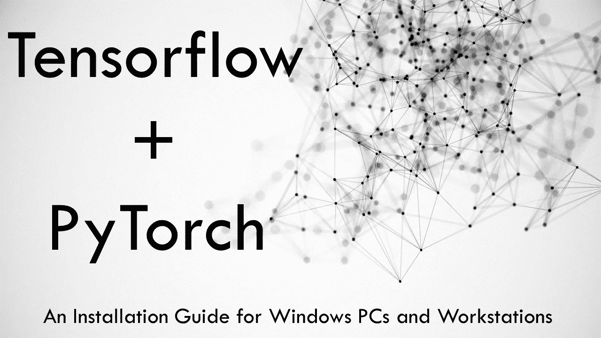

作者图片

本文将指导您在 windows 机器上设置深度学习所需的工具和安装驱动程序的整个过程。令人惊讶的是，即使是建立深度学习的环境也不是那么容易。在这个过程中，你打碎东西的几率其实很高。我经历过多次从零开始设置深度学习所需的一切，尽管是在一个不同的、对程序员更友好的 Linux 操作系统中。(接下来是相关指南)

目前很少有文章解释 Windows 的相同过程。所以我决定试一试。最近坏了几次事，终于找到了妥善解决这个问题的办法。这种方法不仅能成功设置，而且比我见过的大多数其他方法都要简单得多。

本教程面向谁，更重要的是为什么是 Windows？

相信我，我也不太喜欢在 Windows 上玩 CUDA。但是，作为开发人员，更多的时候，我们最终会在笔记本电脑或功能强大的设备上工作，这些设备不仅用于深度学习或编程。在这种情况下，你无法完全摆脱 Windows。如果你是这些人中的一员，或者只是一个拥有 Windows 机器的普通读者，对 Linux 不太熟悉，那么这篇指南就是为你准备的。

下面是我们将在本文中涉及的一些内容，

*   最低硬件和软件要求
*   安装 Python 和所需工具
*   一些 GPU 术语
*   安装 GPU 驱动程序
*   安装 Tensorflow (CPU 和 GPU)
*   安装 PyTorch (CPU 和 GPU)
*   验证您的安装
*   我的个人经验和替代方法
*   结论

# 最低硬件和软件要求

> 如果你打算设置 GPU 支持，你肯定需要一个 Nvidia GPU。

开发深度学习应用程序涉及训练神经网络，这些网络天生就需要计算。它本质上也越来越有利于并行化，这让我们越来越倾向于擅长并行化的 GPU。这就是 GPU 派上用场的原因，绝大多数深度学习框架都支持开箱即用的 GPU 加速，因此开发人员和研究人员可以在几分钟内提高工作效率，而无需进行任何可能会阻碍他们的 GPU 编程。

这些框架中的大多数(只)支持称为 CUDA 的东西——它只能与 Nvidia GPUs 一起工作，这就是为什么你特别需要 Nvidia 的一个。然而，在 AMD 的卡上也不是不可能，更多信息请访问[这一页](https://rocmdocs.amd.com/en/latest/)。

> 如果你不打算安装 GPU，没问题，你仍然可以跟着做。

但当然，你应该有一个像样的 CPU，RAM 和存储，以便能够进行一些深度学习。

我的硬件——我在我的个人笔记本电脑上进行设置，配置如下:

**CPU** —睿频上 AMD 锐龙 7 4800HS 8C -16T@ 4.2GHz。

**内存—** 16 GB DDR4 内存，3200MHz

**GPU—**Nvidia GeForce RTX 2060 Max-Q @ 6GB gddr 6 内存

对于任何有兴趣了解配置的人，我推荐一个至少 4 核、2.6GHz 的像样的 CPU，至少 16GB 的 RAM 和至少 6GB VRAM 的 Nvidia GPU。

对于这个教程，你显然需要在 Windows 10 上。我假设对 Python 包和环境有一些基本的了解。尽管如此，一切都会得到解释。

建议您使用 64 位 Windows 10 的最新稳定版本。

> 本教程还假设您在新安装的操作系统上开始安装过程。如果你真的知道你在做什么，你仍然可以跟着做。

# 安装 Python 和所需工具

当然，第一步是安装 Python。我推荐通过 Mini-Conda 安装 Python。对于绝对初学者，我简单说明一下原因。

Conda 是一个软件包管理器，可以帮助你安装、管理和删除所有不同的软件包。但这不是唯一的一个，还有 pip——python 的默认包管理器，我非常喜欢。这里我们使用 conda，因为它在 Windows 中设置起来更加直接和简单。

Anaconda 和 Mini-Conda 是软件发行版，预装了一些非常有用的 Data Science/ML 包来节省您的时间。Anaconda 包含 150 多个有助于进行数据科学和机器学习的包，其中包括您可能需要的一切，而 Mini-Conda 只附带了少数真正必要的工具和包。

我推荐使用 Mini-Conda，因为我喜欢(几乎)完全控制安装什么软件包。保持事物的清淡确实不是一件坏事。它可以为你节省一些存储空间，当然，你也不会有 50 多个你可能从来没有用过的包。

要安装迷你康达，请点击下面的链接，[https://docs.conda.io/en/latest/miniconda.html](https://docs.conda.io/en/latest/miniconda.html)

下载 python 3 Windows 64 位安装程序，并像安装任何其他 Windows 软件一样安装它。确保勾选询问您是否希望将 conda 和 python 添加到路径的复选框。

现在，您可以通过运行以下命令来检查是否安装了 python 和 conda。它们应该显示版本号，否则您可能需要正确安装 mini-conda 并将其添加到 PATH 中。

```
> python --version
Python 3.8.3> conda --version
conda 4.8.4
```

下一步是安装 *jupyter-notebook* ，在你的命令行界面粘贴以下命令，

`> conda install -y jupyter`

您可以通过运行 jupyter 笔记本来验证您的安装，这将在浏览器上为您打开 jupyter 笔记本。

`> jupyter notebook`

## 设置您的开发环境

这是很多人经常错过的重要一步。使用包含所有已知包的东西(如 Anaconda)是可以理解的，但要处理您的项目并实际构建东西，您可能需要一个特定于该项目或您所做工作性质的定制环境。使用专用虚拟环境的另一个巨大优势是，您可以隔离您的软件包与全局设置的交互，这意味着如果您在您的环境中弄乱了软件包，您可以随时丢弃它，而不会影响任何全局软件包。

它还可以让您灵活地创建任何 python 版本的环境。所以你可以暂时远离所有新的不稳定的东西，以后基于支持进行升级。

创建一个 conda 环境相当简单，为了便于解释，我用 tensorflow 这个名字来创建它，你可以把它设置成你想要的任何值。我打算用 python 3.7，因为我知道 Tensorflow 很好地支持它。你可以通过他们的[文档](https://www.tensorflow.org/install/pip)来验证这一点。顺便说一下，我们将在这里安装 Tensorflow 并创建一个类似的名为 torch 的环境，PyTorch 将安装在这里。

`> conda create --name tensorflow python=3.7`

创建环境后，您可以使用下面的命令进入，这里 tensorflow 只是我们之前给这个环境起的名字。

`> conda activate tensorflow`

一旦你进入这个环境，你就能在提示符的左边看到类似这样的东西

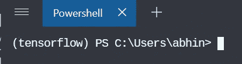

如果您碰巧在 Powershell 上没有看到这一点，您可能希望事先在 Powershell 中只初始化 conda 一次，

`> conda init powershell`


之后，当您不在任何环境中时，您可能会在左侧看到(base ),如上图所示。在此之后，每当您输入一个 env 时，您都会看到 env 名称。

此外，您还可以在这个环境中安装 nb 工具，并将其与我们之前安装的 jupyter notebook 链接

`> conda install nb_conda`

要使用 Jupyter 笔记本注册环境，请在不换行的情况下运行该命令，

`> python -m ipykernel install --user --name tensorflow --display-name “Python 3.7 (tensorflow)”`

要退出康达环境…

`> conda deactivate`

现在按照相同的步骤创建一个名为 torch 的环境

```
> conda create --name torch python=3.7> conda activate torch> conda install nb_conda> python -m ipykernel install --user --name torch --display-name “Python 3.7 (torch)”
```

如果环境设置成功，您将能够在列出环境时看到这一点，

`> conda env list`

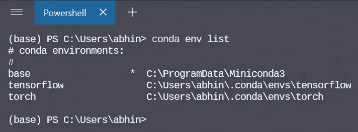

要验证各个包是否实际安装在每个环境中，您可以进入该环境并执行`conda list`,这将显示该环境中安装的所有包的列表。

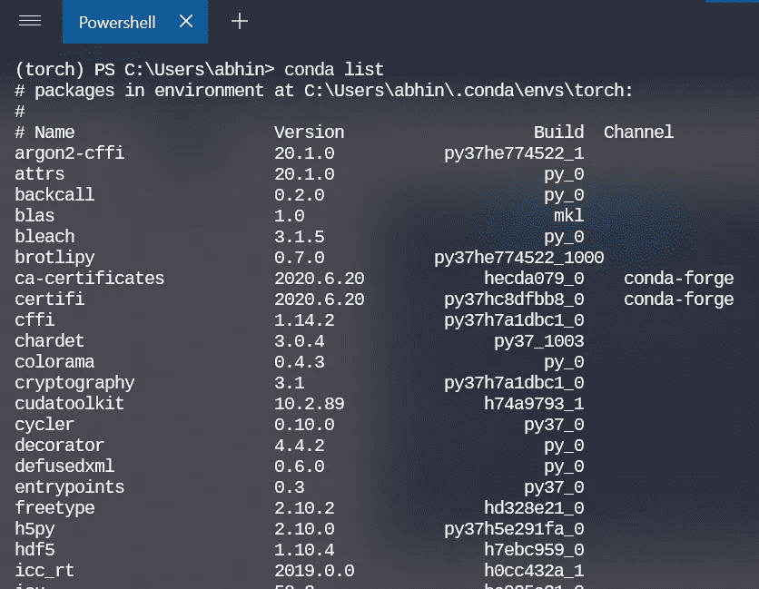

如果清单很长，不要担心。Conda 已经处理了基本的东西和依赖关系

# 一些 GPU 术语

在开始安装一些与 GPU 相关的东西之前，有必要了解什么是什么以及为什么你需要这些东西。

**GPU 驱动—** 顾名思义 GPU 驱动是一个软件，它允许你的操作系统及其程序使用 GPU 硬件。游戏玩家当然更清楚这一点，如果你喜欢游戏，那么你可能需要更新这个软件以获得最佳体验。

**CUDA —** 简单来说**，**它是由 Nvidia 开发的一个编程接口层，可以访问 GPU 的指令集及其并行计算单元。

> 自 2010 年代末的 GeForce 8 系列 GPU 以来，几乎所有的 GPU 都支持 CUDA。

要了解更多信息，您可以访问 Nvidia 网站的[这个](https://developer.nvidia.com/cuda-gpus)页面，了解您的 GPU 是否支持 CUDA。

例如，如果你有一个消费级 GPU，比如 GeForce 系列或 Titan 系列的产品，你可以在下图中看到支持和不支持的内容，

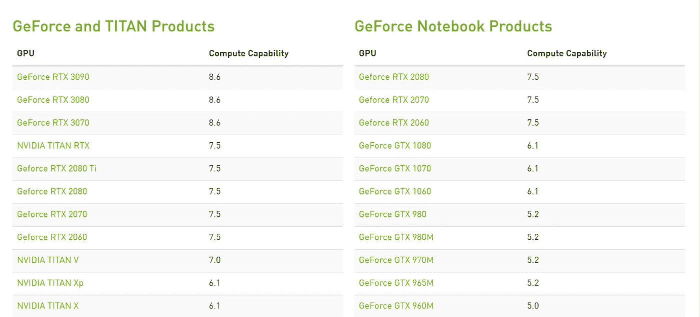

截至 2020 年 9 月(这只是名单的上半部分)

如果你有一台笔记本电脑，你应该检查笔记本产品列表，如果你有一个成熟的桌面 GPU，你显然必须寻找左手边的其他阵容。

如前所述，我有一辆 RTX 2060 Max-Q，列于右侧。顺便说一句，你不必担心你的卡的标题与网页中列出的内容完全匹配，Max-Q 和 Super 都只是共享相同底层架构的设计，只是在 TDP，CUDA 核心数量和张量核心数量上有所不同。

例如，如果你拥有一辆 RTX 2080 Super 或 2080 Max-Q，甚至是一辆 2080 Super Max-Q——如果你能在列表中找到 RTX 2080，那完全没问题。但是，如果您拥有一台 RTX 2080Ti 或末尾带有 Ti 的产品，这仅仅意味着您拥有该特定系列的最高端版本，因此您很可能会发现它在 VRAM 和 CUDA 数量以及张量内核方面具有更大的能力。

> 截至 2020 年 9 月，
> 
> 要使用 Tensorflow 2.0，您的卡的计算能力必须高于 3.5，但为了获得更好的体验，建议您至少拥有 6。Tensorflow 2.0 还需要 CUDA 版本 10，这反过来要求您的驱动程序版本为 418.x 或更高。
> 
> PyTorch 要求你的 CUDA 版本至少是 9.2 或更高，它也支持 10.1 和 10.2。计算能力必须至少高于 3.0

**CuDNN —** CUDA 深度神经网络库(CuDNN)是一个 GPU 加速的深度神经网络原语库。cuDNN 为标准例程提供了高度优化的实现，例如前向和后向卷积、池化、规范化和激活层。

**(可选)TensorRT—**[NVIDIA TensorRT](https://developer.nvidia.com/tensorrt)是一款用于高性能深度学习推理的 SDK。它包括一个深度学习推理优化器和运行时，为深度学习推理应用程序提供低延迟和高吞吐量。

# 安装 GPU 驱动程序

在做任何事情之前，你需要确定你正在使用的 GPU。它必须是一个支持 CUDA 的 GPU。

如果您还没有安装驱动程序，您可能需要运行 Windows Update，它会自动处理有用软件的安装，如 Nvidia 控制面板。这将有助于您了解更多关于 GPU 的信息，以及一些与本文无关的设置。

如果您有 Nvidia 控制面板，您可以从开始菜单打开它，或者右键单击桌面并选择 Nvidia 控制面板。

一旦你打开它，你可以通过点击帮助->系统信息来验证 GPU 驱动程序的版本。驱动程序版本将列在详细信息窗口的顶部。

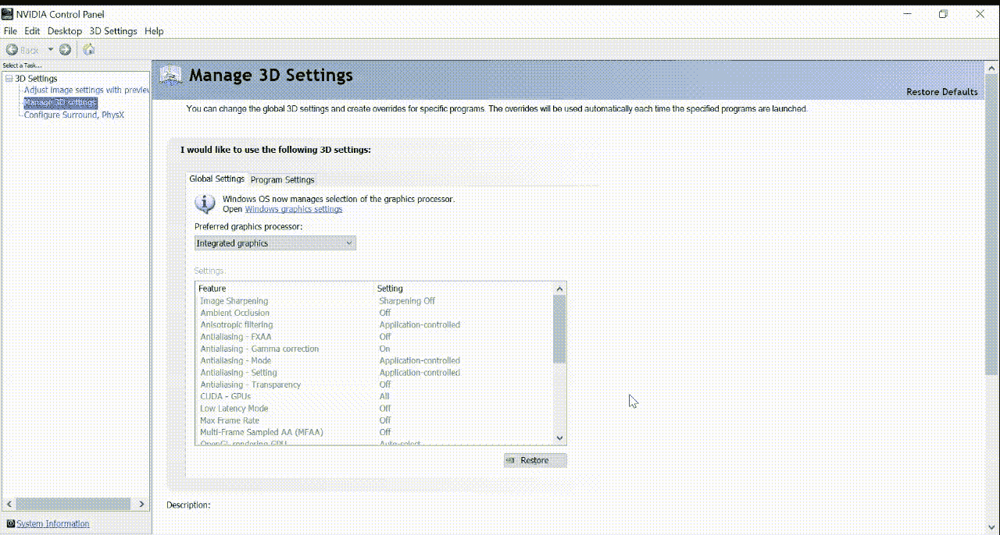

GIF 流程图

如上面的 GIF 所示，我的驱动版本是 456.x，远远高于 418.x 的最低要求，所以我不用担心安装任何新的驱动程序。

对于你来说可能不是这样，要安装最新的驱动程序，你可以去[这个网站](https://www.nvidia.com/Download/index.aspx)并输入关于你的 GPU 的正确信息来下载所需的正确驱动程序。


下载 Nvidia 驱动程序— GIF

下载驱动程序后，运行安装程序并选择*快速安装*以获得更轻松的体验。安装驱动程序后，您可以使用 Nvidia 控制面板进行验证。

另一种安装驱动程序的方法是使用 Nvidia 的 GeForce Experience 应用程序，如果你拥有一台原本用于游戏的消费类计算机。这个过程非常简单。

> 这一步是可选的。如果您已经按照上述步骤安装了驱动程序，或者您的不是游戏机，您可以安全地忽略这一点。

从[页面](https://www.nvidia.com/en-in/geforce/geforce-experience/)下载申请。按照安装程序在您的机器上安装应用程序。完成后，您可以打开应用程序并转到驱动程序选项卡，检查更新并安装新的驱动程序。您也可以在应用程序中验证驱动程序版本。

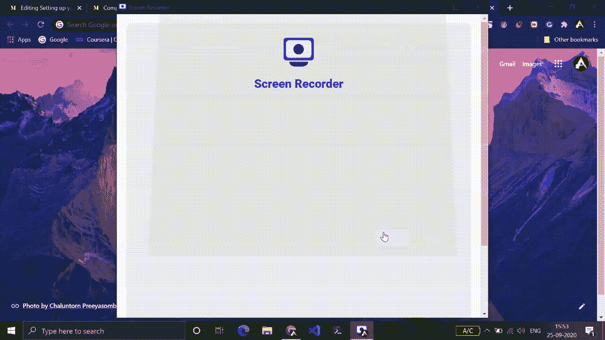

GeForce 体验演示

> 既然安装驱动程序最重要的部分已经完成，你可以手动安装 CUDA toolkit，或者让 conda 来处理 TF 或 PyTorch 安装期间的所有事情，我强烈推荐这样做。

如果你决定手动安装，你可以从[这个网站](https://developer.nvidia.com/cuda-downloads)获得安装程序，并按照那里的说明进行操作。

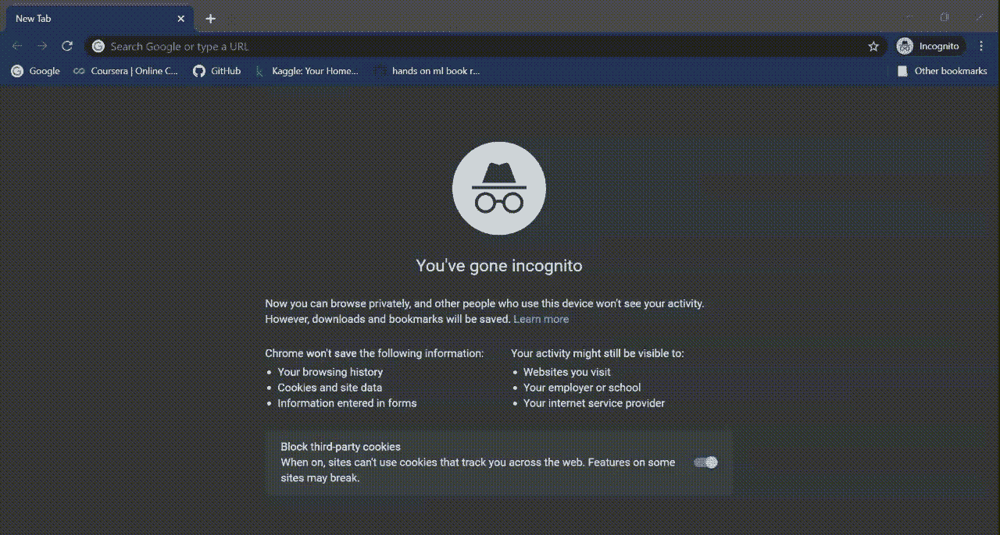

安装 CUDA 工具包

一旦安装了 CUDA 工具包，就可以通过在 cmd 或 Powershell 中运行`nvidia-smi` 命令来验证它。

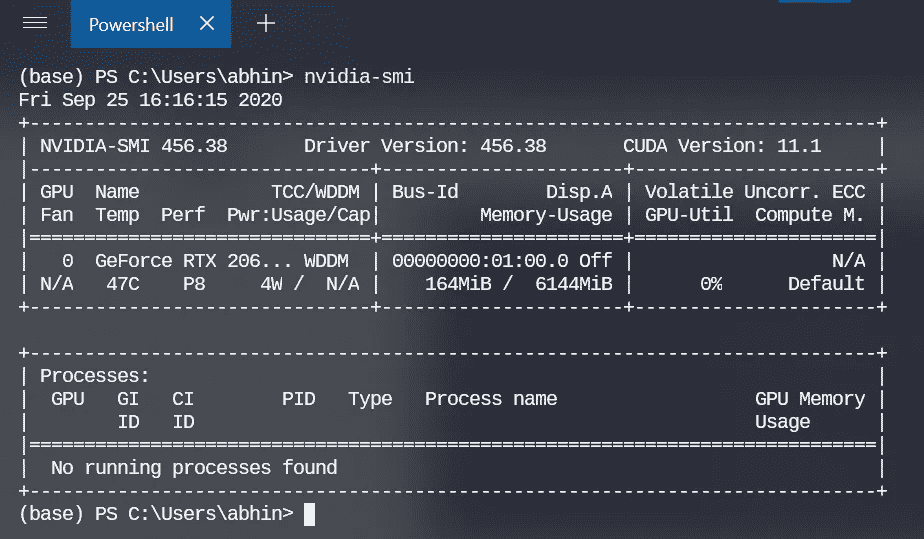

nvidia-smi 输出

# 安装 Tensorflow

现在终于到了本教程的关键。如果你已经做了前面提到的所有事情，这一步将会非常简单。

> 我们将通过康达安装 Tensorflow 2.x。

进入我们之前创建的张量流环境并跟随它是非常重要的，

`> conda activate tensorflow`

如果您计划在 GPU 支持下安装，请运行以下命令

`> conda install -c anaconda tensorflow-gpu`

这将通过 anaconda 通道安装 TensorFlow GPU。使用 conda 而不是 pip 安装 TensorFlow 的一个主要好处是 conda 包管理系统。当使用 conda 安装 TensorFlow 时，conda 也会安装软件包的所有必需和兼容的依赖项。这是自动完成的，用户不需要通过系统软件包管理器或其他方式安装任何额外的软件。

> 这还包括 Tensorflow 或 PyTorch 所需的 CUDA 工具包的正确版本，这使得该过程更加轻松。

安装的 CUDA 工具包仅在我们安装 tensorflow GPU 的环境中可见，这是一个巨大的优势。想象一下这个版本的 CUDA 工具包搞乱了你的全球系统的 CUDA 版本，PyTorch 甚至需要一个完全不同的 CUDA 版本才能运行。这是使用虚拟环境的最大优势。它提供了所有虚拟环境之间的完全隔离。

如果一切顺利，你不会在安装过程中得到任何错误信息。

要验证 tensorflow 和所需的包是否已成功安装，您可以执行`conda list`，它会显示已安装包的列表，您将在其中找到 tensorflow 相关包以及 CUDA 工具包。

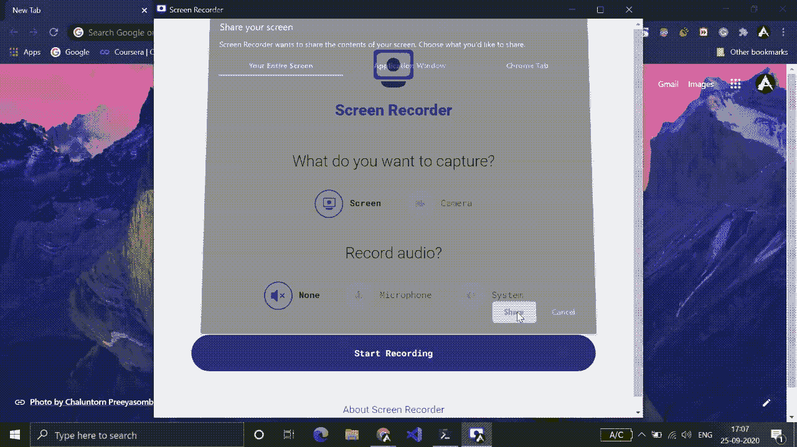

您可以打开 Python 提示符并验证是否安装了 tensorflow，

```
>>> import tensorflow as tf
>>> tf.__version__
'2.1.0'
```

如果你拿回了版本号，恭喜你！你做到了！Tensorflow 安装成功。

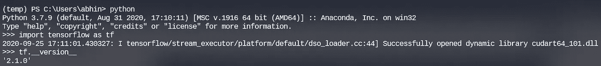

在 Python 提示符下验证 TF 安装

在 Python 提示符下使用 Tensorflow 时，您可能会得到这样的消息——“打开了动态库”，这并不意味着什么不好的事情，它只是一个日志消息，是 tf 能够打开这些库的好迹象。

> 稍后将介绍如何验证 GPU 上的安装。

**要安装仅用于 CPU 的 Tensorflow，您只需对安装命令**进行简单更改

`> conda install -c anaconda tensorflow`

这将在没有 CUDA 工具包和 GPU 支持的情况下安装 Tensorflow。

# 安装 PyTorch

既然我们已经介绍了如何安装 Tensorflow，安装 PyTorch 也没什么不同。康达让整个过程出奇的简单。

首先，你应该进入我们为 torch 创建的 conda 环境。

`> conda activate torch`

如果您想安装支持 CUDA 的 PyTorch，请使用下面的命令，

`> conda install pytorch torchvision cudatoolkit -c pytorch`

上面的命令将通过 Conda 中的 PyTorch 通道安装带有兼容 CUDA 工具包的 PyTorch。

要安装仅用于 CPU 的 PyTorch，可以从上面的命令中删除 cudatookit

`> conda install pytorch torchvision cpuonly -c pytorch`

这将在没有任何 CUDA 支持的情况下安装 PyTorch。

如前所述，您可以使用`> conda list`来验证安装。要在 Python 上验证它，请使用下面几行代码

```
>>> import torch
>>> torch.__version__
'1.6.0'
```

如果它返回版本号，您就完成了 PyTorch 的安装。

# 验证您的安装

你可能认为一切都是正确的，并开始使用这些工具，但突然当你这样做时，你会开始看到一些致命的错误。如果您碰巧遇到这种情况，可能是因为您的机器和您的设置方式的原因，在实际了解更多与您的情况相关的信息之前，我无法在此一一介绍。

> 因此，我提供了几个笔记本，至少可以帮助您更好地验证安装，并确保 TF 或 PyTorch 使用了预期的硬件。

你可以在[这个资源库](https://github.com/abhinand5/blog-posts)的 [dl-setup-win](https://github.com/abhinand5/blog-posts/tree/master/dl-setup-win) 文件夹下找到笔记本。克隆笔记本和运行单元取决于您。如果它显示正确的信息，那么你就可以开始了。

我在下面嵌入了相同笔记本的要点版本。

> **注意:**如果没有从正确的环境启动 jupyter 笔记本，您可能会遇到一些错误。例如，如果您想使用 tensorflow 环境，您可以从 base env 启动笔记本，并将您的内核更改为 tensorflow env，但我在执行此操作时遇到了错误。因此，要运行 TF，请从 tensorflow 环境启动您的笔记本，要运行 PyTorch，请从 Torch 环境启动您的笔记本，而不是从 base 或其他地方。

如果你知道这个问题的解决方案，请在下面的评论中告诉我。

# 我的个人经验和替代方法

我一直在使用这种设置来处理一些轻度的深度学习工作负载，对于这些工作负载，我的本地硬件已经足够了。已经过了几个星期了，到目前为止，在这个设置中，一切都按预期运行。然而，我以前试过其他几种方法，结果都很糟糕。

我尝试的一种方法是[这里的](https://developer.nvidia.com/cuda/wsl)，它涉及到让 WSL 内部的 CUDA 和 Nvidia 驱动程序利用 GPU 进行深度学习。目前，这仍处于预览阶段，但一旦正式发布，这将是 DL 从业者真正的游戏规则改变者。它汇集了令人惊叹的 WSL2 和 CUDA/GPU 驱动程序。

但是和往常一样，这里有一个陷阱。您必须是 Windows Insider 计划的成员才能使用此功能。当然，从我的经验来看，内部预览版也有很多问题。对我来说，它有时会导致所有 Windows 应用程序完全失败，GSOD(绿屏死机)错误，无法正常启动，以及驱动程序故障等等。我个人不喜欢处在一个不稳定的环境中，所以我决定一劳永逸地选择退出只是时间问题。

> 你仍然可以使用带有所有这些特性的预览版，没有任何问题，只是我对预览版的体验很糟糕，不推荐任何人。

另一种选择是完全放弃 Windows，选择基于 Linux 的操作系统，这样事情会顺利得多。只是你没有像在 Windows 中那样的漂亮的 GUI 安装程序来处理所有的事情。

> 在我的下一篇文章中，我将讨论如何在没有 conda 的情况下，在 Linux 中从头开始设置您的深度学习环境。

## 关于数据科学和机器学习的其他包的想法:

在这篇文章中，我只介绍了 Tensorflow、PyTorch 和 Jupyter 工具的安装。您可能需要安装工作流程所需的所有其他组件。

# 结论

我希望这篇文章对你有用。希望这有助于你毫无问题地建立你的深度学习环境。如果你遇到任何问题，我强烈建议你去 StackOverflow 和 Nvidia 论坛看看。还有关于 PyTorch 和 Tensorflow GitHub 库的讨论。

我也会在未来写更多的教程和安装指南。你可以在 [Medium](https://medium.com/@abhinand05) 上关注我，不会错过任何事情。你也可以跟着我，

[推特](https://twitter.com/Abhinand5899)——[LinkedIn](https://www.linkedin.com/in/abhinand-05/)——[GitHub](https://github.com/abhinand5)——[Kaggle](https://www.kaggle.com/abhinand05)

非常感谢一路阅读。祝您愉快！