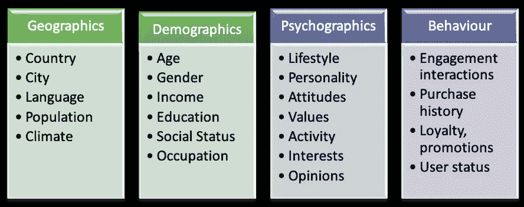
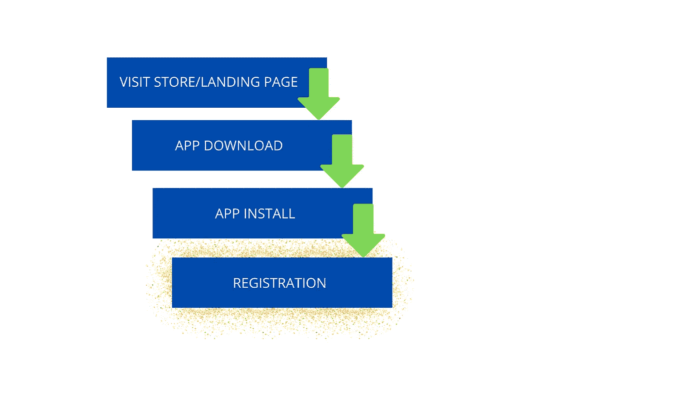
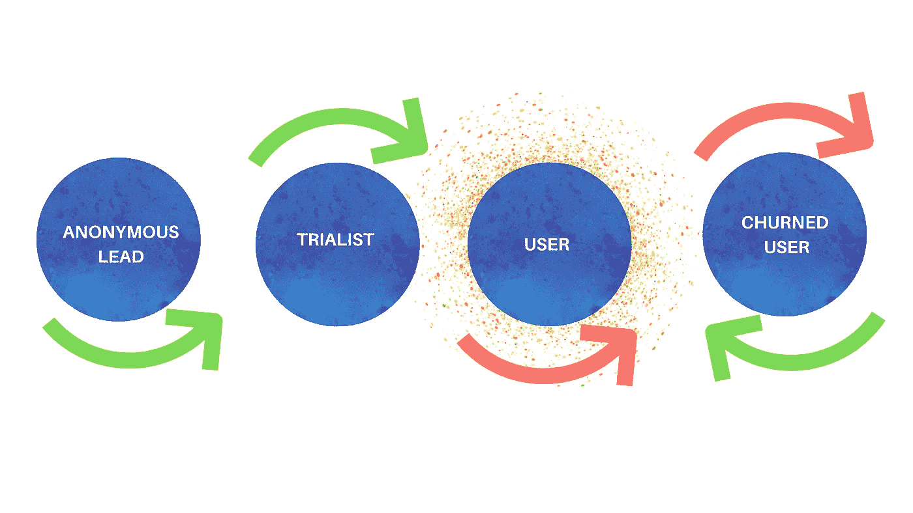
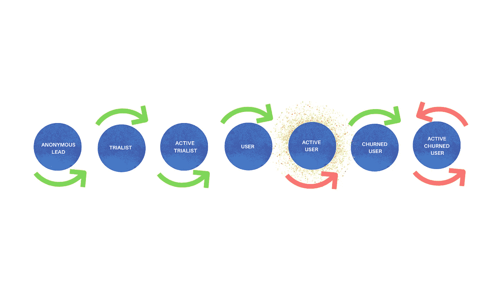
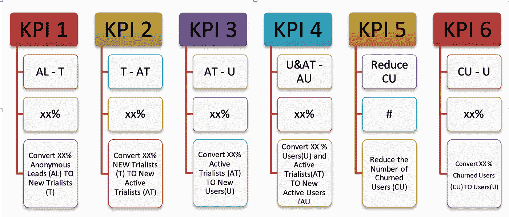
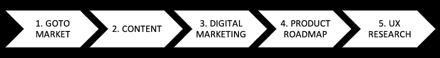
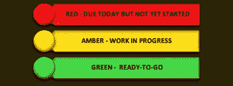

# 通过行为细分让您的企业走向成功

> 原文：<https://towardsdatascience.com/setting-your-business-up-for-success-with-behaviour-segmentation-74cf675ef18b?source=collection_archive---------36----------------------->

查尔斯·德鲁维奥在 [Unsplash](https://unsplash.com/s/photos/segment?utm_source=unsplash&utm_medium=referral&utm_content=creditCopyText) 上拍摄的照片

数据是任何组织的宝贵资产之一。它真的有可能成为下一个石油。然而，拥有大量数据并不总是意味着商业成功。拥有相关数据并知道如何使用它才是有效的。

大多数企业的增长都依赖于客户。人们可能会认为，企业将围绕与客户相关的数据制定计划和战略。与客户相关的数据是企业成功的关键。令人惊讶的是，一些商业目标和指标不包括客户行为。他们考虑的是其他不同领域的增长，而忽略了一个决定他们业务成败的因素。这使得团队将精力花费在收效甚微的活动上。因此，管理层无法实现其目标。

在本文中，我们探讨了客户行为细分的重要性。我们讨论易于遵循的策略，并探索行为细分系统。我们还研究了行为细分如何推动业务增长和成功。

**关键外卖**

阅读本文后，您将能够:

定义你最初的 6 个 KPI，这样你可以让你的团队保持专注。

了解如何确定是什么增加了你的活跃用户数量。

确定什么能帮助你的营销、产品和开发团队。

开始创建细分市场的具体内容，最大限度地发挥您的营销努力。

通过数据驱动的、针对具体细分市场的增长实验，搞清楚什么行得通，什么行不通。

帮助您摆脱盲目创建内容或活动。

> “知道谁是你的客户固然很好，但知道他们的行为更好。” **—乔恩·米勒。**

# 定义问题

了解客户应该是每一个以客户为中心的企业的目标。企业应该在理解客户行为、动机因素和影响的基础上茁壮成长。这有助于企业了解客户如何与他们的产品互动。有了这些知识，企业可以影响客户的旅程，衡量成功，同时推动业务增长。适应客户观点的数据驱动方法可以影响客户旅程。

企业在收集和使用数据时会遇到一些挑战。一些组织拥有有效的数据收集策略和系统。在某些情况下，这些组织缺乏利用这些数据的工具。集成大量不同的数据成为这些组织的一个棘手问题。因此，他们坐在有用的数据，对他们来说是无用的。其他组织缺乏收集足够有用数据的方法。由于分散的努力，这两种情况都可能导致增长不佳。

增长和扩展依赖于许多不同的因素。一些组织关注除客户行为之外的一些因素。他们把顾客的行为留给机会和假设。对客户行为做出假设是一个巨大的谬误。以客户为中心的历史数据应该是衡量进展的工具。它应该有助于组织分析什么可行，什么不可行。这指导了组织的决策，例如，在新产品开发中。利用这类数据的组织往往会获得成功。

作者的不同客户群/图片

除了数据管理，还有目标和指标的问题。关键绩效指标(KPI)衡量组织或产品的表现。KPI 可以帮助组织确定其成就和衡量增长。这些指标依赖于有限的数据，这排除了客户行为的关键方面。一些组织关注这些和其他指标，忽视客户行为。这可能会导致注意力分散，让团队非常忙碌，但无法达成目标。此外，过多的 KPI 可能会将公司的关注点从以客户为中心的角度转移到团队管理的角度。

有很多关于客户细分和个性化的讨论。企业寻求增强客户体验的方法，同时以组织发展为目标。培养客户参与度和忠诚度并不是一件容易的事情。这些函数中的大多数都是数据相关的。

# 定义行为细分

根据 Jan Teichmann 的说法，“行为细分是指利用从客户行为中获得的洞察力，通过他们的行为而不是他们是谁来理解客户。他继续将行为细分定义为“一种客户细分形式，它基于客户在与公司/品牌互动或做出购买决定时表现出的行为模式。”(Designandtechnologydepartment，Bronhiggs and Follow，2020)。行为细分根据客户与组织的互动对客户进行分类。

Deasi (2020)在一篇名为 *10 种了解客户的有效行为细分方法*的文章中列出了 10 种行为细分方法，简要讨论如下:

1.  **购买行为**

购买行为研究顾客购买时的各种趋势和行为。顾客决策和购买行为模式的动机有助于预测未来的购买。组织可以识别购买障碍，并努力消除购买障碍。

**2。** **谋取利益**

处理理解顾客寻求什么好处。识别重要的好处对组织来说是很有帮助的。

**3。** **客户旅程阶段**

客户可能处于与组织互动的不同阶段。这确保了更好的营销和产品定位。

**4。** **用法**

客户使用产品的时间和互动的频率。

**5。** **时机或时机**

客户最有可能购买或参与产品或服务的时间。星期几、一周的时间等。可能是一个重要的因素。了解购买之间的时间间隔也很重要。

**6。** **顾客满意度**

顾客对产品的态度很大程度上反映了他们的满意度。满意率可以帮助组织更好地制作他们的销售和营销信息。知道满意的顾客和不满意的顾客是有用的。不满意的客户比他们提供的改进信息重要两倍。

7。 **顾客忠诚度**

当一个组织知道哪些客户是忠诚的，它就可以想办法确保他们保持忠诚。留住现有的忠诚客户比寻找新客户更有益。向这些客户提供特殊服务和特权可以让他们开心。组织还可以识别不忠诚的客户以及不忠诚背后的原因。

8。 **利益**

识别不同的客户兴趣可以帮助组织打造个性化的体验。此外，组织可以确定潜在的兴趣领域。

**9。** **参与度**

这比使用水平要宽泛得多。它定义了客户对产品或服务的参与程度。

**10。** **用户状态**

这是客户参与产品或服务的水平。例如，客户端可以被分类为非用户、预期用户、首次用户、常规用户或叛逃者/被搅动的用户。这样，就更容易确定是什么触发了客户端从一种用户状态转换到另一种用户状态。有了这些知识，组织可以更好地优化其工作和资源。

由于技术进步，处理大量不同的数据成为可能。。在 Jan Teichmann 的文章中， *AI 符合市场细分模型，*他指出

> “在数据驱动的个性化兴起之前，大多数系统只能处理少量的细分市场，因此目标定位仅限于一般的受众细分。”

**行为细分的好处**

它帮助组织识别和认可客户行为。

组织可以了解客户如何与他们的业务或产品进行交互。

它提供了衡量成功和影响的准确指标。

通过将目标与关键结果分离，组织可以更好地管理进度。精简、规划和时间框架变得易于管理。

行为细分有助于阐明组织希望实现的目标。

它帮助 OKRs 适应现有的实践、敏捷流程和客户开发。

它有助于澄清和重新定义成功的衡量。

当团队清楚他们在做什么时，这就减少了计划周期。

它有助于激活和留住客户。

帮助组织关注重要的事情。

# 实施行为细分

规划用户生命周期是实施行为细分的关键组成部分。这不是一次性的过程。持续研究和将用户或客户行为重新应用到生命周期定义中是至关重要的。这些生命周期定义成为行为部分。大多数公司都犯了依赖人口统计细分的错误。他们错过了可能决定或破坏其产品增长的关键因素，或对其业务扩展至关重要的关键因素。平衡客户行为数据与其他商业目标并不总是容易的。然而，将 KPI 与客户旅程生命周期保持一致可能会带来业务成功。

一些工具有助于实现上述目标。旅程分析就是这些工具之一。旅程分析是帮助理解和转变客户旅程的解决方案。虽然它们有助于扩展，但对于客户的成功也至关重要。旅程分析帮助组织从多个维度看待客户。客户互动被视为旅程的终点，而不是一次性的互动。使用旅程分析，组织可以识别和预测客户行为。跟踪和分析客户如何在每一点上与组织互动变得更加容易。通过绘制全面的数据，组织可以监控和评估哪些可行，哪些不可行，从而重新设计客户旅程并改善客户体验。

**先认识自己**

> 准确的知识是无可替代的。知己知彼，百战不殆。”——***李·艾柯卡***

了解组织所处的阶段对于理解最重要的指标至关重要。这有助于直接关注重要的指标。

创业公司由于数据有限，尤其有几个未知数。这使得有效利用数据和分析变得困难。从本质上来说，初创企业的特点是高风险，并带有潜在的代价高昂的教训。因此，对初创公司来说，明确自己所处的阶段非常重要。这样，it 可以专注于最重要的指标。

以下是精益分析的 5 个阶段。

**第一阶段:** **感同身受**

在这个阶段，组织已经确定了值得解决的问题。将会生产出一种产品或服务来解决这些确定的问题。在这个阶段，组织可能会密切关注对其产品或服务的反应。

**第二阶段:** **粘性**

这是当一个产品被创造和使用的时候。有持续的客户参与和相当数量的活跃用户。

**第三阶段:** **病毒式**

这是在一个工作产品被开发出来之后，并且这个企业正在逐渐扩大它的用户基础以及它的忠实客户。满意的顾客可能会开始传播消息，分享更多关于业务、产品或服务的信息。

**第四阶段:收入**

在这个阶段，企业的经济学将开始变得有意义。关注更多的是价值创造和收入增长。

**第五阶段:** **规模**

这个阶段是关于业务增长的。企业必须建立足够大的客户群。该行业的经济学也开始变得有意义。它可以继续探索扩大规模的渠道。

了解组织所处的阶段有助于识别重要的度量标准。

**减少关键绩效指标的数量**

KPI 的数量应该最少。平均六个 KPI 被认为是理想的。然后，这六个 KPI 可以分解为由具体活动组成的团队目标。然后，这些活动被轻松地分配给每个团队成员。每个人都应该意识到自己的角色，以及如何衡量他们的投入和成功。

在这个阶段，如何衡量成功的明确定义是至关重要的。理解和规划用户的生命周期也很重要。特定事件定义了生命周期的每个阶段。这些共同构成了行为部分。开发生命周期图可以更容易地表达客户体验。

确保每个人都在同一页上

绘制出这些细分市场后，就可以建立 KPI 了。确保所有相关人员意见一致是很重要的。这样，每个人都可以根据目标和关键成果(okr)制定成长战略。当整个团队都致力于实现他们特定的 KPI 时，组织就可以享受巨大的成功。让团队参与制定最终实现六个 KPI 的任务可能会促进更大的合作。这样，所有团队都会知道他们在做什么，并满怀热情地将他们的活动集中在特定的 KPI 上。

**设定总体目标**

整体目标应该是团队/公司中每个人的焦点。所有团队成员都应该以此为目标。从人力资源、UX、发展等等，所有的角色都必须以某种方式导向这些目标。每个人的日常任务和个人目标都应该与这些目标保持一致。一些人称之为北极星度量(NSM)。一个应用程序的总体目标可以是:-持续增加活跃用户的数量。

**制定并更新跟踪计划**

跟踪计划列出了当前事件、它们的属性和定义。必须定期更新跟踪计划。需要设计的事件可以动态添加。下面的链接包含一个跟踪计划的例子。

[追踪计划](https://docs.google.com/spreadsheets/d/e/2PACX-1vSyZt8nTHvtNJUJ1tDCJx32Ez-s81wI7VJTN8or54cLcaBOroxGItFiSf5ftISjDzQ7KOY1Y-5pArck/pubhtml)举例

**识别核心事件**

核心事件是那些与用户生命周期相关联并构成行为细分的事件。当访问软件商店登录页面时，核心事件可能如下所示。

图片作者[作者](https://rosi-bremec.medium.com/)

这些事件定义了从匿名领导到试用者的变化。正如成长型营销人员所说，“他们已经在漏斗中向下移动了一步。”

a.**商店/登陆页面访问**

有一个单独的登录页面是有益的，因为它可以提供一个更详细的线索是谁。另一方面，也很难获得和店内页面一样多的流量。此时，有一个可以重新定位的活动销售线索。

b. **APP 下载**

这是指用户从商店下载应用程序。鉴于消费者受到大量应用程序的轰炸，应用程序下载对组织来说是一个很好的机会。顾客会喜欢这些功能吗？他们会继续在他们的设备上安装它吗？

c. **APP 安装**

安装是下载后的一个事件，构成用户第一次打开应用程序。这是决定性的一点。根据他们的体验，客户可以决定使用或不使用该应用程序。

d.**登记**

注册是指某人注册他们的详细信息，并成为试用者。

这是怎么发生的？

一个用户开始作为一个匿名的线索。通常情况下，他们是通过登录页面来实现的。登录页面可能会有一个对应用程序或产品进行简要描述的页面，并且通常会有一个行动号召(CTA)。行动号召可能是注册一份时事通讯或注册成为用户。一旦他们注册成为用户，这就是一个黄金时刻。他们突然从一个匿名的领导者或者仅仅是一个网站访问者变成了一个试用者！该组织现在在注册过程中收集其详细信息。焦点可以指向在用户生命周期的不同阶段移动这个特定的客户端。这些用户的反馈也很有帮助。

**设置事件组。**

事件组是构成特定行为段或生命周期阶段的事件集合。例如，构成活动用户的事件有:

o 查看事件

o 编辑事件

o 导出事件

o 回顾事件

**定义用户生命周期**

一旦制定了事件、核心事件、事件组和活动用户事件，就该定义用户生命周期了！下面的图 3 展示了一个简单的用户生命周期。

图片由[作者](https://rosi-bremec.medium.com/)

**1。** **匿名线索**

这可能是一个已经与该产品互动过的人，可能还没有决定使用它。这可以是网站访问者。

**2。** **试用者**

试用者可以是实际下载了应用程序并正在使用它的人。

**3。** **用户**

一个用户已经不再是试用者。他们可能已经购买了该应用程序的完整版本，并且正在使用它的大部分功能。

4.**被搅动的用户**

流失的用户是已经停止使用该企业的产品和/或服务的先前用户。

通常情况下，我们会停留在上述 4 个阶段。上述细分不足以区分不同的客户行为。例如，活跃的试验者和不活跃的试验者之间没有区别。

试用者可能是曾经下载过应用程序但发现它不合适的人。将他们转化为积极的试用者或用户并不容易。积极的试用者——下载了应用程序，觉得它很有趣的人。他们继续使用许多功能，并继续尝试使用锁定功能。他们可能会向支持部门询问问题，也可能会进行某种交易。出于某种原因，他们没有迁移到付费版本的应用程序上。他们没有进入生命周期的下一个阶段，也没有转化为用户。要了解走向市场、内容和数字营销、产品/功能开发战略和计划是否奏效，我们需要看到更多积极的试用者。将行为方面添加到上述部分可以提供一个前沿。

初创企业和扩大规模的企业犯了一个错误，那就是将增长建立在注册和在线访客数量的基础上。有时，这些是试用者、随机访问者和匿名线索。举例来说，这一大堆数据并没有显示这些试验者中有多少人实际上是活跃的。通过将不同的用户放入一个桶中，以下相关问题仍然没有答案:

1.是什么阻碍了试用者和匿名线索成为活跃的试用者？

2.如何增加积极试用者的数量？如果我们做一个更好的登陆页面作为成长实验呢？

3.我们应该在免费/试用版的应用程序中包含一个付费功能，作为另一个增长实验吗？

4.事实上，什么会增加积极试用者的数量？

如果不了解用户行为，就不可能有有效的增长战略。因此，重新定义这些包含行为的部分至关重要。

**定义行为细分**

行为细分是由用户触发的事件定义的用户组。这是下一个层次的用户细分，例如，匿名线索试用者。

1.  **匿名线索**

**2。用户**

**3。试用者**

**4。被搅动的用户**

图片由[作者](https://rosi-bremec.medium.com/)

上面的图 4 显示，四个细分市场包含一些行为细分市场，其定义比图 3 更广泛。这种更广泛的细分允许理解不同阶段的用户行为。更容易解决与增长和扩展相关的问题。理解行为有助于理解顾客喜欢或讨厌的特征。这可以帮助组织进行必要的改进。请记住，不满意的用户在提供关键的改进信息方面也是至关重要的。常言道，“所有的反馈，无论好坏，都有利于业务增长。”识别这些不同的用户，就更容易识别应用程序中的缺点。

将试用者与活跃试用者分开，将有助于创建符合市场需求的内容和产品功能。

转化率的增加——试用者转化为活跃试用者，然后用户转化为活跃用户——是一个很好的指标，表明产品或应用程序符合产品市场。这也有助于理解公司是否在增长。根据行为创建分段，将触发事件附加到分段，并将活动事件与非活动事件区分开，而不是简单的用户分段，这是更有益的。简单的用户细分将试用者和活跃试用者放在同一个细分市场中。很难确定一个人是否在正确的轨道上。如何判断自己是否走对了路？

下一步是根据核心事件设置生命周期定义。核心事件显示您的应用程序或产品的使用程度。基于这种用法，它们属于特定的生命周期。生命周期的每个阶段都包括行为相似的用户群。行为细分就是这样诞生的。

**制定 6 个关键绩效指标**

明确公司在客户行为方面的发展方向，下一步是制定 6 个关键绩效指标。一个应用程序的简单 KPI 图如下图 5 所示。KPI 是所有团队成员和相关部门的参考点。

与应用程序用户行为一致的 KPI 地图——图片由[作者](https://rosi-bremec.medium.com/)提供

**6 KPI—仪表盘**

这是整个团队，无论是财务、产品开发、市场营销、增长、销售等等。查看他们的活动是否对上述任何 KPI 产生了影响。

**制定增长战略**

图片作者[作者](https://rosi-bremec.medium.com/)

每个商人都会重申发展一个企业有多难。规划业务增长需要大量的努力。实施增长战略可能是成功与失败的区别。将 6 个关键绩效指标与行为细分相结合后，下一步是制定增长战略**。**这包括以下计划或战略。

1.去市场

这方面指的是公司如何将产品推向市场。它概述了商业计划和营销计划等方面。它涉及产品或服务的交付和到达目标市场。走向市场计划可能有助于推出新产品或重新上市。它包括市场定义、客户、分销模式、产品信息、定位和定价。

2.内容

内容作者需要知道他们在给谁写内容。当作者知道他们为谁写作时，他们可以使用适当的语气和信息。当向活跃用户介绍一个新功能时，写作将不同于针对匿名线索。

3.数字营销

如今，数字营销是一种至关重要的营销工具。有许多数字营销策略可以考虑。技术范围从使用搜索引擎，社会媒体营销等。

4.产品路线图

产品路线图概述了组织的产品将如何满足业务目标。它有助于确定产品的发展方向，以及如何实现这一目标。在功能上，它使产品开发与业务目标相一致。产品路线图信息在协调工作中至关重要。

5.UX 研究

用户体验(UX)研究确定用户的需求、行为和动机因素。UX 研究揭示了客户的有用信息。

增长战略包括包含上述所有方面的增长实验。每个实验都列出了目标 KPI，并记录了成功目标的百分比增长，同时设置了对照组进行比较。这使得衡量什么可行，什么不可行成为可能。一个很好的例子是分析内容的影响，以及针对活跃试用者的数字活动，以转化为用户。如果 KPI 3 没有增加，那么下一步将是探索不同的方法或尝试其他方法。人们可以探索 KPI3 的另一个增长实验。将以前付费的功能添加到试用版可能是一种选择。可以监控结果，并确定对 KPI3 的影响。

**设定成长日历**

这是生长实验被绘制在日历上的地方，使用颜色代码来绘制活动。颜色代码的使用示例如图 5 所示。

图解生长日历彩色编码。—图片作者[作者](https://rosi-bremec.medium.com/)

成长日历 **:**

1.告知组织中的所有团队正在进行的工作。

2.通知团队每个项目的状态。

3.充当交叉参考点。如果任何 KPI 出现峰值/下降，可以参考增长日历来检查该周发生了什么。

理想情况下，实验应该提前 3 周计划好。

持续不断地研究和重新应用。

作为产品的新功能和集成，您可以将新事件设计到您的跟踪计划中，后端您的事件组以及活动用户和所有其他行为细分市场的事件列表将会发生变化。这是一个好的变化，一个有利于业务增长的动态变化。KPI 和细分市场将保持不变，但都得到了极大的优化。

持续一致的 UX(用户体验)研究的结合对于 BI 战略的成功至关重要，因此也是成功和发展的关键。

# 结论

传统的客户细分方法忽略了客户行为的关键方面。行为细分是商业成功战略的一部分。这使得企业能够了解他们的客户行为，并识别客户在任何给定时间的行为类别。企业可以为个别客户群定制通信、产品和行动。

一个企业的成长依赖于它的客户和团队。将 KPI 和目标与行为细分数据相结合应该是业务的重点。这确保了企业关注最重要的事情。将团队努力与客户行为结合起来是一个伟大的商业成功公式。

**参考书目**

Deasi，b . g .(2020)‘了解你的客户的 10 种强有力的行为细分方法什么是行为细分？“为什么要按行为划分客户？”，第 1–25 页。

Designandtechnologydepartment，f .，Bronhiggs，w .和 Follow，J. T. (2020)“人工智能符合营销细分模型”，第 1-14 页。