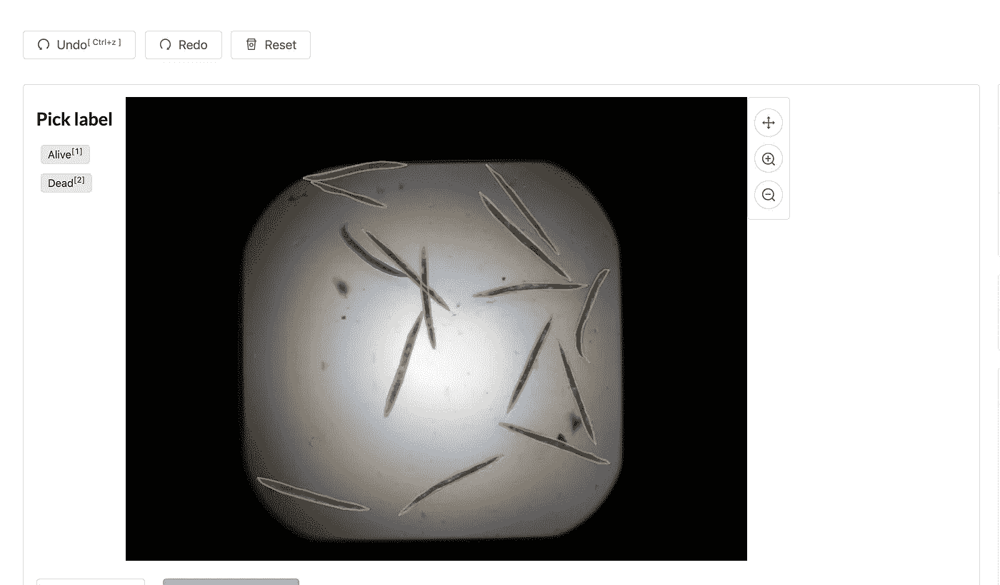
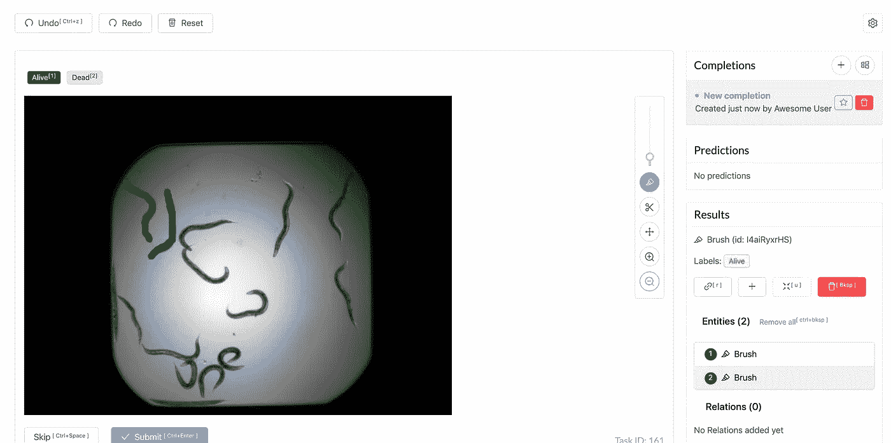
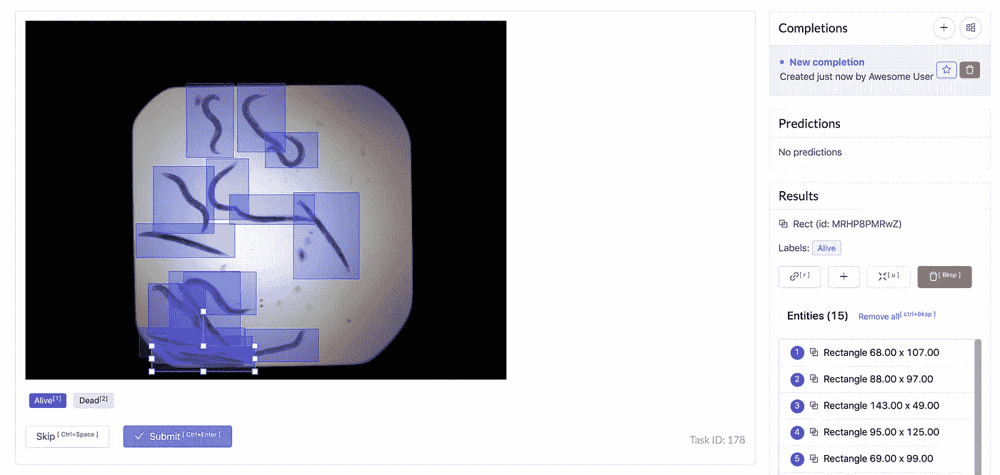
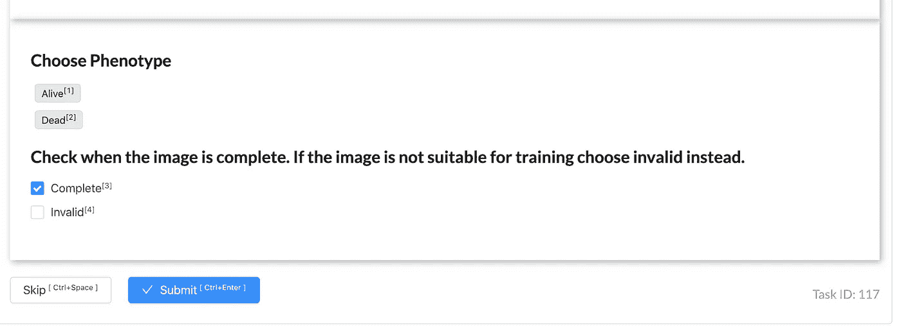

# 使用 Label Studio 建立高内容放映影像平台

> 原文：<https://towardsdatascience.com/setup-a-high-content-screening-imaging-platform-with-label-studio-b7e5a6ebb13c?source=collection_archive---------47----------------------->

## 对于 HCS 来说，拥有一个注释图像数据的平台是必不可少的。在这里，我将演示如何从 Broad 注释 C Elegans 图像。


几年来，我一直在寻找一个我真正喜欢的工具，使用 web 界面来注释 HCS 图像。我用过几个工具，包括一个叫做 [LabelImg](https://github.com/tzutalin/labelImg) 的桌面应用，我终于找到了一个检查所有叫做 [LabelStudio](https://labelstud.io/) 的盒子的工具！

Label Studio 是一个用于图像、音频和文本的注释工具。在这里，我们将专注于图像作为我们选择的媒介。

我在这个视频中讲述了这个过程。

# 获取数据

当然，您可以使用您自己的数据，但是对于本教程，我将使用来自[Broad bio image Benchmark Collection](https://data.broadinstitute.org/bbbc/BBBC010/)的公开可用的 *C. elegans* 数据集。

```
mkdir data
cd data
wget https://data.broadinstitute.org/bbbc/BBBC010/BBBC010_v2_images.zip
unzip BBBC010_v2_images.zip
```

在系统查看器中打开时，HCS 图像通常非常暗。为了将它们用于管道的其余部分，我们必须进行两步转换过程，首先使用 [bftools](https://www.openmicroscopy.org/bio-formats/) 从 tif - > png 转换，然后使用 [Imagmagick](https://imagemagick.org/index.php) 进行色阶校正。

```
cd .. # be in your project root here
# Use the bftools docker image and drop into a shell
mkdir data/tif
mkdir data/png
mkdir data/corrected-png
docker run -it -v $(pwd)/data:/home/bf/data openmicroscopy/bftools bash
cd /home/bf/data
find $(pwd) -name '*tif' | sed 's/\.tif//g' | xargs -I {} bfconvert -nogroup {}.tif {}.png
# ctrl+d to exit the container
```

现在，我们将使用 ImageMagick 来应用自动水平校正，以便我们可以看到我们正在标记的内容！

```
docker run -it --rm -v $(pwd)/data:/data \
    continuumio/miniconda3 bash
# On the image
conda install -c conda-forge -y imagemagick
cd /data
find $(pwd) -name '*tif' | xargs -I {} basename {} | sed 's/\.tif//g' | xargs -I {} convert -auto-level /data/{}.png /data/{}-autolevel.png
mv *.tif tif/
mv *auto*.png corrected-png/
mv *.png png/
# Ctrl+D to exit
```

如果你像我一样，收集 docker 图片作为避免在你的电脑上安装东西的一种方式，你需要偶尔清理它们。

```
# This will remove ALL DOCKER containers from your system
# Use with caution!
docker container stop $(docker container ls -aq)
docker system prune -f -a
```

如果您需要清理图像，请移除`data/png`和`data/tif`文件夹。我们不会使用它们。

# 启动 LabelStudio

LabelStudio 基于项目工作，每个项目都包含任务。在这种情况下，任务是标记图像。因此，我们需要做的是将它指向一个图像目录，它将为我们配置项目。

# 不同的标签配置

LabelStudio 可以容纳几种不同的图像注释类型。了解更多信息的最佳途径是访问他们的[模板](https://labelstud.io/templates/)页面，开始探索他们的游乐场。

我将假设您正在使用语义分割、多边形标记或包围盒。作为一个快速的免责声明，语义分割界面在我试用时有点小故障。在撰写本文时，它被标记为“新的”,正在积极开发中。也许当你读到这封信的时候，事情已经解决了。

这对我来说不是问题，因为我个人发现我可以使用多边形标注工具来勾勒形状，从而获得相同的功能。我还发现多边形工具更容易使用，一旦你有了多边形轮廓，你就可以把它转换成一个遮罩。

# 语义分割与包围盒

语义分割是指将图像中的每一个像素指定为你想要标记的东西。标注更加耗时，并且需要更多的计算资源来训练模型，但是精度会更高。

使用边界框来标记和开始使用要快得多，但是你会失去准确性，特别是当你有许多重叠的对象时。

下面的例子可以更好地解释这一点:

**多边形标签**



**语义标签**



**边界框**



# 初始化并启动脚本

抓住这个，命名为`init-labelproject.sh`。

```
#!/usr/bin/env bash

# init-labelproject.sh

docker run --rm -it \
    -e PORT=${PORT} \
    -v $(pwd)/${TYPE}:/label-studio/${TYPE} \
    -v $(pwd)/data:/label-studio/data \
    -v $(pwd)/conf:/label-studio/conf \
     --name label-studio-${TYPE} \
     heartexlabs/label-studio:latest label-studio \
        init ${TYPE} --force \
        --port ${PORT} \
        --input-path=/label-studio/data/corrected-png \
        --label-config=/label-studio/conf/${TYPE}-config.xml \
        --input-format=image-dir
```

抓住这个，命名为`run-labelstudio.sh`。

```
#!/usr/bin/env bash

# run-labelstudio.sh

docker run --rm -it \
    -p ${PORT}:${PORT} \
    -e PORT=${PORT} \
    -v $(pwd)/${TYPE}:/label-studio/${TYPE} \
    -v $(pwd)/data:/label-studio/data \
    -v $(pwd)/conf:/label-studio/conf \
     --name label-studio-${TYPE} \
     heartexlabs/label-studio:latest label-studio \
        start ./${TYPE} --port ${PORT}
```

一旦你有了这些运行`chmod 777 *sh`，让我们来标记一些蠕虫！

# 设置您的项目并启动 Web 界面

在下面找到您想要的配置，并启动 web 界面。

```
mkdir conf
# Make sure each of the xml files are in the conf dir!
cd conf
```

**包围盒配置**

抓住这个放在`conf/object-config.xml`里。

```
<View style="display: flex">
  <View style="width: 100px">
    <Header value="Pick label" />
    <RectangleLabels name="tag" toName="img">
      <Label value="Alive" background="blue"></Label>
      <Label value="Dead" background="orange"></Label>
    </RectangleLabels>
    </View>
  <View>
    <Image name="img" value="$image" showMousePos="true" zoom="true" zoomControl="true" />
  </View>
</View>
```

**多边形配置**

抓住这个，把它放在`conf/polygon-config.xml`。

```
<View style="display: flex">
  <View style="width: 100px">
    <Header value="Pick label" />
    <PolygonLabels name="tag" toName="img" strokewidth="2" pointstyle="circle" pointsize="small" showInline="false">
      <Label value="Alive" background="blue"></Label>
      <Label value="Dead" background="orange"></Label>
    </PolygonLabels>
    </View>
  <View>
    <Image name="img" value="$image" showMousePos="true" zoom="true" zoomControl="true" />
  </View>
</View>
```

**语义配置**

抓住这个放在`conf/semantic-config.xml`里。

```
<View style="display: flex">
  <View style="width: 100px">
    <Header value="Pick label" />
    <BrushLabels name="tag" toName="img">
      <Label value="Alive" background="blue" />
      <Label value="Dead" background="orange" />
    </BrushLabels>
    </View>
  <View>
    <Image name="img" value="$image" showMousePos="true" zoom="true" zoomControl="true" />
  </View>
</View>
```

# 包围盒

要运行边界框界面，使用以下命令-

```
export TYPE="object"
export PORT="8080"
mkdir $TYPE
# you only need to run the init script once for setup
./init-labelproject.sh
./run-labelstudio.sh
```

并在浏览器中打开`localhost:8080`。

# 多边形

要运行多边形界面，请使用以下命令-

```
export TYPE="polygon"
export PORT="8081"
mkdir $TYPE
# you only need to run the init script once for setup
./init-labelproject.sh
./run-labelstudio.sh
```

并在浏览器中打开`localhost:8081`。

# 语义分割(画笔)

要运行语义界面，请使用以下命令-

```
export TYPE="semantic"
export PORT="8082"
mkdir $TYPE
# you only need to run the init script once for setup
./init-labelproject.sh
./run-labelstudio.sh
```

并在浏览器中打开`localhost:8082`。

# 定制标签界面

LabelStudio 给了你很多对[标签界面](https://labelstud.io/tags/#Styles)的控制。您也可以使用[控制标签](https://labelstud.io/tags/choices.html)直接通过配置添加简单的表单。

我想要的是将图像标记为完整的能力，这意味着所有的蠕虫都被标记，或者无效以将其从训练中排除。我可以用下面的配置添加它。

```
<View>

    <!--    Begin Display the image-->
    <View style="padding: 25px;
               box-shadow: 2px 2px 8px #AAA;">
        <Image name="img" value="$image" showMousePos="true" zoom="true" zoomControl="true"/>
    </View>
    <!--    End Display the image-->

    <!--    Begin display labels-->
    <View style=" padding: 25px;
               box-shadow: 2px 2px 8px #AAA;">
        <View style="">
            <Header value="Choose Phenotype"/>
            <PolygonLabels name="tag" toName="img" strokewidth="2" pointstyle="circle" pointsize="small"
                           showInline="false">
                <Label value="Alive" background="blue"></Label>
                <Label value="Dead" background="orange"></Label>
            </PolygonLabels>
        </View>

        <View style="">
            <Header value="Check when the image is complete. If the image is not suitable for training choose invalid instead."/>

            <Choices name="complete" toName="img" choice="single">
                <Choice alias="complete" value="Complete"/>
                <Choice alias="invalid" value="Invalid"/>
            </Choices>
        </View>
    </View>
    <!--    End display labels-->

</View>
```

为了得到你想要的精确布局，你可以在这上面多下功夫。宽度、高度和其他 CSS 变量都可以通过配置进行配置。确保重新启动服务器以查看您的新配置！

每个控件都有一个名称`name`，它必须是唯一的，还有一个目的地`toName`。

```
<Choices name="complete" toName="img" choice="single">
# ...
<Image name="img" value="$image"
# ...
<PolygonLabels name="tag" toName="img"
```



# 处理标签输出

每个输出都在您的`project-dir/completions`中，在那个目录中，每个图像都有一个 json 文件。你会看到路径`completions`，然后会有一个`results`的数组。输出格式和具体规格可能会因您的配置而异，因此请务必使用您自己的配置进行验证。

以下是一个面标注输出示例。我已经添加了注释，它不再是有效的 json，所以不要试图解析它。；-)

```
{
## Corresponds to the name on the Polygon Control
    "from_name": "tag",
## Randomly generated ID 
    "id": "bUgnJpbBgC",
## Height and Width of the Image
    "original_height": 520,
    "original_width": 696,
## Task Variable
    "source": "$image",
## The to portion of the control
    "to_name": "img",
## Control Type
    "type": "polygonlabels",
    "value": {
## Points of the polygon
## These can be read into a matplotlib.Path object for parsing
        "points": [
            [
                71.25434944790884,
                27.052753770458885
            ],
            [
                68.9321022931952,
                28.148466100859682
            ],
            ... More labels
        ],
        "polygonlabels": [
        ## ITS ALIVE!
        ## This is one of the phenotypes
        ## The phenotypes were either alive or dead
            "Alive"
        ]
    }
},
```

这是我们用完全/无效创建的“表单”的一个示例。

```
{
# This is the name from the control
    "from_name": "complete",
    "id": "PZru1lZMeo",
    "to_name": "img",
    "type": "choices",
    "value": {
        "choices": [
        ## This image as marked as invalid!
        ## Don't use it for training!
            "invalid"
        ]
    }
}
```

这是事情变得有趣的时候，因为现在您有了一个带有可解析输出的可配置接口，您可以开始为训练创建健壮的管道。

# 进一步的想法

当您旋转界面并开始标记时，您会看到 LabelStudio 将您的数据发送到`{polygon,object,semantic}/completions/*.json`。这些只是数据文件，然后您可以使用它们为 Tensorflow、PyTorch 或 Keras 训练模型。

假设您使用的是 [Tensorflow MaskRCNN](https://github.com/tensorflow/models/blob/master/research/object_detection/g3doc/instance_segmentation.md) 模型。您可以使用 LabelStudio 来标记您的图像，将 JSON 文件转换成一个 [TFRecord](https://github.com/tensorflow/models/blob/master/research/object_detection/g3doc/using_your_own_dataset.md) ，并进行训练。然后你可以拿起你不完美的模型，让它标记一个图像集，然后手动清理新的图像，冲洗并重复。

如果你有任何问题，请不要犹豫与我在 jillian@dabbleofdevops.com 联系。

# 引文

[](https://data.broadinstitute.org/bbbc/BBBC010/) [## BBBC010:秀丽隐杆线虫活/死分析

### 登录号 BBBC010 第 1 版这一选择的图像是控制选择从一个屏幕上找到新的…

data.broadinstitute.org](https://data.broadinstitute.org/bbbc/BBBC010/) 

“我们使用了由 Fred Ausubel 提供的*秀丽隐杆线虫*感染活/死图像集版本 1，可从 Broad bio image Benchmark Collection 获得[ [Ljosa 等人， *Nature Methods* ，2012](http://dx.doi.org/10.1038/nmeth.2083) ]。”

*最初发表于*[*【https://www.dabbleofdevops.com】*](https://www.dabbleofdevops.com/blog/setup-a-high-content-screening-imaging-platform-with-label-studio)*。*