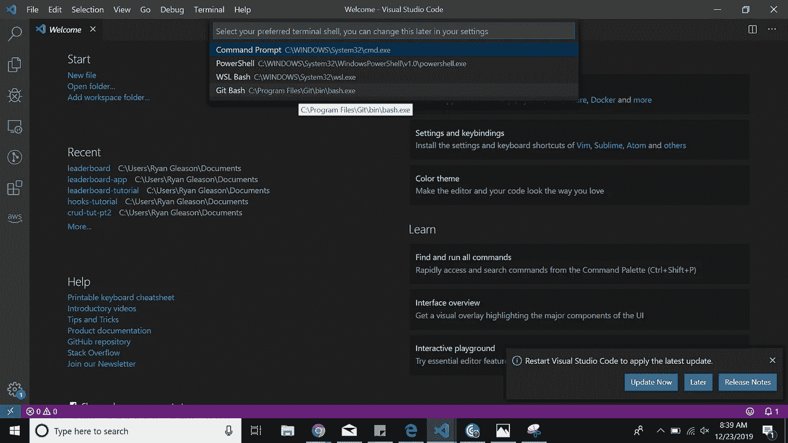
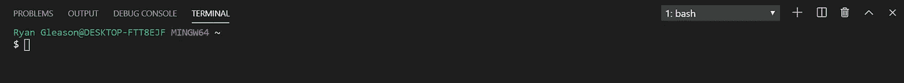
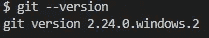
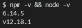
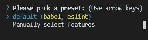
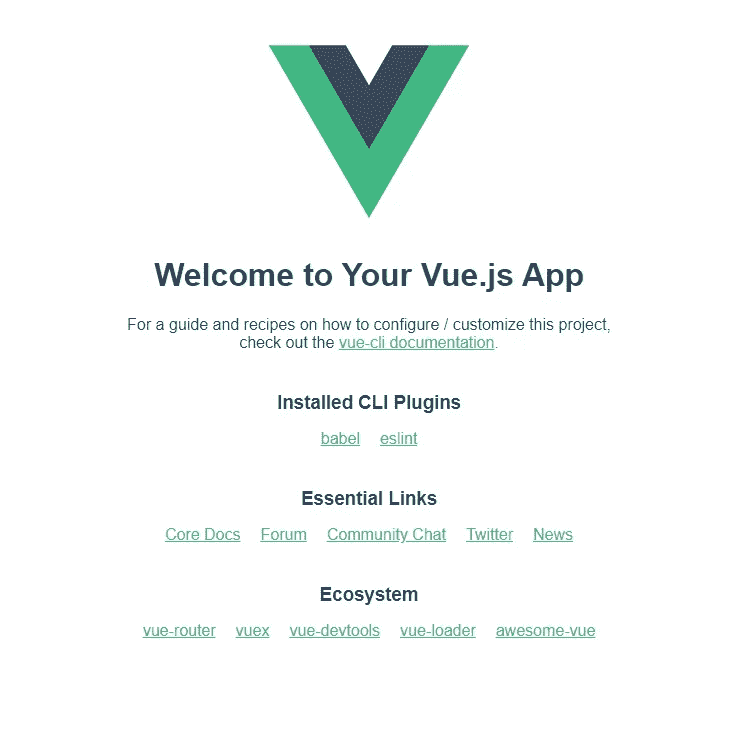

# 在 Visual Studio 代码中设置 Vue.js Hello World

> 原文：<https://towardsdatascience.com/setup-vue-js-hello-world-in-visual-studio-code-15d4edccd6e2?source=collection_archive---------12----------------------->

## 在 Vue.js 中快速启动 Hello World 应用程序


在 [Unsplash](/s/photos/software?utm_source=unsplash&utm_medium=referral&utm_content=creditCopyText) 上由 [Austin Distel](https://unsplash.com/@austindistel?utm_source=unsplash&utm_medium=referral&utm_content=creditCopyText) 拍摄的照片

# 目标

在设置好本地开发环境之后，启动一个简单的 Vue 应用程序。

这些是您将在本教程中安装的工具:

*   Visual Studio 代码(VS 代码):这当然不是创建 Vue 应用程序的要求，但它是我推荐的文本编辑器。我相信它使软件开发变得更加愉快和高效。
*   [Git](https://git-scm.com/downloads) [Bash](https://www.gnu.org/software/bash/) : Git 是一个非常流行的管理源代码的工具，尤其是当你在一个大型开发团队中工作的时候。VS 代码允许您集成 Git Bash 终端，这使得将您的代码推送到 Git 存储库非常方便。此外，它允许您在模拟 Bash 环境时使用大多数标准的 UNIX 命令。
*   JavaScript 运行时环境
*   npm:节点包管理器。这与 Node.js 一起使用，以便我们可以轻松地共享打包的代码模块。

# 下载 VS 代码

从 [Visual Studio 代码](https://code.visualstudio.com/)下载稳定版本。

这是一个非常简单的下载。微软在简化这个应用程序的安装过程方面做得很好。

# 在 VS 代码中使用 Git Bash

从 https://git-scm.com/downloads 的[下载适用于您特定操作系统的 Git Bash。](https://git-scm.com/downloads)

当你点击 Git 安装程序时，我建议使用所有默认的安装设置，除非你真的知道你在做什么。

我们现在将 Git Bash 作为一个集成终端添加到 VSCode 中。

*   在 VS 代码中打开一个新的终端(Ctrl + Shift +`)或者终端→新终端。
*   打开命令选项板(Ctrl + Shift + P)或视图→命令选项板。
*   键入“终端:选择默认外壳”。
*   您应该会看到下面的选项:



*   选择 Git Bash。
*   在终端窗口中选择+按钮。



您应该会看到类似这样的内容。

检查点 *:* 输入下面的命令，确保已经正确安装了 Git。

```
git --version
```



根据您安装的版本，这应该会出现。

# 安装 Node.js

去这个链接下载: [Node.js](https://nodejs.org/en/) 。

我选择了“推荐给大多数用户”选项，然后使用 Node.js 设置中的所有默认设置。

检查点:安装完成后，在命令行中输入:

```
node -v && npm -v
```

它应该是这样的(你的版本可能比我的更新):



如果您成功安装了 Node 和 npm，请跳到下一节。

如果它没有出现在你的 Git Bash 中，不要烦恼！重新启动计算机。

如果这不起作用，请在 PowerShell 中键入相同的命令，或者只在 Windows 命令行中键入，您应该会在那里看到它。

要使用 Git Bash，您需要将它添加到您的路径中。该路径告诉您的操作系统在哪里寻找可执行文件，以响应来自用户的命令。下面是在 Windows 上如何做到这一点:

*   打开“查看高级系统设置”。
*   单击“环境变量”。
*   在系统变量下，选择路径，然后选择编辑按钮。
*   添加这个 C:\Program Files\nodejs\。
*   如果上述文件路径不正确，您可以通过在 Windows 命令行中键入以下命令来轻松找到它:

```
where node
```

*   在检索到节点目录的正确路径并将其添加到 path 系统变量后，选择“确定”。
*   重新启动计算机。

检查点:现在，尝试在 Git Bash 中键入以下命令:

```
node -v && npm -v
```


# 安装 Vue

在命令行中键入以下命令。

```
npm i -g @vue/cli
```

完成后，我们将创建我们的项目:

```
vue create hello-world
```

我选择了预设



接下来，将目录切换到新项目中，并启动它！

```
cd hello-world && npm run serve
```

导航到 localhost:8080，您应该会看到类似这样的内容:



就是这样！我们做到了。

# 回顾

您已经安装了以下工具，可以开始创建 Vue.js 应用程序。

*   虚拟代码
*   饭桶狂欢
*   节点. js
*   npm
*   Vue CLI

恭喜你。

# 赖安·格里森的更多故事

[](https://medium.com/better-programming/node-js-vs-spring-boot-which-should-you-choose-2366c2f76587) [## Node.js 与 Spring Boot——你该选择哪一个？

### 轻松点。Spring Boot。对吗？没那么快…

medium.com](https://medium.com/better-programming/node-js-vs-spring-boot-which-should-you-choose-2366c2f76587) [](https://medium.com/better-programming/is-it-time-we-forget-react-and-jump-on-the-svelte-bandwagon-4848bb5d0839) [## 是时候忘记反应，加入苗条的潮流了吗？

### 一场真正的泰坦之战(苗条还能算泰坦吗？)

medium.com](https://medium.com/better-programming/is-it-time-we-forget-react-and-jump-on-the-svelte-bandwagon-4848bb5d0839) [](/how-i-used-aws-lambda-to-make-my-girlfriend-smile-61194596f2d) [## 我如何使用 AWS Lambda 让我的女朋友微笑

### 开始这个有趣的小项目来提升你周围人的精神

towardsdatascience.com](/how-i-used-aws-lambda-to-make-my-girlfriend-smile-61194596f2d)