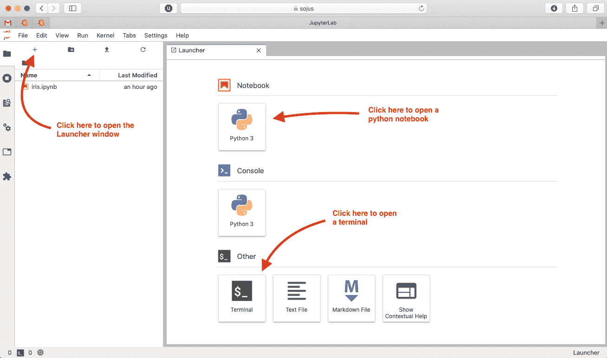
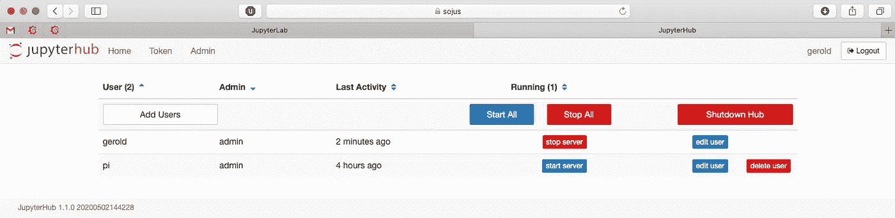

# 在树莓派上设置您的家庭 JupyterHub

> 原文：<https://towardsdatascience.com/setup-your-home-jupyterhub-on-a-raspberry-pi-7ad32e20eed?source=collection_archive---------5----------------------->

## 从家中的任何设备启动笔记本。一个家庭中心。

作为一名数据科学家，我每天都使用 Jupyter 笔记本。有时在本地我的笔记本上，有时通过 JupyterHub 在服务器上。但是为什么不把两者结合起来，在树莓派上运行 JupyterHub 呢？这样，家庭中的每个人都可以通过浏览器从每台设备启动笔记本电脑。数据总是留在家里，随着 Raspberry Pis 变得越来越强大，我们实际上可以在它上面进行真正的数据科学。


我平板电脑上的一点机器学习。旁边:树莓派和咖啡。

# 目录

1.  准备 Python 环境
2.  安装 JupyterHub
3.  设置为系统服务
4.  使用 JupyterLab
5.  安装 Python 库
6.  用户管理

# 准备 Python 环境

有许多文章描述了如何设置 JupyterHub，但是大多数都使用了 Anaconda。不幸的是，Anaconda 不支持像 Raspberry Pi 和 Miniconda 这样的 ARM 系统，而这两个系统通常被认为是一种替代方案，显然没有得到进一步的维护。所以让我们和皮普一起去。

我做错什么了吗？当我在新安装的 Raspbian Buster 中输入“python”时，它打开了“python2”。真的吗？不是 2020 年吗？所以让我们快速地将系统重定向到 python3:

```
sudo rm /usr/bin/python 
sudo ln -s /usr/bin/python3 /usr/bin/python
```

并安装 python 包管理器 pip:

```
sudo apt-get update 
sudo apt-get install python3-pip 
sudo pip3 install --upgrade pip
```

# 安装 JupyterHub

JupyterHub 由三个组件组成:

*   一个*单用户笔记本服务器*，当系统上的每个用户登录时启动。这基本上就是你已经安装在笔记本电脑上的东西，从`jupyter notebook`开始。
*   管理用户账户、认证和协调单用户笔记本服务器的*中枢*。
*   一个*代理*，它将用户请求路由到集线器和笔记本服务器。

相应地，我们需要安装这三个组件。让我们从代理开始:

```
sudo apt-get install npm 
sudo npm install -g configurable-http-proxy
```

现在，我们可以使用 pip 安装 JupyterHub 和 Jupyter Notebook。因为我们想让多个用户使用 JupyterHub，所以我们需要确保安装是系统范围的:

```
sudo -H pip3 install notebook jupyterhub
```

JupyterHub 是使用 python 脚本配置的。您可以使用以下命令生成模板。然后，将其移动到主目录之外的位置:

```
jupyterhub --generate-config 
sudo mv jupyterhub_config.py /root
```

在下面的步骤中，当我们在配置文件中进行更改时，我们需要修改这个文件`/root/jupyterhub_config.py`。由于它位于`/root`，我们需要使用 sudo。

例如，默认情况下，JupyterHub 运行在端口 8000 上。可能我们已经在使用这个端口了，所以我们把它改成 8888 吧。为此，取消配置文件中以下语句的注释，并调整端口:

```
c.JupyterHub.bind_url = 'http://:8888'
```

# 设置为系统服务

我们的 JupyterHub 已经准备好了。我们可以从`jupyterhub -f /root/jupyterhub_config.py &`开始(其中`-f`指向我们刚刚创建的配置文件)。但是，集线器只能存活到下一次系统重启。第一次尝试还好，但是如果我们经常使用它，当然最好将 JupyterHub 设置为系统服务，这样它会在系统启动时自动启动。

要将 JupyterHub 注册为系统服务，创建文件`/lib/systemd/system/jupyterhub.service`,并用以下内容填充它:

```
[Unit] 
Description=JupyterHub Service 
After=multi-user.target [Service] 
User=root 
ExecStart=/usr/local/bin/jupyterhub --config=/root/jupyterhub_config.py 
Restart=on-failure [Install] 
WantedBy=multi-user.target
```

确保以`ExecStart`开头的行包含 JupyterHub 二进制文件和配置文件的正确位置，或者进行相应的调整。

然后，运行以下命令:

```
sudo systemctl daemon-reload 
sudo systemctl start jupyterhub 
sudo systemctl enable jupyterhub 
sudo systemctl status jupyterhub.service
```

JupyterHub 将在系统启动时启动。最后一个命令显示了状态，希望是“active (running)”。

如果是这种情况，请前往`http://<address of your raspi>:8888`。您应该会看到 JupyterHub 的登录页面。Raspberry Pi 的每个系统用户现在都可以登录并启动他们自己的笔记本服务器！

# 使用 JupyterLab

JupyterLab 是 Jupyter 项目的下一代基于网络的用户界面。它允许您以非常灵活的方式处理文档和笔记本。如果你还不相信:它甚至有一个黑暗模式…

要使用 JupyterLab 而不是传统的笔记本，我们首先必须使用 pip 安装它，然后启用扩展(使用 sudo 在系统范围内完成):

```
sudo -H pip3 install jupyterlab  
sudo jupyter serverextension enable --py jupyterlab --system
```

现在，我们必须在配置文件中添加(或取消注释并调整相应的行)以下内容:

```
c.Spawner.default_url = '/user/:username/lab'
```

# 安装 Python 库

为了进行实际的数据科学，我们当然需要比 python 标准库更多的东西。我们基本上有两种可能性:我们可以在系统范围内安装它们。或者，每个用户都可以将它们安装在自己的主目录中。

一个合理的方法是在系统范围内安装最常用的包，让用户自己安装其他的包。下面是如何在系统范围内安装 numpy 的一个例子。要使 numpy 工作，您还必须安装以下系统软件包:

```
sudo apt-get install libatlas-base-dev 
sudo -H pip3 install numpy
```

没有 sudo 权限的用户可以在他们的主目录中安装软件包，例如:

```
pip3 install seaborn
```

您实际上可以从 JupyterLab 中打开一个终端，因此没有必要为“普通”用户设置 ssh 连接。只需转到启动窗口，打开一个终端。



首先打开启动窗口。从那里，您可以打开一个新的笔记本或终端。

# 用户管理

在我们当前的设置中，用户由操作系统管理。这意味着每一个 Raspberry Pi 的用户也可以启动他们自己的笔记本服务器。

管理员有额外的权利。例如，他们可以访问管理面板，在那里他们可以看到哪些用户登录，并启动和停止他们的服务器。管理员权限通过组来处理。例如，如果我们想指定用户“gerold”为 admin，我们将首先创建一个组(我们也可以使用一个预先存在的组)并将用户添加到其中。这在 Unix 系统中通常是这样做的:

```
sudo addgroup jupyter_admin 
sudo usermod -aG jupyter_admin gerold
```

然后，我们需要在配置文件中将该组添加为 admin-group:

```
c.PAMAuthenticator.admin_groups = {'jupyter_admin'}
```

可以在`http://<address of your raspi>:8888/hub/admin`下找到管理面板。



JupyterHub 管理面板。

# 参考

*   木星枢纽:[https://jupyterhub.readthedocs.io/](https://jupyterhub.readthedocs.io/)
*   木星实验室:[https://jupyterlab.readthedocs.io/](https://jupyterlab.readthedocs.io/)