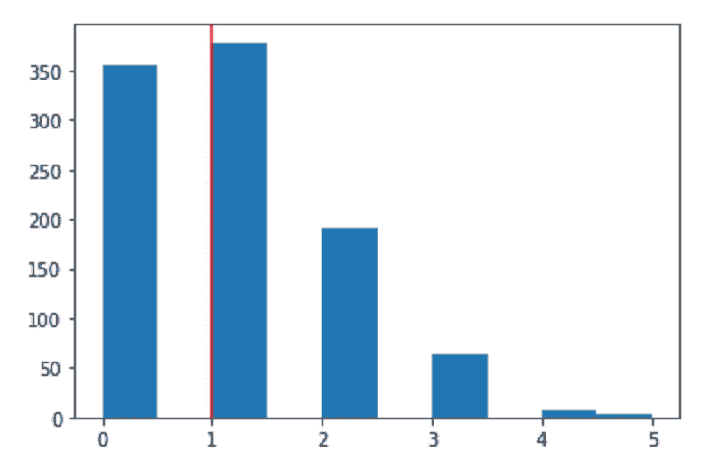
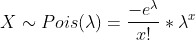

# 数据科学中必须知道的七种统计分布及其模拟

> 原文：<https://towardsdatascience.com/seven-must-know-statistical-distributions-and-their-simulations-for-data-science-681c5ac41e32?source=collection_archive---------4----------------------->

## [入门](http://Getting Started)

## 假设、关系、模拟等等


由[卢克·切瑟](https://unsplash.com/@lukechesser?utm_source=unsplash&utm_medium=referral&utm_content=creditCopyText)在 [Unsplash](https://unsplash.com/s/photos/data-science?utm_source=unsplash&utm_medium=referral&utm_content=creditCopyText) 上拍摄的照片

统计分布是一个参数化的数学函数，它给出了随机变量不同结果的概率。根据它模拟的随机值，有离散分布和连续分布。本文将介绍七种最重要的统计分布，展示它们与 Numpy 库嵌入式函数或随机变量生成器的 Python 模拟，讨论不同分布之间的关系及其在数据科学中的应用。

# 不同的分布和模拟

## 1、伯努利分布

伯努利分布是一种离散分布。伯努利分布的假设包括:

1、只有两种结果；

2、只审一次。

伯努利分布描述了一个只包含两种结果的随机变量。举个例子，抛一次硬币，只能得到“头”或者“尾”。我们也可以通过将结果定义为“成功”和“失败”来概括它如果我假设当我掷骰子时，我只关心我是否得到 6，我可以将显示 6 的骰子的结果定义为“成功”，而将所有其他结果定义为“失败”尽管掷骰子有六种结果，但在我定义的这个实验中，只有两种结果，我可以用伯努利分布。

遵循伯努利分布的随机变量 x 的概率质量函数(PMF)为:


p 是这个随机变量 x 等于“成功”的概率，它是基于不同的场景定义的。有时我们有 p = 1-p，就像扔硬币一样。

从 PMF 中，我们可以根据 x 的数值计算出随机变量 x 的期望值和方差，如果“成功”时 x=1，“失败”时 x=0，则 E (x)和 Var (x)为:


通过定义一个随机变量来模拟伯努利试验是很简单的，这个随机变量只产生两个具有一定“成功”概率 p 的结果:

```
import numpy as np#success probability is the same as failure probability
np.random.choice([‘success’,’failure’], p=(0.5, 0.5))#probabilities are different
np.random.choice(['success','failure'], p=(0.9, 0.1))
```

## 2、二项分布

二项式分布也是离散分布，它将随机变量 x 描述为 n 次伯努利试验的成功次数。你可以把二项分布想象成 n 个相同的伯努利分布随机变量的结果分布。二项式分布的假设是:

1、每次试验只有两种结果(像扔硬币一样)；

2、总共有 n 次相同的试验(抛同一个硬币 n 次)；

3、每次审判都是独立于其他审判的(第一次审判得到“人头”不会影响第二次审判得到“人头”的机会)；

4、p 和 1-p 对于所有试验都是相同的(在所有试验中得到“头”的机会是相同的)；

分布中有两个参数，即成功概率 p 和试验次数 n。PMF 使用组合公式定义:


我们在 n 次试验中有 x 次成功的概率就像在顺序不重要的情况下从 n 次试验中选择 x。

将二项式分布视为 n 个相同的伯努利分布有助于理解其期望值和方差的计算:


如果你有兴趣得到上面这两个方程，可以看看[可汗学院](https://www.khanacademy.org/math/ap-statistics/random-variables-ap/binomial-mean-standard-deviation/v/expected-value-of-binomial-variable)的这些精彩视频。

Python 的 Numpy 库内置了二项式分布函数。要模拟它，定义 n 和 p，并设置为模拟 1000 次:

```
n = 100
p = 0.5
size = 1000binomial = np.random.binomial(n,p,size)
plt.hist(binomial)
```

我们可以得到直方图:


二项式分布，平均值约为 n*p = 50

当设置 n 等于 1 时，我们可以模拟伯努利分布:

```
n = 1
p = 0.5
size = 10000bernoulli = np.random.binomial(n,p,size)
plt.hist(bernoulli)
```


伯努利试验

## 3、几何分布

几何分布是一种离散分布，它模拟在重复、独立的伯努利试验中首次成功之前的失败次数(x 次失败)。例如，随机变量可以是在你得到第一个“头”之前你会得到多少个“尾”它还可以模拟获得第一次成功的试验次数(x-1 次失败)，比如你要折腾多少次才能得到第一个“头”这两个随机变量的唯一区别是失败的次数。几何分布假设与二项式分布相同，因为它们都来自一些相同的独立伯努利试验。

当随机变量 x 是第一次成功前的失败次数时，PMF 为:


期望值和方差为:


当随机变量 x 是获得第一次成功的试验次数时，PMF 是:


期望值和方差为:


我们需要使用几何级数来推导几何分布的期望值和方差。在[可汗学院](https://www.khanacademy.org/math/ap-statistics/random-variables-ap/geometric-random-variable/v/proof-of-expected-value-of-geometric-random-variable)有一个很棒的教程可以解释细节。

为了模拟几何分布，我们可以使用伯努利试验，计算第一次成功之前的失败次数，然后绘制失败次数(非常感谢 [Tiffany Sung](https://medium.com/u/c036b6e902fd?source=post_page-----681c5ac41e32--------------------------------) 发现了这段代码中的错误):

```
geometric = []
failure = 0
n=0
p=0.5while n<10000:
    result = np.random.choice(['success','failure'],p=(p,1-p))
    if result == 'failure':
        failure+=1
    else:
        geometric.append(failure)
        failure = 0
        n+=1plt.hist(geometric)
plt.axvline(np.mean(geometric),color='red')
```


平均值在(1-p)/p 附近的几何分布

## 4、均匀分布

均匀分布模型是一个随机变量，其结果发生的可能性是相等的。结果可以是离散的，就像掷骰子得到的结果，也可以是连续的，就像等车的时间。因此，根据随机变量，均匀分布可以是离散的或连续的分布。这些假设是:

1，有 n 个结果(离散的)，或结果的范围(连续的)；

2，结果集或范围中的所有值出现的可能性相等。

离散均匀分布很简单，很容易计算期望值和方差。对于均匀分布在[a，b]的连续均匀分布，概率密度函数(PDF)为:


使用积分，期望值和方差为:


为了模拟均匀分布，我们可以使用 Numpy 的嵌入函数并指定分布的范围。基于[0，1]处的均匀分布，我们可以生成[a，b]处的均匀分布:

```
#generate a random variable follows U(0,1)
np.random.uniform(0,1,size=10000)#use U(0,1) to generate U(a,b)
def uniform(a,b):
    return a + (b-a) * np.random.uniform(0,1,size=10000)
```


在[2，3]处均匀分布

## 5、正态分布

正态(高斯)分布是最广泛使用的连续分布，因为它代表了大多数宇宙情况。由于[中心极限理论](https://en.wikipedia.org/wiki/Central_limit_theorem)，许多随机变量是正态分布的，或者在将它们拟合到统计模型之前假设它们是正态分布的。正态分布有一些独特的特征:

1，均值=众数=中位数=；

2，PDF 呈钟形，对称于 x =；

3，介于[ -σ，+σ]之间的值大约占数据的 68%，其中σ是标准差，并且:


图片由[百科](https://en.wikipedia.org/wiki/Normal_distribution#/media/File:Standard_deviation_diagram.svg)，此处=0

正态分布的 PDF 为:


当=0 且σ=1 时，我们有一个标准正态分布，其中 PDF 简化为:


期望值和方差嵌入在正态分布的 PDF 中。期望值是平均值，即，方差是标准差的平方，σ。

为了模拟正态分布，我们可以使用 Numpy 函数:

```
np.random.normal(mu, sigma, 1000)
```

或者我们也可以用中心极限理论来模拟正态分布:

```
def clm(N,n):
#generate a sample from any random population N
    lis = np.random.random(size=N)
    means = []#take a random sub sample with size n from N
    for i in range(n):
        lis_index = np.random.randint(0,N,n)
        means.append(lis[lis_index].mean())
        i+=1#plot means
    return plt.hist(means)clm(10000,1000)
```


CLM 正态分布

## 6、泊松分布

泊松分布是一种离散分布，它模拟在固定的时间或空间间隔内发生的多个事件的概率[。泊松分布可用于表示一小时内到达商店的顾客数量，或公司一天接到的电话数量等。如果将事件发生的次数作为成功的次数来衡量，泊松分布与二项式分布密切相关。例如，当测量一个小时内有多少辆车经过一条特定的街道时，经过的车的数量是一个服从泊松分布的随机变量。要了解汽车通过事件，可以把一个小时分解成 60 分钟，看一分钟内会有多少辆车通过，然后概括成一个小时。在一分钟内，可能不止一辆车经过街道，因此它不是一个二元随机变量。然而，如果我们把一分钟分解成 60 秒，很可能在一秒钟内只有一辆车通过或没有车通过。我们可以继续分解一秒来做出更自信的主张。然后我们可以将汽车通过视为成功事件，没有汽车通过视为失败事件，并对 3600 次试验(一小时 3600 秒)中有多少次成功事件(有多少辆汽车通过)进行建模，这是一个成功概率为 p 的二项分布，试验次数等于 3600 次。](https://en.wikipedia.org/wiki/Poisson_distribution)

将泊松分布与二项分布联系起来，有助于我们理解泊松分布的假设和 PMF。假设泊松分布为:

1、任何成功的事件都不应该影响其他成功事件的结果(前一秒观察一辆车不影响下一秒观察另一辆车的机会)；

2，成功的概率 p，在所有区间都是一样的(这个小时和其他小时观察汽车经过没有区别)；

3、一个区间的成功概率 p 随着区间变小而趋于零(如果我们在讨论一毫秒内会有多少辆车通过，因为时间太短所以概率接近零)；

泊松分布的 PMF 可以从二项分布的 PMF 中导出:


二项分布

我们知道 x 是 n 次伯努利试验的成功次数，E(x)=np。如果我们将λ =E(x) =np 定义为 n 次伯努利试验的平均成功次数，则成功概率 p 可由λ/n 来估算。当 n 趋于无穷大时，PMF 变为:


经过[的一些计算](https://www.khanacademy.org/math/statistics-probability/random-variables-stats-library/poisson-distribution/v/poisson-process-2)，我们可以得到一个新的 PMF，也就是泊松分布的 PMF:


泊松分布给出了在一个时间间隔内观察到一定数量事件的概率，给出了该时间间隔内事件的平均数。服从泊松分布的随机变量的期望值和方差都是λ:


为了模拟泊松分布，我们可以使用 Numpy 函数:

```
lam = 1poi = np.random.poisson(lam=lam,size=1000)
plt.hist(poi)
plt.axvline(x=lam,c='red')
```



λ为 1 的泊松分布

## 7、指数分布

指数分布是一种与泊松分布密切相关的连续分布。它是泊松事件之间时间间隔的概率分布。如果一个公司一小时内接到的电话数服从泊松分布，那么电话之间的时间间隔服从指数分布。由于指数分布与泊松分布密切相关，其假设遵循泊松分布的假设。

我们可以通过首先推导其累积分布函数(CDF ),然后对 CDF 求导来推导指数分布的 PDF。我们使用这个技巧是因为我们可以用泊松分布得到 CDF。假设我们还在观察同一条街上有多少辆车经过，现在我们关心的是随机变量ω，它被定义为当我们看到一辆车经过时，至少需要ω分钟才能观察到另一辆车经过。我们从头说起——观察第一辆车需要多长时间？假设用ω分钟观察第一辆车用ω分钟，有零辆车通过。我们知道，一分钟内在街上通过的汽车数量遵循泊松分布:



每分钟汽车数量

在ω分钟内，街道上通过的汽车数量如下:


ω分钟内的汽车数量

我们在ω分钟内观察到零辆车的概率是:


从指数分布的角度来看，我们现在已经知道花至少ω分钟观察第一辆车的概率，那么花少于ω分钟的概率是:


这是随机变量ω的 CDF，对ω求导，我们得到 PDF:


如果我们知道在一分钟内，平均下来，我们很可能观察到三辆车(λ=3)经过街道，那么预计每 1/3 分钟，我们就会观察到一辆车经过。因此，指数分布的期望值和方差为:


为了模拟指数分布，我们可以使用 Numpy 随机函数:

```
lam = 2
exp = np.random.exponential(lam, 10000) 
plt.hist(exp)
plt.axvline(x=lam, c=’red’)
```


指数分布

或者我们可以用(0，1)的 CDF 和均匀分布来模拟它。以下等式显示了该过程:


遵循准则:

```
rate = 1/20
inverse_cdf=np.random.uniform(0,1,size=1000)interval = [-np.log(1-u)/rate for u in inverse_cdf]plt.hist(interval)
```


用 U(0，1)模拟指数分布

# 不同分布之间的关系

正如上面部分讨论的，这些分布以不同的方式彼此密切相关:

1、伯努利分布是二项分布在 n 等于 1 时的特例；

2，当 n 趋于无穷大，p 趋于零时，np = λ，一个有限数，二项分布逼近泊松分布；

3，当 n 趋于无穷大，p 不是无限小，λ也趋于无穷大时，二项分布接近正态分布；

4，如果长度为 t 的时间间隔内的事件总数服从参数为λ的泊松分布，则随机事件之间的时间服从速率为λ/t 的指数分布。

几何分布是唯一具有无记忆性的离散分布，指数分布是唯一具有无记忆性的连续分布。无记忆属性的数学定义是:

P( X > a + b | X> a ) = P ( X> b)

您可以在此阅读更多关于该房产[的详细信息。你能想到的一个含义是，如果电池的寿命呈指数分布，那么一个*用过的电池*就和新的一样好，只要它没死。](https://www.statisticshowto.com/memoryless-property/)

# 数据科学中的统计分布

了解不同统计分布的假设和属性无疑有助于数据科学家的日常工作:

1，蒙特卡罗模拟从从均匀分布产生随机变量开始；

二项分布是任何二元分类模型的基础；

3，所有使用最小二乘成本函数的回归模型都假设残差遵循均值等于零的正态分布；

4、正态分布的变换分布，如学生 t 分布、标准正态分布是用于进行假设检验、计算 p 值和得到置信区间的分布；对数正态分布描述数据右偏时的所有数据样本；

5，泊松和指数分布更适合模拟具有固定时间速率(λ)的事件。例如，我们可以使用泊松分布来模拟一天中有多少客户会出现在商店中，并使用指数分布来模拟两个连续的客户进入商店所需的时间。

统计分布在日常生活中无处不在。了解统计分布对于数据科学家更透彻地了解数据、进行更好的数据分析、选择更合适的模型等有着非常重要的作用。这篇文章有帮助。感谢您的阅读。

这是我所有博客帖子的列表。如果你感兴趣的话，可以去看看！

[](https://zzhu17.medium.com/my-blog-posts-gallery-ac6e01fe5cc3) [## 我的博客文章库

### 我快乐的地方

zzhu17.medium.com](https://zzhu17.medium.com/my-blog-posts-gallery-ac6e01fe5cc3) [](https://zzhu17.medium.com/membership) [## 阅读朱(以及媒体上成千上万的其他作家)的每一个故事

### 作为一个媒体会员，你的会员费的一部分会给你阅读的作家，你可以完全接触到每一个故事…

zzhu17.medium.com](https://zzhu17.medium.com/membership)