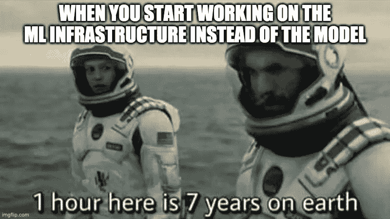
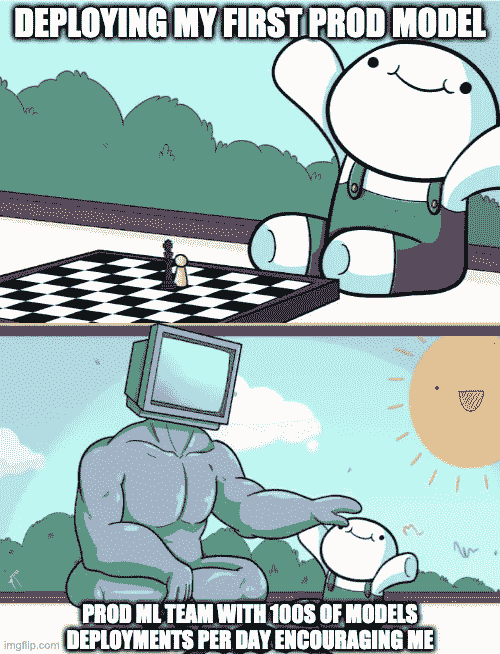
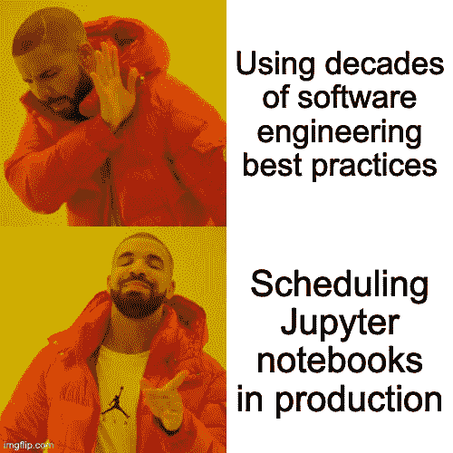
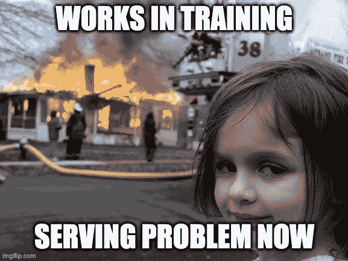
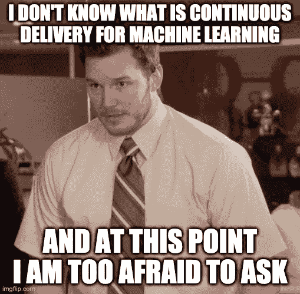
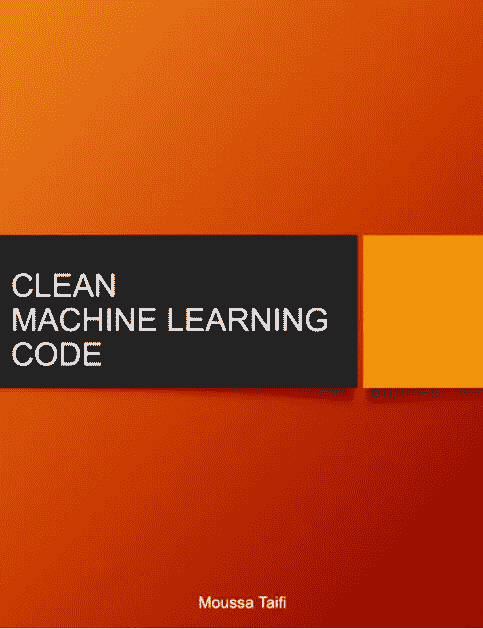

# 你可能正在制造 ML 技术债务的七个迹象

> 原文：<https://towardsdatascience.com/seven-signs-you-might-be-creating-ml-technical-debt-1a96a840fd80?source=collection_archive---------49----------------------->

## 以及你能做些什么

[7]

在线机器学习 ML 社区同意萌芽的 ML 产品面临的大多数问题都是工程挑战[1][2]。领先的 ML 研究者和实践者似乎一次又一次地证实，快速迭代和添加**优秀 ML 特性**的能力才是最重要的。承诺是，通过将您的资源投入到持续的 ML 交付实践中，可以从优秀的特性和大量的迭代中获得显著的收益；而不是专注于最新的前沿 ML 算法、技术或框架。

在这篇文章中，我们将假设你已经确信，你的企业是时候建立一个机器学习驱动的产品了。你可能在没有任何机器学习的情况下推出了你的 ML 服务。您可能还关注于指标设计和收集。此外，你已经做出决定，你想使用 ML，而不是你试图取代的不可维护的启发式噩梦。

如果你已经在那里，请继续阅读——否则，请点击这里查看如何超越 ML 项目[的第 0 阶段。](https://developers.google.com/machine-learning/guides/rules-of-ml)

# ML 技术债务的早期迹象

## 1.您不关心基础设施，而是专注于启动复杂的初始模型

[8]

在最初的发布阶段，很容易认为团队面临的大多数问题都与 ML 有关。基本上，如果你的团队正在讨论像*这样的事情，“哦，太糟糕了，我们不能使用 GPT-3 文本嵌入，这将真正提高* ***初始*** *情感分析模型的性能。”。*这可能是 ML tech 债务即将到来的迹象。

如果由于关注最新的模型性能，团队不清楚如何将样本带到模型的培训阶段，或者对好的和坏的业务结果看起来有些模糊，或者团队不知道模型是离线还是在线应用，那么团队的集体意识中应该有一个红色霓虹灯闪烁的尖锐警报。

此外，在第一个计划的发布中，如果团队不能解释特性是如何流向系统的，或者模型权重是不稳定的，或者服务管道有一种复杂的方式来访问推断所必需的特性，那么不要期望后续的发布会神奇地修复这些问题。

最后，如果对 v1 模型性能的期望是正向倾斜的，那么对性能的关注将使对基础设施的关注相形见绌，基础设施建立了一个更可持续的产品市场适应学习循环。

## 2.您将测试 ML 组件与测试基础设施混在了一起

[9]

测试对于 ML 从业者来说是一个巨大的眼中钉。通常，ML 团队报告说没有 ML 组件就不可能测试基础设施。如果 ML 模型与基础设施的其余部分是不可分的，那么您可能会有相当多的债务需要处理。

Next ML 团队有时是外部数据源的定制消费者。很容易理解，公司里没有人希望城市代码是一次性编码的。这使得无法将从特定于 ML 的转换中获得的统计数据与任何外部数据源进行比较。

最后，另一个迹象是，当选择候选模型时，在训练模型之后，没有对模型的输出进行验证，以判断未来服务时间分数的分布是否将匹配离线训练时间分数。

# 成长阶段的 ML 技术债务迹象

## **3。你期望你正在启动的模型将是唯一的、最后的、最好的一个**

[10]

一旦 ML 团队完成了第一个端到端系统,“技术现金流问题”就会开始出现。ML 团队通常发现他们自己从初始阶段就开始关注累积的债务，在初始阶段，关注的焦点是将特性添加到模型中，通过偷工减料来收集度量，以及在各种支柱上支撑服务基础设施。

在 ML Eng 行业反复报道的一个误解是，团队推出的第一个模型将是唯一的、最后的、最好的模型。有些人甚至认为，总有一天模型会停止发布。这种一劳永逸的态度通常会在团队发现所有仍将包含在模型中的特性时得到迅速纠正。虽然每天用新数据重新训练无变化的 ML 管道正在成为标准，但至少，期望在 2 年内每月或每季度发布改进的模型管道应该是 ML 团队事实上的基线。

这个阶段对于 ML 团队来说是一个激动人心的时刻；他们开始关注用新功能改进模型，调整超参数，创建新的旧功能组合，甚至重新思考他们正在优化的代理业务指标。不幸的是，这是大多数技术债务产生的地方，因为项目已经运行了一段时间，所以为了按时发布新的改进，更多的可维护性方面的问题被忽略了。

ML 管道需要一些关心和关注的迹象是团队问自己:

*   从现有模型中移除特征有多容易？
*   添加新功能或将它们与现有功能相结合有多容易？
*   拥有整个 ML 管道的副本需要什么？让黑暗启动的管道发布并比较它们与主线的性能会有多难？
*   团队是否优先考虑将昂贵的特性包含到模型中，而不是频繁地发布增量版本，并从实时用户流量中了解什么可行，什么不可行？

如果一个 ML 团队发现自己因为之前的设计和架构决定而被锁定并且不能移动，那应该是系统中技术债务增长的警告信号。

## **4。您将未使用的特性留在管道中，直到它们不再被使用**

[11]

最有效的提高性能的方法，伟大的特性，也可以是最阴险的技术债务创造者。如果你听到你的团队说我们应该在特性转换工作中保留一个未使用的特性“以防万一”,那么这可能是 ML 技术债务正在增长的一个信号。

这种迹象与添加一个新的令人鼓舞的特性不与代码角力就无法使用的情况密切相关，因为一个未使用的特性与新特性冲突。这个标志指向了管道设计的刚性，其中特征转换可能与模型训练/服务代码过度地交织在一起。

最后，有时即使有一种干净的方法来移除未使用的功能，也没有简单的方法来区分功能的有用性，因为没有适当的过程来根据例如功能的覆盖范围和与标注的相关性来对功能的效用进行排序。

## 5.您正在寻找将您的笔记本电脑安排为生产流水线的方法

[12]

Jupyter 笔记本是探索和原型制作 ML 管道的神奇工具。这个社区非常棒，将来可能会有基于笔记本电脑构建可靠软件的方法，但是专家们正在慢慢反对在生产中使用笔记本电脑。

随着笔记本电脑基础技术的发展，未来可能会安排笔记本电脑并在生产中使用它们。然而，截至 2020 年[5]，指导方针是从笔记本电脑中提取智能，并使用标准的集成开发环境，促进更清洁的架构、模块化、自动化测试和标准软件实践。

目前，如果您正在尝试或计划将笔记本电脑作为生产设备，这可能会工作一段时间，但您的工作效率将会遇到阻碍，因为随着时间的推移，笔记本电脑中固有的问题和技术债务会越来越多。

# 培训服务 ML 债务陷阱

## 6.在训练和服务管道之间使用两个独立的实现

[13]

这种迹象很容易发现，也很难察觉。

容易发现的一点是决定在训练和服务/评分管道之间使用不同的编程语言或者甚至不同的 ML 代码实现。这可能是一个明确的信号，表明您正在放弃任何类型的迭代，并在第一次发布后重用。让一个伞兵工程班从头开始重新实现你的分类评分系统是一个灾难。从软件的角度来看，训练代码将极大地偏离评分代码，因为他们几乎相反的关注点。培训是面向后的，错误可能会触发内部电子邮件警报，而评分最有可能是面向客户的，这将在不恰当的时候点燃你松弛的渠道。

第二个迹象特别出现在评分是在线处理操作时。虽然团队可能在训练和模型选择阶段过度优化了批处理代码，但在线处理需要系统在每个请求到达预测服务时对其进行处理。如果你没有计划如何弥合在线和离线系统处理的数据处理性质的差异，那么这也可能是潜在增长的 ML 技术债务的一个迹象，这可能会在以后困扰你。

## 7 .**。你不能 100%确定 CI/CD 代表什么**

机器学习的 CD 连续交付和 CD4ML 连续交付。

[14]

这与第三点有关。计划迭代。

连续交付[3]是一种非常适用于 ML 工程世界的软件实践。有许多迹象表明，CD 实践将帮助您发展您的 ML 产品。如果你很少在产品中发布模型，并且在等待第四季度的发布系列时，多个“改进”不断堆积，那么对新的主要发布的影响的恐惧就会不断增长。一个变更在发布系列中停留的时间越长，它是否能在产品中工作的不确定性就越大。

需要 CD 的另一个迹象是当有一个昂贵的过程来发布模型到产品中。如果项目经理正在为一个变更窗口做预算，以允许数据管道中涉及的所有团队同步，那么这个可归因于发布过程的固定成本应该被视为一个信号。

缺乏可靠的部署管道可能会导致不必要的协调，但是会降低团队成员的幸福感。他们的模型改进未被使用，未被部署，可能会消除您的 ML 工程师和最终用户之间的重要反馈循环，而大部分责任感、持续学习和有用性都来自于此。类似地，如果没有办法组织代码和部署管道，以允许频繁的 A/B 测试，那么这可能是一个信号，表明 2/3 的功能没有被用户使用[3]。

## 8.额外收获:你意识到 ML Eng 很像软件 Eng，但是你从来没有找到一本好书来沟通这两个世界

> 机器学习(ML)管道毕竟是软件管道。

我有一个独特的机会来研究这个主题，作为一个隔离项目，以便提炼和组织我多年来在这本书里学到的东西:

[清理机器学习代码。](https://leanpub.com/cleanmachinelearningcode)

[我的书:清洁机器学习代码](https://leanpub.com/cleanmachinelearningcode)

这本书将帮助读者应用实用的软件工程原理来防止他们在机器学习软件工艺过程中的失败。

[今天给自己买一本我最新的书吧！](https://leanpub.com/cleanmachinelearningcode)

谢谢你的支持。

伙计们，现在就这样。

我希望这篇文章对你有用。

感谢阅读。

在外面注意安全。

## 参考

[1][https://developers . Google . com/machine-learning/guides/rules-of-ml](https://developers.google.com/machine-learning/guides/rules-of-ml)

[https://research.google/pubs/pub43146/](https://research.google/pubs/pub43146/)

[https://continuousdelivery.com/](https://continuousdelivery.com/)

[https://martinfowler.com/articles/cd4ml.html](https://martinfowler.com/articles/cd4ml.html)

[5][Thoughtworks](https://youtu.be/CUTSnAutoAM?t=2746)Technology Radar vol . 23 11/2020 先睹为快网络研讨会 2 — Zhamak Dehghani — [生产搁置的笔记本电脑:https://youtu.be/CUTSnAutoAM?t=2746](https://youtu.be/CUTSnAutoAM?t=2746)

[【6】](https://youtu.be/9I9GdSQ1bbM?t=571)转到 2019 年——整体结构分解模式——萨姆·纽曼[https://youtu.be/9I9GdSQ1bbM?t=571](https://youtu.be/9I9GdSQ1bbM?t=571)

【7】[Meme 模板在这里:https://img lip . com/Meme/257455447/Leonardo-Dicaprio-pointing-in-TV](https://imgflip.com/meme/257455447/Leonardo-Dicaprio-pointing-at-tv)。迷因文本是自我创作的

[8] [模因模板在这里:https://imgflip.com/meme/155217391/Interstellar-7-years](https://imgflip.com/meme/155217391/Interstellar-7-years)。迷因文本是自我创作的

[9] [模因模板在这里是 https://imgflip.com/i/3jqfd0](https://imgflip.com/i/3jqfd0)

[10] Meme 模板在这里:[https://img lip . com/Meme template/228603083/odd1 sout-vs-computer-chess](https://imgflip.com/memetemplate/228603083/odd1sout-vs-computer-chess)。迷因文本是自我创作的

【https://imgflip.com/memetemplate/Two-Buttons】【11】模因模板在此:模因文字为自己创作

[12]【https://imgflip.com/meme/Drake-Hotline-Bling】模因模板在这里:模因文字均为自己创作

[13]迷因模板在这里:[https://imgflip.com/memetemplate/Disaster-Girl](https://imgflip.com/memetemplate/Disaster-Girl)迷因文字为自己创作

[14]模因[模板 https://imgflip.com/memegenerator/Afraid-To-Ask-Andy](https://imgflip.com/memegenerator/Afraid-To-Ask-Andy)。迷因文本是自我创作的

**免责声明:**本文表达的观点是我个人的观点，不一定代表我现在或过去雇主的观点。