# 严重性分数推导

> 原文：<https://towardsdatascience.com/severity-score-derivation-c5e63f9ae046?source=collection_archive---------44----------------------->

## 解释所涉及的步骤、思考过程以及新冠肺炎严重程度评分背后的研究，以便在州和县之间进行比较

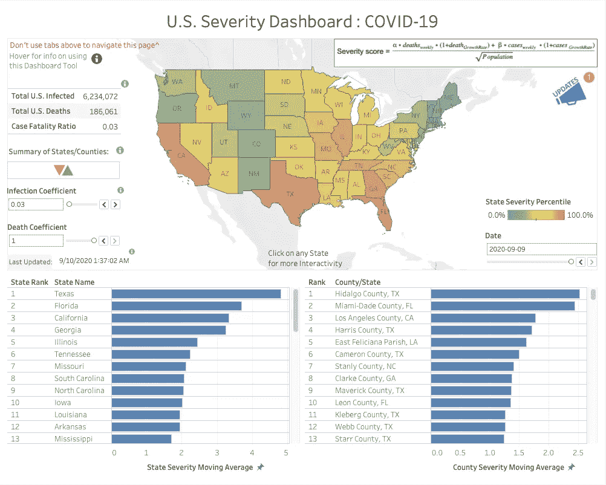

美国严重性仪表板:Tableau Public 上的新冠肺炎登录页(2020 年 9 月 9 日)

当我为新冠肺炎制作[美国严重性仪表板时，有几个人问我:](https://public.tableau.com/views/SeverityDashboardTableauPublic/U_S_SeverityDashboard?:language=en&:display_count=y&:origin=viz_share_link?:embed=y&:display_count=yes&:showTabs=y&:toolbar=no?&:showVizHome=yes)

> *“您是如何为您的新冠肺炎仪表板计算出严重性分数的？”*

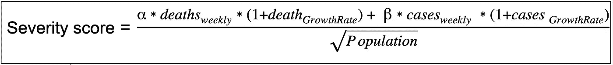

我解释说，这是一个相当有趣的过程，有许多尝试。在与我在 LinkedIn 上的一个密友交谈后，我意识到我所经历的过程可能会成为一篇有趣的文章。因此，我们在这里。

解决问题有很多不同的方法；数学定律、推导出的数学方程式或有用的信息表示。例如，一个 FICO 信用评分是一个有用的和有意义的代表某人偿还贷款的能力。是法律吗？不，橄榄球联盟的四分卫得分也不是。我们作为指标所依赖的许多指数，如道琼斯指数，并不是经过验证的科学事实，而是以有意义的格式表示数据的一种简明方法。

钟系列的创造者埃里克·坦普尔·贝尔说:

> “抽象性，有时被当作对数学的一种指责，是它的主要荣耀，也是它最可靠的实用头衔。它也是可能从数学中产生的美的源泉”

换句话说，有时候抽象思维可以导致实践。

## 收集的初始数据:

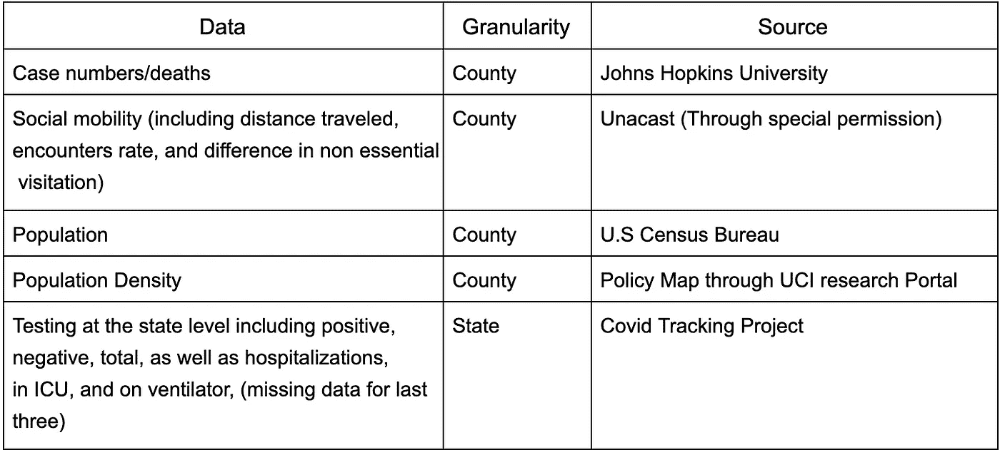

可用于构建严重性分数等式的构件

COVID 仪表盘在互联网上随处可见。一个共同点是，不清楚病毒在哪里受到最严重的打击。“严重性”与死亡或感染有关吗？假设像纽约市这样的城市里的人比该国农村地区的人与他人接触更多，那么人口是否应该在决定病毒的严重程度方面发挥作用？

然后我突然想到…

> *“如果我能想出一种方法来表示病毒在美国每个县的严重程度，这样人们就能很容易地说出哪里的病毒对健康影响最大，那会怎么样？”*

我思考了这个想法，并决定研究一下流行病学家的结论。

## 这项研究

对于流感爆发，公共卫生官员通常使用[疫情严重程度评估框架(PSAF)](https://www.cdc.gov/flu/pandemic-resources/national-strategy/severity-assessment-framework.html) 来帮助确定疫情会有多“糟糕”。它使用两个因素；临床严重性和病毒传播性。文章提到，“PSAF 是疾病预防控制中心开发的两个评估工具之一，用于指导和协调参与疫情反应的联邦、州、地方和部落实体的行动”

文章随后提到了[“评估流感流行和大流行的流行病学影响的新框架”](https://wwwnc.cdc.gov/eid/article/19/1/12-0124_article) (Reed et al. 2013)。新框架详细说明了根据数据可用性、可传递性和临床严重程度指标确定疫情严重程度的 4 个方法步骤。文章还提到，在历史上，病死率(CFR)一直被使用。

另一个众所周知的疾病统计是*死亡率* **。**

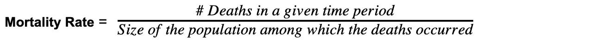

通常代表每 1 千或 10 万人

CDC 网站上的另一个链接指向[流感风险评估工具(IRAT)](https://www.cdc.gov/flu/pandemic-resources/monitoring/irat-virus-summaries.htm?CDC_AA_refVal=https%3A%2F%2Fwww.cdc.gov%2Fflu%2Fpandemic-resources%2Ftools%2Firat-virus-summaries.htm) 。文章解释说,“IRAT 使用 10 项科学标准来衡量与每种情况相关的潜在疫情风险。这 10 项标准可以分为三大类:“病毒的特性”、“人群的属性”和“病毒的生态学&流行病学”。”(Reed 等人 2019)。

## 我的评估

*   我知道临床严重程度指标在一段时间内不会出现，也不知道为了确定病毒如何在生物学上传播而进行的研究是否充分。
*   病死率忽略了人口规模和密度，这在不同县之间进行比较时很重要。
*   死亡率包括人口数量，但不包括感染。

似乎没有一个衡量标准可以概括这一切。现有的总体框架和评估工具似乎侧重于病毒如何传播的性质，而不一定是“每个地区有多严重”。

既然如此，我开始头脑风暴:

> *“我认为决定严重程度的因素是什么，我如何整合常见的流行病学计算来赋予这个等式一些合法性？*

## 等式尝试 1:

我读过的文章中没有一篇提到增长率。感染和死亡的增长率不同。因此，我需要将它们作为单独的实体插入。这个思路让我创建了一个*感染分数*和一个*死亡分数*，其中:

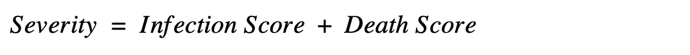

我决定将*死亡分数*乘以 2，以说明感染人数将多于死亡人数的事实，并且我最初决定按照指数增长公式 y = ab^x 来模拟我的方程，其中 *a* 将是总指标， *b* 将是增长率，x 将被平方。除以*人群*进行归一化，第一个严重性评分诞生。

**方程式**:

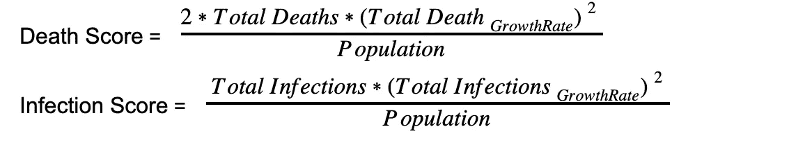

严重性等式尝试 1

## 等式尝试 2:

坚持指数增长的概念，我添加了*阳性检测百分比(PTP)* 作为*总感染增长率的系数，理由是*一百万次检测中有 1000 次阳性结果的县应该比 1001 次检测中有 1000 次阳性结果的县不那么严重。

随着*阳性检测百分比*降低了*总感染增长率*的影响，我认为添加*病死率*作为*总死亡增长率*的降低系数将是包含在严重性分数中的适当指标。

**方程式**:

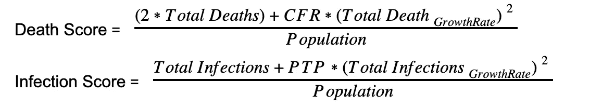

严重性等式尝试 2

**辅助方程:**

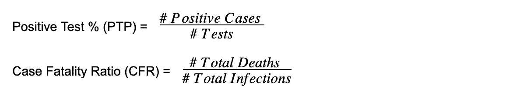

**问题**:这一轮方程式出现了两个主要问题，还有一个我还没有注意到的问题。

这两个问题是:

1.  *病死率* * *总死亡人数增长率*是什么意思？
2.  *阳性检测百分比* * *总感染增长率*是什么意思？

我没有注意到 CFR 和 PTP 都在< 1 and most of the growth rates are also < 1\. Multiplying them together essentially added nothing to my score when deaths and infections could both be in the thousands.

**收集反馈**

抛开这些问题，我决定收集一些关于我正在做的事情的反馈。我收到的最常见的问题是

> "为什么死亡总数要乘以 2？"以及“你为什么要平方增长率？”

我的教授 Vibhanshu Abhishek 告诉我，每个分数的权重不应该由我来决定，因为每个人对如何比较感染和死亡的严重程度都有自己的偏见。

在这种情况下，我决定添加两个可以由用户调整的系数，一个是死亡系数α，另一个是感染系数β，范围在 0 到 1 之间。此外，我在*中加入了人口密度*，理由是*人口*的增加应该会降低*的严重程度*(因为现在每个感染/死亡只占总数的一小部分)，但是*人口密度*的增加应该会增加*的严重程度*，因为人们会更频繁地接触。为了实现这个行为，*人口*需要在分母上，而*人口密度*需要在分子上。为了便于阅读，可以表示如下。

**方程式尝试 3:**

结合这一反馈，这些方程得出:

**方程式**:

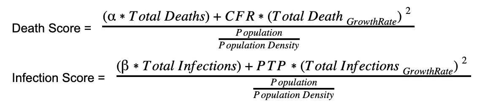

严重性等式尝试 3

**问题**:我后来才意识到分母的问题，但是

人口被取消，分母等于面积。

## 仪表板创建

带着一个充满了我最初没有意识到的疑问和问题的等式，我继续前进，创建了美国严重性仪表板的第一个迭代。

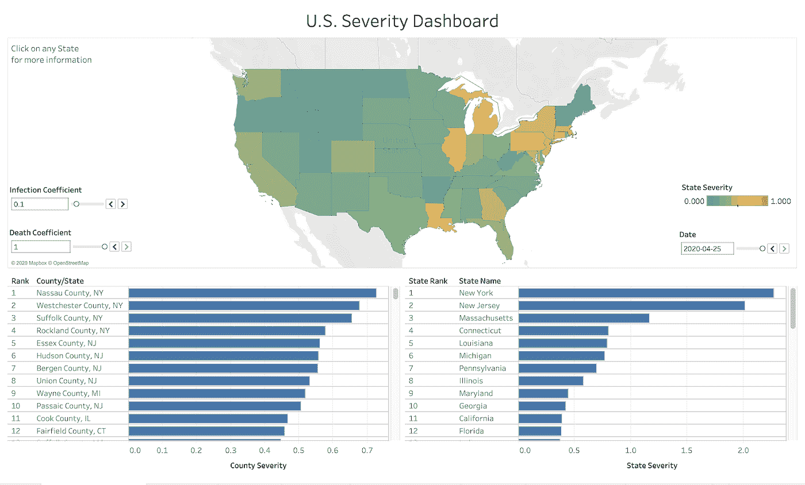

美国严重性仪表板:新冠肺炎登录页面—第一次迭代—(2020 年 4 月 12 日)

基于每个州和县的严重程度的国家整体视图。我对结果非常满意。我的教授告诉我，我可能应该对方程取一个对数，以便将严重性标准化，因为分布在当前状态下是高度偏斜的。

取我的严重性分数的对数，我意识到我在我的一个表示中违反了对数的第一定律。

对数第一定律指出:

> log A+log B =**log AB**

这意味着:

> log(感染分数)+ log(死亡分数)≠ log(感染分数+死亡分数)

这提出了一个新的问题，因为*死亡分数*和*感染分数*不能相乘。如果它们相乘，0(无死亡)的*死亡分数*将导致 0 的*严重性分数*，即使该州或县有数百万感染。因此，我需要将*感染分数*加到*死亡分数*上。

在对正确的对数表示进行推导之后，我终于发现了我之前提到的问题，并决定重新构建整个方程。

**方程式尝试 4:**

几天的实验过去了，我试着把注意力集中在为什么我首先要创建严重性分数上。

> “严重性分数的意义在于能够比较县或州之间的健康影响”

我重新构建了这个等式，以说明一旦增长率为 0，意味着没有新的感染，那么产生的*严重性分数*将基于该县或州已达到的感染和死亡总数。

什么改变了:

*   修复了前面提到的所有问题
*   我意识到我应该用实际感染或死亡人数乘以增长率
*   我意识到*阳性检测百分比*使等式变得复杂，无法将其与增长率联系起来。
*   我意识到*病死率*包含了感染和死亡。这意味着随着感染的增加，*感染分数*会增加，但是*死亡分数*会降低，因为 CFR < 1
*   我意识到*人口*对*严重性*有着压倒性的影响。我想让*人群*标准化*严重性*分数，但我不想让它成为线性效应。我决定平方根会对更大的人口产生更小的影响，而对数会有更陡的影响。

**方程式**:

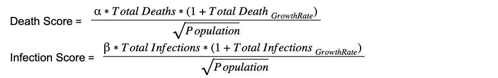

严重性等式尝试 4

**收集反馈(第二部分)**

收集了几个人的意见后，我问了一个关于严重性等式的基本问题。

> “当一个县或州不再有任何感染或死亡病例时，其严重性分数应该为零还是达到最高？”

我得到了响亮的答案

> “当然，如果没有更多的感染或死亡，严重性分数应该为零，这时你会说没有严重性”

思考这个答案，我意识到这很有道理。在目前的状态下，这个等式永远不会等于零，因为总死亡数*和总感染数*和*永远不会等于零。这意味着需要做一点小小的调整。*

**方程式尝试 5:**

我决定，如果我计算过去 7 天感染和死亡的周平均值，那么如果一个县或州停止出现新的感染或死亡，他们的严重程度得分将为零。我还必须改变增长率，使其基于过去 7 天的数据。

**最终方程式**:

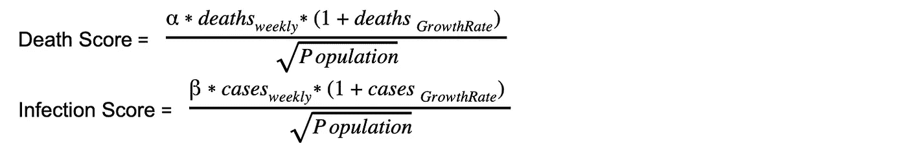

严重性等式尝试 5

这种表现感觉就像我想在这个等式中达到的完美平衡。

*   按人口标准化的感染和死亡的包容性方程。
*   严重性的每周快照，如果没有进一步的感染或死亡，得分为 0。
*   包含增长率以揭示趋势案例的方向性。
*   一个用户可调整的参数，允许感染和死亡之间的重量感觉差异。

在启动严重性仪表板整整一个月后，我现在有了一个完整的等式和一个更新的仪表板来显示它。

**媒体报道**

两周后，我在 UCI 的学校写了一篇关于这个项目的文章。https://merage . UCI . edu/news/2020/05/Matthew-littman-msba-20-creates-新冠肺炎-dashboard.html

两个月后,《洛杉矶时报》刊登了这篇报道。

[https://www . latimes . com/socal/daily-pilot/news/story/2020-07-15/UC-Irvine-graduate-is-the-architect-of-detailed-新冠肺炎-dashboard](https://www.latimes.com/socal/daily-pilot/news/story/2020-07-15/uc-irvine-graduate-is-the-architect-of-detailed-covid-19-dashboard)

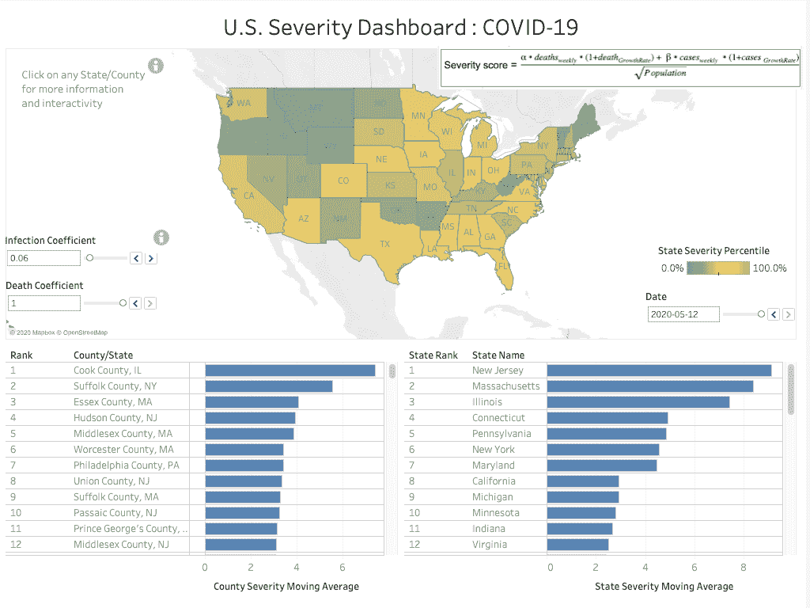

美国严重性控制面板:新冠肺炎登录页面(2020 年 5 月 12 日)

**成品是什么样子的？**

经过几个月的添加工具提示、更新、新功能、用户体验和质量检查，目前形式的[美国严重性仪表板:新冠肺炎](https://public.tableau.com/views/SeverityDashboardTableauPublic/U_S_SeverityDashboard?:language=en&:display_count=y&:origin=viz_share_link?:embed=y&:display_count=yes&:showTabs=y&:toolbar=no?&:showVizHome=yes)如下图所示。点击链接查看，感谢阅读！

美国严重性仪表板:Tableau Public 上的新冠肺炎登录页(2020 年 9 月 9 日)

来源:

[“流感风险评估工具(IRAT)。”2019.2019 年 10 月 10 日。](http://paperpile.com/b/eptrDn/Lxsj)[https://www . CDC . gov/flu/疫情-资源/国家-战略/风险-评估. htm](https://www.cdc.gov/flu/pandemic-resources/national-strategy/risk-assessment.htm) [。](http://paperpile.com/b/eptrDn/Lxsj)

里德、凯莉、马修·比格斯达夫、林恩·费内利、丽莎·m·库宁、丹尼斯·博韦、阿姆拉·乌兹卡宁、安德鲁·普卢默、乔·布雷西、斯蒂芬·c·里德和丹尼尔·b·杰尼根。“评估流感流行和大流行的流行病学影响的新框架——第 19 卷，第 1 期——2013 年 1 月——新发传染病杂志——CDC。”2020 年 9 月 9 日接入。https://doi.org/[10.3201/Eid 1901.120124](http://dx.doi.org/10.3201/eid1901.120124)