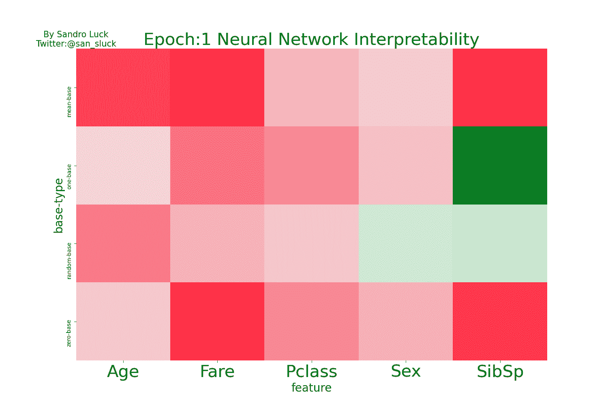
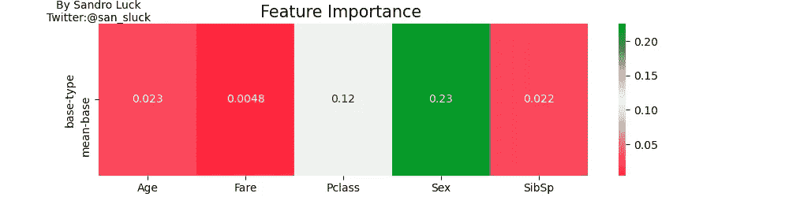
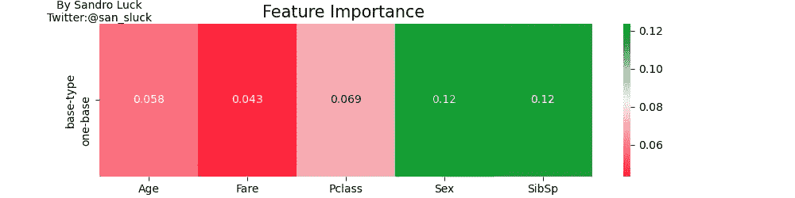
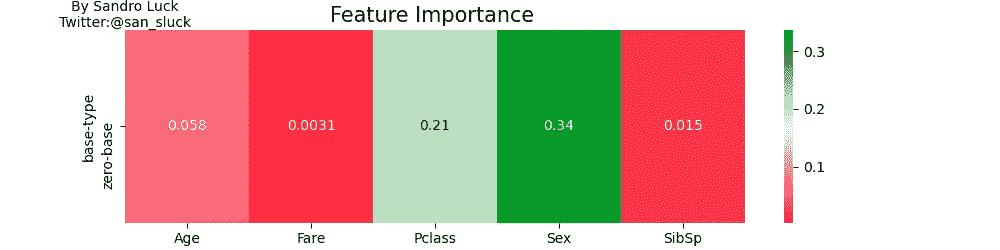
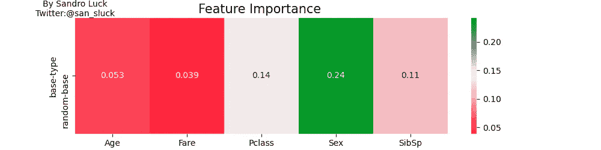

# 性很重要，为什么我知道

> 原文：<https://towardsdatascience.com/sex-matters-and-why-i-know-712578a6857d?source=collection_archive---------22----------------------->

## 使用 Captum，综合梯度和 PyTorch 闪电的神经网络的可解释性。看着黑盒！


看看黑匣子，由大卫·拉古萨拍摄。

# 介绍

神经网络已经席卷了全世界。每周都有关于 GPT-3 如何自动完成另一项语言任务的好消息。或者在当前的疫情中人工智能是如何帮助医生的。

但是越来越多的人对人工智能的转变越来越怀疑。它选择这种治疗方法是因为它是正确的治疗方法吗？还是因为它恰好是训练集中另一个 5.29 岁患者的最佳选择？

整个群体都在警告我们人工智能中糟糕设计的含义，我们应该更好地倾听。毕竟，种族和性别相关的特征已经以歧视的方式在最近的招聘流程算法中使用了！

作为一个人工智能社区，我们如何，

1.  确保我们建立包容性的工具。
2.  确保我们的模特做我们认为他们在做的事情。
3.  向他人解释我们的模型在做什么。

1、2、3 的答案是明确的可解释性！它在深度学习领域掀起了一阵风暴。让我们今天了解一下它是什么，以及如何轻松地将其集成到我们的流程中。

我们将建立一个神经网络来预测泰坦尼克号乘客的生存机会。最后，了解我们做了什么，并使用 Captum 解释我们的模型。全部使用强大的闪电框架。



Gif 总结解释了我们神经网络的学习过程。作者图片

# 0.进口

我们将从导入依赖项开始。

```
# Our ML things
import pytorch_lightning as pl
import torch
from torch.utils.data import DataLoader, Dataset

from captum.attr import IntegratedGradients
from pytorch_lightning import seed_everything
from pytorch_lightning import Trainer# Visualization
import pandas as pd
import seaborn as sns
import matplotlib.pyplot as plt# Utils
from enum import Enum
import pandas as pd
from sklearn.metrics import classification_report
```

# 1.资料组

为了制作这个最小的例子，我们将使用 Titanic 数据集(一个小文件)。可以在这里下载[](https://www.kaggle.com/c/titanic/data?select=train.csv)****。下载完成后，将其放入一个新文件夹“data/train.csv ..”这个数据集可能是有史以来最受欢迎的 Kaggle 数据集，因此允许我们验证我们的结果。****

**它包含了泰坦尼克号的 890 名不同的乘客。对于每位乘客，我们将预测他们是否幸存！**

**为此，我们被赋予了几个特性。**

```
PassengerId  **Survived**  Pclass  ...     Fare Cabin  Embarked
0              1         0     ...   7.2500   NaN         S
```

**我们将只处理其中的一小部分，即:**

```
**Survived**  Pclass     Sex   Age  SibSp     Fare
0           0       3    male  22.0      1   7.2500
```

**现在我们有了一个概述，让我们定义数据集。数据集是 PyTorch 中的一个类。它需要定义 3 个私有函数，init()、len()、getitem()。**

**如果你对此不熟悉，可以在这里 **(** 1)找到一个简单的解释 [**。数据集)。这里的目标是做一个最小的预处理，以便稍后展示我们的解释。**](/pytorch-lightning-machine-learning-zero-to-hero-in-75-lines-of-code-7892f3ba83c0)**

```
**# Simple enum that helps organizing
# Not really important**
class TrainType(Enum):
    train = 1
    test = 2**# Our Custom Dataset class** class RMSTitanic(Dataset):
    def __init__(self, type: TrainType):
        file = "data/train.csv"
 **# Preprocessing**
        df = pd.read_csv(file)
 **# Select relevant fields**
        df = df[['Survived', 'Pclass',
                 "Sex", "Age", "SibSp",
                 "Fare"]]
 **# Convert Sex -> 0/1**
        m = {'male': 1, 'female': 0}
        df['Sex'] = df['Sex'].str.lower().map(m)
 **# Fix the non available vals
        # Also normalize**
        df = df.fillna(df.median())
        df -= df.min()
        df /= df.max()
 **# The first 80% are Train**
        if type == TrainType.train:
            self.df = df.loc[:int(0.8 * len(df))]
        if type == TrainType.test:
            self.df = df.loc[int(0.8 * len(df)):]
 **# We will use this later for interpretation**
        self.base = torch.tensor(df[
                                     ['Pclass', "Sex",
                                      "Age", "SibSp",
                                      "Fare"]
                                 ].mean()).cuda().float()

    def __len__(self):
        return len(self.df)

    def __getitem__(self, item):
 **# This function return the i-th elem**        row = self.df.iloc[item]
        label = row['Survived']
        features = row[['Pclass', "Sex",
                        "Age", "SibSp",
                        "Fare"]]
 **# return the (label,features)**        return (
            torch.tensor(features).cuda().float(),
            torch.tensor(label).cuda().float()
        )
```

**这已经是我们最小的数据集了。请记住，这只是一个小的助手类。它帮助 Pytorch Lightning 施展它的魔法，因此我们可以节省更多的代码。**

## **简短解释**

**我们得到的特征和它们的解释是什么。**

```
**Pclass**   "What class is person traveling in? First being best"
**Sex**      "Male or Female"
**Age**      "How old in years?"
**SibSp**    "How many Sibiling/Spouses are there onboard"
**Fare**     "Amount in money spend"
```

# **2.模型**

**我们现在将构建一个简短但强大的模型。它将依次调用下面的层。**

```
 | Name      | Type     | 
  ------------------------
0 | input     | Linear   |   
1 | r1        | PReLU    |  
2 | l1        | Linear   |
3 | r2        | PReLU    |    
4 | out       | Linear   |   
5 | sigmoid   | Sigmoid  |
```

**我们现在将定义一个名为 MyHeartWillGoOn 的 PytorchModel。基本上只有前进功能是至关重要的。**

```
class MyHeartWillGoOn(pl.LightningModule):

    def __init__(self):
 **# Setting up our model**        super().__init__()
 **# way to fancy model**        self.lr = 0.01
        self.batch_size = 512
        l1 = 128

 **# We send our 5 features into first layer**        self.input = torch.nn.Linear(5, l1)
 **# PRELU is just a fancy activation function**        self.r1 = torch.nn.PReLU()
 **# More Layers**        self.l1 = torch.nn.Linear(l1, l1)
        self.r2 = torch.nn.PReLU()
        self.out = torch.nn.Linear(l1, 1)
 **# Befor the Output use a sigmoid**        self.sigmoid = torch.nn.Sigmoid()
 **# Define loss**        self.criterion = torch.nn.BCELoss()

    def forward(self, x):
 **# Heart of our model**        x = self.input(x)
        x = self.l1(x)
        x = self.r1(x)
        x = self.out(x)
        x = self.r2(x)
        x = self.sigmoid(x)

        return x

    def train_dataloader(self):
 **# Load our Dataset: TRAIN**        return DataLoader(
            RMSTitanic(type=TrainType.train),
            batch_size=self.batch_size,
            shuffle=True)

    def val_dataloader(self):
 **# Load our Dataset: TEST
        # Simplification: TEST=VAL**        return DataLoader(
            RMSTitanic(type=TrainType.test),
            batch_size=self.batch_size,
            shuffle=False)

    def configure_optimizers(self):
        return torch.optim.Adam(self.parameters(), lr=self.lr)

    def training_step(self, batch, batch_idx):
 **# Here we just log some basics
        # We can look at them later in tensorboard**        x, y = batch
        y_hat = self(x)
        y = torch.reshape(y, (y.size()[0], 1))
        loss = self.criterion(y_hat, y)
        tensorboard_logs = {'loss': loss}
        return {'loss': loss, 'log': tensorboard_logs}
```

# **3.火车**

**PyTorch Lightning 的训练是由一个不错的小训练师完成的。**

```
if __name__ == '__main__':
 **# Seed so we can reproduce**    seed_everything(404)
 **# Load model to GPU**    device = torch.device("cuda")
    model = MyHeartWillGoOn().to(device)
 **# Make the Trainer do the work**    trainer = Trainer(max_epochs=20, min_epochs=1, auto_lr_find=True, progress_bar_refresh_rate=10)
    trainer.fit(model)
 **# Accuracy #ToBeMeasured**    ts = RMSTitanic(TrainType.test)
 **# Bit of Hacking**    x = torch.stack(
        [ts.__getitem__(i)[0] for i in range(ts.__len__())]
    )
    y = torch.stack(
        [ts.__getitem__(i)[1] for i in range(ts.__len__())]
    ).cpu().detach().numpy()
    y_hat = model.forward(x).cpu().detach().numpy()
    y_hat = (y_hat > 0.5)
 **# Accuracy and other metrics**    print("REPORT:\n",
          classification_report(y, y_hat))
```

**在 GPU 上训练我们的模型 20 个历元将会得到以下结果。**

```
**SURVIVED**   precision recall  f1-score   support**FALSE**      0.84      0.94      0.89       115
**TRUE**       0.86      0.67      0.75        64**accuracy**                               **0.84 **      179
macro avg          0.85      0.81      0.82       179
weighted avg       0.85      0.84      0.84       179
```

**正如我们所看到的，我们得到了 84%的准确率，这对于这个任务来说是可以接受的。这次我们更感兴趣的是解读。如果你想知道如何在这项任务中获得满分，可以看看 [Kaggle](https://www.kaggle.com/c/titanic/notebooks) 。**

# **4.解释**

**既然 Pytorch 闪电真的很新，而 Captum 更新；)我们在这方面相当领先。**

**我们需要解决一些尚未妥善解决的小问题。为了做到这一点，我们需要添加一个更小的包装函数，稍后呈现给 Captum。基本上，Captum 是一个有几种可用方法的库。这些方法预测输入特征对神经模型的重要性。他们以几种方式这样做。我们将使用可能是最流行的方法**集成梯度**。下面我就给出这种方法的一个直觉。**

```
**# Let's start with the interpretation** STEP_AMOUNT = 50
SAMPLE_DIM = 5

**# Since Captum is not directly
# made for Lightning,
# we need this wrapper**
def modified_f(in_vec):
 **# Changes the shapes correctly
    # X:Shape([SAMPLE_DIM*STEP_AMOUNT]=250)**
    x = torch.reshape(in_vec,
        (int(in_vec.size()[0] / SAMPLE_DIM), SAMPLE_DIM)
    )
 **# RES:Shape([50,5])
    # Since we have 50ti Batches and 5 features**
    res = model.forward(x)
 **# Again reshape to correct dims**
    res = torch.reshape(res, (res.size()[0], 1))
    return res

ig = IntegratedGradients(modified_f)
```

**现在我们可以开始学习我们的模型是如何思考的。赋予此对象 IntegratedGradients。我们可以使用它的 main 方法属性()！**

> **attribute()是一个函数，它将一个张量作为输入，并返回给我们一个相同形状的张量**

**这意味着当我们告诉我们的模型，我们的案例研究对象:**

```
**Pclass  Sex   Age  SibSp     Fare**
3       male  22.0      1       7.2500 (I am not normalized)
```

**它将使用这 5 个特征进行预测。假设这个 22 岁的男子支付了 7.25 英镑的车费，那么这个数字就是 0.3%，也就是 0.3%的生存机会。预测后我们会发这个 30%存活率->0 %，意思是他死了。**

**现在积分梯度返回给我们一个张量，也有 5 个值。这些值中的每一个都会告诉我们各自的特性有多重要。这可能是 y. E .的差异**

```
**Pclass  Sex   Age  SibSp     Fare**
0.1619, -0.1594,  0.0196, -0.0024,  0.0068
```

# **5.综合梯度**

**中间上了一堂理论课。集成梯度已经在[中提出，用于深度网络的公理化属性](https://arxiv.org/abs/1703.01365)综合梯度用于理解我们的神经网络是如何工作的。集成梯度是所谓的可解释性算法。**

**今天的人工智能社区中使用了几种可解释性算法，但 IG 是最早和最成熟的算法之一。科学界还没有明确决定哪种算法是最好的。随意测试一些其他的，比如 [DeepLift](https://captum.ai/api/attribution.html) 。**

## **综合梯度—简而言之**

> **这是一个简化的解释，更多细节请参考论文“[深度网络的公理化归属](https://arxiv.org/abs/1703.01365)**

**为了以神经网络的方式优化损失函数，我们建立梯度。为了了解每个输入要素对我们的损失函数的贡献大小，我们颠倒了这个过程(称为积分)，因此我们对梯度进行积分。**

**现在，计算积分很难，答案也不清楚。这就是为什么我们必须近似它。我们用黎曼和来近似这个积分。**

**我们通过使用超参数 n_steps 和基线来近似该值。基线是我们与输入进行比较的对象(我们将在下面详细讨论)。n_steps 是我们反向传播以估计积分的次数。N_steps 基本上控制了我们对积分的估计有多精确。**

# **6.资本基础**

**我们现在有三样东西:**

1.  **受过训练的模特**
2.  **测试设备**
3.  **综合梯度**

**使用这些东西，我们将了解我们的模型**

```
**# Test to understand the basics**
**# First get the 6th test example**
val = ts.__getitem__(6)[0]
print("IN X1:", val)
**# Predict the importance of the features
# for the male example**
imp_m = ig.attribute(inputs=val,
                     baselines=ts.base,
                     n_steps=STEP_AMOUNT)
print("IMPORTANCE X_m:", imp_m)
print("Probability SURVIVAl X_m:", modified_f(val))
**# Predict the importance of the features
# for the female example**
print("Let's Change the gender ->X2")
val_f = val
val_f[1] = 0
imp_f = ig.attribute(inputs=val_f,
                     baselines=ts.base,
                     n_steps=STEP_AMOUNT)
print("IMPORTANCE X_f:", imp_f)
print("Probability SURVIVAl X_f:", modified_f(val_f))
```

**该代码将打印:**

```
IN X1: [1.0000, 1.0000, 0.3466, 0.0000, 0.0303]
IMPORTANCE X_m:[-0.0593, -0.1121, -0.0010,  0.0019, -0.0040]
Probability SURVIVAl X_m:0.1265IMPORTANCE X_f:[-0.1178,  0.4049, -0.0020,  0.0037, -0.0080]
Probability SURVIVAl X_f:0.5817
```

**如你所见，当我们给出 Captum，这两个相同的例子。除了性别。我们得到了截然不同的存活率。**

```
**# MALE** Pclass  Sex   Age  SibSp     Fare
3       male  22.0      1       7.2500 (I am not normalized)
**# FEMALE** Pclass  Sex     Age  SibSp     Fare
3       female  22.0      1       7.2500 (I am not normalized)
```

**男性的存活率是 12%,女性是 58%!我们得到的两个重要值是:**

```
 Pclass  Sex         Age    SibSp     Fare  
IMPORTANCE X_m:[-0.0593, **-0.1121**, -0.0010,  0.0019, -0.0040]
IMPORTANCE X_f:[-0.1178,  **0.4049**, -0.0020,  0.0037, -0.0080]
```

**正如我们在这两种情况下所看到的，在特征**性**中重要性是最强的(就绝对而言)。这表明这是最重要的功能！**

> **解读符号:我们可以把它看作是增加到预测(+)或从预测(-)中扣除的东西。即+使其更可能是(1)或更不可能是(1)。**

**我们可以看到，根据性别(男性\女性)的不同，产生的向量也大不相同。**

# **7.基线的影响**

**基线是我们用来比较自己价值的东西。为了理解它的影响，我们将比较最明显的选择。在最初的论文中，使用了噪声和黑色图像(零)的概念。**

**我们将比较 4 个不同的基线。**

> ****对比:****
> 
> **1 .平均值！**
> 
> **2.噪声，与随机相比**
> 
> **3.全是 1**
> 
> **4.全是零**

**接下来，代码将产生期望的解释。**

```
**# define a collection** to_be_df = []
**# Compare each element of the test set to out baselines
# we will than use this**
for i in range(0,
               1):  # ts.__len__()):
 **# load our test example**
    in_val = ts.__getitem__(i)[0]
 **# compare it to the 4 baselines**    att_b = ig.attribute(
        inputs=in_val,
        baselines=ts.base,
        n_steps=STEP_AMOUNT).detach().cpu().numpy()
    att_r = ig.attribute(
        inputs=in_val,
        baselines=torch.rand(
            5).cuda(),
        n_steps=STEP_AMOUNT).detach().cpu().numpy()
    att_z = ig.attribute(
        inputs=in_val,
        baselines=torch.zeros(
            5).cuda(),
        n_steps=STEP_AMOUNT).detach().cpu().numpy()
    att_1 = ig.attribute(
        inputs=in_val,
        baselines=torch.ones(
            5).cuda(),
        n_steps=STEP_AMOUNT).detach().cpu().numpy()
 **# save result, this will produce a df
    # you can skip the details**
    for base_type, vals in [
        ("mean-base", att_b),
        ("random-base", att_r),
        ("zero-base", att_z),
        ('one-base', att_1),
    ]:
        for i, name in enumerate(['Pclass',
                                  "Sex",
                                  "Age",
                                  "SibSp",
                                  "Fare"]):
            to_be_df.append({
                "base-type": base_type,
                "feature": name,
                "value": vals[i],
            })
**# Convert our data to a pandas** df = pd.DataFrame(to_be_df)
df.to_csv('data/interpretation_results.csv')
print("OUR INTERPRETATION:\n\n",
      df)
```

**我们的结果看起来像这样。**

```
 **base-type feature     value** 0     mean-base  Pclass  0.162004
1     mean-base     Sex -0.159421
2     mean-base     Age  0.019652
3     mean-base   SibSp -0.002433
4     mean-base    Fare  0.006821
5   random-base  Pclass  0.117517
```

**现在我们找到了我们要找的东西！**

# **8.形象化**

**一旦我们完成了工作，我们就可以坐下来享受它了！**

```
**# Aggregate and Visualize
# Load Data**
df = pd.read_csv('data/interpretation_results.csv')
**# Defined the color map for our heatmap to be red to green**
cmap = sns.diverging_palette(h_neg=10, h_pos=130, s=99,
                             l=55, sep=3, as_cmap=True)
**# Aggregate the CSV by mean**
df = df.groupby(["base-type", 'feature', 'epoch'],
                as_index=False).mean()
df = df[df['epoch'] == max_epoch]
**# Make one plot per baseline to compare**
for b in ["mean-base",
          "random-base",
          "zero-base",
          'one-base']:
 **# Let's plot them isolated**
    tmp = df[df['base-type'] == b]
 **# Create a pivot frame**
    tmp = tmp.pivot(index='base-type', columns='feature',
                    values='value')
    print("We will plot:\n",tmp)
```

**枢纽数据框基本上只是对相同的数据采用不同的视图。这里我们告诉它拥有索引(基本类型上的行)和“特性”上的列这看起来像这样。**

```
**feature         Age      Fare    Pclass       Sex     SibSp**
**mean-base**  0.023202  0.004757  0.116368  0.225421  0.022177
```

**现在剩下要做的就是用**

```
**# Create a pivot frame**
 tmp = tmp.pivot(index='base-type', columns='feature',
                    values='value')
**# Some code to make a heatmap using seaborn** fig, ax = plt.subplots()
fig.set_size_inches(10, 2.5)

plt.title("Feature Importance ", fontsize=15)
sns.heatmap(tmp, ax=ax, cmap=cmap, annot=True)
plt.text(0, 0,
         'By Sandro Luck\nTwitter:@san_sluck',
         horizontalalignment='center',
         verticalalignment='bottom',
         fontsize=10)

plt.savefig(f'data/{b}.png')
```

## **`Mean`-基地**

****

**太好了，现在我希望最后一个怀疑者也相信性是伟大的！我们可以清楚地看到，特征性别的影响是显著的。当我们查看数据集时，我们可以注意到，作为一个男人，你的死亡几率会大大增加。毕竟，“妇女和儿童优先”是他们对待船只的方式。**

## **一垒对零垒**

****

**一垒**

****

**零基数**

**这里我们看到基线之间有很大的差异。如果我们将这两个基线与平均基线进行比较，我们会注意到 SibSp 的重要性发生了巨大变化。这通常应该说明使用基线(如 1 和 0)是不可取的。这样做的原因是我们要计算预测在基线和值之间的变化量。**

> **例如，对于图像，使用 0 基线可能是有意义的。原因是，在这种情况下，黑色方块代表没有信息。**

## ****随机基数****

****

**对我来说，这一天的惊喜来自于随机基线的成功。综合梯度的作者提到使用随机基线是明智的。但是我没有预料到它在这个例子中工作得如此之好。**

****

**显示训练时间重要性的 GIF**

**在某些平台上让人们关注你的数据时，gif 是至关重要的。尤其是在社交媒体上，动画可以决定点击和快速浏览的区别。**

**由于这篇文章已经相当长了，请参考我的文章《[如何用 Python 和 Seaborn 从 Google Trends 数据制作 GIFS](https://medium.com/python-in-plain-english/how-to-make-gifs-with-python-and-seaborn-from-google-trends-data-fd3fe16cba11)》以闪电般的速度学习制作上面的 GIF。**

# **结论**

**我们已经了解了什么是可解释性，以及如何在 PyTorch 中使用它。我们已经看到在原型制作中使用它是多么容易，以及如何将其连接到 PyTorch Lightning。**

**我希望这种对可解释性世界的介绍是容易的，没有痛苦的。了解您正在构建什么可以帮助我们的客户和我们。这大大增加了他们对我们预测的信心。**

**如果你喜欢这篇文章，我会很高兴在 [Twitter](https://twitter.com/san_sluck) 或 [LinkedIn](https://www.linkedin.com/in/sandro-luck-b9293a181/) 上联系你。**

**一定要看看我的 [YouTube](https://www.youtube.com/channel/UCHD5o0P16usdF00-ZQVcFog?view_as=subscriber) 频道，我每周都会在那里发布新视频。**

**整个代码**